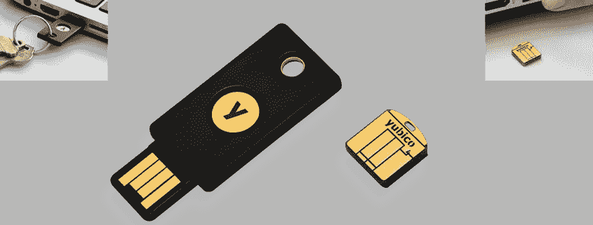
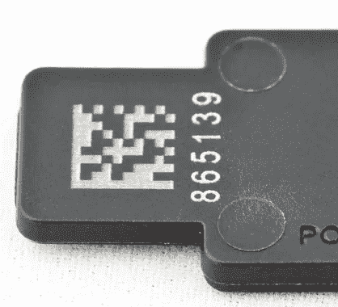
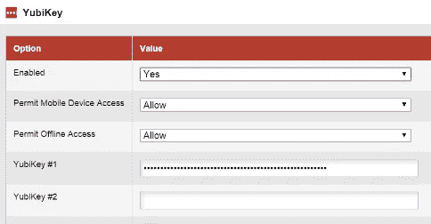

# 避免泄露你的身份与 YubiKey

> 原文：<https://medium.com/hackernoon/avoid-leaking-your-identity-with-yubikey-92539b6608a>

使用 U2F(通用第二因子)设备是当前终端用户可用的最安全的身份验证方法之一。它的优势来自硬件隔离。仅仅使用[软件](https://hackernoon.com/tagged/software)是不可能从它那里窃取密钥或者触发认证的。身体接触是必须的。U2F 也通过设计来抵抗网络钓鱼。例如，您不能被欺骗按下按键并用“假”网页进行认证，因为认证来源也是该过程的一部分，并且设备和网络浏览器之间的通信不能被第三方截取。一个恶意的人不能要求你的“U2F 代码”,因为没有代码在发挥作用。

[优必科](https://www.yubico.com)可能是市场上最受欢迎的 U2F 设备制造商。YubiKey 如今几乎是 U2F 的代名词。它们也越来越受欢迎，因为像 SMS 这样的其他身份验证因素被证明容易受到攻击。

这里有一些 YubiKeys:



YubiKey Nano，图片中较小的设备，是专为您将钥匙插入计算机的情况而设计的。你也可以使用多个键。一个大的 YubiKey 放在你的钥匙链上，一个 Nano 放在你经常使用的设备上。你让 Nanos 一直插在电脑上，这样你就不会去找你把钥匙放在哪里了，你就不会每次需要认证的时候都试图把 YubiKey 弄得叮当作响，并找到 USB 端口的正确方向。我甚至经历过 YubiKey 从 USB 口掉下来，因为我的钥匙链太重了:

正因为如此，我认为人们最终会像我一样拥有多个总是插着电源的优酷。那么这有什么问题呢？

除了 U2F 之外，许多 YubiKey 型号都附带了额外的开箱即用身份验证方法。叫做 OTP(一次性密码)。它不如 U2F 安全，因为它模拟按键，所以可以被网页捕获。通过在文本编辑器上按 YubiKey，您可以看到 OTP 是如何工作的:

```
ccccccggddkclluntcfulcjevtjhehbjnlnjrhtbrhhfd
```

以上是我的一个 YubiKeys 生成的 OTP。看起来几乎是随机的。如果我再次按下它，我会看到不同的输出:

```
ccccccggddkclulctlvnuvggttnkhedfgbgethkbieckg
```

几乎不同。YubiKey OTPs 的前 12 个字符部分永远不会改变，因为它是您的 YubiKey 的序列号*。*

你可以看到这是怎么回事。当我匿名浏览网页时，如果我不小心触摸到了 YubiKey，比如在移动笔记本电脑或触摸其他东西时，我会将我购买的设备的序列号发送到我目前正在访问的随机网页。它实际上印在你的 YubiKey 上:



这是识别一个人的非常强烈的信号。

因为 YubiKeys 是通过触摸而不是点击来工作的，所以很容易无意中发出信号。这里有一个概念证明，可以在后台捕捉你的 YubiKey 系列，如果你有 YubiKey，你可以试试:[https://ssg.github.io/yubitell](https://ssg.github.io/yubitell)

该序列号可以与您的会话或您的身份相关联，而您当时认为这是匿名的。连续触摸您的设备可以提供更多信息，如取消 Tor/VPN 用户的匿名，识别多个帐户之间的关联，识别处于“匿名”模式的人，甚至指控某人。

即使网站没有恶意，它也可以选择使用 YubiCloud OTP 认证方法**，它不是 U2F** ，但看起来很像。LastPass 和 Passpack 等服务仅支持 YubiKey OTP 模式。这意味着你的设备序列号可能会在你不知情的情况下存储在一个网站的数据库中，与你的账户相关联。

你有两个选择来避免泄露你的个人信息。你可以只使用一个 YubiKey，只在需要的时候插上电源，用完之后就把它拿掉。我发现这实际上比输入[谷歌](https://hackernoon.com/tagged/google)验证码更麻烦，因为不像我的钥匙链，我总是带着我的手机。

另一个选择是在你的 YubiKey 设备上禁用 OTP 模式。请注意，当您更改您的 YubiKeys 时，您可能无法访问您的帐户。请确保您有一个单独的恢复方法，或者禁用您的 YubiKey 与基于 OTP 的平台的集成，这样就不会发生任何不好的事情。

在以下情况下，平台可能正在使用基于 OTP 的 YubiKey 身份验证:

*   它称集成为“YubiKey”而不是通用的“U2F”
*   在 LastPass 中，它会显示一个“密码字段”,要求您像这样按下您的 YubiKey:



OTP

虽然在[演示](https://ssg.github.io/yubitell)中，密码字段不是必需的。但这是 OTP 的一个很强的指标。

现在你需要做的是**关闭 OTP 模式**。我重申我的警告，关于失去你的帐户在这里。记住:OTP 可以在所有浏览器上工作，因为它只是一个简单的键盘模拟。截至 2017 年 1 月，U2F 仅受 Chrome 和 Opera 支持。如果你使用另一个浏览器，你根本不能利用 U2F。

如何关闭 OTP？下载 [YubiKey 个性化工具](https://www.yubico.com/support/knowledge-base/categories/downloads/)。它提供了一个关闭它的选项。

该工具还允许您更改 OTP 前缀，这样它就可以发送序列号以外的内容。但是该前缀也存储在设备上。所以并不能改变它可以和你联系在一起的事实。

您也可以保持启用 OTP，但从发送的 OTP 代码中删除静态前缀。个性化工具也可以让你做到这一点。然而，这实际上阻止了 YubiCloud 的工作，因此在实践中，这与为典型用户禁用 OTP 没有任何区别。无前缀的 OTP 可以在企业场景中使用，在这些场景中，您可以使用定制的私有密钥，但不能使用 YubiCloud。

平台也需要远离 YubiCloud OTP 模式。它对用户产生太强的信号，容易被误认为是 U2F。仅支持 U2F 模式，并推动其采用。如果您需要支持 2FA，请使用“Google Authenticator”流，它不易受到“意外接触”或“身份泄露”问题的影响。

最后一点，YubiKeys 是多功能且安全的设备。我正在使用其中的一些，并且对目前为止的体验非常满意。OTP 也有合法和安全的用途。一次偶然的触碰让自己入罪似乎还很遥远。但随着越来越多的人开始采用它，我们不可避免地进入了“危险的违约”地带。事实上，我们都需要意识到 OTP 的问题，并推动 U2F 的更广泛应用。

*更新:我被通知 YubiKey* *的* [*基本 U2F 型号没有 OTP 模式。据此编辑了这篇文章。如果你有那种型号，你就不需要担心。*](https://www.amazon.com/Yubico-Y-123-FIDO-U2F-Security/dp/B00NLKA0D8)

[](http://bit.ly/HackernoonFB)[](https://goo.gl/k7XYbx)[](https://goo.gl/4ofytp)

> [黑客中午](http://bit.ly/Hackernoon)是黑客如何开始他们的下午。我们是 [@AMI](http://bit.ly/atAMIatAMI) 家庭的一员。我们现在[接受投稿](http://bit.ly/hackernoonsubmission)并乐意[讨论广告&赞助](mailto:partners@amipublications.com)机会。
> 
> 如果你喜欢这个故事，我们推荐你阅读我们的[最新科技故事](http://bit.ly/hackernoonlatestt)和[趋势科技故事](https://hackernoon.com/trending)。直到下一次，不要把世界的现实想当然！

