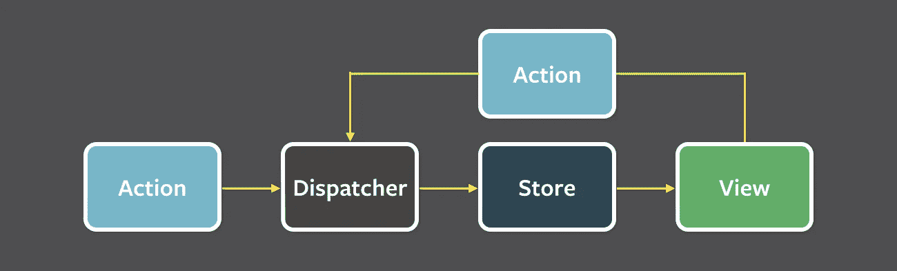

# 构建应用程序状态时避免意外的复杂性

> 原文：<https://medium.com/hackernoon/avoiding-accidental-complexity-when-structuring-your-app-state-6e6d22ad5e2a>

we live in a rainbow of chaos

像 Redux 这样的 Flux 实现鼓励我们明确地思考我们的应用程序状态，并花时间建模。事实证明，这不是一个微不足道的任务。这是混沌理论的一个经典例子，一个看似无害的翅膀朝错误的方向扇动可能会在随后引发一场意外复杂的飓风。下面列出了一些实用的技巧，告诉你如何对应用程序状态建模，以保持你的业务逻辑和你自己尽可能的理智。

## 到底什么是应用状态

根据[维基百科](https://en.wikipedia.org/wiki/State_(computer_science))——计算机程序将数据存储在变量中，变量代表计算机内存中的存储位置。在程序执行的任何给定点，这些内存位置的内容被称为程序的*状态*。

在我们的上下文中，将单词 *minimal* 添加到这个定义中很重要。当对我们的应用程序的状态进行建模以进行显式控制时，我们将尽最大努力处理表达该状态所需的最少量的数据，并忽略程序中可以从该核心派生的所有其他浮动变量。

在 [Flux](https://facebook.github.io/flux/) 应用中，app 状态保存在*存储器*中。分派的*动作*导致该状态改变，之后监听这些状态改变的*视图*将相应地重新呈现它们自己。

为了便于讨论，Redux 将是我们的常驻 Flux 实现，它增加了几个更严格的要求——比如在一个*单个*存储中保存整个应用状态，这也是*不可变的*并且通常是*可串行化的*。

如果您没有使用 Redux，下面列出的提示应该也是相关的。如果你根本不使用 Flux，它们很有可能是相关的。

## 1.避免在服务器 API 之后建模状态

本地应用程序状态通常来自服务器。当一个应用程序用来显示来自远程服务器的数据时，保持这些数据的结构不变通常是非常诱人的。

考虑一个电子商务商店[管理](https://hackernoon.com/tagged/management)应用的例子。商家将使用这个应用程序来管理商店库存，因此显示产品列表是一个关键功能。产品列表来自服务器，但是需要以应用程序状态存储在本地，以便在视图中呈现。让我们假设从服务器检索产品列表的主 API 返回以下 JSON 结果:

产品列表作为*对象*的*数组*到达，那么为什么不在应用程序状态下将它们保存为对象数组呢？

服务器 API 的设计遵循不同的关注点，这些关注点不一定与您的应用程序状态结构试图实现的目标一致。在这种情况下，服务器对*数组*的选择可能与响应分页有关，将整个列表分割成较小的块，以便可以根据需要下载数据，并避免多次发送相同的数据以节省带宽。所有有效的网络问题，但总的来说，与我们州的问题无关。

## 2.更喜欢地图而不是数组

一般来说，数组不便于维护状态。考虑一下当特定产品需要更新或检索时会发生什么。例如，如果应用程序用于编辑价格，或者服务器中的数据需要刷新，就会出现这种情况。遍历一个大数组来查找一个特定的产品远不如根据产品的 *ID* 来查询这个产品方便。

那么有什么推荐的做法呢？使用一个*映射*并通过用于查询的主键进行索引。

这意味着上例中的数据可以存储在应用程序状态中，结构如下:

如果排序顺序很重要，会发生什么？例如，如果从服务器返回的订单与我们需要呈现给用户的订单相同。在这种情况下，我们可以只存储一个额外的 ID 为*的数组:*

一个有趣的附带说明:如果我们计划在一个[React Native](https://hackernoon.com/tagged/react-native)[ListView](https://facebook.github.io/react-native/docs/listview.html)组件中显示数据，这个结构实际上工作得非常好。支持稳定行 ID 的推荐版本[clonewithouts](https://facebook.github.io/react-native/docs/listviewdatasource.html#clonewithrows)需要这种精确的格式。

## 3.避免在视图喜欢消费什么之后建模状态

应用程序状态的最终目的是传播到视图中，并呈现给用户。似乎很容易避免额外转换的成本，而简单地将状态存储在视图预期接收的相同结构中。

让我们回到我们的电子商务商店管理的例子。假设每种产品都可能有货，也可能缺货。我们可以将这些数据存储在产品对象的一个*布尔*属性中:

我们的应用程序需要显示所有缺货的产品列表。正如您从上面回忆的那样，React 原生 ListView 组件期望它的[clone 抛出](https://facebook.github.io/react-native/docs/listviewdatasource.html#clonewithrows)方法 2 参数:一个行映射和一个行 ID 数组。我们很想提前准备好状态，并明确地持有这个列表。这将允许我们向 ListViews 提供两个参数，而无需额外的转换。我们最终得到的状态结构如下:

听起来是个好主意，对吧？良好的..事实证明并非如此。

像以前一样，原因是观点是由不同的关注点引导的。视图不关心保持最小状态。如果有的话，他们更喜欢完全相反的，因为数据必须为用户着想。不同的视图可能以不同的方式呈现相同的状态数据，通常不可能在不复制数据的情况下满足所有的视图。

这就引出了下一点..

## 4.永远不要在应用程序状态下保存重复数据

测试您的状态是否包含重复数据的一个好方法是检查是否必须同时对两个地方进行更新，以保持一致性。在上面脱销产品的例子中，假设第一个产品突然脱销。为了处理这个更新，我们必须将地图中的*缺货*字段更改为*真*，并将它的 *ID* 添加到数组*缺货产品 ID—*两个更新*。*

处理重复数据很简单。您所要做的就是删除其中一个实例。这背后的推理源于[单一真理来源](https://en.wikipedia.org/wiki/Single_source_of_truth)的原则。如果数据只保存一次，就不再可能达到不一致的状态。

如果我们移除 *outOfStockProductIds* 数组，我们仍然需要找到一种方法来为视图消费准备这些数据。这种转换必须在运行时就在数据被提供给视图之前发生。Redux 应用程序中的推荐做法是在一个[选择器](https://egghead.io/lessons/javascript-redux-colocating-selectors-with-reducers)中实现这一点:

选择器是一个纯粹的函数，它将状态作为输入，并返回我们想要使用的状态的转换部分。Dan Abramov 建议我们将选择器放在减速器旁边，因为它们通常是紧密耦合的。我们将在视图的 *mapStateToProps* 中执行选择器。

移除数组的另一个可行的替代方法是从地图中的每个产品中移除 *outOfStock* 属性。在这种替代方法中，我们可以将数组作为唯一的真实来源。实际上..根据技巧 2，将这个数组改为一个地图可能更好:

## 5.从不在状态中存储派生数据

事实的单一来源原则不仅仅适用于重复数据。在存储中发现的任何派生数据都违反了该原则，因为必须对多个位置进行更新以保持一致性。

让我们在商店管理示例中添加另一个需求——销售产品并在价格上添加折扣的能力。该应用程序需要向用户显示一个过滤列表，显示所有产品，只有没有折扣的产品或只有有折扣的产品。

一个常见的错误是在商店中保存 3 个数组，每个数组包含与每个过滤器相关的产品的 *ID* 。因为 3 数组可以从当前过滤器和产品图中获得，所以更好的方法是像前面一样用一个*选择器*来生成它们:

在视图被重新呈现之前，选择器在每次状态改变时被执行。如果你的选择器是计算密集型的，并且你关心性能，应用[记忆](https://en.wikipedia.org/wiki/Memoization)来计算一次结果并缓存它们。看看实现这种优化的[重新选择](https://github.com/reactjs/reselect)库。

## 6.规范化嵌套对象

总的来说，到目前为止，提示的潜在动机是简单。随着时间的推移，状态需要得到管理，我们希望尽可能使这一过程不那么痛苦。当你的数据对象是独立的时，简单性更容易保持，但是当我们有相互联系时会发生什么呢？

考虑我们商店管理应用程序中的以下示例。我们想添加一个订单管理系统，客户购买几个产品作为一个单一的*订单*。假设我们有一个服务器 API，它返回以下 JSON 订单列表:

一个*订单*包含几个*产品*，因此我们需要对两者之间的关系进行建模。从技巧 1 中我们已经知道，我们可能不应该照原样使用 API 响应结构，这看起来确实有问题，因为它将导致产品数据的重复。

在这种情况下，一个好的方法是*规范化*数据并维护两个独立的映射——一个用于产品，一个用于订单。由于这两种类型的对象都是基于唯一的 *ID* 的，我们可以使用 *ID* 属性来指定互连。产生的应用程序状态结构是:

如果我们想找到属于某个订单的所有产品，我们迭代 *products* 属性的键。每把钥匙都是一个产品 *ID* 。使用此 *ID* 访问 *productsById* 地图将为我们提供产品详情。特定于该订单的其他产品详细信息，如 *giftWrap* ，可在订单下的*产品*图的值中找到。

如果规范化 API 响应的过程变得单调乏味，那么看看通用助手库，如 [normalizr](https://github.com/paularmstrong/normalizr) ，它接受一个模式并为您执行规范化过程。

## 7.应用程序状态可以被视为内存中的数据库

到目前为止，我们已经讨论过的各种建模技巧应该很熟悉了。当我们戴上 DBA 的帽子，设计传统的[数据库](https://en.wikipedia.org/wiki/Database)时，我们一直在做类似的选择。

在对传统数据库结构建模时，我们避免了重复和衍生，使用主键(ID)在类似地图的*表*中索引数据，并使几个表之间的关系正常化。差不多是我们到目前为止讨论的所有内容。

像对待内存数据库一样对待你的应用程序状态可能会帮助你进入正确的思维模式，从而做出更好的结构化决策。

## 将 app state 视为一等公民

如果你从这篇文章中得到什么，那就是这个。

在命令式编程中，我们倾向于视代码为王，较少花时间担心内部隐式数据结构(如状态)的“正确”模型。我们的应用程序状态通常发现自己分散在不同的管理者或控制者中，作为私有财产自然增长。

在声明性范式下，情况有所不同。在 React 这样的环境中，我们的系统是*反应*到*状态*。国家现在是一等公民，和我们写的法典一样重要。这是我们流动行为的目的，也是我们流动观点的真理来源。像 Redux 这样的库围绕着它，并使用像 immutability 这样的工具使它更加可预测。

我们应该花时间思考我们的应用程序状态。我们应该意识到它变得有多复杂，以及我们的代码花费了多少精力来维护它。而且我们绝对应该*重构它，就像我们对显示出开始腐烂迹象的代码所做的那样。*

> [黑客中午](http://bit.ly/Hackernoon)是黑客如何开始他们的下午。我们是 [@AMI](http://bit.ly/atAMIatAMI) 家庭的一员。我们现在[接受投稿](http://bit.ly/hackernoonsubmission)，并乐意[讨论广告&赞助](mailto:partners@amipublications.com)机会。
> 
> 如果你喜欢这个故事，我们推荐你阅读我们的[最新科技故事](http://bit.ly/hackernoonlatestt)和[趋势科技故事](https://hackernoon.com/trending)。直到下一次，不要把世界的现实想当然！

