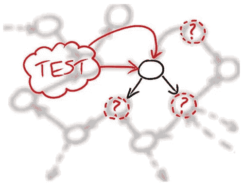

# 在 ScalaTest 中避免模仿

> 原文：<https://medium.com/hackernoon/avoiding-mocks-in-scalatest-940bb8bfdb10>

很多次有人问我，在为 Scala 应用程序编写测试时，我是如何模仿的。既然测试对我们来说很重要(参见 [***使用 ScalaTest 和自定义匹配器的简化测试***](https://hackernoon.com/simplified-testing-with-scalatest-and-custom-matchers-bd5297128ebc) ***)*** 看来嘲讽是我们测试技术中不可或缺的一部分，所以让我们探讨一下这方面的一些想法。

让我们从展示一个每天都会发生在我们身上的常见问题开始。请注意，这个例子可能非常简单，但是给定一个上下文，它可以外推至日常现实问题。

我们的问题领域是与*应用程序用户操作相关的领域。*

让我们从一开始就定义一些高层次的抽象。

首先，我们有一个从某种存储中存储和检索对象接口。正如你可能看到的，这个定义非常抽象，在某些时候，我们需要它的专门化。

现在，我们可以定义另一个更接近我们领域的抽象。

***user repository***是一个抽象概念，表示我们将如何管理应用程序中的用户。

在这一点上，我们需要实现 ***用户存储库*** ，它需要一个 ***数据库*** 的具体表示来处理。

让我们从编写一些测试开始。

这个测试没什么不寻常的。它唯一做的事情是确保用户一旦被添加就可以恢复。它的问题是它需要一些 ***DB*** 的实例。

此时，我们可以给我们的依赖项添加一个嘲讽库，开始嘲讽***DB***；但问题是这真的有必要吗？

如果只是实现一个我们可以在测试中使用的版本呢？

现在，在我们的测试中，我们需要在运行它们之前初始化 InMemDB 中的 ***。***

在某种程度上，我们正在创建一个真正的 ***DB*** 的实现，这对于很多情况来说是很好的，但有时我们希望有更多的灵活性，这就是嘲讽库的闪光点。

在这种情况下，我们不必实现 ***DB*** 来使用它。我们可以用我们想要的方式嘲笑/模拟它的行为。然而，为了设置模仿，需要额外的步骤。

让我们使用这种技术编写另一个测试。

在这里，我们测试谓词(user.name.length ≤ 3)是否正在执行。

正如您所看到的，建立这些模拟并不难，但这也可能是另一种方式来做同样的事情，而不会给我们的测试引入额外的依赖。

如果我们可以用下面的方式写同样的测试呢？

我们实际上可以创建一个 ***DB*** 的实例，并内联实现它。缺点是，我们还需要有其他功能，即使我们不使用它们。

我们可以通过用默认实现创建另一个特征，然后在测试中使用这个新的特征来规避这个问题。

现在我们可以如下重写我们测试。

重要的是要记住，在这里我们根本不是在测试 ***DB*** 。这里重要的是能够成功地测试 ***用户存储库*** 。

对于我们可以在***user repository***中使用的东西，至少还有一种方法可以替换 ***DB*** 。我们可以将 ***DB*** 与我们的测试类混合在一起。

以这种特殊的方式，我们需要在我们的测试类中实现 ***DB*** 函数，这使它成为 ***DB* 的一个实例。**这和我们用***UserDBForTesting***做的有点像，但是在这种情况下，我们不需要额外的类，实现正是我们测试所需要的，没有别的。

让我们看另一个例子，它通过使用类型类和上下文带来了一种不同的模拟/替换实现的方式。

这个`type class`是一个抽象的 ***编写器*** ，我们可以通过某种专门化来实现它，特别是对于 ***用户*** 。

这个想法是我们可以做下面的函数调用。

为了实现这一点，我们需要实现***Write【User】***，它实际上将 ***用户*** 写到磁盘上。*写一个用户应该永远不会失败。*

***Writer【用户】*** 的相关测试可以用多种方式完成，集成测试可能是解决这个问题的好方法。但是，从这一层开始，我们就不用再处理磁盘了。我们可以简单地替换 ***的实现，将*** 放到我们的测试中。

假设我们必须编写在某些上下文中覆盖用户信息的用户管理器。上下文本身不必是固定的。

***。替换*** 不仅写磁盘，还对用户做其他验证。

让我们看看它的测试是什么样的。

对内，**、*取代*、**应该在某些时候做到。

问题是为了测试 ***用户管理器*** 我们根本不应该去磁盘。我们可以简单地替换测试调用。一种方法是替换测试过程中选择的上下文。

然后我们隐式导入***TrueTestingUserStorage***模仿/模拟被测类( ***UserManager*** )所具有的依赖关系。

回到问题 ***我如何嘲讽？*** 嗯，我一般不会。

我们刚刚看到了几种不同的替代模拟的方法。我不嘲笑，因为我从来不记得框架的细节；因为团队中的人对如何模仿有强烈的意见，而且每个人对框架都有不同的偏好。要考虑的事情太多了，因此复杂性和决策更难处理。

我个人认为使用纯 Scala 技术来模拟测试依赖的实现，同时保持小的构建和库依赖，更容易。

看起来，当应用程序组件中有大量状态需要管理时，模仿就成了一种方式。然而，在我们的模块中使用纯函数和较少的状态使得测试应用程序/模块的不同部分变得更加容易。有时候，接受纯函数式编程需要时间，但是它带来的好处之一是测试的简单性。

> Scala mix 很好地完成了这项工作。

许多人在这些想法中挣扎。请分享你对此的看法，以及你是如何进行嘲讽和测试的。我将很高兴从社区中学到更多。

*注意，我们使用了一些测试技术和 Scala 隐式，正如我们在之前的帖子中所讨论的(参见* [***使用 ScalaTest 和自定义匹配器的简化测试***](https://hackernoon.com/simplified-testing-with-scalatest-and-custom-matchers-bd5297128ebc)***)***