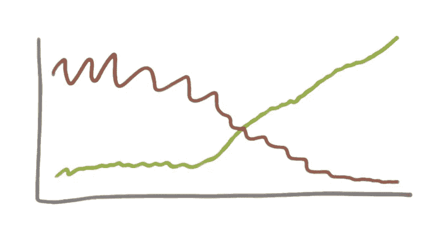

# 可怕到可怕:一个软件开发的故事

> 原文：<https://medium.com/hackernoon/awful-to-awesome-a-software-development-story-f9fee2fc84cb>

by Joshua Kerievsky

当 Stas Zvinyatskovsky，Ed Kraay 和团队开始拉雅虎！软件开发在石器时代，团队平均用 20 周来构建、测试、稳定和部署大型软件版本。每一次发布都伴随着痛苦、紧张的生产事件，程序员们加班加点，修复缺陷，处理紧急情况，只是为了生存。一名开发人员说，“我们真的很努力，但我们不知道我们是否有所作为。”

雅虎！美国的竞争对手围着他们团团转，必须做点什么。两年后，雅虎！团队每天或每周投入生产，生产事故几乎不存在。这是一个痛苦旅程的快乐结局，斯塔斯和埃德描述为，*从沥青坑中拖出一头大象。*

雅虎软件开发的陷阱！是一个与[敏捷](https://hackernoon.com/tagged/agile)相反的软件开发过程。程序员没有编写单元测试，这导致了大量的缺陷泄漏到产品中。程序员在分支机构工作了很长一段时间，与其他人的代码变更隔离开来，这使得以后的集成变得缓慢和困难。手动构建过程是由经理安排的，当代码不能编译时通常会中断。在一个成功的构建最终产生后，质量保证人员会发现其中存在严重的缺陷。程序员修复缺陷，尝试新的构建，并重复循环。这项工作是如此的缓慢和痛苦，以至于大多数团队每年只能发布 3 个版本。

连续部署是频繁的、小代码变更的安全的、自动的部署，支持将细粒度的变更发布到产品中，而不是风险大得多的大批量发布。在今天的硅谷，进行持续的部署是一种赌注，因为频繁地发布小的变更可以让你不断地改进你的软件，快速地修复缺陷，快速地从生产实验中学习，并且更快地给客户带来快乐。

回到雅虎！被困在沥青坑里，他们无法接近连续部署。他们不得不做出一些重大的改变来实现这一目标，但不清楚该怎么做。“我们尝试了很多次，失败了很多次，才找到了走出沥青坑的路，但我们找到了出路”，斯塔斯说。

早期的实验包括创建一个“端到端”的环境来模拟生产，并允许人们在那里测试发布。这种方法的问题是，它导致程序员只对他们的代码执行表面测试，因为他们认为真正的测试将发生在端到端的环境中。结果，质量差的代码被推到了端到端的环境中，当这些代码不能正常工作时，就会破坏环境。

他们试图从在一个大版本上合作转变为在功能上分开工作，但这导致了功能分支的复杂混乱，需要大量痛苦的合并来处理共享代码的依赖性。

尽管尝试了各种改变，他们仍然一年只发行 3 次，而且质量很差。

他们试图走得更快，准备好发布，成功地将其推广到 1%的生产机器，然后是 5%的生产机器，然后是 100%的生产机器，于是它崩溃了。雅虎！最优秀的工程师努力寻找只发生在产品中的缺陷(那些是最难修复的缺陷)，修复缺陷，然后尝试另一个版本。同样的循环发生了，导致了不得不回滚的发布。花了 7 次尝试和 3 个月的时间(消耗了公司最好的工程师的宝贵时间)才最终将一个好的版本投入生产。这是如此的痛苦，以至于管理层对任何真正有帮助的事情都持开放态度。

**改变一切**

生产中发生的大多数缺陷都可以通过单元测试发现。斯塔斯和埃德有一个解决方案，他们最终被邀请去尝试。2011 年 1 月，一个团队同意为 real 进行持续集成(总是保持构建工作)并为任何和所有代码变更进行单元测试。当他们 6 个月后发布到生产环境时，没有回滚！

那是一道微弱的光。持续集成带来了巨大的变化！管理层决定每个人都需要这样做，并要求所有工程人员都这样做。但是他们继续奋斗。质量问题持续存在，他们每年发布的版本不能超过 3 个。

这时，他们决定需要从根本上改变他们在雅虎的工作方式。他们没有敏捷或实现持续集成的目标，而是意识到他们真正的目标是“快速行动以取悦客户”

要做到这一点，他们的理由是，他们不能再在筒仓中工作，一个是产品管理，一个是工程师，一个是质量保证，一个是发布工程，每个筒仓都将工作抛给下一个筒仓。相反，他们形成了真正的 40-50 人的跨职能社区，这种社区可以从产品创意转向生产，而无需向任何其他团队或部门寻求帮助。在这些社区内，他们组织成小团体，但社区负责向顾客传递快乐。他们抛弃了昂贵的端到端环境，致力于实现持续部署:如果您签入代码，并且它通过了自动化构建，它就会自动投入生产，无需任何人工干预。为了更好地执行持续部署，他们重新致力于持续集成。他们还聘请了我的公司 Industrial Logic 来帮助培训测试驱动开发和重构方面的工程师，并通过学习如何在功能上合作、制定验收标准和自动化验收测试来培训质量保证人员成为质量工程师。

这是他们一直需要的巨大突破，以取悦客户，让他们在雅虎工作！又有趣了。生产释放的数量呈急剧上升趋势，而生产事故的数量呈急剧下降趋势。整个 1，000 人、地理位置分散的组织的经理和员工都喜欢这些变化，客户也很高兴。每日发布和接近零的生产事故开始变得正常。

雅虎！通过耐心、反复试验以及提高和竞争的坚定决心，美国人把自己从软件开发的焦油坑中拉了出来。在他们开始旅程之前，一些开发人员说“持续部署是疯狂的”，并发誓他们永远不会这样做。现在他们说他们再也不会回到那种糟糕的、陈旧的工作方式了。

注:这个故事最初是我的朋友斯塔斯讲的。你可以在这里观看他的视频:[https://www.youtube.com/watch?v=C-Itdv1p11A](https://www.youtube.com/watch?v=C-Itdv1p11A)