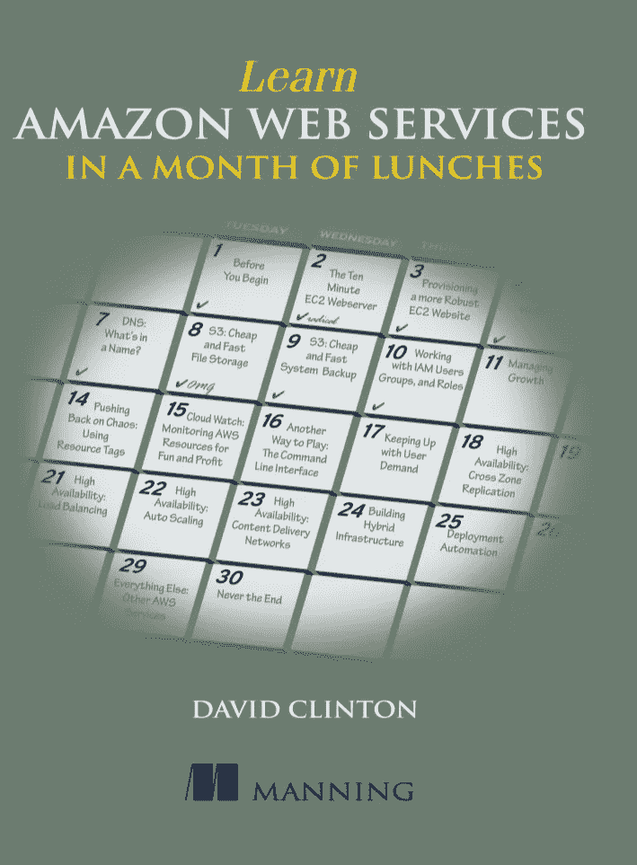
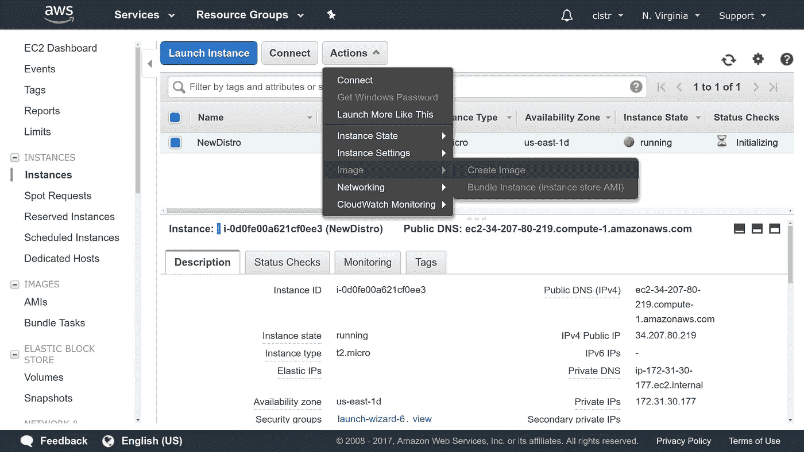
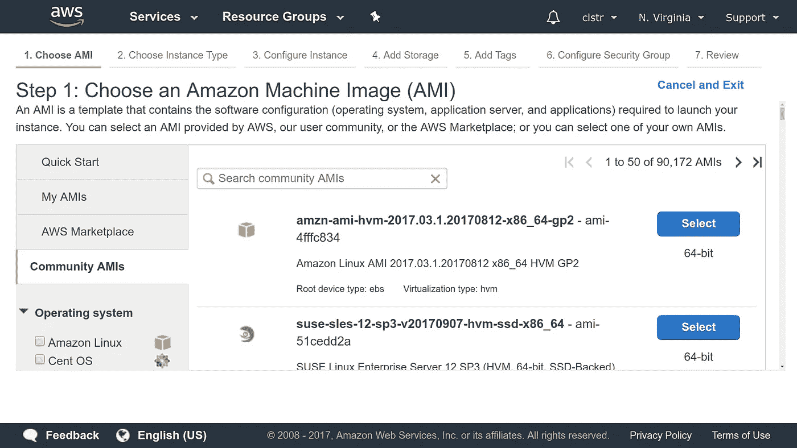

# AWS AMIs:推出自己的 Linux 发行版的另一种方式

> 原文：<https://medium.com/hackernoon/aws-amis-another-way-to-roll-your-own-linux-distros-9e79bd1b264d>

开源应该是一项团队运动。由于您可以自由下载代码并根据自己的需要重新编写，因此您也可以自由地与您最亲密的朋友和家人分享您的定制内容。多年来，开源世界的核心——Linux 已经发展成了数百个发行版(或者更常见的叫法是“发行版”)。你认为还有一个无人问津的领域吗？您自己的企业是否需要专门构建的操作系统环境来适应其独特的工作流程？那就想尽一切办法定制吧。

创建你自己的发行版并不意味着你必须破解内核，通过晦涩的系统调用和 isa 来解决问题。你可以简单地安装你自己的软件，重置一些环境变量，或者只是安装几个定制脚本，假设你的名字是 Linda，你可以叫它 Lindux(但那是你自己的事)。

尽管如此，不管你的发行版有多简单，把它打包到一个 ISO 文档中与世界共享会变得非常复杂，非常快。不相信我？只需在互联网上搜索“构建你自己的 Linux 发行版”的指南和工具，并注意有多少，每个需要多少步骤，以及有多少工具已经被放弃，因为对基础发行版的新升级使它们变得无用。

我不是想打击你。如果你已经得到了新发行版的 bug，并且你已经准备好迎接挑战，那么尽一切办法，使用传统的工具为我们构建一个伟大的。但是，如果您想要的是一个将在 AWS 云中运行的定制的 Linux 服务器映像，那么有一个简单得多的方法。

正如我在我的新书 [Manning 中详细描述的那样，“**在一个月的午餐中学习亚马逊网络服务**，”](https://www.manning.com/books/learn-amazon-web-services-in-a-month-of-lunches?a_aid=bootstrap-it&amp;a_bid=1c1b5e27)支持许多 AWS 工作负载的基本虚拟机是弹性计算云(EC2)服务器实例。EC2 实例预装了一系列操作系统，但是绝大多数都运行不同风格的 Linux。



[Learn Amazon Web Services in a Month of Lunches](https://www.manning.com/books/learn-amazon-web-services-in-a-month-of-lunches?a_aid=bootstrap-it&amp;a_bid=1c1b5e27)

所以你可以这么做:

*   选择并启动一个用您选择的 Linux 发行版构建的 EC2 实例。这将是你自己发行版的基础。
*   使用 SSH 登录到您的实例，安装您自己的发行版所需的软件和环境设置。
*   创建实例的映像(这将有效地成为实例当前状态的完美副本)。作为一个亚马逊机器映像(AMI)，这个映像可以公开给任何人，让他们在自己的 AWS 帐户中启动。或者你可以保持私密，只在你自己的团队成员之间分享。

实际上，AWS AMI 成为打包和分发图像的单一工具。也许把从另一端出来的东西叫做*发行版并不是 100%准确，而且如果你想提供一个桌面 GUI 体验的话，这也是毫无用处的——但是它会比其他任何选择都要快得多，也容易得多。*

这一切是如何运作的？下面是简短的版本。在 EC2 实例仪表板中选择要复制的正在运行的 EC2 实例。然后点击**动作**，选择**图像**，然后选择**创建图像**。



Create a new image based on a running instance

几分钟后，一个新的图像应该会出现在 EC2 仪表板的 AMI 页面上。下次您从 EC2 仪表板启动一个新实例并到达**选择一个 Amazon 机器映像**页面时，单击**My AMI**选项卡:您的新 AMI 应该在那里，等待被选择。如果您选择公开您的图像，那么其他用户将在**社区 AMIs** 选项卡中找到它。



Public AMIs are available from this tab

但是这有什么意思呢？如果你想像职业玩家一样玩，你将[安装并验证 AWS CLI](https://livebook.manning.com/#!/book/learn-amazon-web-services-in-a-month-of-lunches/chapter-12/) 并通过他们的 API 运行它。

这就是通过引用映像 ID 启动 AMI 映像的方式(顺便说一下，据我所知，这个映像不是活动的):

```
$ aws ec2 run-instances --image-id ami-5cf5c74b \
--count 1 --instance-type t2.micro \
--key-name mykey --security-group-ids sg-7a4d6200
```

让我们一步一步来:

*   **aws ec2 run-instances** 运行一个新实例，其详细信息将在后面介绍。
*   **image-id ami-5cf5c74b** 标识 ami 的 id。您可以从 EC2 仪表板的 AMI 页面或从
    CLI 使用

```
aws ec2 describe-images --owners self .
```

*   **count 1** 指定您只想启动该映像的一个实例。
*   **实例类型 t2.micro** 是实例类型。
*   **key-name mykey** 是在实例运行时用来访问实例的密钥对的名称。这个例子使用了上一章中的复数——一个 key-
    name 例子。
*   **security-groups SG-7a4d 6200**是您将使用的现有安全组的名称；您可以使用 aws ec2 describe-security-groups 找到它。此处显示的 ID 对于我的帐户的 VPC 中的组是唯一的。您需要使用自己帐户中的群 ID。

回到控制台。您将看到您的新实例正在初始化，最终您将看到您的 Linux“发行版”的新副本正在愉快地运行。

*本文部分改编自我的* [*曼宁《用一个月的午餐学会亚马逊 Web 服务》一书*](https://www.manning.com/books/learn-amazon-web-services-in-a-month-of-lunches?a_aid=bootstrap-it&amp;a_bid=1c1b5e27) *。还有更多这方面的内容，包括我的来自曼宁的书*[*Linux in Action*](https://www.manning.com/books/linux-in-action?a_aid=bootstrap-it&a_bid=4ca15fc9)*，以及一个名为*[*Linux in Motion*](https://www.manning.com/livevideo/linux-in-motion?a_aid=bootstrap-it&a_bid=0c56986f&chan=motion1)*的混合课程，它由两个多小时的视频和大约 40%的 Linux in Action 文本组成。查看* [*我的其他书籍和课程*](https://bootstrap-it.com/) *。*