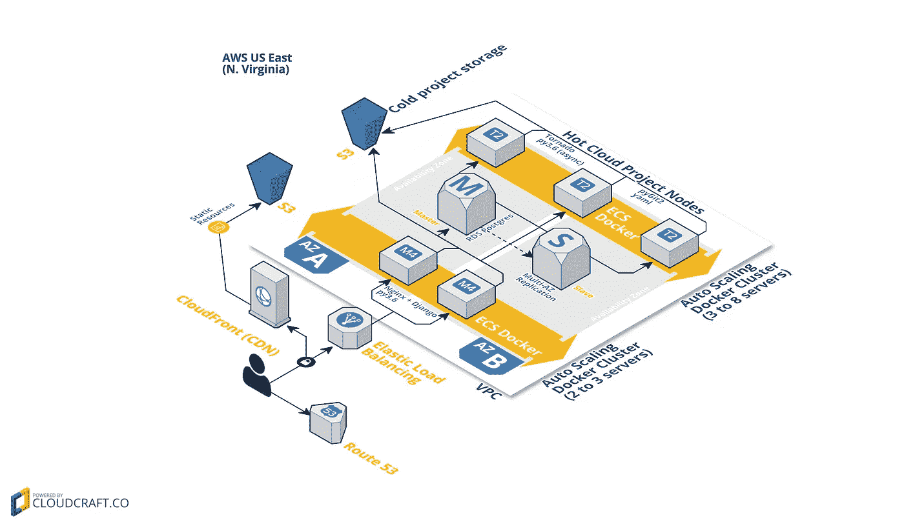

# AWS 作为云同步服务的无状态平台

> 原文：<https://medium.com/hackernoon/aws-as-a-stateless-platform-for-cloud-syncing-services-7afe1908463c>

## 当涉及到设计支持 Paw 云同步服务所需的基础设施时，我们希望以这样一种方式构建它，即每个组件都可以被拔掉，而不会导致用户数据丢失。

当我们发现 [Paw](https://paw.cloud) 的许多用户通过 Dropbox、Git 或 Slack 附件分享他们的工作时，我们意识到我们有机会构建一个伟大的同步服务来帮助他们的 API 开发工作。我们希望构建一个对用户来说既无缝又可靠的东西，让使用我们产品的工程师每天都能信任它。

An overview of our AWS infrastructure showing both sets of Auto Scaling Docker Clusters (graphic created on [cloudcraft.co](https://cloudcraft.co))

我们有 2 套自动扩展 ECS (EC2 容器服务，又名。亚马逊 EC2 for Docker)集群组成了 [paw.cloud](https://paw.cloud) 的核心骨干，同时服务于网站和云同步解决方案 [**Paw for Teams**](https://paw.cloud/teams) 。

当我在 2015 年 10 月加入 Paw 团队时，我们的网站(*luckymarmot.com*当时)由数字海洋上的单个实例托管。随着团队同步功能的规划，我们开始在 Amazon [AWS](https://hackernoon.com/tagged/aws) 上构建我们的新基础设施，目标是所有部署代码的高冗余和无状态操作。

然而，有两样东西不能是无状态的:数据库和客户项目存储。所以我们选择使用 AWS 的关系数据库服务(RDS)和 PostgreSQL 和 S3 来提供有状态存储解决方案。通过这样做，我们现在能够扩展和收缩面向公众的 Django 服务器和我们的云同步工作节点，而不用担心数据的一致性和丢失。

我们的网站和所有 API 都是通过第一组 Docker 集群(最面向公众的集群)的 Docker 容器提供服务的，如上所示。这个容器包含通过 uWSGI 到运行在 [Python 3.6](https://www.python.org/) 上的 [Django](https://www.djangoproject.com/) (1.10.6)的 Nginx 映射。

我们的 web 前端是 Django 静态模板的混合，这些模板呈现在服务器端，用于未认证的登录页面和 [React](https://facebook.github.io/react/) 账户、[购买](https://paw.cloud/purchase/)和[文档](https://paw.cloud/docs/)页面。我们认为这在搜索引擎难以抓取的动态内容页面和静态页面之间提供了一个很好的平衡。唯一的例外是我们的文档，我们有一个非常定制的解决方案，用于为搜索引擎和传统浏览器生成静态 HTML 内容，同时使用 React 提供更丰富的内容。所有网络资产(样式表、JS 等。)是通过由亚马逊 S3 桶支持的 CloudFront CDN 提供的。

为了管理我们的云同步服务，所有请求首先通过 Django(在那里用户被认证),并被传递到另一个自动扩展 Docker 集群，该集群再次在 Python 3.6 上运行。利用完全异步的运行时和语法 [(async，await)](https://docs.python.org/3.6/library/asyncio-task.html) ，用 Python 3.5+编写这本书是一件乐事。我们面向公众的 Django 集群负责将请求路由到适当的后端 Tornado 实例，并且当一个项目在亚马逊 S3 上变冷时，将它加载到最可用的后端实例上。随着项目写入的发生，整个项目的备份被推送到 S3，项目版本散列被保存在 Postgres 数据库中，以确保数据一致性。

*即将发布的关于 Paw 云基础设施的文章将介绍 reStructuredText 作为基于自适应 React 的产品文档平台的源代码，* [*修改存储在 PostgreSQL 之外的文件，同时保持完全的事务安全和无状态设计*](https://hackernoon.com/modifying-files-stored-outside-of-postgresql-while-maintaining-full-transaction-safety-and-d8b55327e679#.rtf0hj8ol) *。Git 作为复杂多对象文档的云存储后端:一条可循之路？*

> [黑客中午](http://bit.ly/Hackernoon)是黑客如何开始他们的下午。我们是 [@AMI](http://bit.ly/atAMIatAMI) 家庭的一员。我们现在[接受投稿](http://bit.ly/hackernoonsubmission)，并乐意[讨论广告&赞助](mailto:partners@amipublications.com)机会。
> 
> 如果你喜欢这个故事，我们推荐你阅读我们的[最新科技故事](http://bit.ly/hackernoonlatestt)和[趋势科技故事](https://hackernoon.com/trending)。直到下一次，不要把世界的现实想当然！

