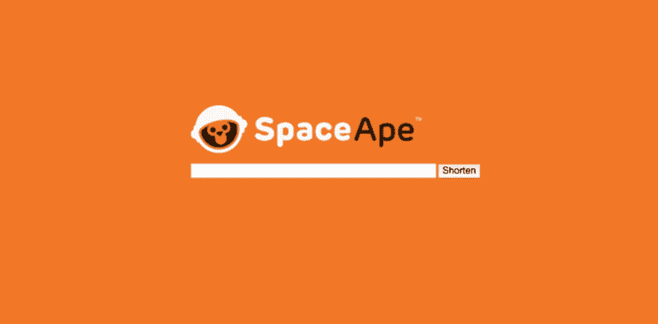
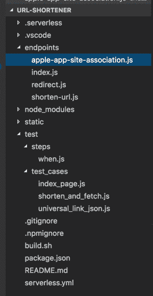
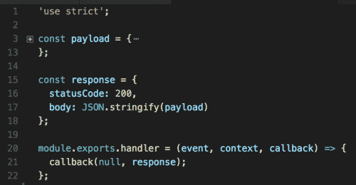
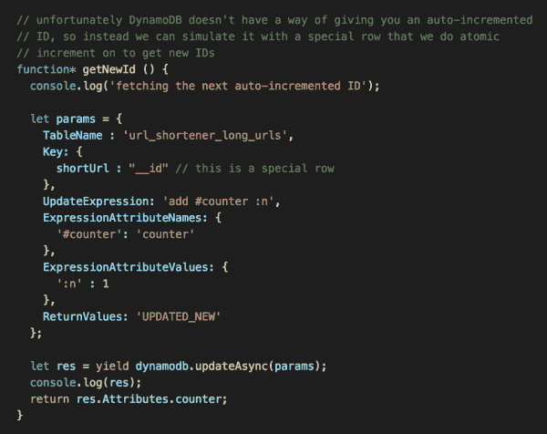
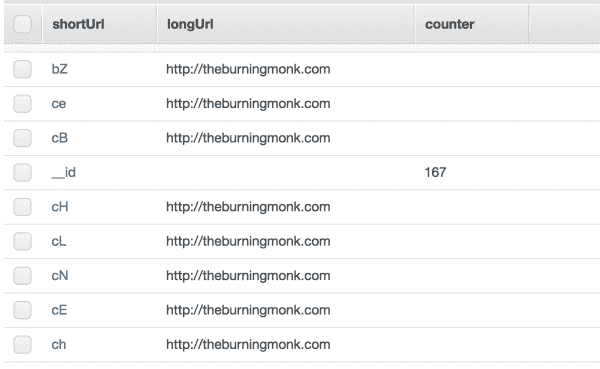
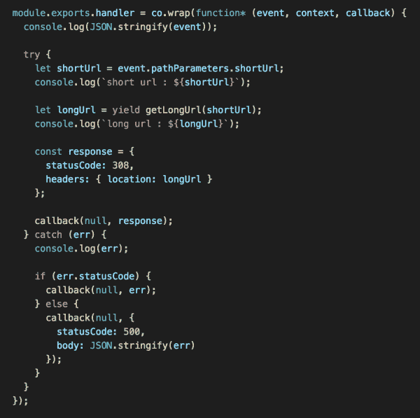
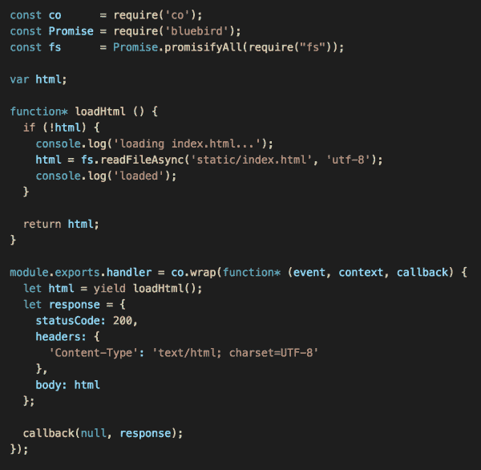

# AWS Lambda——在 2 小时内为自己构建一个网址缩写器

> 原文：<https://medium.com/hackernoon/aws-lambda-build-yourself-a-url-shortener-in-2-hours-94f9627ed4a6>

本周工作中出现了一个有趣的需求，我们讨论了可能必须运行我们自己的 URL 缩短器，因为*通用链接*机制(在 iOS 9 及以上版本)[需要一个 JSON 清单](http://blog.hokolinks.com/how-to-implement-apple-universal-links-on-ios-9/)

> 【https://domain.com/apple-app-site-association 

由于操作系统不遵循重定向，该清单必须托管在 URL 缩写的根域上。

由于对*应用程序*的限制，当你为你的应用程序配置了*通用链接*时，目前[无法缩短链接](https://support.appsflyer.com/hc/en-us/articles/207032266-Setting-Deeplinking-in-iOS9-and-above-using-iOS-Universal-Links)。虽然我们可以切换到另一个供应商，这意味着我们的(已经捉襟见肘的)客户端开发人员要做更多的工作，我们真的很喜欢 *AppsFlyer* 对属性的支持。

这又把我们带回了这个问题

> "我们应该建立一个网址缩短器吗？"

紧接着

> “2017 年打造一个可扩展的网址缩短器能有多难？”

事实证明，这一点也不难，因为我用了不到两个小时就实现、测试和部署了所有东西！

# FTW

对于这个网址缩写，我们需要几样东西:

1.  一个 **GET /{shortUrl}** 端点，它会将您重定向到原始 Url
2.  一个 **POST /** 端点，它将接受原始 URL 并返回缩短的 URL
3.  一个 index.html 页面，在这里人们可以很容易地创建简短的 URL
4.  一个提供静态 JSON 响应的**GET/apple-app-site-association**端点

所有这些都可以用 *API Gateway + Lambda* 来完成。

总的来说，这是我最终得到的项目结构:

*   使用[无服务器](https://serverless.com/)框架的**模板**
*   上述每个端点都有一个相应的处理函数
*   ***index.html***文件在*静态*文件夹中
*   测试用例以这样的方式编写，它们既可以用作集成测试[，也可以用作验收测试](http://theburningmonk.com/2017/02/yubls-road-to-serverless-architecture-part-2/)
*   有一个 ***build.sh*** 脚本，方便运行…
*   集成测试，如 ***。/build . sh int-test { env } { region } { AWS _ profile }***
*   验收测试，如 ***。/build.sh 验收测试{ env } { region } { AWS _ profile }***
*   部署完毕，如**T5。/build.sh 部署{ env } { region } { AWS _ profile }**

# 获取/apple-app-site-association 端点

因为这是一个静态 JSON blob，所以每次预先计算 HTTP 响应并返回它是有意义的。

# 发布/结束

对于缩短 URL 的算法，你可以在 StackOverflow 上找到一个非常简单优雅的[解决方案](http://stackoverflow.com/questions/742013/how-to-code-a-url-shortener/742047#742047)。您所需要的只是一个自动递增的 ID，就像您通常从 RDBMS 获得的 ID 一样。

然而，我发现 *DynamoDB* 在这里是一个更合适的 DB 选择，因为:

*   这是一项托管服务，所以我不需要担心基础设施
*   OPEX 超过资本支出，伙计！
*   我可以灵活地扩展读写吞吐量，以匹配利用率水平并处理任何流量峰值

但是， *DynamoDB* 没有算法需要的自动递增 ID 这样的概念。相反，您可以使用一个[原子计数器](http://docs.aws.amazon.com/amazondynamodb/latest/developerguide/WorkingWithItems.html#WorkingWithItems.AtomicCounters)来模拟一个自动递增的 ID(代价是每个请求增加一个额外的写单元)。

# GET /{shortUrl}端点

一旦我们在一个 *DynamoDB* 表中有了映射，那么*重定向*端点就是一件简单的事情，获取原始 URL 并将其作为*位置*头的一部分返回。

哦，不要忘记返回适当的 HTTP 状态代码，在本例中是一个 *308 永久重定向*。

# 获取/索引页面

最后，对于索引页面，我们需要返回一些 HTML(和一个不同的 HTML 内容类型)。

我决定将 HTML 文件放在一个静态文件夹中，这个文件夹在第一次调用函数时被加载和缓存。

# 为生产做准备

幸运的是，我有足够的实践经验[让 Lambda 函数为生产做好准备](http://theburningmonk.com/2017/03/slides-for-my-aws-user-group-talk-aws-lambda-from-the-trenches/)，对于这个 URL shortener，我们需要:

*   为 *DynamoDB* 表配置自动缩放参数(我们有一个内部系统来管理自动缩放)
*   为生产阶段打开 *API 网关*中的缓存

# 未来的改进

如果你多次输入相同的 url，你会得到不同的短 URL，一个优化(对于存储和缓存)是返回相同的短 URL。

为此，您可以:

1.  将 GSI 添加到 *longUrl* 属性的 *DynamoDB* 表中，以支持高效的反向查找
2.  在 *shortenUrl* 函数中，使用 GSI 执行 GET 来查找现有的短 Url

我认为在这里添加一个 GSI 比创建一个新表更好，因为它避免了跨越多个表的“事务”。

# 有用的链接

*   [分解 iOS 9 通用链接](http://blog.hokolinks.com/how-to-implement-apple-universal-links-on-ios-9/)
*   [我的演讲幻灯片，介绍如何利用 AWS Lambda 为生产做好准备](http://theburningmonk.com/2017/03/slides-for-my-aws-user-group-talk-aws-lambda-from-the-trenches/)
*   [我的关于将 Yubl 迁移到无服务器架构的系列文章](http://theburningmonk.com/yubls-road-to-serverless-architecture/)
*   [SO:缩短 URL 的算法](http://stackoverflow.com/questions/742013/how-to-code-a-url-shortener/742047#742047)

喜欢您正在阅读的内容，但需要更多帮助？我很乐意作为一名独立顾问提供服务，帮助您完成无服务器项目——架构审查、代码审查、构建概念验证，或者提供关于领先实践和工具的建议。

我在**英国伦敦**工作，目前是唯一一个在英国 [**AWS 无服务器英雄**](https://aws.amazon.com/developer/community/heroes/yan-cui/) 。我有近 **10 年**的[经验](https://www.linkedin.com/in/theburningmonk/)在 AWS 中大规模运行生产工作负载。我主要在英国开展业务，但我愿意出差一周以上。为了看看我们如何能够一起工作，在这里告诉我更多关于你试图解决的问题。

我还可以组织一个内部研讨会来帮助您的无服务器架构进入生产准备阶段。您可以在这里找到关于为期两天的研讨会[的更多信息，该研讨会将带您从 AWS Lambda 的基础知识一直到日志聚合、分发跟踪和安全最佳实践的通用操作模式。](https://theburningmonk.com/workshops/)

如果你喜欢按照自己的进度学习，那么你也可以找到所有与我为曼宁制作的**视频课程相同的研讨会内容。我们将讨论的主题包括:**

*   **认证 *&* 授权与 API 网关 *&* 认知**
*   **本地测试 *&* 运行功能**
*   **CI/CD**
*   **日志聚合**
*   **监控最佳实践**
*   **X 射线分布式跟踪**
*   **跟踪相关 id**
*   ***性能&成本*优化**
*   **错误处理**
*   **配置管理**
*   **金丝雀部署**
*   **VPC**
*   **安全**
*   **Lambda、Kinesis 和 API 网关的最佳实践**

**你还可以用代码 **ytcui** 获得**票面价格的 6 折优惠**。不过，这个数字只有在我们参加曼宁的早期访问计划(MEAP)时才有效。**