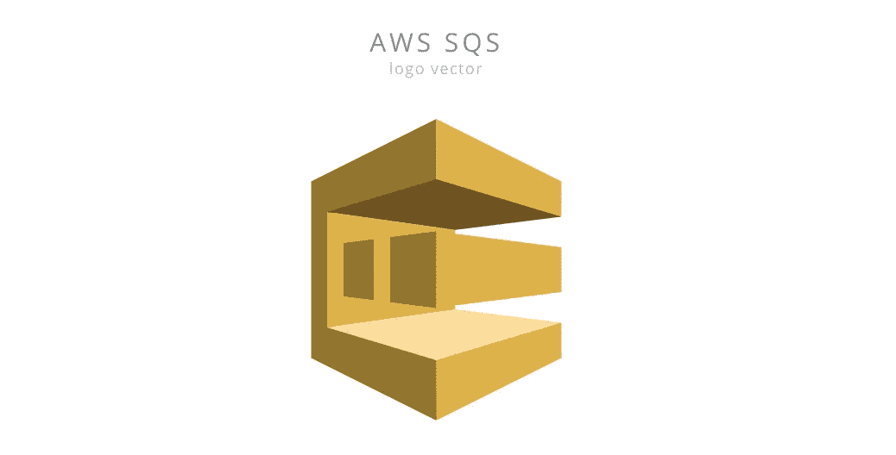
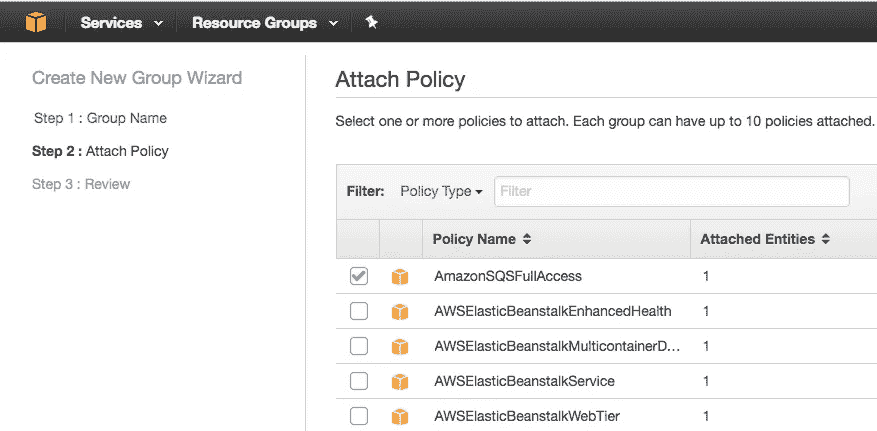
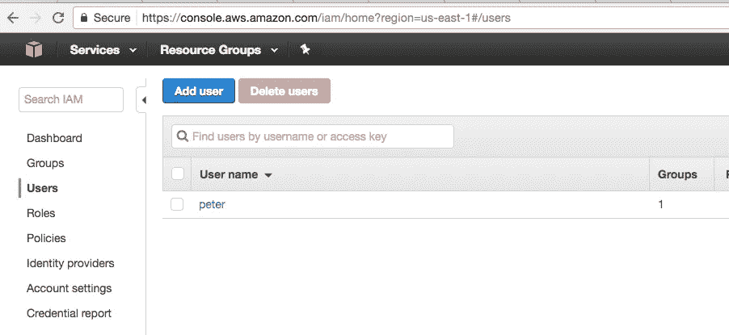
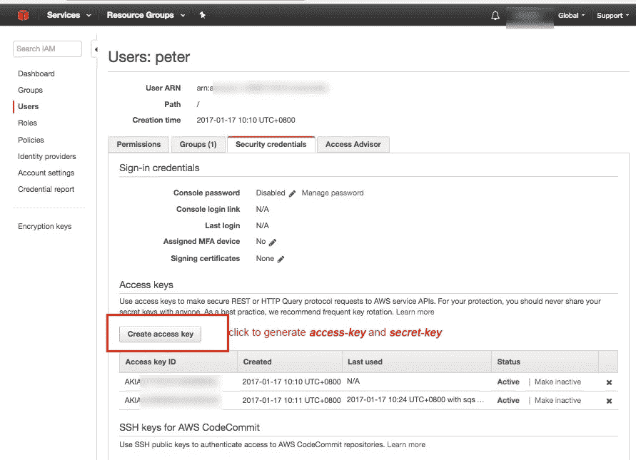
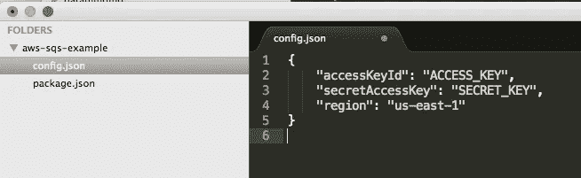
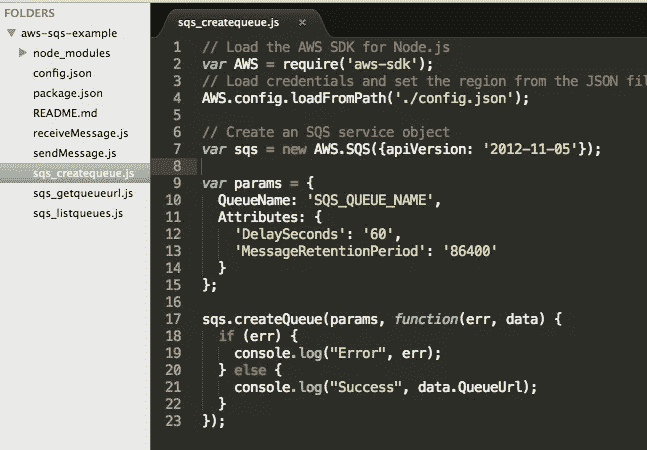
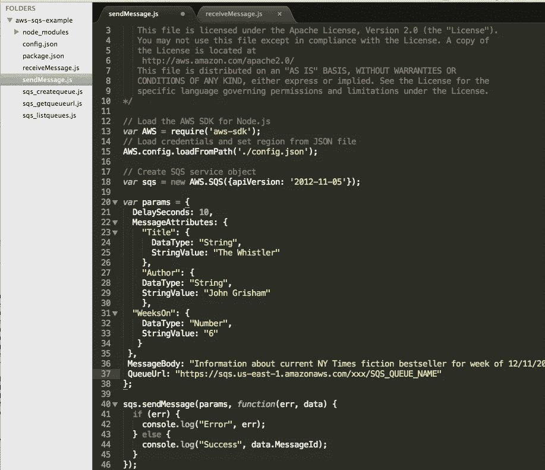

# [AWS]教程 SQS(消息队列服务)

> 原文：<https://medium.com/hackernoon/aws-sqs-queue-send-message-nodejs-javascript-helloworld-setup-config-5e9bb26f6dec>



建立你自己的服务器需要很好的知识，这样你就不会遗漏任何一个角落。这不是亚马逊 SQS 的情况，因为它可以很快上手。

> SQS 的美妙之处还在于它不会丢失东西——独立于任何服务器——而且它消除了两个线程试图做相同的工作和碰撞头的情况。
> 
> 一旦任何东西接收到队列中的消息，它们就在一定时间内拥有对它的独占租约。当您需要扩展到多个工作服务器时，这一点尤其重要。每一个都只是获得队列中的下一个作业，独立于其他作业完成自己的工作，然后一旦完成就从队列中删除它(Jason Byrne )。

## 备注:

—在开始下面的步骤之前，克隆[示例 Git](https://github.com/wahengchang/aws-sqs-example) ，并进行 npm 安装。

# 步骤:

1.  设置访问密钥和秘密密钥
2.  $ node sqs_createqueue.js
3.  $ node sqs_listqueues.js
4.  $ node sqs_getqueueurl.js(返回 url 用于步骤 5 和 6)
5.  $ node sendMessage.js
6.  $ node 接收消息. js

# 1-设置访问密钥和秘密密钥


进入 ***IAM 管理控制台*** 创建一个用户，系统将为其生成访问密钥和秘密密钥([了解更多信息](http://docs.aws.amazon.com/IAM/latest/UserGuide/console_controlling-access.html))。

创建用户之前，需要具有 SQS 权限的已配置组。在权限窗口中，选择***AmazonSQSFullAccess***的点击框，然后选择下一步。



将用户添加到具有访问 SQS 权限的组中。



生成 ***access-key*** 和 ***secret-key*** ，稍后将在 ***config.json*** 中使用。



在 Node.js 目录下创建一个 ***config.json*** 文件，将上一步生成的 ***access-key*** 和 ***secret-key*** 粘贴到字段*和***secretAccessKey***中。*

**

# *2-创建队列*

*亚马逊不仅给我们带来了多样化的东西，它还为我们提供了非常容易阅读的文档和非常容易使用的示例代码。有了 [doc](http://docs.aws.amazon.com/sdk-for-javascript/v2/developer-guide/sqs-examples-using-queues.html) 和 git 示例，运行 Helloworld 示例，发送/接收消息只是小菜一碟。*

**

## *创建队列*

*运行 sqs_createqueue.js 文件*

**

```
 *$ node sqs_createqueue.jsSuccess https://sqs.us-east-1.amazonaws.com/xxx/SQS_QUEUE_NAME*
```

## *列表队列*

```
*$ node sqs_listqueues.jsSuccess [ 'https://sqs.us-east-1.amazonaws.com/xxx/SQS_QUEUE_NAME' ]*
```

## *获取队列 Url*

```
*$ node sqs_getqueueurl.jsSuccess [**https://sqs.us-east-1.amazonaws.com/xxx/SQS_QUEUE_NAME**](https://sqs.us-east-1.amazonaws.com/xxx/SQS_QUEUE_NAME)*
```

*在 **sendMessage.js** 中，将返回结果的值设置为有价值的 **QueueUrl** ，将发送 ***消息“关于当前纽约时间的信息……”***:*

**

## *将消息发送到队列*

```
*$ node sendMessage.jsSuccess 169607bb-xxx-xxx-xxx-d4d1cc270e9f*
```

## *从队列接收消息*

*在 **receiveMessage.js** 中，将来自 **sqs_getqueueurl.js** 结果的值设置为 **QueueUrl** :*

```
*$ node receiveMessage.js{ ResponseMetadata: { RequestId: 'f7ae9017-0692-5eae-874e-c0e0a13a070b' },Messages:[ { MessageId: '169607bb-3d5a-4dab-a8bf-d4d1cc270e9f',
    ReceiptHandle: 'xxx',
    MD5OfBody: 'xxx',
 ***Body: 'Information about current NY Times fiction bestseller for week of 12/11/2016.',***    Attributes: [Object],
    MD5OfMessageAttributes: 'xxxx',
    MessageAttributes: [Object] } ] }*
```

# *注意*

## *消息属性与消息正文*

*— ***消息属性*** 应该被用作消息元数据(如时间戳或可能的某个类别)，而不是消息本身。*

*—*

# *参考:*

*[https://github . com/AWS docs/AWS-doc-SDK-examples/tree/master/JavaScript/example _ code/SQS](https://github.com/awsdocs/aws-doc-sdk-examples/tree/master/javascript/example_code/sqs)*

*[http://docs . AWS . Amazon . com/SDK-for-JavaScript/v2/developer-guide/SQS-examples-using-queues . html](http://docs.aws.amazon.com/sdk-for-javascript/v2/developer-guide/sqs-examples-using-queues.html)*

*[https://github.com/wahengchang/aws-sqs-example](https://github.com/wahengchang/aws-sqs-example)*

*[](http://bit.ly/HackernoonFB)**[](https://goo.gl/k7XYbx)**[](https://goo.gl/4ofytp)*

> *[黑客中午](http://bit.ly/Hackernoon)是黑客如何开始他们的下午。我们是 [@AMI](http://bit.ly/atAMIatAMI) 家庭的一员。我们现在[接受投稿](http://bit.ly/hackernoonsubmission)并乐意[讨论广告&赞助](mailto:partners@amipublications.com)机会。*
> 
> *如果你喜欢这个故事，我们推荐你阅读我们的[最新科技故事](http://bit.ly/hackernoonlatestt)和[趋势科技故事](https://hackernoon.com/trending)。直到下一次，不要把世界的现实想当然！*

**