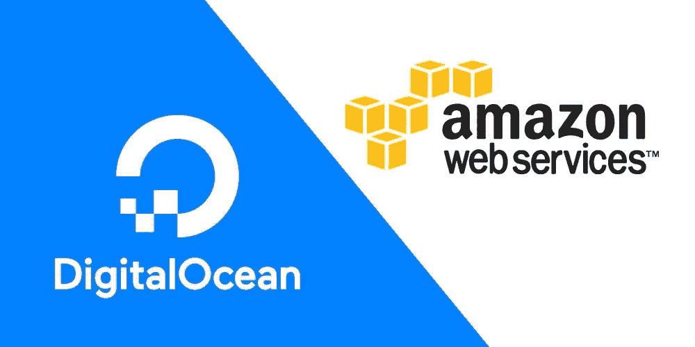
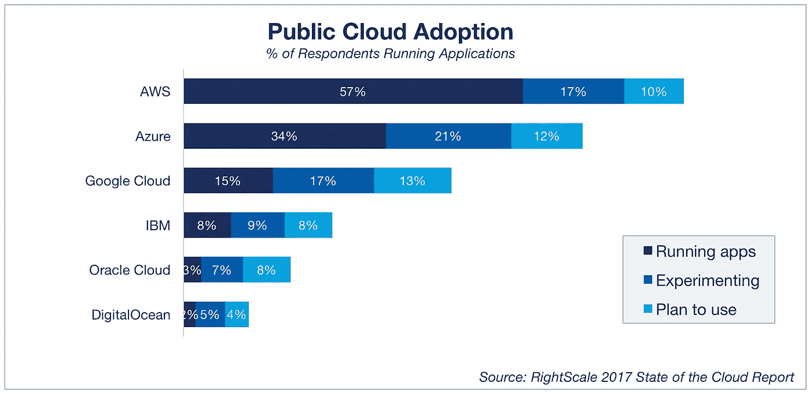
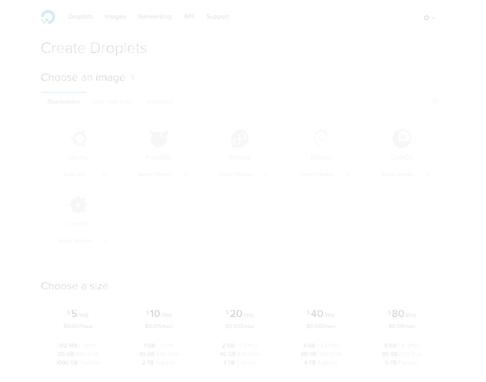
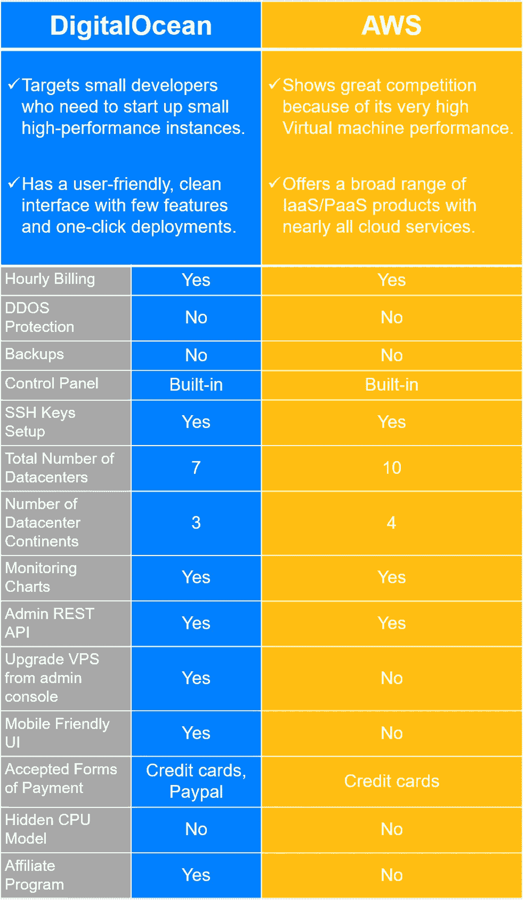

# AWS 与 DigitalOcean:哪个云服务器更好

> 原文：<https://medium.com/hackernoon/aws-vs-digitalocean-which-cloud-server-is-better-1386499a6664>

由 [**RightScale**](https://www.rightscale.com/blog/cloud-industry-insights/cloud-computing-trends-2017-state-cloud-survey) 进行的关于最新云计算趋势的第六次年度云状况调查显示，AWS 在公共云采用方面继续领先。

# 什么是“云”？

云通常是指一些与 web 相关的服务器，它们可以作为产品或软件应用服务的一部分。基于云的服务可以整合网络托管、数据共享和软件使用。

“云”也可以指分布式计算，其中一些服务器连接起来分担负载。这种连接意味着，与使用一台功能强大的服务器不同，复杂的过程可以分布在不同的小型服务器上

在云中，有许多分布式资源作为一个整体。由于数据的分布，这使得云非常能够容忍错误。由于可以共享记录和数据，使用云可以减少不同版本文件的创建。

[**数字海洋**](https://www.digitalocean.com/?refcode=50296f61d305) 和 [**AWS**](https://aws.amazon.com/) 是云服务平台，提供数据库存储、计算机能力以及其他功能。DigitalOcean 对 AWS 被命名为大卫对歌利亚的故事。勇敢的新贵 DigitalOcean 面临着一个庞大的机构。像大卫一样，DigitalOcean 有一种技术，在远离与亚马逊的斗争的同时发挥其优势。但这不是一场战斗，直到最后。亚马逊和 AWS 满足了不同受众群体的需求，意识到各自的优势将使你能够在它们之间做出选择。

# 数字海洋

DigitalOcean(拼写为一个单词；“数字海洋”是 90 年代无线通信设备的生产商)是一家新的云托管供应商。数字海洋于 2011 年推出，专注于开发者的需求。该组织目前有 9 个数据中心，分别位于旧金山、新加坡、阿姆斯特丹、纽约和伦敦。

DigitalOcean 专注于三个突出的关键卖点:简单性、价格和高性能虚拟服务器。他们致力于为开发人员提供一种简单快捷的方式来建立他们称之为 droplets 的负担得起的 Linux 实例。DigitalOcean 支持大多数现代 Linux 发行版；Ubuntu，Fedora，Debian 和 CentOS。在 droplets 上设置几个应用程序是很简单的，比如 Ruby on Rails、LAMP、Ghost、Docker 或 stack。

DigitalOcean 的定价是所有云提供商中最实惠的。定价从 0.007 美元/小时或 5 美元/月开始，它们提供了小时和月费率之间的轻松过渡。他们最受欢迎的软件包名为 droplet，价格为 0.015 美元/小时或 10 美元/月，同时提供 1 个核心处理器、1Gm 内存、30GB SSD 磁盘和 2TB 传输。在 AWS 上，与此最接近的是一个名为 t2.small instance 的包，价格为 0.026 美元/小时，是 DigitalOcean 上一滴费用的两倍。另一个好处是，数字海洋没有额外服务的隐藏费用，如更多的流量或固定 IP 地址。

DigitalOcean 以提供高性能服务器而闻名。他们的网速是 1Gbps 所有硬盘都是固态硬盘，启动时间只有 55 秒，令人难以置信。通过独立的性能测试，DigitalOcean 节点排名第一，远远高于亚马逊机器。

DigitalOcean 拥有大量可用于其管理的文档，并且由于它是一个中等基础的 VPS 主机，因此通常不太需要支持。因此，他们不通过电话提供帮助，通过电子邮件的响应时间可能很慢，可能是因为他们支持的客户数量太多。

在性能与价格方面，DigitalOcean 多年来一直明显领先于大多数竞争对手，但这一优势已经消失，因为每个人都跟随他们的步伐，修改了他们的网络基础设施，同时降低了入门级产品的价格。DigitalOcean 是开发人员的最爱，因为其平台的设置速度非常快，用户友好。

最后，DigitalOcean 以其简单、用户友好的设置而自豪。仅面向开发人员，提供 Linux 虚拟机和 DNS 管理。它缺乏托管数据库、配置管理、分析、负载平衡等功能。DigitalOcean 自豪地将自己标榜为面向 Linux 开发者的基本 IaaS 提供商。

# 亚马逊网络服务

到目前为止，亚马逊的 AWS 是市场的领导者；据估计，亚马逊的计算能力相当于榜单上接下来 11 个竞争对手的总和。他们提供了各种 IaaS 和 PaaS 解决方案。其中最著名的是 EC2 IaaS 解决方案。AWS 提供的其他服务包括负载平衡、存储、内容交付、数据库、网络和内容交付、部署和配置管理以及应用程序开发平台。他们拥有全球最大的数据中心，战略性地分布在全球 9 个地区。

很明显，DigitalOcean 在功能方面无法与亚马逊的 AWS 竞争。DigitalOcean 唯一可以竞争的领域是 EC2，但即使在这里，DigitalOcean 的容量也只有 EC2 的 1%左右。

Amazon 也有一个强大的帮助文档数据库，但是由于门户中提供了大量的服务，大多数客户都需要在某个时候获得支持。他们有一个庞大的支持团队可以适应这一点，但支持并不包括在所有的软件包中。技术援助费用可能会占到您每月支出的 10%，对于较大的组织来说，这一数字可能会增加。

# 包装它

如果你已经是 DigitalOcean 的一员，你应该庆幸自己做出了更明智的选择。如果您使用 AWS，运行几个 ECM 虚拟机，每个月都有很高的带宽成本，那么它可能值得切换并利用免费捆绑的带宽。

很明显，对以开发人员为中心的云的需求正在上升。对“NoOps”环境的意图是显而易见的。然而，哪种云服务器更好的答案完全取决于您的项目需求和合规性。

[*德米特里·布科*写的](https://www.linkedin.com/in/dmitrybudko/\)

*想了解更多？* [*点击这里查看*](https://dashbouquet.com/blog)