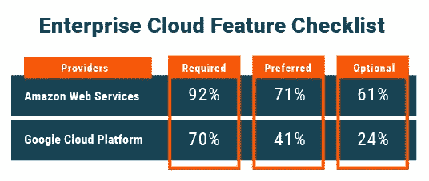
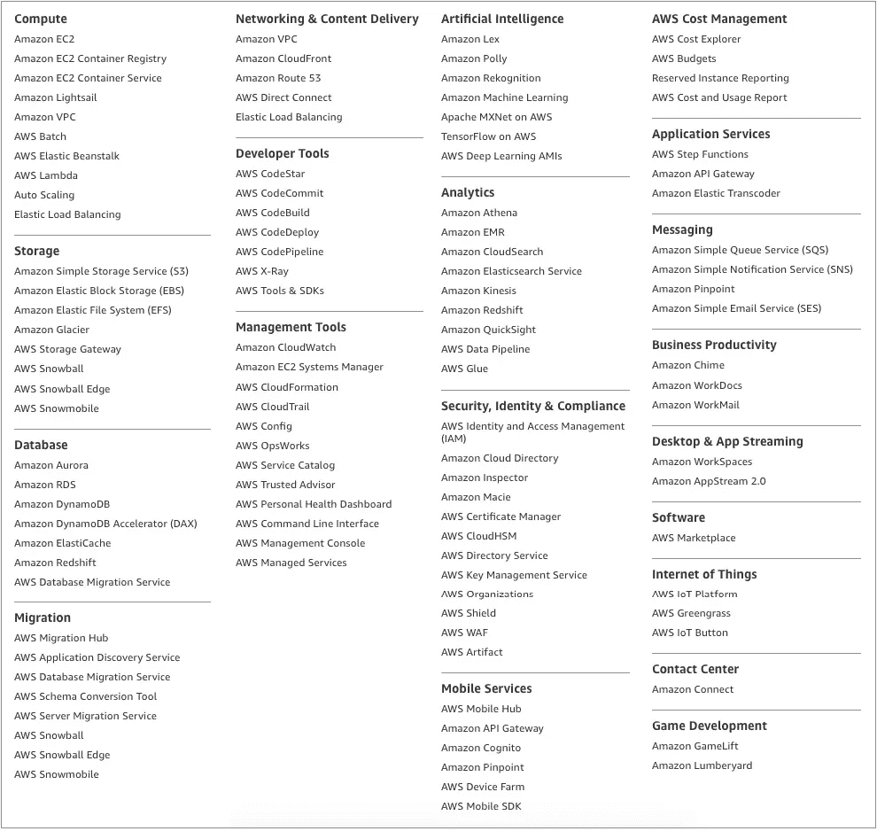
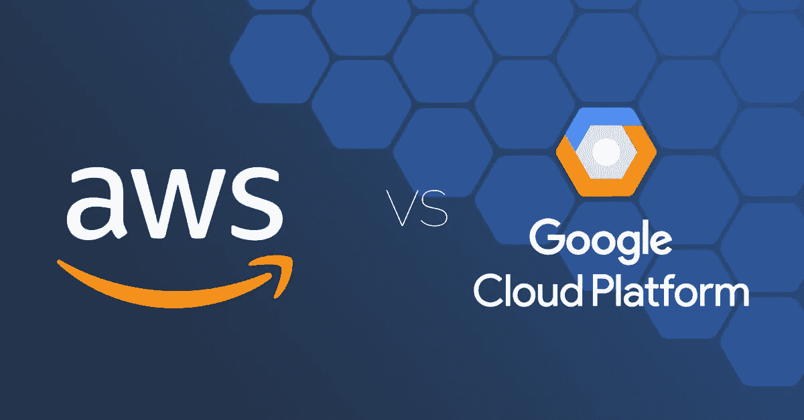
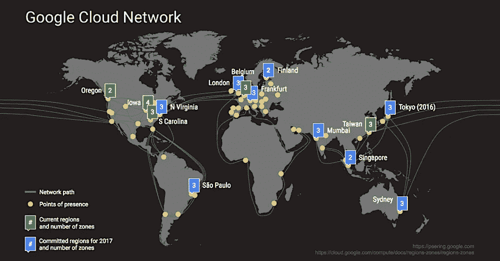

# AWS vs. Google 云平台:选择哪家云服务提供商

> 原文：<https://medium.com/hackernoon/aws-vs-google-cloud-platform-which-cloud-service-provider-to-choose-94a65e4ef0c5>

虽然 AWS 无疑是云服务质量的基准，但它也有一些缺点。今天我们比较亚马逊网络服务(AWS)和谷歌云平台(GCP)。

AWS 无疑是云计算服务的领导者，因为它自 2006 年以来就是 IaaS 行业的先驱，比其他流行的云服务提供商领先 5 年。然而，这导致了某些不便和缺点，它们可能被竞争对手所利用。从本质上讲，AWS 服务的数量是巨大的。

虽然谷歌云平台没有如此丰富的服务列表，但它迅速增加了新的产品。需要注意的重要一点是，虽然 AWS 确实提供了大量的服务，但其中许多服务都是面向利基市场的，只有少数服务对于任何项目都是必不可少的。对于这些核心功能，我们认为谷歌云是一个有价值的竞争对手，有时甚至是一个轻而易举的赢家，尽管许多基本功能，如 PostgreSQL 支持在 GCP 仍处于测试阶段。

你们自己看吧。谷歌云可以在以下领域与 AWS 竞争:

*   长期折扣带来的成本效益
*   大数据和机器学习产品
*   实例和支付可配置性
*   隐私和交通安全

# 长期折扣:从 1 个月开始，而不是 1 年

客户忠诚度政策是必不可少的，因为它们帮助客户获得最大的每一分钱，从而提高承诺。然而，这里有一个重要的区别:AWS 仅在[签署 1 年期限并提前支付](https://aws.amazon.com/ec2/pricing/reserved-instances/buyer/)后提供折扣，而无权更改计划。这显然不是完美的选择，因为许多企业动态地调整他们的需求，更不用说提前支付一年的费用是一笔相当可观的支出。

GCP 提供了同样的灵活性，即[持续使用折扣](https://cloud.google.com/compute/docs/sustained-use-discounts)，仅使用一个月后，如果需要调整配置，该折扣可以应用于任何其他套餐。这使得 GCP 的长期折扣政策成为 AWS 提供的可行的替代方案，而是一种投资，而不是一项支出。此外，您避免了供应商锁定，如果需要，您可以自由地更换供应商，而不会损失所有预先支付的费用。

# 大数据和机器学习产品

AWS 无疑是构建大数据系统的领导者，因为它与许多流行的 DevOps 工具如 [Docker 和 Kubernetes](https://itsvit.com/blog/docker-kubernetes-till-death-us-part/) 进行了深度集成，并为无服务器计算提供了一个伟大的解决方案 [AWS Lambda](https://aws.amazon.com/lambda/details/) ，这是短时间大数据分析任务的完美匹配。

与此同时，GCP 拥有世界上最大的谷歌 Chrome 大数据宝库，据说每年处理超过 2 万亿次搜索。访问这样一座数据金矿肯定会开发出一套很棒的产品，而 [Bigquery](https://cloud.google.com/bigquery/) 无疑就是这样一个解决方案。它能够快速处理大量数据，对于这样一个功能丰富的工具，它的学习曲线非常平缓(它甚至可以对您的数据产生实时见解)。最棒的是，Bigquery 非常用户友好，可以在几乎没有技术背景的情况下使用，更不用说 300 美元的试用费了。

# 实例和支付可配置性

正如我们在关于[揭开 5 个流行的大数据神话](https://itsvit.com/blog/news/demystified-5-myths-big-data/)的文章中所解释的，与维护本地硬件相比，云计算可能更具成本效益。本质上，这实际上归结为在最佳计费方案下最佳地使用资源。例如，AWS 使用预付费的小时计费方案，这意味着运行一个 1 小时 5 分钟的任务将花费整整 2 个小时。

此外，虽然 AWS 在几种计费方法下提供了大量不同的 [EC2 虚拟机](https://aws.amazon.com/ec2/pricing/)，但这些配置是不可定制的。这意味着如果你的任务需要 1.4GB 的内存，你必须选择 2GB 的包，这意味着你付出了过多。当然，亚马逊有几种省钱的方法，从投标[现货](https://aws.amazon.com/ec2/spot/)到出借[预约实例](https://aws.amazon.com/ec2/pricing/reserved-instances/buyer/)和选择[每秒计费](https://aws.amazon.com/ec2/pricing/)。不幸的是，后一种选择目前只适用于 Linux 虚拟机。

相反，GCP 从 2017 年 9 月 26 日开始，为他们所有的虚拟机提供[每秒计费选项，而不管它们运行的是什么操作系统。更重要的是，他们的实例是完全可配置的，因此客户可以订购 1 个 CPU 和 3.25GB RAM、4.5GB 或 2.5GB，您应该明白这一点。](https://cloudplatform.googleblog.com/2017/09/extending-per-second-billing-in-google.html)

# 隐私和交通安全

正如《华盛顿邮报》告诉我们的，美国国家安全局已经渗透了数据中心的连接，并窃听了谷歌一次(据说是更多次)。这一漏洞导致谷歌选择对其所有数据和通信渠道进行全面加密。连存储的数据都加密了，更不用说数据中心之间的流量了。

AWS 在这方面还是比较滞后的。他们的关系数据库服务(RDS)确实提供了数据加密选项，但它在默认情况下是不启用的，如果涉及多个可用性区域，则需要密集的配置。到目前为止，数据中心之间的流量也没有被 AWS 加密，这造成了另一个潜在的安全威胁。

# 最后的想法

总的来说，GCP 实际上是 AWS 和 Azure 女士的有力竞争者。是的，由于 5 年的领先，AWS 在客户和产品数量方面领先。与此同时，GCP 已经提供了所有需要的功能，并提供有竞争力的价格和配置模型，由严格的交通隐私和安全措施支持。随着时间的推移，随着越来越多的企业接受人工智能优先的业务方式，GCP 在大数据分析方面的巨大能力和谷歌 Chrome 在浏览器中的领先地位将使谷歌云平台成为 AWS 更重要的对手。

请记住，GCP 的许多特性还处于测试阶段，所以它们的行为和 API 可能会改变。这意味着结合长期项目使用 GCP 可能需要在项目生命周期内升级 GCP 连接器。

我们强烈建议评估您项目的实际需求，并认为 GCP 是开发和试运行环境的最佳选择。事实可能会证明，选择 GCP 就足够了，可以满足您的所有需求，避免选择高效使用平台所需的多个 AWS 服务，但实际上并不需要运行您的项目。欢迎[联系我们](https://itsvit.com/contacts/)关于项目要求的任何问题，我们随时准备提供帮助！