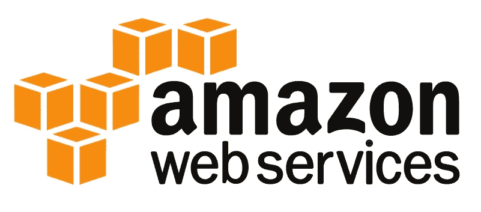
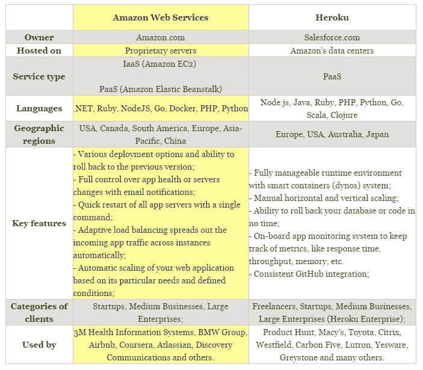

# AWS vs Heroku:2017 年云平台对比

> 原文：<https://medium.com/hackernoon/aws-vs-heroku-cloud-platform-comparison-for-2017-5f2194c0673e>

当你运行一个 web 项目时，不管它是一个小的 API 解决方案还是全功能的 web 应用程序，你都将达到托管你的服务并向全世界提供它的地步。今天，有大量的选择，但我们将深入我们的最爱，也提到一些替代品，给你一个市场的一般概念。

## 亚马逊网络服务

[**AWS**](https://aws.amazon.com/) 是 Amazon.com 自 2004 年以来提供的一个大规模云计算服务集合，构建了一个成熟的平台。事实上，它可以被称为向开发人员提供的数据库、存储、管理、分析、网络和部署/交付选项的发电站。AWS 云在 16 个地理区域可用，并且仍在增长。

目前，亚马逊弹性计算云(EC2)和亚马逊简单存储服务(S3)都是非常著名的服务，还有不断扩展的数据库库、负载平衡和随时可用的部署配置。亚马逊平台的核心优势包括:控制水平、全面的分析、有用的见解以及访问应用程序内部工作的能力。

## 赫罗库

[**Heroku**](https://www.heroku.com/) 是一个云平台，为构建、部署和扩展 web 应用程序提供了一个高效且经过优化的平台。它的生态系统由 140 多个插件组成，从警报和通知到数据库、分析工具或安全服务，再到监控、缓存、邮件或网络插件。

Herokucloud 旨在提高您团队的生产力，使开发和推广过程更加高效和方便。然而，在所有情况下，当人们比较 AWS 和 Heroku 时，他们主要谈论 Heroku 的直接竞争对手，即 AWS Elastic Beanstalk。同样，它允许您在 AWS 云中部署和管理 web 应用程序，而不用担心基础架构。

# AWS 与 Heroku 对比表:

# 为什么是云？

目前，云计算是 IT 行业最热门的话题之一。无论您只是迁移到云，在那里存储文件还是部署软件，越来越多的公司都在关注它能给企业带来的好处。

[IDC](https://www.idc.com/getdoc.jsp?containerId=prUS40960516) 预测，公共云平台的国际支出将从 2015 年的约 700 亿美元增长到 2019 年的超过 1410 亿美元。为什么公司要转向云计算？此类平台提供了优于本地托管的多种优势，而**六大优势**是:

*   **运营灵活性**是企业采用云服务的核心原因之一:如果您需要扩大或缩小云平台规模；
*   **基于云的备份和恢复解决方案**对于各种规模的企业来说都是值得投资的，因为它们还有助于节省时间和避免前期投资；
*   **云供应商负责所有的软件和安全更新**，以及电子邮件和文件服务器的管理、备份控制等等；
*   **随时随地实时访问、编辑和共享文件的能力**增强团队协作，提高员工的工作效率，并提供更大的灵活性；
*   所有的**文档都集中存储**，避免格式、版本或标题的混乱。您的团队不必来回发送文件进行编辑或审阅；
*   云计算为创业公司提供了获得世界级企业技术的途径，确保了在全球市场上的竞争优势，以及更快行动和保持敏捷的能力。

# Heroku vs AWS 2017:替代方案

亚马逊无疑是领先的云服务提供商之一，但由于其复杂性、成本以及 2017 年 2 月[和 2015 年 9 月](http://venturebeat.com/2017/02/28/aws-is-investigating-s3-issues-affecting-quora-slack-trello/)发生的问题，越来越多的用户倾向于探索其他替代方案。目前微软 Azure 和谷歌云平台是亚马逊最大的竞争对手和主要替代者。

[**Azure**](https://azure.microsoft.com/en-us/)**的受欢迎程度仍在增长，尤其是自从它与 Mesosphere 和 Docker 合作以来。它提供了快速简单的虚拟机设置、基于实时流量的自动扩展、在最大负载下的连续运行、对各种编程语言和操作系统的支持、内置的连续部署等等。**

**[**谷歌云**](https://cloud.google.com/) 被认为是为大数据提供丰富工具集的最实惠的解决方案之一。它为开发人员提供实时虚拟机迁移、久经考验的安全系统、冗余备份、迅捷的性能等等。**

**谈 Heroku 替代品用户主要指数字海洋。**

**2015 年 [**数字海洋**](https://www.digitalocean.com/) 被评为[全球第二大托管提供商](https://www.digitalocean.com/company/press/releases/digitalocean-now-worlds-second-largest-web-hosting-provider/)，2016 年《福布斯》将其列入[全球最佳 100 家云公司](https://www.digitalocean.com/company/press/releases/digitalocean-named-to-forbes-worlds-best-100-cloud-companies-list/)名单。DO 专注于高级别的安全性、丰富的开发工具、可靠的基础设施、强大的 SSD 和全面的文档。**

**然而，这个列表并不完整。还有其他托管提供商，如 Apache CloudStack、RackSpace、Brightbox、SoftLayer、Codero、Media Temple、Linode、Vultr、Atlantic.net 等。所有的解决方案都是不错的选择，这取决于你的成本预期、项目规模和未来目标。**

# **最后的想法**

**我们生活在这样一个时代，大型老牌公司和初创公司都可以访问一流的企业基础设施来计算、存储和管理他们的下一代创新在线服务。这种方法使组织能够专注于业务战略、运营流程的改进，从而提高绩效。**

**在 Heroku vs AWS vs local machine 之间进行选择时，最初您应该考虑机器管理的成本和资源可用性。运行自己的数据中心，您负责让它们启动并运行，检查、更新并在以后全天候提供支持。有了亚马逊网络服务和 Heroku，所有的责任都转移到了云供应商身上。**

************

> **[黑客中午](http://bit.ly/Hackernoon)是黑客如何开始他们的下午。我们是 [@AMI](http://bit.ly/atAMIatAMI) 家庭的一员。我们现在[接受投稿](http://bit.ly/hackernoonsubmission)并乐意[讨论广告&赞助](mailto:partners@amipublications.com)机会。**
> 
> **如果你喜欢这个故事，我们推荐你阅读我们的[最新科技故事](http://bit.ly/hackernoonlatestt)和[趋势科技故事](https://hackernoon.com/trending)。直到下一次，不要把世界的现实想当然！**

****