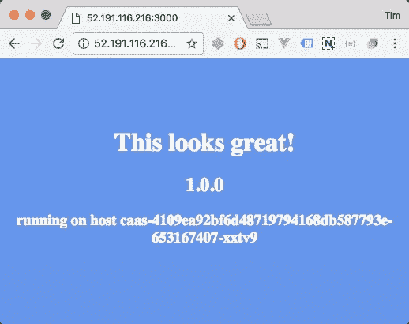
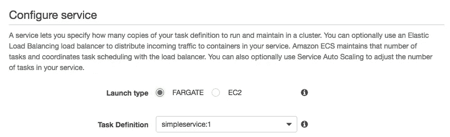
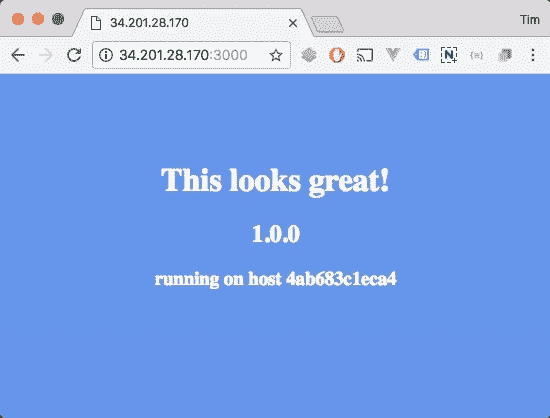

# Azure 容器实例与 AWS Fargate

> 原文：<https://medium.com/hackernoon/azure-container-instances-vs-aws-fargate-3216607f63f4>


上周，在他们的 re:Invent 2017 盛会上，AWS 宣布了他们的新集装箱服务 [Fargate](https://aws.amazon.com/fargate/) 。Fargate 是 AWS 的无集群/无服务器的容器运行方式。Fargate 的声明还包括 AWS 管理的 Kubernetes 集群，称为 AWS EKS，只能在 2018 年通过注册获得。

在极少数情况下，AWS 似乎正在追赶微软的 Azure。Azure 在过去的几个月里已经有了[Azure Container Instances](https://azure.microsoft.com/en-us/services/container-instances/)(ACI ),并且已经推出了托管的 Kubernetes(和 DC/OS)作为 Azure Container Services…ehm…服务的一部分。

Fargate 是全新的，目前只在 us-east-1 地区可用，但将其与 Azure Container 实例进行比较仍然很有趣，因为它们似乎都面向相同的受众，并提供相同的价值。但是外表可能具有欺骗性，因为事实证明它们是完全不同的动物！震惊，恐怖！

# 入门指南

让我们先来看看从 zero——这里 zero 表示您有一个拥有适当权限的 AWS 和/或 Azure 帐户——到一个在两个服务上向互联网公开简单网页的运行容器有多容易。

## Azure 容器实例启动并运行

ACI 没有真正的可视化设置向导或 GUI。幸运的是，Azure CLI 非常好，让容器运行起来非常简单:两个 bash 一行程序。

*   创建资源组
*   创建容器实例

在这之后，一个快速的`az container show`通知我我的服务在地址`52.191.116.216:3000.`上可用，是的，它实际上也工作了:



simple service running on Azure Container Instances

## Fargate 启动并运行

让我们从一个小问题开始:根据 AWS，Fargate“允许你运行容器，而不必管理服务器或集群”。然而，运行 Fargate 容器的第一步是…创建一个集群！好吧，它非常快，你不必管理它，但仍然。

不过一般来说，在 Fargate 上设置第一个运行的容器要比 ACI 复杂得多。使用 AWS GUI，您可以完成以下步骤，其中每一步都有大量的选项、下拉列表和输入字段。

*   创建一个集群
*   创建任务定义
*   创建容器定义
*   在集群中创建服务:选择 Fargate 类型
*   选择 VPC、子网、安全组等:确保选择“自动分配公共 IP”
*   选择四个负载平衡选项之一:无、应用程序、经典或网络负载平衡器。
*   选择自动缩放，可以跳过

很明显，Fargate 已经完全嵌入到当前的 Amazon 弹性容器(ECS)服务中。与 EC2 版本相比，您实际上需要选择它作为“启动类型”。



ECS Fargate launch type

这意味着 Fargate 附带了所有配置和设置灵活性/bagage。这不是问题 *an sich* 但至少对我来说，AWS ECS 的设置和配置总是很麻烦。

完成这个设置过程后，仪表板通知我们容器正在运行。但是我们能在哪里到达它？这让我困惑了一段时间:UI 中什么也没有，在 AWS CLI 中使用适用的`describe`调用时，结果 JSON 中什么也没有。原来你必须导航到服务中任务的 ENI(弹性网络接口)。这会将您带到标准的 EC2 控制台，其中列出了公共 IPv4 地址！

最初的尝试没有得到回应。通过将端口 3000 添加到连接到 ENI 的安全组，解决了这个问题。



simple service running on AWS Fargate

注意:这个完整的设置可以使用 AWS CLI 来完成，参见 [AWS 自己写在这里的](http://docs.aws.amazon.com/AmazonECS/latest/developerguide/ECS_AWSCLI_Fargate.html)。

# 在使用中

现在容器已经启动并运行了，我们可以用它们做什么呢？

## Azure 容器实例

ACI 实际上没有 GUI，只有一个只读屏幕显示正在运行的容器，出于某种原因称为“容器组”。这意味着您将使用 Azure CLI 与 ACI 进行交互，幸运的是，这并不意味着您可以使用 ACI 容器做什么:

```
az container [-h] {show,logs,list,delete,create}
```

无停止、无暂停、无扩展、无度量、无更新、无卷/磁盘装载，什么都没有。你可以跟踪日志，仅此而已。这是不可改变的基础设施带来了它的逻辑结论！事实上，即使在这种 MVP 形式的服务中，也没有可伸缩性，因为启动同一个容器的多个负载平衡版本是一个很大的缺陷。

因此，ACI 看起来就像是通常集成得很好的 Azure 景观中的一个孤岛，我打赌微软正在努力集成他们的负载平衡解决方案和卷安装之类的东西。

*更新 9–12–2017:*在评论中，ACI PM Sean 跳了进来，提到卷挂载确实存在:[https://docs . Microsoft . com/en-us/azure/container-instances/container-instances-instances-mounting-azure-files-volume](https://docs.microsoft.com/en-us/azure/container-instances/container-instances-mounting-azure-files-volume)然而，这些 CLI 参数并没有在我使用的 CLI 版本中列出。

## 法尔盖特

如前所述，设置比 ACI 复杂得多。但是，在经历了所有这些困难之后，您确实拥有了一个非常灵活且得到良好支持的容器平台，它具有基本上所有的 ECS 功能:

*   停止、开始、缩放、自动缩放、调度等。
*   负载平衡
*   安全组、IAM、角色等。
*   VPC、子网、ENI、公共 IP、卷等。
*   集成的 CPU 和内存使用指标。

到目前为止，您可能已经注意到，Fargate 并不是一个真正独立的 AWS 服务，尽管 AWS 确实是这样描述它的:Fargate 是 ECS 的一个不同的容器运行时。在您的日常使用中，您使用 ECS 而不是 Fargate。

# 表演

大警告:这充其量只是一个轶事般的“性能测试”。这实际上主要是一个网络吞吐量测试…不过，我很好奇这两种服务在简单性能上是否有明显的巨大差异。

我的测试服务是一个节点。JS 哈比神应用服务一个简单的页面。用 1000 个请求和 10 次运行并发 5 次运行 Apache Bench 基准测试，得到了以下结果:

```
 **ACI      Fargate** Requests per second (#/sec):     43.34      45.54
Time per request (ms):         118.083     109.797
99% (ms):                          371      276
```

结果非常非常接近。但是值得注意的是，Fargate/ECS 的峰值行为似乎较少，例如，99%通常较低。

# 定价

这两种服务使用非常相似的定价模型，其中主要成本是以下因素的函数:

**持续时间*容器*内存* CPU**

ACI 为每个创建的集装箱增加了 0.0025 美元的“创建请求”成本。这有点混淆了基于资源的按使用付费模式，但对大多数人来说可能不是大问题。Fargate 集装箱的充电时间至少为 1 分钟。

下面是一个例子:您在一个月(30 天)内每天创建一次具有 1 个核心、2 GB 配置的 5 个容器实例。每个实例的持续时间为 10 分钟(600 秒)。Fargate 不提供 1 个 vCPU / 1GB 的组合。1 个 vCPU 容器的最低容量为 2GB。

以美元/月计算的费用如下:
**Azure 容器实例:**$ 3.75
**AWS Fargate**:1.90 美元

你可以在我为这篇文章准备的 Google 表单中看到上面例子的计算。请随意使用它来为您自己的用例进行价格比较。

[](https://docs.google.com/spreadsheets/d/1bsqd5DilkARPjLRhzMU_4xfNm3sQIfHs1FnDobNpLvU/edit?usp=sharing) [## Azure 容器实例和 AWS Fargate 成本比较

### Sheet1 示例您在一个月(30 天)内每天创建一次具有 1 个核心、2 GB 配置的 5 个容器实例…

docs.google.com](https://docs.google.com/spreadsheets/d/1bsqd5DilkARPjLRhzMU_4xfNm3sQIfHs1FnDobNpLvU/edit?usp=sharing) 

**注意**:该计算仅考虑给定服务的定价，并将 Azure 内核视为与 AWS vCPU 相同。此外，AWS 会提示您添加其他付费服务，如负载平衡器，以“完成该包”。

# 结论

深入比较一下，我认为这两种服务非常相似。他们不是。在目前的版本中，这两种产品都有非常不同的用例。

Azure 容器实例几乎就像 Requestbin 或 JsFiddle 一样。一个快速简单的沙箱，用于运行具有类似 Heroku 行为的容器:一个 bash 命令，你的容器就在线了。实际上我很喜欢这样:我从来没有以如此快的方式向互联网发布过容器。可能比使用 Ngrok 等服务的本地 Docker 实例还要快。我可以想象自己在原型制作过程中，在与客户远程合作时，或者当我需要在聚会或会议上展示快速演示时使用它。

正如 AWS 所描述的，Fargate 是 ECS 和后来的 EKS 的一项技术。这意味着它位于 DC/OS 和 Kubernetes 空间中，并具有该特性集。如前所述，你不会每天都使用 Fargate。它在后台负责管理您的 ECS 群集。

**Azure 容器实例摘要**

*   Azure 生态系统中看似独立的解决方案。
*   10 秒，不存在的设置。
*   比如容器的超轻版 Heroku 或者 JsFiddle。

**AWS Fargate 摘要**

*   几乎在任何地方都集成到现有的 AWS 和 ECS 生态系统中。
*   开始时令人困惑和麻烦。
*   将完全支持大型的真实世界部署。

*Tim 是*[*https://vamp . io*](https://vamp.io,)*的产品倡导者，这是一款为现代云平台发布的智能&无压力应用。*