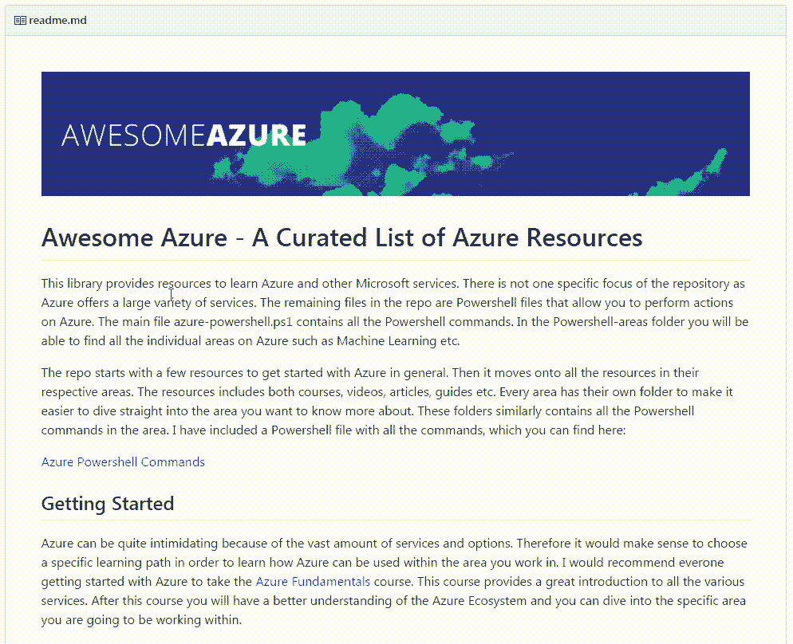
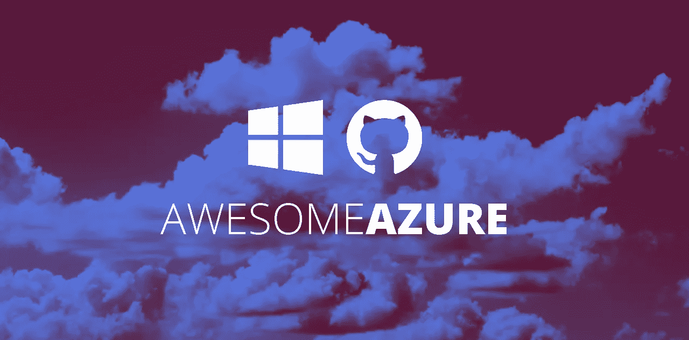

# 蔚蓝——从零到英雄

> 原文：<https://medium.com/hackernoon/azure-from-zero-to-hero-d47196c82c7f>

GitHub Repo (click on the GIF jump to the repo)

云计算已经存在了 10 多年，并且它的存在还在继续增长。世界各地的公司开始看到快速启动 IT 项目的好处。与内部托管相比，云提供了多种优势，如今大量项目都是将内部项目迁移到云上。这使得云计算在当今的商业环境中成为一项有价值的技能，因为它使您能够在此类项目的第一线工作。我最近开始了我的云计算之旅，我记录了一些重要的资料来源，以供[了解](https://hackernoon.com/tagged/learning)细节。就我而言，我曾与微软 [Azure](https://hackernoon.com/tagged/azure) 云合作过，它在过去几年经历了巨大的增长。这强调了它在 2017 年作为一项需要熟悉的宝贵技能的地位。本文旨在为您提供一组资源，让您能够熟练使用 Azure 云。

# **用 Azure 开始你的旅程**

只有当人们知道如何使用云时，云才有价值。微软在创建基于云的用户友好浏览器方面做得很好，这使得世界各地的人们能够快速熟悉他们的服务。正因为如此，你可能会很快地站起来并运行。然而，云本身并不是你的最终产品。这是您可以运行应用程序的地方。

实际学习如何使用 Azure 的最好方法是创建驻留在云中的产品。微软为开始使用 Azure 提供了极好的机会，如果你已经有了一个 [MSDN 订阅](https://azure.microsoft.com/en-us/pricing/member-offers/visual-studio-subscriptions/)，你会得到一个在门户网站上使用的月度信用点数。如果你没有订阅，你可以尝试他们的[免费试用](https://azure.microsoft.com/en-us/free/)，它为你提供信用点数和 90 天的试用时间。

# **资源**

反思学习和学习所用的材料总是有帮助的。就我而言，我需要更好地了解可用的资源。这导致了 Github 上的一个资源库，里面有我在 Azure 学习阶段看到的所有相关资源。你可以在这里找到仓库[或者点击下面的图片。](https://github.com/kristofferandreasen/awesome-azure)

The GitHub Repository (click on the image)

# **你将何去何从？**

从来没有完美的学习方法。这完全取决于什么对你有效，以及你如何利用现有的资源。Azure 不同于学习一门编程语言或者类似的东西。这是一个云平台，因此了解可用服务的范围，也许不是所有服务的细节，将是非常有价值的。拥有广阔的视野可以让你的公司对新的服务做出快速反应。

我对这个库的目标是为学习 Azure 的人提供对相关资源的便捷访问。我永远也不会有时间去了解资源，因为它们会在任何地方突然出现。如果您找到了有价值的信息来源，请随意创建一个[拉动请求](https://github.com/kristofferandreasen/awesome-azure/pulls)。让更多的人参与进来会让它变得比现在更好。

快乐学习！

> [黑客中午](http://bit.ly/Hackernoon)是黑客如何开始他们的下午。我们是 [@AMI](http://bit.ly/atAMIatAMI) 家庭的一员。我们现在[接受投稿](http://bit.ly/hackernoonsubmission)并乐意[讨论广告&赞助](mailto:partners@amipublications.com)机会。
> 
> 如果你喜欢这个故事，我们推荐你阅读我们的[最新科技故事](http://bit.ly/hackernoonlatestt)和[趋势科技故事](https://hackernoon.com/trending)。直到下一次，不要把世界的现实想当然！

