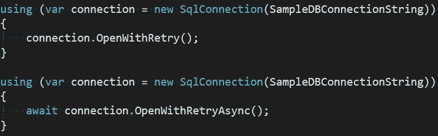
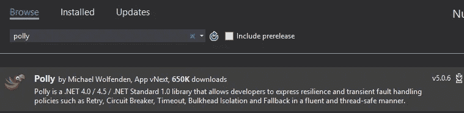

# Azure SQL 暂时性错误

> 原文：<https://medium.com/hackernoon/azure-sql-transient-errors-7625ad6e0a06>

## 中处理 Azure SQL 瞬态错误。NET Core 使用 Polly

迁移到使用云服务时，人们会注意到的一件事是，间歇性错误的发生率比在本地运行时要高。

这些错误通常被称为 ***瞬时*** 错误，可以通过重试操作来减轻。虽然有些操作在所有情况下都可以重试，例如获取数据，但其他操作，如创建订单、扣款等。可能不需要或者至少需要更精细的颗粒控制。此外，有些错误重试是没有意义的，因此最好快速失败。

编写要处理的代码很容易变成意大利面条式的代码，这不是你想要复制粘贴的代码，因为它很容易出错并且难以维护——所以你真的需要一个框架来帮助你处理这些场景。

## 介绍波利

作者是这样描述波利的:

> Polly 是一个. NET 弹性和瞬时故障处理库，允许开发人员以流畅和线程安全的方式表达策略，如重试、断路器、超时、隔板隔离和回退。

这实际上总结了它的功能，它允许您使用流畅的 API 创建策略，这些策略可以重复使用，范围从通用到非常具体的场景。

Polly 可作为 NuGet 包使用，可与两种旧的。又净又闪亮。NET Core，这将是我在这篇文章中使用的。

同样值得注意的是 Polly 是开源的，可以在 GitHub 上获得。
波莉也是[的成员。网基](https://dotnetfoundation.org/)。

## 创建策略

用 Polly 定义一个策略非常简单，只需使用你的类来创建你的策略

上面我们已经通过`Handle<TException>`方法定义了一个策略，如果`TimeoutException`发生，它将等待 ***3 秒*** 并重试操作 ***5 次*** ，然后在使用`WaitAndRetry`方法定义的***6 次*** 时间失败。

因为在这种情况下，每次重试尝试的延迟是使用一个`Func<int, TimeSpan>`委托来检索的，所以实现更高级的场景(比如滑动延迟)真的很容易

为了让我们的策略处理更多的异常，我们可以在`Handle<TException>`调用之后使用一对多的`Or<TException>`方法

您还可以通过用异常谓词检查异常来使您的策略更加细化

在这种情况下，如果没有找到`.tmp`文件，我们将很快失败。您还可以根据结果值设置策略，除了重试之外，还支持断路器、超时、回退、组合策略等，因此策略“引擎”非常灵活。

## 使用策略

我们现在已经有了我们的策略，并且想要很好地使用它，这里 policies `Execute`方法发挥作用了

您还可以创建异步策略，然后我们可以利用策略的`ExecuteAsync`方法

这简直好得令人难以置信，有很多事情正在发生——但在我看来“隐藏”在一个非常容易理解和维护的 API 之下。

## Azure SQL 策略

当涉及到 SQL server 时，有几个已知可以安全重试的错误，所以我们明确地寻找这些错误，所以如果我们开始，它可能看起来像这样:

其中`SqlRetryCount`仅仅是重试次数的常数，而`ExponetialBackoff`是指数增加每次尝试之间的延迟的方法

`TimeoutException:s`将总是被重试，但是 SqlExceptions 将被传递给`AnyRetryableError`方法以评估它是否可重试

`AnyRetryableError`将迭代所有错误，并用`RetryableError`方法检查是否是已知可重试的错误，这就是神奇的地方

我们将打开 SqlException 错误号，并使用几个已知的常数来确定它应该快速失败还是重试。

## 拿政策兜兜风

在这种情况下，我将做一个简单的 API，用`WithRetry`方法扩展`SqlCOnnection`，即打开 SQL 连接

给了我们一个开放的同步和异步方法，其最简单的用法如下

结合一个简单的 SQL 来。像 [Dapper](https://github.com/StackExchange/Dapper) 这样的. NET 对象映射器会产生非常干净的代码

上面的代码将使用重试策略打开 sql 连接，但查询将在不重试的情况下执行，这可能是您对某些操作所希望的，但对于 select 来说，重试整个操作通常是安全的。为此，我们添加了一个重载，允许我们在策略边界内执行代码

这将打开连接，然后调用并返回您传递给它的`Func`的结果，所有这些都在策略的范围内，只是调用代码的小的重构

异步变量的用法如下所示

## 结论

Polly 功能非常强大，而且很容易上手，也很容易改装到现有的应用程序中——所以我绝对认为你应该尝试一下。

我已经用这篇文章中的代码在 GitHub 上创建了一个完整的样本库，感谢阅读！❤

 [## azurevoodoo/AzureSQLTransientHandling

### AzureSQLTransientHandling -处理中的 Azure SQL 瞬态错误。NET Core 使用 Polly

github.com](https://github.com/azurevoodoo/AzureSQLTransientHandling) 

> [黑客中午](http://bit.ly/Hackernoon)是黑客如何开始他们的下午。我们是 [@AMI](http://bit.ly/atAMIatAMI) 家庭的一员。我们现在[接受投稿](http://bit.ly/hackernoonsubmission)并乐意[讨论广告&赞助](mailto:partners@amipublications.com)机会。
> 
> 如果你喜欢这个故事，我们推荐你阅读我们的[最新科技故事](http://bit.ly/hackernoonlatestt)和[趋势科技故事](https://hackernoon.com/trending)。直到下一次，不要把世界的现实想当然！

