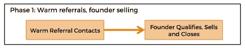
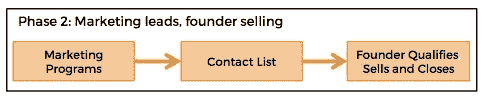
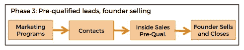
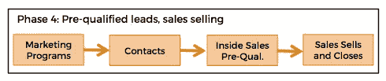

# B2B SaaS:从创始人销售到销售团队

> 原文：<https://medium.com/hackernoon/b2b-saas-evolving-from-founder-selling-to-a-sales-team-9e8e759c3e8a>

对于销售模式有些复杂的 [SaaS](https://hackernoon.com/tagged/saas) 公司来说(即销售过程包括一个人与潜在客户交谈以达成交易)，销售过程应该随着公司的发展而发展。经历这一演变的最佳方式是在销售漏斗建立时(而不是在此之前)缓解自然发生的堵塞。以我的经验来看，[从创始人销售到组建销售团队的转变速度过快会带来很多风险，只要确保你为转变过程中的每个新阶段做好准备，这些风险是很容易避免的。](https://hackernoon.com/tagged/evolving)

这里是大多数 B2B SaaS 公司应该通过的阶段和每一步的风险。

# 第 1 阶段—热情推荐创始人销售

在这个阶段，创始人通常是做“销售”的人。这是一件好事，因为从与顾客的互动中仍有很多东西要学。创始人将会了解到他们的价值主张中哪些是可行的，可能会阻碍交易的典型异议是什么，以及什么能真正让潜在客户兴奋起来。这个阶段是你完善销售技巧和演示的时候。此外，重要的是，你正在了解你的潜在客户喜欢购买什么——他们必须得到采购部门的批准吗？公司里哪个人有权做交易？你可能不得不跨越哪些法律障碍？你如何判断一个潜在客户是否有可能继续前进？这一阶段的线索通常来自于你的人际网络中的热情推荐。第 1 阶段销售流程通常如下所示:

# 第 2 阶段—营销线索，创始人销售

随着你获得更多的销售经验，并更好地了解你的目标客户，你将开始更有效地达成交易。很快，阻碍你卖出更多东西的唯一因素就是有更多的人可以交谈。在这一点上，你可能会耗尽你的人际网络，这些人可以热情地推荐给你，你开始在其他地方寻找一种方法来增加你的可疑名单。在这个阶段，重点应该是找到建立你的清单的方法。这可能是开始尝试一些营销策略的时候了(收集公开名单，从 LinkedIn 建立名单，参加你的潜在客户聚集的展会，让你获得名单的赞助，等等)。).

在这个阶段，雇佣一个在你的目标市场已经有很深人脉的销售人员可能很有诱惑力。根据我的经验，这几乎总是一个错误，原因有几个。首先，你对自己的销售流程理解得不够深刻，无法教给别人。其次，你可能会发现，你对自己的销售对象(目标市场和这些业务中的关键联系人)的理解很可能仍在发展。向关系密切的人推销要比向与你没有关系的人推销容易得多，这些人根本没有理由帮你的忙和与你交谈。根据我的经验，在你知道你可能需要什么样的销售人员以及什么样的人脉对你有价值(如果有的话——以后会有更多)之前，你需要在第二阶段磨砺一段时间。阶段 2 流程通常如下所示:

# 第 3 阶段—通过资格预审的创始人销售

在这一阶段，你会越来越清楚谁是你的最佳潜在客户，也就是最适合你的解决方案、最容易理解你的价值主张、达成交易最快的人。你也变得越来越聪明，知道如何找到这些人并与他们联系。你可能会在营销工作中变得越来越老练，并建立越来越大的联系人名单，此时你漏斗中最大的障碍是你自己打电话和开会的时间，尤其是与你还没有说过话的联系人的初次通话。

同样，在这个阶段简单地雇佣一些人来代替你的销售过程是很有诱惑力的，但是根据我的经验，这将是一个错误。减轻这种压力的一个更好的方法是尽可能地从你的肩膀上卸下销售技巧，同时让你在这个过程中做一些困难的事情(关键的销售会议、演示、结束)。至此，你应该对一个好的潜在客户的样子有了相当的了解。你应该知道在与潜在客户互动的早期应该问什么问题，这将告诉你他们是否值得花更多的时间。在这一点上，增加一些人来帮助您对交易进行资格预审，并帮助安排销售会议的后勤工作，可以节省您的大量时间，同时还可以让您参与到销售的关键部分，这些部分需要您更深入的专业知识和经验。一般来说，雇用内部业务发展代表/内部销售人员比雇用销售助理/客户代表要容易得多，风险也低得多(除此之外，我们对这些工作的命名方式在我看来简直是愚蠢至极)。通常，此人可以很容易地接受培训，主动接触潜在客户，询问一系列具体问题，以确定潜在客户的资格，并与创始人召开销售会议。

阶段 3 流程通常如下所示:

# 第 4 阶段——销售人员在创始人最少参与的情况下进行销售

一旦你有了一个与内部销售人员一起对交易和预约进行资格预审的过程，你将最终准备好考虑引进能够完成交易的销售代表。在这一阶段，您将深入了解您的销售对象，交易完成前的各个阶段，以及如何对交易进行资格预审。不仅如此，您还拥有一台运行良好的机器，能够大量生产经过资格预审的销售线索。这是开始寻找一个人来代替你的最佳时机，这个人将负责销售会议，演示，并完成交易，直到完成交易。在这个阶段，您将确切了解您想要的人的类型，他们需要什么技能以及如何培训他们。在这一点上，雇用销售人员的一个有趣的事情是，您不会被诱惑高估销售人员带来的关系和网络。根据我的经验，当你有一个好的销售渠道时，这些并不像与客户建立关系和关闭业务的能力那么重要。我发现，从长远来看，当我把招聘过程集中在这一点上时(而不是让它偏向于这个人可能带来的线索)，结果会好得多。

以下是第 4 阶段的流程:

在这一演变过程中，我所看到的(也是我自己犯的)大多数错误都是因为在这个过程中过早地添加了客户经理/销售专员。通过让销售过程缓慢发展，您可以在每个阶段学到更多，这将使您能够雇用更好的员工，从长远来看，他们更有可能取得成功。

喜欢这个帖子吗？点击下面的❤按钮。

[*艾波莉·邓福德*](https://twitter.com/aprildunford) *是*[*Sprintly*](http://sprint.ly)*的首席执行官，也是 6 家初创公司的元老。她在*[*rocketwatcher.com*](http://rocketwatcher.com)开了创业营销和销售博客

> [黑客午间](http://bit.ly/Hackernoon)是黑客们下午的开始。我们是 [@AMI](http://bit.ly/atAMIatAMI) 家族的一员。我们现在[接受提交](http://bit.ly/hackernoonsubmission)并很高兴[讨论广告&赞助](mailto:partners@amipublications.com)的机会。
> 
> 如果你喜欢这个故事，我们推荐你阅读我们的[最新科技故事](http://bit.ly/hackernoonlatestt)和[趋势科技故事](https://hackernoon.com/trending)。直到下一次，不要把世界的现实想当然！

