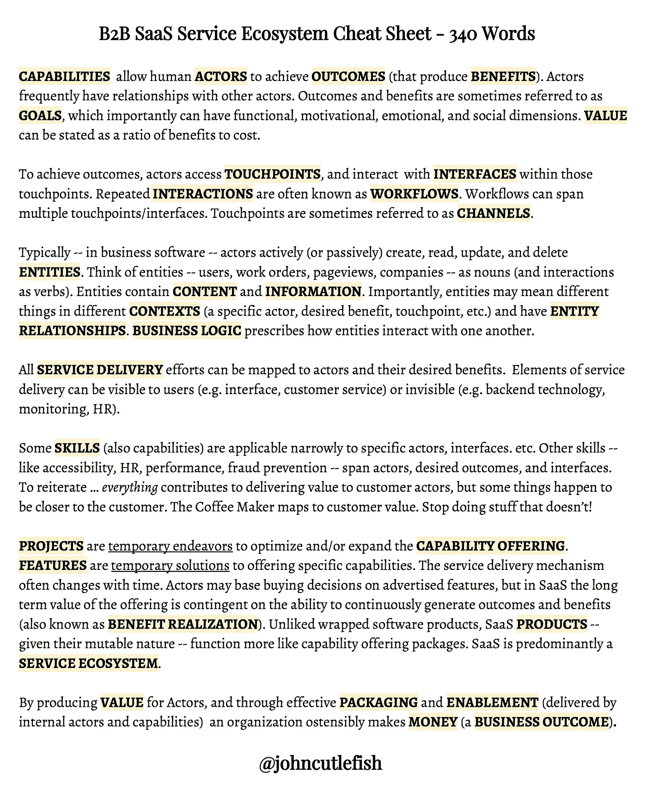

# B2B SaaS 服务生态系统备忘单

> 原文：<https://medium.com/hackernoon/b2b-saas-service-ecosystem-cheat-sheet-46c17eb955e6>

为了便于培训，我写了一份服务生态系统(B2B SaaS 产品使用的地方)中使用的术语的快速备忘单。我这里有这个[的 PDF](https://goo.gl/ypZoLJ)。请随意分享，但请在文档上保留(我的)署名。那样的话，我将对拼写错误负责，而不是你。

*注:我希望我有时间制作一个精美的信息图表或动画电影。也许过会儿。*

**能力**允许人类**参与者**实现**结果**(产生**利益**)。演员经常与其他演员发生关系。结果和利益有时被称为**目标**，它可以具有重要的功能、动机、情感和社会维度。**价值**可以表述为收益与成本的比率。

为了实现结果，演员访问**接触点**，并在这些接触点内与**界面**交互。重复的**交互**通常被称为**工作流**。工作流可以跨越多个接触点/界面。接触点有时被称为**通道**。

通常，在商业软件中，参与者主动(或被动)创建、读取、更新和删除实体。把实体——用户、工作订单、页面浏览量、公司——想象成名词(把交互想象成动词)。实体包含**内容**和**信息**。重要的是，实体在不同的**上下文中可能意味着不同的东西**(特定的参与者、期望的利益、接触点等。)并具有**实体关系**。**业务逻辑**规定了实体如何相互作用。

所有的**服务交付**工作都可以映射到参与者及其期望的利益。服务交付的要素可以是用户可见的(如界面、客户服务)，也可以是不可见的(如后端技术、监控、人力资源)。

一些**技能**【能力】狭隘地适用于特定的演员、界面。等等。其他技能——如可访问性、人力资源、绩效、防欺诈——包括参与者、预期结果和界面。重申… *一切*都有助于向客户提供价值，但有些事情恰好更接近客户。咖啡机符合顾客价值。不要做那些不重要的事情！

**项目**是优化和/或扩展**能力提供**的临时努力。**功能**是提供特定功能的临时解决方案。服务提供机制经常随时间而变化。参与者可能会根据广告的功能做出购买决定，但在 SaaS，产品的长期价值取决于持续产生结果和效益的能力(也称为**效益实现**)。与包装的软件产品不同，SaaS **产品**——考虑到它们易变的本质——功能更像能力提供包。SaaS 主要是一个服务生态系统。

通过为参与者产生**价值**，并通过有效的**包装**和**启用**(由内部参与者和能力交付)，一个组织表面上赚**钱**(一个**业务成果** ) **。**

