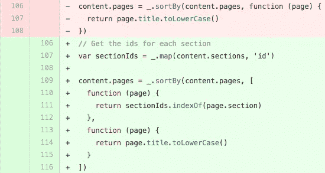

# 宝宝的第一个开源拉请求

> 原文：<https://medium.com/hackernoon/babys-first-open-source-pull-request-3da9beafee39>

## 一个初学者为开源做贡献的经历

我为编程已经快 10 年了。我开发过游戏，开发过应用程序，并且领导了一个软件团队三年。然而有一件事我没有做到，那就是为一个[开源](https://hackernoon.com/tagged/open-source)项目做贡献。

Awwww look how cute she is! I could just pinch her little diff cheeks!

开源对我来说似乎有点令人畏惧。我有时会患上冒名顶替综合症，有点害怕自己的代码被陌生人评判，我读过和听过太多开源社区中关于倦怠和怪人的恐怖故事。这阻止了我冒险参与任何项目。

现在，不是每个人都需要为开源做贡献，如果你不做也没关系。但是我想让 T8 去做，只是太害怕或者不知道从哪里开始。即使所有的项目都贴上了`newbie friendly`或`good for beginners`的标签，我也从未采取措施参与其中。

# 让我们开始吧

离我的加拿大 PyCon 之旅还有一周，我下定决心花一天时间在 Python sprints 上，尽我所能做出贡献。我想要一点实践，所以当我看到阿什莉·威廉姆斯在推特上寻求 NPM 医生的帮助时，我想这是一个好的开始。

那天晚上晚些时候，我深入到公开的问题，并发现了一个完美的。它被标记为`your-first-pr`。他们怎么知道的！？就像是为我量身定做的一样。好了，关键时刻到了，第九局底部，满垒，你们是小熊队，你们就要赢得世界大赛了。(这是我所有的棒球参考资料，我希望它们有意义。)

我在这个问题上的内心独白是这样的:

> 所有文档页面的列表顺序错误。太好了，我知道怎么分类，我会分类。我是排序之王。我们去整理一些文件吧。
> 
> 好吧，它工作了。嗯……有点乱，让我来清理一下。哦，他们用的是 lodash，但我这里不用，让我把这部分换成 lodash。我觉得这样很好？是吗？据我所知，这已经足够好了。如果有问题，这就是公关评论的目的。美国普什敦，我们来了！

就是这样，[拉动请求上升](https://github.com/npm/docs/pull/772)，正在等待审核。没那么糟吧。

# 开放供审查

现在我的童子军腰带上挂着闪亮的请求徽章，它(在写作时)正等待审查，我很惊讶我花了这么长时间才开始做出贡献。这可能是一个小的文档更新，但这并没有减少贡献的影响。如果说有什么不同的话，那就是接受不光彩的任务对每个人都有帮助。如果它们不那么有趣或好玩，会有更少的人愿意花时间在它们上面，但是有人需要！

对于任何想为一个项目做贡献，但从未这样做过的人来说，这里有一些事情需要记住:

1.  贡献并没有看起来那么可怕，项目维护人员也不是！
2.  不要觉得对“较小”或“简单”的任务(如文档)的贡献不如对核心代码库的主要错误修复或添加功能的贡献好或重要。它们是开始的好方法。
3.  在 Twitter 和 GitHub 上关注社区成员、维护者和项目。我知道，如果我没有在 Twitter 上关注 Ashley，我就不会有为《NPM 医生》投稿的灵感。
4.  不要害怕提交一个不完美的拉取请求，如果需要帮助，可以提出问题。
5.  每个人都有起点，所以现在就开始吧！

*喊出* [*开源博客*](https://medium.com/u/c98f56800747#.j31xblwb7) *的帖子，鼓励我分享我的经验！*

> [黑客中午](http://bit.ly/Hackernoon)是黑客如何开始他们的下午。我们是阿妹家庭的一员。我们现在[接受投稿](http://bit.ly/hackernoonsubmission)并乐意[讨论广告&赞助](mailto:partners@amipublications.com)的机会。
> 
> 如果你喜欢这个故事，我们推荐你阅读我们的[最新科技故事](http://bit.ly/hackernoonlatestt)和[趋势科技故事](https://hackernoon.com/trending)。直到下一次，不要把世界的现实想当然！

