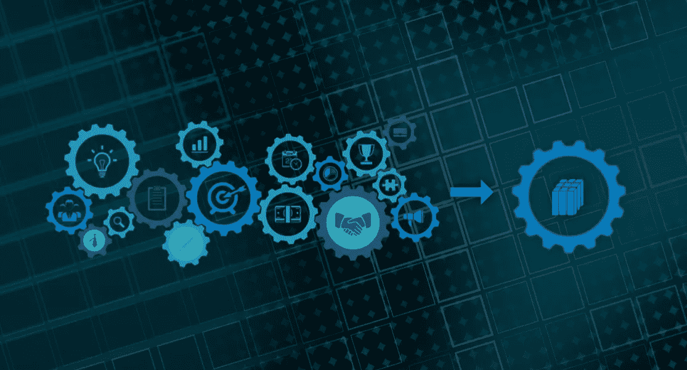
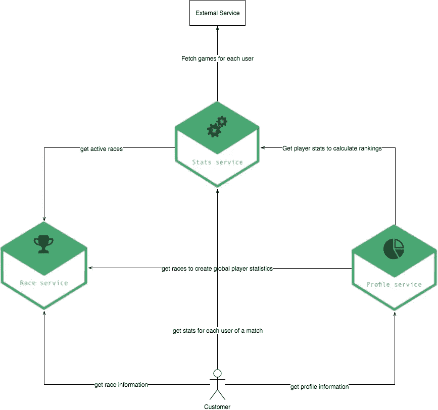
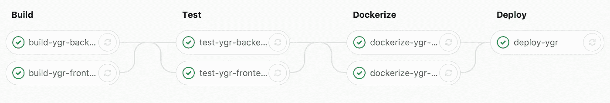
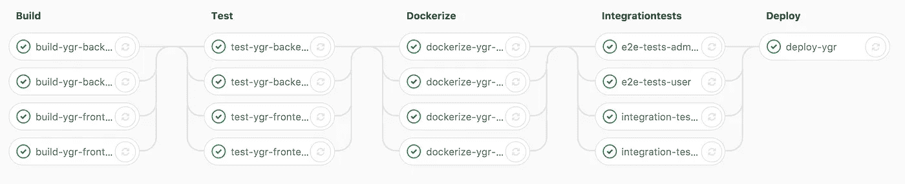
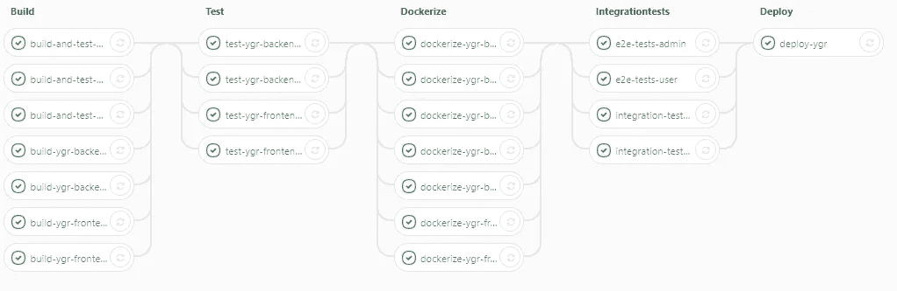
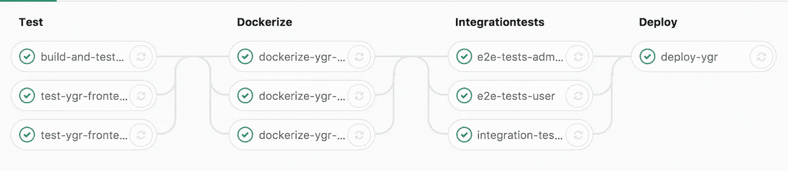

# 退回新建项目的微服务架构

> 原文：<https://medium.com/hackernoon/backpedal-a-microservice-architecture-of-a-greenfield-project-77432905d90a>

现在每个人都在谈论**微服务**(细粒度面向服务的架构)。他们中的一些人，比如马丁·福勒，建议采取“T2 独石先行”的方式。好处之一是避免了边界的模糊。因此，您可以提前发货，然后一个接一个地切断您的域名。

没有灵丹妙药。不同的宏架构有不同的权衡。对于副业项目来说，还有其他方面也很重要。例如，通过一种特殊的建筑获得**实践经验**。我通常会检查我感兴趣的架构是否适合我的项目。因此我一石二鸟。有很多关于微服务的很棒的讲座和讲座。但是一旦你开始使用它们，你就会意识到什么才是真正重要的。只有一些演讲和经验报告详细介绍了他们架构中不好和丑陋的部分。公司花费了数百万来完成它。营销、声誉和雇人是保持这些秘密的原因。但是一旦你和一个有经验的开发人员喝了第四杯啤酒，你就会获得真正的洞察力。例如，当你问:

> 如果你能回到过去，保留你现在的经历，你还会选择同样的建筑吗？

在详细介绍我的项目之前，我将定义基于微服务的架构。之后我会谈到缺点。如果你想听微服务的优点，去 youtube，找本书或者谷歌一下。

> 简而言之，微服务架构风格是一种将单个应用程序开发为一套小服务的方法，每个小服务都在自己的进程中运行，并通过轻量级机制(通常是 HTTP 资源 API)进行通信。这些服务是围绕业务功能构建的，可由全自动部署机器独立部署。这些服务只有最低限度的集中管理，它们可能用不同的编程语言编写，并使用不同的数据存储技术。
> (M .福勒)

我现在将介绍我的公共服务器设置。接下来是我的项目描述。之后，我将概述我的服务的复杂性增长和我的经历。最后，我会总结不好的事情，并尝试从我的学习中找到结论。

# **基础设施**

通常我从“老学校”主机提供商那里租用虚拟服务器。现在我对网杯很满意。是一家德国主机提供商。他们的虚拟服务器基于 T2 KVM T3。因此，运行 docker 就像在裸机上一样。

一年来，我一直是亚马逊网络服务(AWS)等云解决方案的粉丝。我可以在应用程序中添加缓存或负载平衡器之类的东西。这样可以节省时间和金钱。最值得注意的是，它降低了应用程序的复杂性。云解决方案有一个缺点，那就是价格。你将支付 200%到 400%的费用。与白天相关的高峰允许按需扩展。那么你也许可以省钱，也许…

在早期，我把一个兼职项目所需的一切都放在一个虚拟服务器上。因此，参与项目的其他人不能损害其他项目。此外，每个项目都可以单独扩展。

一旦一个项目变得更大，需要更多的资源，我就会增加更多的服务器。将生产环境从我的 ci 系统和测试环境中分离出来，可以实现更好的可伸缩性并提高安全性。此外，我将团队分布式工作的工具转移到一台自主机器上。

对于这个项目，我从以下设置开始:

*   英特尔至强 E5–2680 v4
*   6 GB DDR4 内存(ECC)
*   2 个专用内核
*   40 GB 固态硬盘

这种设置的成本约为 8 €，可以处理所有的基础设施部分。对于简单的应用程序，它可以同时为 1000 个用户提供服务。

# 在线竞赛平台

我的一个副业项目是为喜欢玩多人游戏的人提供一个在线平台。在那里你可以创造和参加比赛，最好的玩家可以赢得奖品。

React 实现了一个前端模块。此外，还有多个后端微服务被它们的[域](https://en.wikipedia.org/wiki/Domain_model)分开:

*   **比赛服务:**用户可以创建和管理比赛来显示和注册可用的比赛。
*   统计服务:获取、处理和存储比赛细节数据。这是计算排名基础数据。
*   **档案服务:**存储并更新玩家档案数据，以显示玩家出席。此外，它存储过去比赛的获胜价格和结果。

## 迭代次数

一开始，我从一个**比赛服务**开始，管理一般的比赛。这个服务有几个端点来创建、读取、更新和删除比赛。参赛者可以在比赛还没有开始的时候加入。与比赛的状态(即将开始、正在进行、已完成)相关，存在各种其他约束。

我的初始设置是:

*   为比赛服务的弹簧靴，
*   Gitlab 和 Gitlab-CI 来托管代码、运行测试和部署代码，
*   Docker 和 docker 组合起来为开发、测试和生产创建可部署的单元，
*   对纯前端行为作出反应，
*   基本 NodeJs express 应用程序，用于登录页面和使用 Oauth2 的基本身份验证。

First CD pipeline

一开始这很简单。一个前端，一个后端，快速构建和自动化测试。与大型企业应用程序相比，添加功能是一种魅力。整个 CI-pipeline 运行了大约 15 分钟，新版本已经上线。

我总是试图测试一切，以便一推代码就有好的感觉。因此，我在服务中添加了触发 Rest 请求的功能测试。已经有一个任务对我的服务进行了记录。为了测试，我使用另一个容器名前缀启动所有服务。此外，我将端口更改为非生产端口。一旦所有实例都启动并运行，我就可以运行我的测试了。这些触发了对我的应用程序的请求，并期望得到某些响应。

为了确保整个应用程序正常工作，我添加了基于 [CasperJs](http://casperjs.org/) 的端到端测试。他们帮助确保前端工作。此外，它还揭示了后端通信是否正常运行。我只测试创造种族的快乐路径。

此时，完整的管道执行需要大约 20 分钟。

随着我添加越来越多的功能，复杂性也增加了。第二个服务是 T2 统计服务。首先，我复制了现有的基于 Spring 的服务，更改了端口并添加了新的 CI 步骤。从 20 分钟 CI 运行时间开始，我已经达到了 30 分钟。我复制了构建、测试、rest 集成和端到端测试任务。此外，除了管理前端，我还添加了一个用户前端来访问比赛。

此时，每个服务都有其他服务的硬编码名称和端口。至少它部分动态地使用了环境变量:

*requestedServicePort = base port+requestedServicePort offset*

因此，测试系统单独启动。因此，我可以在不停机的情况下部署我的应用。这是通过在新应用程序启动并运行后立即更改端口重定向来实现的。此时，应用程序成功通过了第一次用户测试。因此，我的团队决定更进一步。

随着时间的推移，我添加了 profile 服务来保存全局用户统计数据。现在三个 的 [**法则来袭。我没有将所有这些服务连接在一起，而是选择了一个更具可扩展性和灵活性的解决方案。我使用一个叫做**](https://en.wikipedia.org/wiki/Rule_of_three_%28computer_programming%29)**[尤里卡](https://github.com/Netflix/eureka)的服务发现。我需要了解我的服务的可用性和健康状况。一个基于 Spring 的管理仪表板与 Eureka 通信，并给我所有我需要的数据。**

在我的机器上运行得非常好。感觉这是一个伟大的系统。没有静态链接，没有额外的配置。每个服务只在 Eureka 注册自己，并向 Eureka 请求其他服务的 IP 和端口。对于客户端负载平衡，我使用 [Ribbon](https://github.com/Netflix/ribbon) 。因此，负载可以分布在多个服务实例之间。为了实现容错，我还使用了 [Hystrix](https://github.com/Netflix/Hystrix) 。

在添加了所有这些服务之后，我的服务器变得汗流浃背。CI 任务有时开始失败。部署花费了大量时间。机器内存不足，无法交换。

在这种情况下，我将不得不投入更多的时间和金钱来进行纵向和横向扩展。

最简单的解决方案是购买更贵的虚拟服务器。不管怎样，我开始思考是什么让我慢了下来:

*   **复杂服务通信**:服务需要调用其他服务的端点，使用[断路器](https://martinfowler.com/bliki/CircuitBreaker.html)同步获取数据。与简单的[库相比](https://martinfowler.com/eaaCatalog/repository.html)方法调用就复杂了。
*   **重复代码**:保持模型同步很烦人。它们通常存在于多个服务中。因此，改变它们需要调整服务。尤其是在新项目的开始阶段，这种情况会发生几次。复制的配置文件也存在同样的问题。它们会发生变化，我需要手动使它们保持同步。
*   **更新外部依赖:**每个微服务都使用外部依赖。为了保持我的项目健康，我尝试每两周更新一次包。对于新的软件包版本，我通常需要逐个更新服务。
*   集成测试更复杂:当你测试组件之间的交互时，通常比单元测试更难。在微服务世界中，你需要在另一层测试交互。执行速度较慢，而且更容易出错。此外，重构通常会破坏它们。在纯后端项目中，我的 ide 足够聪明，可以自动修复问题，或者至少抛出一个编译时错误。
*   **对于小项目来说，CI 执行很慢:**通常每个服务都应该是可独立部署的。这使得构建速度更快，复杂度更低。但是如果你只有几个开发所有服务的开发人员，这在早期是没有意义的。此外，您通常希望运行一些影响多个服务的集成测试。拥有一个单一的版本控制系统使事情变得简单。因此，你需要大量的 ci 工作。对于每个服务，您需要构建、测试和打包任务。

所有这些缺点听起来都很刺耳。我是一个微服务粉丝，但正如我所说，这个帖子只会突出不好的事情。

总结利弊后，我决定迁移到一个更大的后端。现在的目标是将比赛、统计、个人资料服务整合到一个单一的服务中。此外，我可以摆脱管理和尤里卡服务，减少服务沟通。

我花了大约 6 个小时。拥有不同的测试层节省了我很多时间。我的第一个目标是，在将测试复制到“monolith”之后，让测试再次工作。在我修复了所有基于 Java 的测试之后，我对 Rest 和 CasperJs 测试做了同样的工作。

我还整理了一下 CI 管道。我可以摆脱建筑任务。应用构建也是测试阶段的一部分。在，我回到了 15 分钟的构建时间，进行了大量的测试和非常安全的部署过程。

后来代码看起来好多了。我用[领域驱动设计](https://en.wikipedia.org/wiki/Domain-driven_design)作为我的核心概念。重构之前我拥有的服务现在存在于不同包结构中的一个服务中。这允许我稍后检查包之间的依赖关系。因此，这使我能够在需要更好的水平可伸缩性时，很快再次切断微服务。

所以我对未来项目的认识是:

*   **永远不要在新项目**中使用微服务架构**。当我认为微服务是正确的架构时，我会在以后停止使用微服务。每个人都应该尝试挑战这一点。当我想到我从这个项目中学到的东西时，我觉得这个项目完全值得。**
*   一个好的微架构和坚实的代码覆盖对于一个进化的系统来说是强制性的。重构微服务更容易，也更不容易出错，反之亦然。
*   服务应该**独立部署**。否则构建时间会爆炸。这听起来很容易，但是对于依赖于其他服务的服务来说很难。
*   [**消费者驱动契约**](https://martinfowler.com/articles/consumerDrivenContracts.html) 是减少端到端测试责任的好方法。他们给出快速反馈，并直接指出问题所在。因此重构更容易。此外，还可以在部署后执行端到端测试，以缩短上市时间。
*   Docker 很棒，我应该越来越经常地使用它。我的开发、测试和生产系统很容易设置和启动。特别是对于微服务，这种隔离非常重要。但对于一个庞然大物来说，这绝对值得努力。
*   与领域相关的微服务需要其他基本服务，如服务发现。所有的服务都需要足够大的内存来可靠地工作。特别是 JVM 不知道基于 docker (cgroup)的限制。在定义内存限制时，它们会导致问题。

软件开发只是关于权衡。在开发人员致力于一项新的[技术](https://hackernoon.com/tagged/technology)之前，他们应该先了解一下利弊。例如和他们一起玩耍。微服务的缺点非常明显，可能是项目失败的原因。如果处理得当，微服务架构可能是一个合理的决策。它加速了开发过程，给了开发人员更多的自由。

最大的好处来自于为某个项目拥有许多开发团队的公司。能够独立开发和部署服务**增加了所有权**。这意味着开发人员觉得**对他们实现需求的内容和方式更加负责**。此外，他们能够从开发、测试到生产护送一个特性。结合例如 [canary releases](https://martinfowler.com/bliki/CanaryRelease.html) 可以大幅减少生产 bug。可伸缩性也是微服务的一个特征，但相比之下相对无关紧要。

我希望你喜欢阅读。请随时使用您选择的平台向我发送反馈和问题。我感谢所有在 [**推特**](https://twitter.com/Journerist) 上的关注者，因为这是我与你们交流的主要工具。

> [黑客中午](http://bit.ly/Hackernoon)是黑客如何开始他们的下午。我们是 [@AMI](http://bit.ly/atAMIatAMI) 家庭的一员。我们现在[接受投稿](http://bit.ly/hackernoonsubmission)，并乐意[讨论广告&赞助](mailto:partners@amipublications.com)机会。
> 
> 如果你喜欢这个故事，我们推荐你阅读我们的[最新科技故事](http://bit.ly/hackernoonlatestt)和[趋势科技故事](https://hackernoon.com/trending)。直到下一次，不要把世界的现实想当然！

