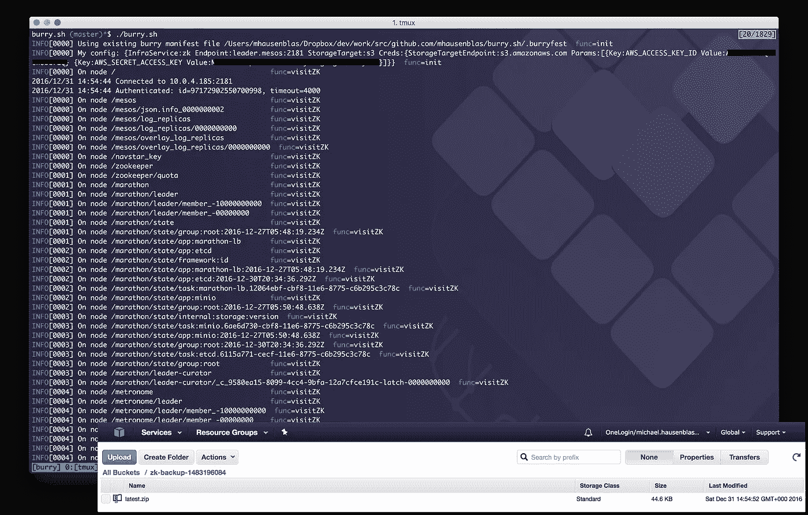

# 基础架构服务的备份和恢复

> 原文：<https://medium.com/hackernoon/backup-recovery-of-infrastructure-services-200b2116930f>



基础设施应该很无聊吧？这并不意味着[为上述基础设施开发](https://hackernoon.com/tagged/developing)工具不能令人兴奋。在一个领域，我相信还有改进的空间:*备份(和恢复)关键的基础设施服务*。

为了提供一些背景:我说的是云原生基础设施，即通常管理某种容器的分布式系统。所有这些分布式系统的共同点是，我们使用一些分布式基础设施组件来存储对其操作至关重要的状态:配置、关于领导者或员工的元数据等等:

*   DC/OS 使用由参展商监管的 [ZooKeeper，用于其分布式内核(Apache Mesos)及其服务(Marathon、Jobs、Spark、Kafka、Cassandra 等等)。](https://dcos.io/docs/1.8/administration/faq/#q-does-dc-os-install-zookeeper-or-can-i-use-my-own-zookeeper-quorum-)
*   Docker SwarmKit 使用内部基于 Raft 的[状态存储](https://github.com/docker/swarmkit/tree/master/manager/state)。
*   Kubernetes 使用 [etcd](http://kubernetes.io/docs/admin/etcd/) 来持久存储它所有的 REST API 对象。
*   Nomad 使用内部基于 Raft 的[共识](https://www.nomadproject.io/docs/internals/consensus.html)协议(以及管理集群成员的 gossip 协议)。

在任何情况下，您可能会发现自己有时会想要获取 infra 服务内容的快照，无论是为了调试它还是为了保存健康状态的备份。这就是我开始研究一个工具的动机，我称之为 *burry* ，意为*B*ack*U*p&Recove*RY*tool:

> [http://burry.sh](http://burry.sh/)

简而言之， *burry* 允许您在编写时对 [ZooKeepe](https://hackernoon.com/tagged/zookeeper) r & etcd 的内容进行快照，然后您可以:

*   转储到屏幕上，例如:`burry --endpoint localhost:2181`
*   将其存储到本地文件系统，例如:`burry --endpoint etcd.mesos:1026 --isvc etcd --target local`
*   将其存储在远程存储系统中，例如:

```
burry --endpoint leader.mesos:2181 --target s3 --credentials play.minio.io:9000,AWS_ACCESS_KEY_ID=Q3AM3UQ867SPQQA43P2F,AWS_SECRET_ACCESS_KEY=zuf+tfteSlswRu7BJ86wekitnifILbZam1KYY3TG
```

*注:目前可以使用亚马逊 S3 和* [*Minio*](https://www.minio.io/) *作为远程存储系统。*

我目前正致力于 Azure 和 Google 存储支持以及恢复状态(这是恢复部分；).

接下来你想看什么？请让我知道，要么在这里，要么在 GitHub 上提出[问题。](https://github.com/mhausenblas/burry.sh/issues)

[](http://bit.ly/HackernoonFB)[](https://goo.gl/k7XYbx)[](https://goo.gl/4ofytp)

> [黑客中午](http://bit.ly/Hackernoon)是黑客如何开始他们的下午。我们是阿妹家庭的一员。我们现在[接受投稿](http://bit.ly/hackernoonsubmission)并乐意[讨论广告&赞助](mailto:partners@amipublications.com)机会。
> 
> 如果你喜欢这个故事，我们推荐你阅读我们的[最新科技故事](http://bit.ly/hackernoonlatestt)和[趋势科技故事](https://hackernoon.com/trending)。直到下一次，不要把世界的现实想当然！

