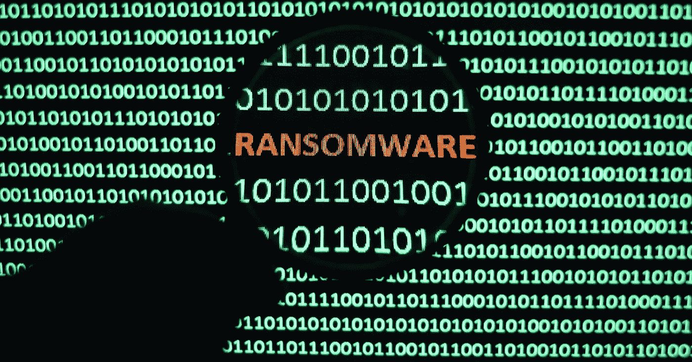

# 备份——计算机病毒和勒索软件的灵丹妙药。

> 原文：<https://medium.com/hackernoon/backup-the-panacea-for-computer-viruses-and-ransomware-468d0380cac>

计算机病毒和勒索软件越来越可怕了。

对于那些没有经历过勒索软件的人来说，勒索软件是一种病毒加密你电脑上的所有数据，有效地将你锁在电脑外面，无法访问你的任何数据。

这意味着你不能再使用你的电脑，也不能得到你的任何数据。句号。

你以为你有杀毒软件就安全了吗？或者你有防火墙？或者你有一个非常好的 IT 人员？你真可爱。

不，真的，它是伟大的，你有最新的反病毒，防火墙，和一个真正好的 it 家伙。真的是。但这还不够。事实上，你可以拥有所有这些，甚至更多，但最终还是你。你是薄弱环节。不是针对个人，只是你，是我，是所有人。我们是人，人并不总是有最好的判断力。我们做傻事。看起来很无辜，却导致灾难性后果的事情。

想象一下，你收到一封来自朋友、家人或老板的电子邮件，看起来合法而重要。你会在家，在工作，或者在两者之间。你会很累，或者会很晚，或者你会在家拿着啤酒或一杯葡萄酒工作，然后漫不经心地打开那封邮件。你会无意中点击邮件中的链接或附件，在你意识到之前，你就会被感染。你的电脑会被加密和锁定，你会被卡住。超过 60%的勒索软件攻击是通过电子邮件进行的，可以从那里传播到整个组织的计算机。

但并非一切都没了，那些把你锁在电脑外面的乐于助人的罪犯包括了一种方法，让你付给他们一笔赎金，用一种特殊的解密密钥解锁电脑。

对于公司来说，这是相当实惠的，解锁和解密你的电脑的平均成本约为 680 美元。你要做的就是用比特币支付赎金。不知道比特币是什么？不要担心，几乎没有人这样做，你并不孤单，锁定你电脑的罪犯让你很容易购买比特币并支付它们，一步一步地指导你能够继续你的一天。

# 勒索软件是一个大生意，它正以 600%的速度增长，仅去年一年，人们就支付了 10 亿美元的赎金。

如果这发生在你身上，不要难过。近 50%的组织都遭受过勒索软件攻击，攻击者的手段越来越高明。

我们越早认识到 100%安全的系统是一个幻想，我们就能越早准备好从不可避免的灾难中恢复过来。

从勒索软件中恢复的最可靠的方法是从备份中恢复。信不信由你，早上第一件事就是遭受勒索攻击，不支付赎金，午饭前完全恢复并运行是可能的。您需要的只是一个良好的备份和恢复策略。

备份是你超级性感的保险政策，当你知道什么击中风扇时，它会把你从困境中拉出来。

如果你为一家大公司工作，很可能他们会为你的电脑制定一个好的备份和恢复策略。希望如此。如果没有，让他们打电话给我。

如果你是一家小公司的一员，或者只是想确保你的个人电脑受到保护，有无数种方法可以备份你的电脑并保证它的安全，我会给你一些建议，告诉你为了能够从勒索软件攻击中恢复，你必须做些什么。但是请记住，虽然下面的内容会非常有帮助，但并不简单。这是一个很有可能让你从 99%的病毒攻击中恢复的起点。

*   *自动备份*。无论你是在 Mac 上使用 TimeMachine 还是其他解决方案，确保它尽可能频繁地运行，以减少工作量。每天、每周或每小时。无论你选择哪种方法，都要确保自动化，因为正如我之前说过的，我们是人，我们会做一些愚蠢的事情，比如忘记备份我们的电脑几个月。
*   *拥有一份离线且与电脑断开连接的副本。*这不是指云(Dropbox、Google Drive 等。)这意味着一个与你的电脑物理连接的硬盘，你可以在完成后从电脑上拔下。我使用几个晚上插上的可移动/外置硬盘，我的备份软件会在我工作或睡觉时自动备份我的电脑。第二天，我把硬盘拔下来收好，插上另一个硬盘，下次自动备份。我这样做是因为如果我在星期三被感染，并且病毒感染了我的计算机和我在星期三早上插入的外部硬盘，我在星期二、星期一和星期天用于备份的硬盘将被拔掉并放在壁橱中，不会被感染。我可以在星期三下午从星期二没有病毒的良好备份中恢复我的整个计算机。我的外置硬盘越多，我就越安全。我可以用一些做每周备份，一些做每月备份，一些做每天备份。
*   *使用多种备份方法。*除了在之前的 bullet 中使用外置硬盘之外，还可以使用云备份解决方案，比如在后台持续运行的 [CrashPlan](http://www.crashplan.com) 。请确保您的备份和帐户用一个好的密码加密。*另外*，使用云存储解决方案，比如 Dropbox，或者 Google Drive。使用多种方法有助于减少丢失数据的机会，并为您的备份提供备份；也是任何好的备份和恢复计划的重要组成部分。

祝你好运！

你有什么建议或故事可以分享吗？你或你的朋友有过这样的经历吗？希望在下面的评论中听到你的想法。

*跟我连线:* [*脸书*](http://facebook.briangreenberg.net/)*|*[*LinkedIn*](http://linkedin.briangreenberg.net/)*|*[*Twitter*](http://twitter.briangreenberg.net/)*|*[*博客*](http://blog.briangreenberg.net/)*|*[*Google+*](http://plus.briangreenberg.net/)

> [黑客中午](http://bit.ly/Hackernoon)是黑客如何开始他们的下午。我们是 [@AMI](http://bit.ly/atAMIatAMI) 家庭的一员。我们现在[接受投稿](http://bit.ly/hackernoonsubmission)并乐意[讨论广告&赞助](mailto:partners@amipublications.com)机会。
> 
> 如果你喜欢这个故事，我们推荐你阅读我们的[最新科技故事](http://bit.ly/hackernoonlatestt)和[趋势科技故事](https://hackernoon.com/trending)。直到下一次，不要把世界的现实想当然！

