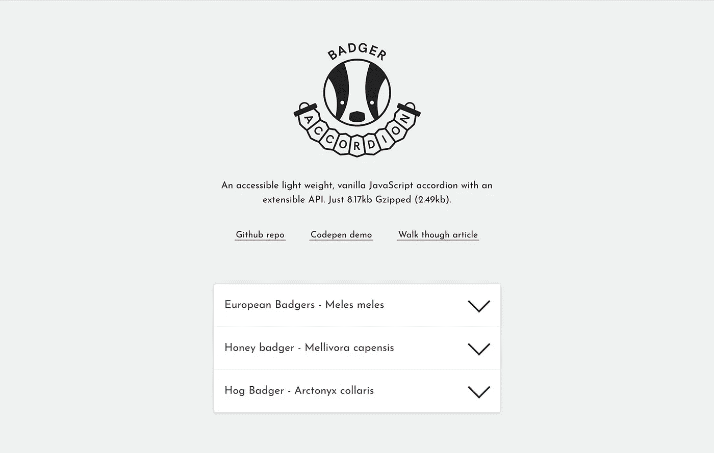

# badger Accordion——一个可访问的轻量级普通 JavaScript accordion，具有可扩展的 API

> 原文：<https://medium.com/hackernoon/badger-accordion-an-accessible-light-weight-vanilla-javascript-accordion-with-an-extensible-api-a34128922822>



Badger accordion demo

像许多开发人员一样，我一直使用[开源](https://hackernoon.com/tagged/open-source) [工具](https://hackernoon.com/tagged/tools)。从我的[文本编辑器](https://atom.io/)到我使用的 CMS，再到我对堆栈溢出的常规搜索。我认为是时候为开源社区做出有意义的贡献了(关于我制作第一个开源工具的经验的文章即将推出……)。请击鼓…不要再拖延了。[獾手风琴](http://ba.northernbadger.co.uk/)！

Badger Accordion demo on [Codepen](https://codepen.io/stuartjnelson/pen/WZpxqY)

## 獾手风琴是什么？

这是一个易于访问的动画手风琴，使用普通 JavaScript 和一点点 CSS 构建。它只有 6.14kb(缩小的)和 1.86kb 的 gzip 文件！

在 B 先生的朋友工作时，我们经常需要快速浏览小型营销网站。对我来说，最具挑战性的部分是在创建尽可能好的代码库和赶在截止日期前发布网站之间取得平衡。我喜欢把它看作是 web 开发的艺术与商业。我没能找到一个可访问的手风琴，它可以在不同状态之间活动，不使用 jQuery，并且有一个可扩展的 API。所以我不得不在幼崽戴夫·史密斯的大力支持下造了一个(看我在那里做了什么来迷惑粉丝？)诞生了！

## 创建您的标记

你的标记不需要固定的结构，在我的例子中我使用了一个`dl`(正如 WAI-ARIA 创作实践指南在他们的[例子](https://www.w3.org/TR/wai-aria-practices-1.1/examples/accordion/accordion.html)中使用的那样)。你需要添加 5 个选择器来使插件工作。下面列出的选择器是默认的选择器，但是都可以用插件[选项](https://github.com/stuartjnelson/badger-accordion#options)重写。

1.  包含元素，`dl`，`.js-badger-accordion`
2.  表头元素，`button`，`.js-badger-accordion-header`
3.  面板元素，`dd`，`.js-badger-accordion-panel`
4.  面板内部元素，`div`，`.js-badger-accordion-panel-inner`
5.  用 CSS、`div`、`.badger-accordion__panel`定位面板元素。虽然你可以使用第三点中的选择器，但我**而不是**建议你这么做。为了保持一切都很好，最好用 CSS & JS 使用不同的选择器。

```
<dl class="js-badger-accordion">
    <dt>
        <button class="js-badger-accordion-header">
            Header Content
        </button>
    </dt>
    <dd class="badger-accordion__panel js-badger-accordion-panel">
        <div class="js-badger-accordion-panel-inner">
            Panel Content
        </div>
    </dd>
</dl>
```

## 添加基本 CSS

为了让插件工作，你需要下面的 CSS。

```
.badger-accordion__panel {
    max-height: 75vh;
    overflow: hidden;
}.badger-accordion__panel.-ba-is-hidden {
    max-height: 0 !important;
}.badger-accordion--initalised .badger-accordion__panel {
    transition: max-height ease-in-out 0.2s;
}
```

## 创建插件的新实例

我在这里假设你将在你的项目中使用某种形式的捆绑器。使用手风琴最简单的方法是使用 [npm](http://npmjs.com/package/badger-accordion) /yarn 下载。

```
npm i badger-accordionyarn add badger-accordion
```

请注意，目前, [array-from-polyfill](https://developer.mozilla.org/en-US/docs/Web/JavaScript/Reference/Global_Objects/Array/from#Polyfill) 作为标准被包括在内(但是被包装在一个条件检查中)。如果这对你来说是一个问题，或者你有一个如何包含它的好主意，请联系我们！

导入包。选择您的 DOM 节点，并将其传递给 Badger Accordion 的新实例。

```
import pollyfill from 'your/path/to/array-from-pollyfill';
import BadgerAccordion from 'badger-accordion'; const accordionDomNode = document.querySelector('.js-badger-accordion');
const accordion = new BadgerAccordion(accordionDomNode);
```

如果你想有多个手风琴的实例，你可以这样做。

```
const accordions = document.querySelectorAll('.js-badger-accordion');

Array.from(accordions).forEach((accordion) => {
    const ba = new BadgerAccordion(accordion);
});
```

## 定制插件的 JavaScript 选项

该插件目前有 11 个不同的选项。从更改手风琴面板的 JS 选择器到能够同时打开多个面板。

```
const accordion = new BadgerAccordion(accordionDomNode, {
    panelClass: 'my-custom-panel-class’
    openMultiplePanels: true,
});
```

看一下[文档](https://github.com/stuartjnelson/badger-accordion#options)中选项的完整列表。

## 使用 API

目前有 6 种方法可以让你更好地控制你的手风琴。让我们来看一个例子，看看你什么时候会用到它。

假设在移动设备上的 FAQ 页面上，您希望关闭所有面板。

```
accordion.closeAll();
```

就这么简单。查看 [Github repo](https://github.com/stuartjnelson/badger-accordion#methods) 获取完整的方法列表。

感谢阅读这篇文章！有问题/错误报告/认为文档可以改进吗？请在下方留言评论。查看 Github [repo](https://github.com/stuartjnelson/badger-accordion) 获取详细文档。repo 中有一个示例实现可以帮助您入门。

有一些很棒的人帮我做手风琴。我在[B 先生&朋友](https://www.mrbandfriends.co.uk/)big shout to the digital team 工作时参与了这项工作。如果没有[戴夫·史密斯](https://github.com/getdave)的睿智之言，这根本谈不上什么好。最后，我最喜欢的数字设计师[塔维·凯勒](https://twitter.com/taavetkelle)，他创造了令人敬畏的标志，并给了我的演示风格*一些爱*(史蒂夫·理查森)。

也感谢 [BrowserStack](https://www.browserstack.com/) 允许我免费使用他们的平台来支持我。

## 我用来制作手风琴的资源

*   读了奇妙的 Tink 写的一堆文章，我去博客寻求可访问性待遇。
*   我强烈推荐 Heydon Pickering 的书 [*包容性设计模式*](https://shop.smashingmagazine.com/products/inclusive-design-patterns) 。
*   WAI-ARIA 创作实践超级有用，对于一些看起来非常技术性的基础文档，我发现它非常可读
*   我用 [Rollup.js](http://rollupjs.org) 捆绑了手风琴，并真心推荐它作为一个工具。他们的启动指南很好，对于像捆绑插件或小网站这样的小用例，我更喜欢它而不是 Webpack。