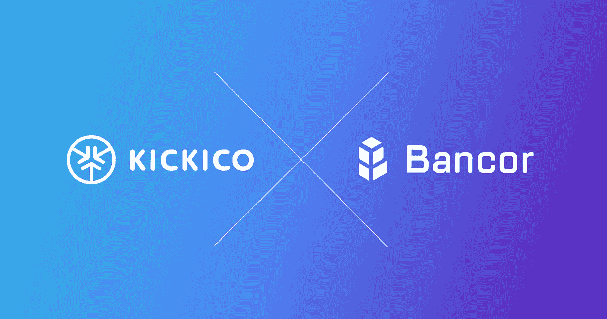

# Bancor 成为 KICKICO 的战略合作伙伴，而 KickCoin 成为智能令牌。

> 原文：<https://medium.com/hackernoon/bancor-becomes-kickicos-strategic-partner-while-kickcoin-becomes-a-smart-token-32c9540559d6>

在 KICKICO，我们专注于中小型项目，有一个好主意和一个忠诚的团队。我们为他们提供完整的融资解决方案，包括在 KICKICO 平台上运行的首次代币发行。然而，我们认识到，这些代币中的大多数都没有足够的资本在加密交易所上市和交易，因此，它们不能流通。

解决方案来了:将 [Bancor 协议](http://bancor.network)集成到代币的智能合约中，这样所有的筹款人都可以通过各种方式让他们的代币变得真正“智能”。

Bancor 协议是由 Bancor 开发的一种标准，它处理中小型货币的长尾效应问题，这意味着对于具有相对较小大写的代币来说，找到适当的匹配是相当复杂的。通过加入 Bancor 网络并为代币做一定的储备，有可能使代币变得“智能”,从而可以容易地将其交换到任何 ERC-20 代币。

该解决方案将允许任何代币流动，并支持 KickCoin 的价值，因为它将成为平台的网络代币(默认情况下，所有项目的储备都将是 KickCoin，BNT 将成为 kick coin 的储备货币)。此外，它将为支持者提供随时出售代币的机会——如果一个项目(和代币)的价值增加，支持者可以出售它并分别获得利润。如果一个项目失败了，投资者至少还能以较低的价格出售它。

KICKICO 平台中第一个集成 Bancor 协议并成为“智能令牌”的加密货币是 KickCoin。KickCoin 的初始 CRR 将是其在 BNTs 中的 ICO 期间筹集的资金的 5%。

[Eyal Hertzog](https://www.linkedin.com/in/hertzog/) 将成为 Token Models [顾问](https://www.kickico.com/team)的战略角色，为 KICKICO 上的融资项目提供 Token model 建议。