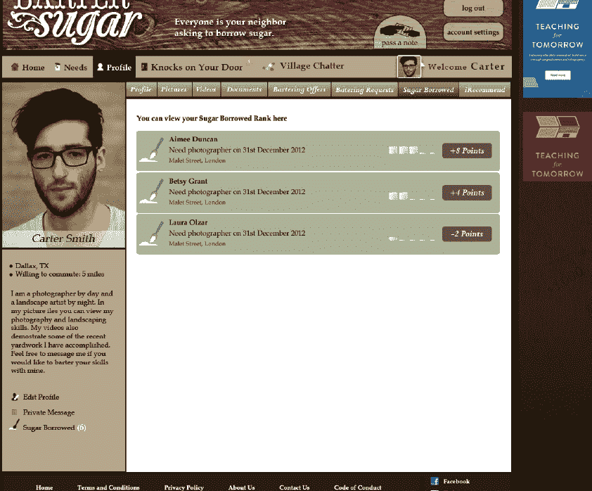
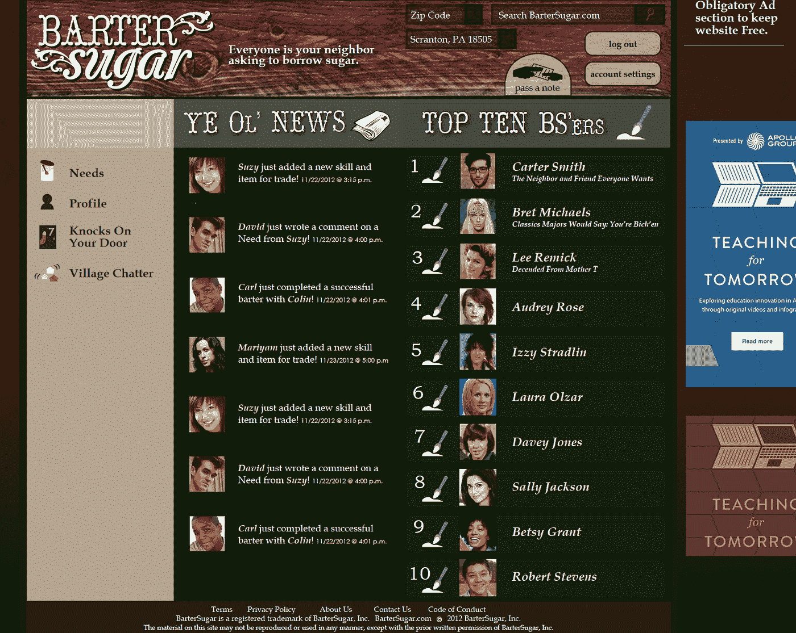
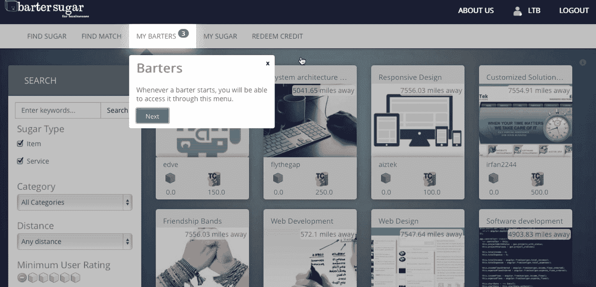
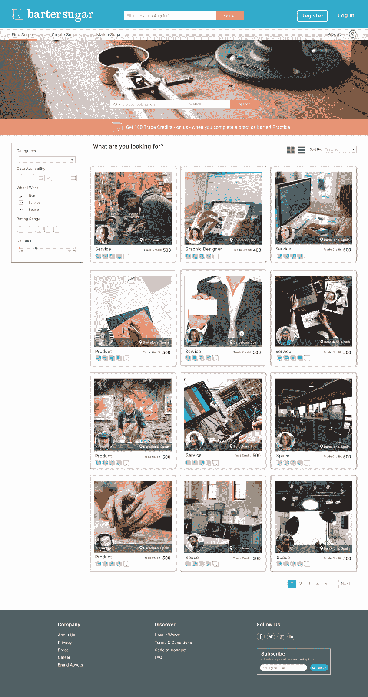
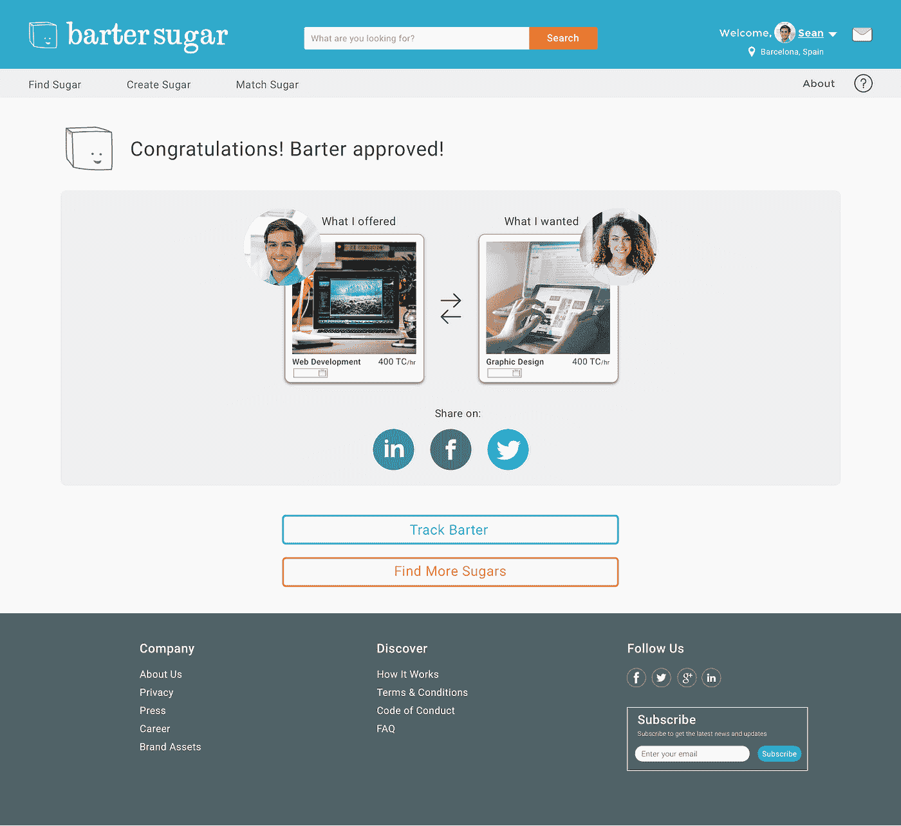
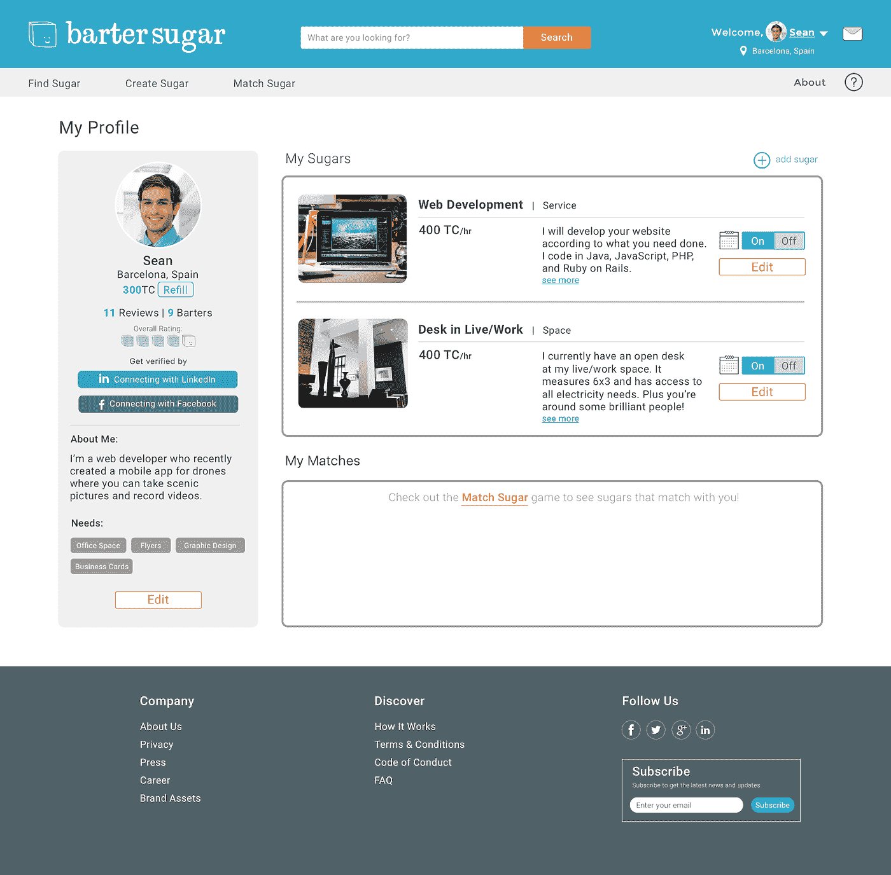

# sBarterSugar 正在关闭-蕾拉塔巴塔贝

> 原文：<https://medium.com/hackernoon/bartersugar-is-shutting-down-layla-tabatabaie-a52a9f1c350d>

五年后， [BarterSugar](https://www.bartersugar.com/) 将于下周关闭。我感谢所有 [BarterSugar](https://www.bartersugar.com/) 成员的支持。现在有多种有效的在线易货渠道。因此，虽然这篇文章是由一个沉重的心情发起的，但它也不可能发生在一个更令人欣慰的时间。

对于超级侦探来说，BarterSugar 存在的第一个证据出现在 2012 年，那是我打算为公司申请的两个商标之一的日期。在一行代码存在之前申请商标是一个非常律师的举动，但对初创公司来说不切实际，因为一开始你的营运资金有限，我不建议这样做。

似乎只有那些阅读像这样的“关闭”文章的人希望收集适用于大多数人的经验教训，所以我会尽力让这篇告别有用。

对我来说，BarterSugar 成了我不知道自己需要的技术和 MBA 的混合体。我不知道这会塑造我余生想要成为的那种人。到这五年结束时，我获得了我不知道作为一名合格的技术创始人所必须的技能:前端和后端开发、使用完整 Adobe 套件的设计和中级技能、UX 测试、问卷和调查构建，这些技能将导致记录数百个——近 400 个——UX 和 UI 访谈、与投资者谈判、向更大的企业推销合作伙伴关系，以及学习多种语言。语言要求会根据你所在的市场而有所不同，但我最终学会了如何用波斯语读写(由于当前的美国政府，这项技能现在很流行)，还学会了基本的西班牙语和德语。

# 第一个可笑的坏版本

作为一名专注于通过视频游戏和互动技术镜头研究知识产权和诉讼的律师(在法学院之前，我几乎玩过所有的最终幻想 RPG)，我最初的倾向是像设计视频游戏一样设计 BarterSugar 有趣且受社区驱动。有趣的是，这是第一个版本的样子:

*(不，你的眼睛没有欺骗你。这是我们在内部模型中使用的迷你阿兰妮斯·莫利塞特图像。)*

是的，因为当时天空是极限，我也试图建立我们自己的内部 PPC 网络，让广告商在市场的右边栏投放广告，这将是该平台的主要收入来源。我在法学院学习了一个学期的游戏化，正如你所看到的，在第一个版本中，我在实现一些方法上有点过火了。

我相信这些图片足以回答为什么这个网站被称为 BarterSugar 的问题——它开始是一个 P2P 网站，后来演变成一个 B2B [创业](https://hackernoon.com/tagged/startup)网站。

# 资金和第二版

2014 年，BarterSugar 从一个新成立的天使集团获得了第一笔非常适度的投资。下一个版本将是一个巨大的改进，但仍然没有优化，原因很明显——它是由一名律师和工程师设计的。

一年后，我写了一千多篇设计文章，脑子里塞满了 UX/UI 工具包、半打 Trello 板和三个科技黑客马拉松，我会理解并欣赏训练有素的设计眼光、简单的 UI 和常识性的 UX，这些只有设计专业学生的头脑才能创造出来。但那时候，我们只是在学习。2014 年，我们所在的团队中没有高水平的设计师，中等设计的文章也还没有出现，所以我们本质上都是一样的——就像新生的鹿在不熟悉的领域中蹒跚前行，寻找父母的指引。

# 最终版

到 2015 年底和 2016 年，我终于做了现在的标准模型:找了一对聪明的 UX/UI 专业人员，使用 Adobe 套件或草图的组合创建了高保真、可点击的模型，并将其导入 InVision，可以在上线前与测试人员分享，以发现可用性问题。我们的最终版本是您今天看到的华丽现场版:

# 物物交换的未来

我的精神油箱在 E 上运行，由于在马萨诸塞州的一个创业投资者训练营的三天里睡眠不足八小时，我仍然记得当我收到 PayPal 通知说我们的第一笔**支付的**易货交易已经完成时，我感到不寒而栗。这不仅是为了 7.5%的降价，而且是国际性的——美国对东欧的易货交易。

随着酒吧的噪音达到临界质量，灯光逐渐变暗，预示着夜晚的来临，我记得在欢乐时光喝酒时告诉 JP 摩根的一位副总裁，我相信物物交换的[未来](https://hackernoon.com/tagged/future)是显而易见的——有一天，也许在 80 年或 100 年后，物物交换将成为政府机构的管辖范围。根据我在麻省理工学院的一个视频讲座中看到的愿景，我相信我们最终会走向这样一个社会:大约 20%的时间用于工作，其余时间根据需要安排。每个人都会得到一点点工作，因为工作量会急剧减少。因为一个人的手段和资源将在一定范围内发挥作用，物物交换将作为一种扩展这些限制的方式而蓬勃发展。我希望在附近，足够清醒，看到这一点，但如果没有，也许这个中等职位将作为在地面上的旗帜预测。

这还不包括今天已经发生并将继续发生在国家之间的交易，比如与伊朗、俄罗斯、印度、中国或委内瑞拉的交易。

# 经验教训:对于初创公司的创始人

## 实践课程

1.  如果你的生活方式业务不是平台密集型的，使用 Shopify 或其他简单的网站创建者，或者将你的应用程序开发外包给更便宜的开发者。对我来说，一些性价比最高的作品来自西班牙和印度。如果你不知道如何编码，那么确保你有一个朋友——一个真正爱你、关心你的朋友——他可以作为项目经理，让团队保持正轨。
2.  如果你正在创建一个技术产品——平台、简单的网站、应用程序、机器人等等。—花一个月的时间(最好是更多，但我们在这里很实际)练习你将要使用的语言。知道如何阅读你的代码，了解它是否是垃圾，这是值得的。五年前，我对代码一无所知。到 2017 年，我已经足够擅长阅读代码，当我报告我与外包公司就项目规格进行谈判时，人们仍然感到震惊。了解真实的开发成本将为您节省几千到几十万美元。
3.  如果你外包，只支付里程碑。永远不要按小时付费，否则你永远不会看到你的产品开花结果。
4.  无论你的外包团队给了你什么时间表，增加三个月，然后回到你的项目规格，看看你可以优先考虑什么，以确保你在最后期限内完成。
5.  作为几家初创公司的律师顾问，我不断看到相同的模式出现:一群热情的理想主义者在他们的产品实现现金流正增长或迅速传播之前辞职，精明的鲨鱼般的投资者察觉到水中的血液，提出了一项条件恶劣的交易，饥饿的初创公司需要资本注入，最终接受了这笔糟糕的交易。除非你已经筹集了足够的资金来维持两年的开销和微薄的薪水，否则不要辞职。忽略这个建议，开始给水上色的血就是你的了。
6.  如果你正在创造一个科技产品，而你不是制造它的人，那么你应该精通另一项必备技能:建立伙伴关系、公关、在线营销、创业法律文件等。你挑吧。我有很多非工程师问我如何为我做的每个项目找到技术合伙人，我告诉他们一些不同的说法，“我的脸书点击量下降到 7 美分；我们从未聘请律师。”
7.  找一个能和你一起笑的联合创始人。生命是短暂的，如果你身边的人是小鸡的化身，而不是大城市，你会觉得生命更短暂。

## 整体课程

1.  如果你是一名初创企业的创始人——那种不属于“不公平优势”的创始人——那么你有点疯狂。因为只有一个疯狂的人——一个不是第二次或第三次被出售的创始人，没有家族遗产/家族声誉，没有堆积如山的资本或著名朋友的人——才会发起一个有 90%失败可能性的前景。这意味着你遇到的许多其他创始人将与你志趣相投。说到底，我最感激的是通过 BarterSugar 参与的各种项目建立起来的友谊。
2.  没有太多的幸运饼干奶酪，生活是一个持续的平衡，承认你只有一个年轻，有弹性的身体，可以忍受长途登山，野外俱乐部之夜，和耐力运动，知道你年轻，永远好奇的大脑随着年龄的增长而退化和变慢。这就是为什么你要在年轻的时候那么努力，攒够钱来养活年老多病的未来的自己。我和一个朋友去南非玩大象，了解那里的文化，然后在旅行两天后回到我的创业公司工作。这里没有明确的规则——只是在做决定时把这种认知记在心里。

# 后续步骤

我已经和一个非常棒的团队开始着手我的下一个创业项目了。这将是我和我的联合创始人之一制作的第三个科技产品，我真的很兴奋能在几个月内展示我们的产品，它旨在让许多家庭安心。

作为一名创业顾问，我还试图在纯股权的基础上每年接受大约三家创业公司；如果你有一家独一无二的初创公司，并且正在寻找一位股权律师顾问，请随时登陆我的网站联系我:[**【laylatabatabaie.com】**](http://www.laylatabatabaie.com/)。我最感兴趣的是那些已经筹集了至少 10 万美元或拥有很高用户留存率的科技初创公司，但它们会屈服于巧克力、纸杯蛋糕、咖啡等。

谢谢所有支持我的鼓舞人心的人，下次再见。

蕾拉·塔巴塔贝

***

*特别感谢 Alison Swety 编辑这篇文章，感谢 Oscar Solis 的早期评论。*

> [黑客中午](http://bit.ly/Hackernoon)是黑客如何开始他们的下午。我们是 [@AMI](http://bit.ly/atAMIatAMI) 家庭的一员。我们现在[接受投稿](http://bit.ly/hackernoonsubmission)并乐意[讨论广告&赞助](mailto:partners@amipublications.com)机会。
> 
> 如果你喜欢这个故事，我们推荐你阅读我们的[最新科技故事](http://bit.ly/hackernoonlatestt)和[趋势科技故事](https://hackernoon.com/trending)。直到下一次，不要把世界的现实想当然！

