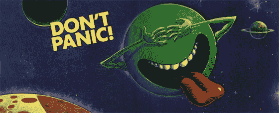
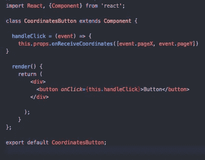
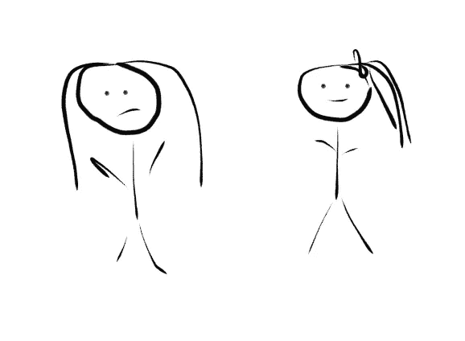
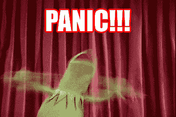
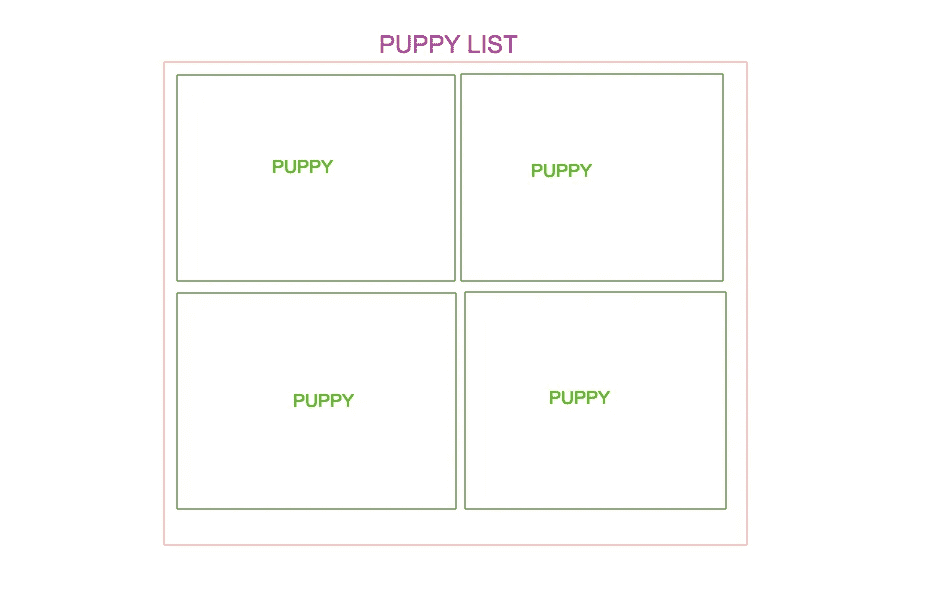

# React.js 中事件侦听器的基本概念和应用

> 原文：<https://medium.com/hackernoon/basic-concepts-and-applications-for-event-listeners-in-react-js-e616fbd22827>



从 [JavaScript](https://hackernoon.com/tagged/javascript) 转移到 [React](https://hackernoon.com/tagged/react) 有些令人生畏，因为人们很容易忘记 React 只是 JavaScript。语法、JSX 以及文件之间共享信息和组件之间传递信息的方式的差异可能会非常令人困惑，因此在这篇博客中，我打算简要概述一下 React 中的事件侦听器是什么样子的，以及需要记住的一些事情。

## 首先，我们应该试着记住 JavaScript 中的事件监听器。

一个 ***事件监听器*** 是一个**回调函数**，它监听(或被调用)一个**事件对象**的**创建**。

让我们来分解一下:

JavaScript 最强大的特性之一是它可以接受一个函数作为参数。回调函数是这样做的函数的名称，它接受另一个函数作为参数。当我第一次接触回调函数时，我把它们和闭包混为一谈，虽然有一些重要的概念与它们都相关(特别是当我们考虑范围时)，但它们也是不同的！在这里，我将重点讨论事件上下文中的回调。为什么回调很棒？

*   它允许我们编写我们可能并不马上需要的函数——例如(正如我们将在这里看到的),当我们等待用户输入时。
*   它允许职责分离，并有助于将代码分解成更小的部分
*   希望我们也能利用这些优势，让我们的代码对我们自己或其他从事该项目的开发人员来说更具可读性。

当我们将一个参数作为函数传递时，我们需要记住在我们准备使用它之前不要调用它！否则，我们的代码可能会中断，或者至少不会像预期的那样工作。

浏览器一直在监听用户输入或交互。这可能意味着击键、点击按钮或提交表单。在这种交互作用下，比如说点击一下，一个新的事件对象就会基于具有某些属性的特定交互作用而被创建。这些属性包括诸如，点击了什么，鼠标的位置之类的东西，这些属性非常有用，因为新的事件对象封装了特定的交互，允许我们以后引用它。

## 那么 JavaScript 和 react 中的回调函数如何比较呢？

所有的概念都是一样的，因为 React 是 JavaScript！下面是比较的语法。

```
//JavaScript button.addEventListener("onclick", sayHi)sayHi() {
console.log("Hello World!)
}
```

所以，在上面的例子中，我们有

1.  向特定按钮添加了一个事件侦听器
2.  表示我们正在等待按钮被点击
3.  告诉程序当特定的按钮被点击时(更确切地说，当一个事件对象被创建用于特定的点击时)，我们应该调用函数 sayHi
4.  sayHi 然后将字符串“Hello World”打印到控制台

```
//React <Button onClick={this.sayHi}/>
```

在这个例子中，

1.  按钮组件有一个用于点击事件的合成事件监听器
2.  当在该按钮上创建一个事件对象时，将调用函数 sayHi
3.  这个。表示这个函数已经在同一个组件上定义了，并且作为一个参数被传入(这是一个回调)

不算太差吧！

# 抓到你了(嗯，抓到我了)

## 事件监听器需要像回调一样设置

这似乎是显而易见的，但是监听点击的组件实际上必须有一个事件监听器，它接受对另一个函数的引用作为参数。我们刚刚看了几段，所以你认为我会马上理解。然而……由于 react 中的命名约定和回调函数的性质，显然有两个相关的函数需要协同工作来实现事件监听器。

我们经常看到这样的代码



Content from Learn.co curriculum

在我惊慌失措的反应中，我辛辛苦苦在 JavaScript 中学习的所有逻辑都飞出了窗外，我脑子里唯一的想法是“但是为什么我不能只使用 HANDLE CLICK ALONEEEEE”



**Past Self: WHY CAN’T I JUST SAY “HANDLE CLICK” WHENEVER I WANT!?!?!?!?!? Current Self: UMM CHILL OUT. You know that is not how event listeners or callbacks work…..**

我真的想写这样的代码:

```
import React, {Component} from 'react';class CoordinatesButton extends Component {handleClick = (event) => {
    this.props.onReceiveCoordinates([event.pageX, event.pageY])
}render() {
    return (
        <div>
          <button **handleClick={this.handleClick}**>Button</button>
        </div>);
    }
};export default CoordinatesButton;
```

这不是我最好的主意。onClick 很特别！它是一个事件监听器！handleClick 不是。它可以被命名为 reactIsTrickySometimes，并且仍然有效！

实际上，正在发生的事情就像在普通的 JavaScript 中一样，我们编写一个函数来决定我们想要在点击之后发生什么。然后，我们传入 click 事件的函数引用。基本上都是一样的东西。

## 有时功能(尤其是与事件相关的)需要作为道具传递

那是什么意思！？！



有时，您可能在一个组件中编写一个函数，但是实际的单击可能需要监听一个子组件。

```
//PuppyList.jsrender() {const puppies = this.props.puppies.map((puppy, index) => <Puppy name={puppy.name} showDescription={puppy.showDescription} key={index} clickFunction={this.handleClick}/>);

    return <div> {puppies} </div>
  } handleClick = (event) => {
    this.props.puppies.map((hog) => {
      if (puppy.name === event.target.name && puppy.showDescription === false) {
        return puppy.showDescription = true
      } else if (puppy.name === event.target.value && pupp.showDescription === true){
        return puppy.showDescription = false
      }
    })//Puppy.jsconst Puppy = (props) => {if (props.showDescription === true) {
    return (<div className="puppyCard" onClick={props.clickFunction} ><h3>{props.name}</h3></div>)
  } else {
    return (<div className="puppyCard" ><h3>{props.name}</h3></div>)
  }
}
```

看起来超级恐怖和混乱。这也是很多行代码的一个例子。这怎么可能行得通呢？发生了什么事？

让我们一行一行地走一遍



V. high tech wireframe

PuppyList 是 Puppy 的**父**组件。现在，它有两项工作，通过功能来完成:

1.  render()具有 a)设置一个常量幼犬，并使用 map 函数遍历列表，并使用我们已经决定的道具构建每个<puppy>组件(包括**click function = { this . handleclick }**(这很重要，我们将很快返回),然后 b)返回带有这些{幼犬}的< div > < /div ></puppy>
2.  handleClick，我们现在声名狼藉但实际上并不混乱的事件处理程序，它只是告诉我们的程序当 Click 发生时该做什么

小狗是**孩子**的组成部分。我们给它传递了一些道具，特别是在这里，我们正在用 PuppyList 构建它

```
//PuppyList.js ...<Puppy name={puppy.name} showDescription={puppy.showDescription} key={index} clickFunction={this.handleClick}/>...
```

但是，等一下，现在在小狗我们有

```
<div className="puppyCard" onClick={props.clickFunction} ><h3>{props.name}</h3></div>
```

onClick={props.clickFunction}

**！==**

click function = { this . handleclick }

发生了什么事？？很简单。

clickFunction 是一个*道具*！！！).在程序列表中，我们将 clickFunction 设置为等于这个。handleClick。通过将它作为一个道具传递下去，我们可以说，“嘿，当用户点击你的时候，去找你的道具“Click Function”——这个道具告诉我们它实际上是这个的引用。handleClick。

同样，这只是我们回调函数的基本原则。

但是，因为这段代码现在还存在，所以它还没有完全生效。

我们必须把它绑起来，以免丢失。


“This” is lost. I am a lost. Everyone is lost!

## $@#*@是怎么回事。在反应中结合(这)

当我们绑定它的时候，我们正在使用对于理解回调函数如何工作很重要的概念。

最初，当我们在 pupylist 中编写 handleClick()时，*这个*指的是 pupylist。有道理！

但是现在，我们将引用发送给 handleClick。回想一下常规的 JavaScript。因为该函数现在“嵌套”在另一个函数中，所以作用域从原来的作用域改变为它所调用的函数的作用域。“handleClick()”生活在“clickFunction”中，不知道“this”是什么意思。

嗯……一定有更有趣的方式来思考这个问题。


这里是坦克里的一只蜥蜴。最初，我想把蜥蜴放在水箱里，就像放在玻璃容器里一样，但是 1。这是词汇精确性和第二课。这更有趣，也许更好地证明了这一点。

现在，我们的蜥蜴在水箱里，这让它很安全。当蜥蜴在坦克里时，它不会被压扁或折断。耶！让我们假设坦克实际上并不驱动，但必须挂在蜥蜴的栖息地，如果他离开去冒险，他将不得不冒险没有任何保护。这不太好！这不安全！当我们的*这个*失去上下文时，它是不安全的——它是孤独和混乱的。我们不希望这种事情发生。


这是一只超级快乐的乌龟。这只乌龟为什么这么开心？因为无论她去哪里，她都带着她的装甲坦克。她很安全，受到保护，而且比那只蜥蜴要危险得多。

这就是我们。装订(这个)。我们希望我们的函数携带它们的上下文，这样它们就不会中断！

好吧，也许，现在我们应该看看实际情况。

```
class PuppyList extends React.Component {
  **constructor(props) {
    super(props);
    this.handleClick = this.handleClick.bind(this);**
  }render() {const puppies = this.props.puppies.map((puppy, index) => <Puppy name={puppy.name} showDescription={puppy.showDescription} key={index} clickFunction={this.handleClick}/>);

    return <div> {puppies} </div>
  }handleClick = (event) => {
    this.props.puppies.map((hog) => {
      if (puppy.name === event.target.name && puppy.showDescription === false) {
        return puppy.showDescription = true
      } else if (puppy.name === event.target.value && pupp.showDescription === true){
        return puppy.showDescription = false
      }
    })
}
```

第 2-4 行传递 props，并将 this.handleClick 函数的值重新分配给一个带有 *this* 的版本。

**写海龟代码！不要写蜥蜴代码！**

# 结论

Reacts 有时肯定会令人困惑，但归根结底，它只是带有一些怪异魔力的 JavaScript。不要太担心魔法。从常规 JavaScript 逻辑的角度考虑问题。如果你不知道到底发生了什么，或者这是如何发生在 JavaScript 上的，查看一下文档，也许有些事情有点复杂，但是你可能会弄明白。

## 资源

[](https://facebook.github.io/react/docs/handling-events.html) [## 处理事件-反应

### 用于构建用户界面的 JavaScript 库

facebook.github.io](https://facebook.github.io/react/docs/handling-events.html) [](https://facebook.github.io/react/docs/components-and-props.html) [## 组件和道具-反应

### 用于构建用户界面的 JavaScript 库

facebook.github.io](https://facebook.github.io/react/docs/components-and-props.html) [](https://facebook.github.io/react/docs/events.html) [## 合成事件-反应

### 用于构建用户界面的 JavaScript 库

facebook.github.io](https://facebook.github.io/react/docs/events.html)