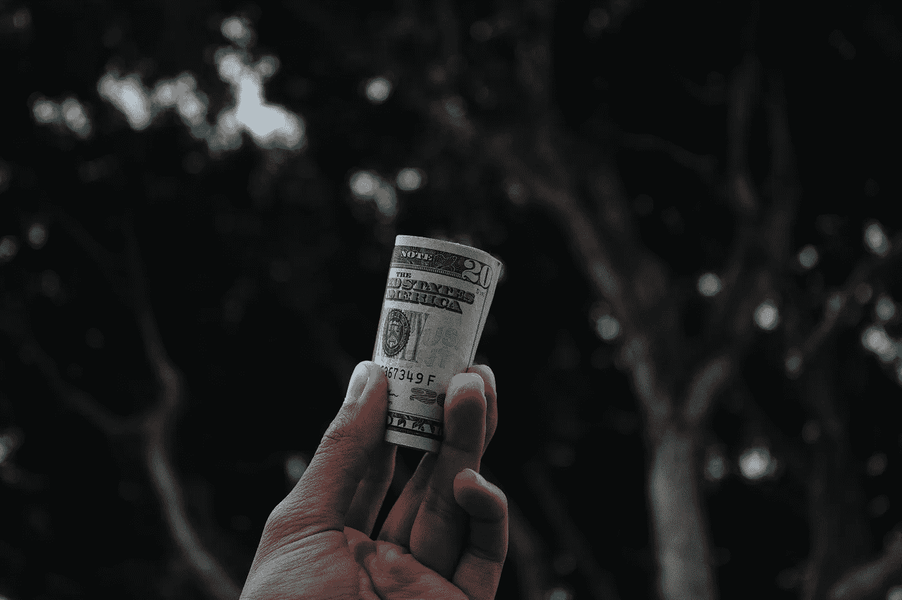

# 基本收入，无限机会

> 原文：<https://medium.com/hackernoon/basic-income-endless-opportunity-5c75225de5e2>

基本收入是提供给个人的定期付款，与收入或工作状况无关。它的目的是使个人获得能力和自由，并为所有人提供基本的财务自由。

这不是一个遥不可及的、50 年后的乌托邦式的概念。从肯尼亚到荷兰到加拿大，基本收入实验已经在世界各地展开。

虽然一般认为这是由公共部门经营和管理的事情，但我个人认为，我们很可能会首先看到私营部门采取重大举措，事实上， [Y Combinator](http://www.ycombinator.com/) 目前正在[进行一项有 100 个家庭参加的实验。](https://blog.ycombinator.com/moving-forward-on-basic-income/)

基本收入处于非常早期的探索阶段，随之而来的是[机会](https://hackernoon.com/tagged/opportunity)。无论它最终是由公共部门、私营部门还是两者共同推动的，我认为有很多潜在的领域初创公司能够提供帮助。

这些是我目前思考最多的问题，集中在三个方面:

# 分配

*   分配基本收入的最有效方式是什么？是否有机会为此目的创建一个 SaaS 并出售给所有基本收入提供者？
*   基本收入可以通过(甚至是专用的？)加密货币？
*   接受者和提供者之间会有什么层次的关系和沟通？这将如何管理？
*   区块链是如何被杠杆化的？
*   你能把你基本收入的 1%兑换/捐赠给别人吗？这怎么可能？

# 分析学

*   我们如何衡量基本收入的影响？
*   我们如何确定哪些领域/个人最容易/最需要首先推广？
*   个人如何跟踪他们如何使用/应该使用他们的基本收入？

# 创造

*   如果更多的人有空闲时间，什么爱好/过去会越来越受欢迎？(不一定是给定的)如何利用这些？
*   是否可以创造新的工作/任务类型，以迎合那些不希望全职工作，而只是依靠基本收入生活的人？
*   如何鼓励人们在获得基本收入的同时仍然工作？

这些问题中的大多数目前被视为障碍，或基本收入永远不会起作用的原因，然而，它们实际上是机会。

如果你也在思考这些问题，或者更好，已经找到了其中任何一个问题的答案，我很乐意与你联系~> neil (at) thenordicweb (dot) com 或 Twitter: [neilswmurray](http://twitter.com/neilswmurray)

> [黑客中午](http://bit.ly/Hackernoon)是黑客如何开始他们的下午。我们是 [@AMI](http://bit.ly/atAMIatAMI) 家庭的一员。我们现在[接受投稿](http://bit.ly/hackernoonsubmission)并乐意[讨论广告&赞助](mailto:partners@amipublications.com)机会。
> 
> 如果你喜欢这个故事，我们推荐你阅读我们的[最新科技故事](http://bit.ly/hackernoonlatestt)和[趋势科技故事](https://hackernoon.com/trending)。直到下一次，不要把世界的现实想当然！

