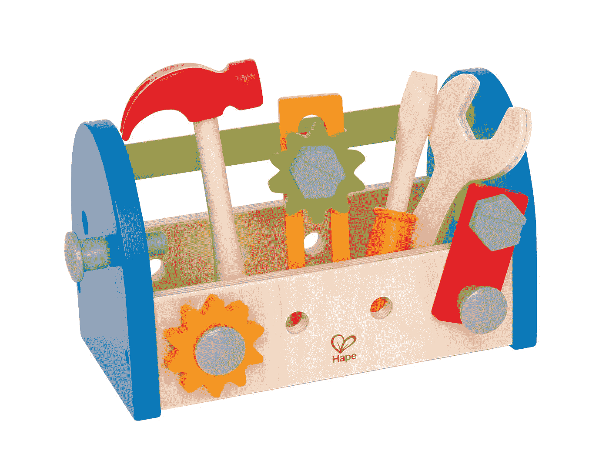

# 基本 javascript 算法工具箱:初学者工具包

> 原文：<https://medium.com/hackernoon/basic-javascript-algorithms-toolbox-starter-kit-dc2af3ceebad>

**TL；博士**:这里有一个经常有用的 [javascript](https://hackernoon.com/tagged/javascript) 快速编写算法的列表。

来自 ruby 背景的我，在学习 javascript 时经历了相当多的挫折。很多基本的方法，比如说`merge`、`flatten`或者`uniq`，在我看来都是缺失的。

然后我发现了 [lodash](https://lodash.com/) 这很酷…直到我发现在运行任何更新时，你必须非常仔细地看*看，冒着以非常不可思议的方式破坏东西的风险(当然这发生了；我让您想象一下，在 lodash 改变了一个方法之后，调试您的代码是一件多么愉快的事情，这个方法现在几乎(但不完全)与以前完全不同。如果你甚至没有意识到 lodash 在第一时间被更新，那就加分了)。*

几年后，由于新的 ES6 标准，事情看起来更容易了，我很少使用 lodash 或任何其他库来实现基本的算法。下面是我在编写代码时经常遇到的一些问题。

**免责声明**:我不会假装在效率或算法复杂度上打败 lodash。此外，lodash 肯定是一个令人敬畏的项目。下面的例子只是简单、易于编写的代码片段，对于足够简单的情况，它们可以快速工作；我们并不总是需要大枪。

哦，还有，下面所有的代码都遵守不变性原则。我们从不改变初始对象，而是返回一个具有所需属性的新对象。

希望它也能帮助你！

## Uniq 数组

这里的想法是从我们的值创建一个`Set`，然后将它转换回一个数组(如果需要的话):

unify an array, two ways are possible

在转换回数组之前，记住`Set`本身有一些有用的工具，例如`size`或`has`。

## 通过属性更新数组对象

这里我们更新数组中有`id: 3`的对象。

Of course, the “initial” const is remained untouched

## 通过属性从数组中移除对象

让我们从数组中移除带有`id === 3`的对象:

Again, initial stays untouched.

## 从对象中移除键

您可以反过来使用非规范化赋值:

## 将一组对象合并在一起

使用这段代码，我们可以将对象合并在一起，或者根据它们的属性更新它们:

reduce and spread operators work really nicely together

## 变平

on-level flattening of an array

## 来自巴黎

I like `[key, value]` denormalized assignment a lot :)

## 减去两组

Less frequent but still useful

## 结论

好了，现在就这样。不要犹豫，给我发更多的例子，甚至要求新的，如果你觉得我忘记了一些有用的算法！随着时间的推移，我很可能会更新这个列表:)