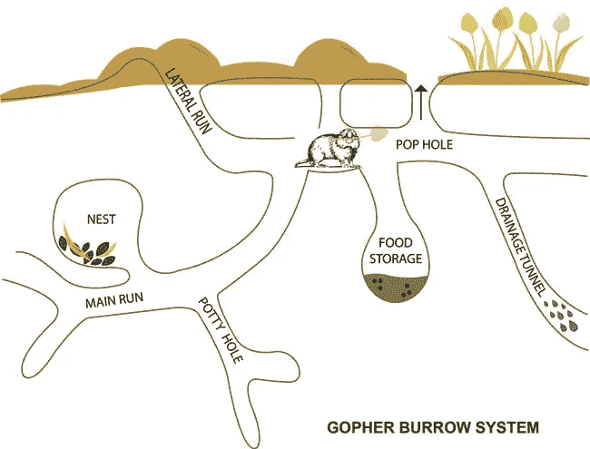

# Go 中的基本项目设计

> 原文：<https://medium.com/hackernoon/basic-monorepo-design-in-go-e9ba1cb8e4e6>



Gopher Nest Structure

**tldr** : *使用基本的 monorepo(所有服务代码的一个存储库)项目设计可以在构建许多服务时使开发更容易。*

# 背景

我在一家学习型公司工作，该公司有两个主要目标:

1.  帮助个人学习/发现与其组织需求相关的技能。
2.  帮助组织留住/接纳/培训个人。

为了实现这两个目标，我们公司收集、处理和分析了大量数据。这种数据挑战在许多从事企业级工作的公司中很常见。它需要一个坚实的数据管道基础设施，既要**快速**和**可扩展**，又要**可靠**。建造时有[设计](https://hackernoon.com/tagged/design)注意事项需要考虑。这篇博客文章将只关注这个管道的一小部分的高级视图。

# 为什么要用 Golang？

*   **可扩展性** : Go 在设计时就考虑到了简单性。只有 [25 个关键字](https://golang.org/ref/spec#Keywords)，只有一个循环(即`for`循环)，由于`go fmt`，所有代码都有一个共同的风格，等等。这种简单性允许团队意义上的可伸缩性。如果新的团队成员要开发用 Go 编写的应用程序，他们会更容易阅读和理解代码。这增加了帮助开发的程序员的数量。
*   **可靠性**:因为 Go 是一种强类型语言，它也有很好的错误处理机制，所以它能产生非常可靠的代码。Go 项目还有一个很棒的竞争检测工具，可以帮助识别可能的竞争情况。
*   **速度**:走的是[快](http://benchmarksgame.alioth.debian.org/u64q/go.html)。

# 为什么要使用服务和单向回购？

扩展团队不仅仅是选择一种每个人都能使用的语言。代码的组织方式必须便于查找和修改。这通常要求*代码彼此紧密联系*，同时具有*明确定义的职责*。

设计良好的 monoliths 可以完成这些任务，但是当设计模式出现分歧、职责不正确或者应用程序的特定部分过于耗费资源并导致整个应用程序停止运行时，它有时会停止工作。资源密集型部分是一些项目选择将代码分解成独立服务的原因。

服务(或任何你想称之为服务的东西)可能会遇到与整体项目相同的问题；然而，许多服务也分散在多个存储库中，这使得新的团队成员很难快速浏览整个项目。

数据处理对任务有各种各样的要求。一些任务可能需要快速的周转时间。其他人可能会收到需要几分钟处理的大量数据。由于这些任务的需求变化很大，使用服务是有意义的。可能还会有问题，但是基于它们各自的需求横向/纵向扩展各个流程要容易得多。最后一个问题是代码邻近性。在某些情况下， **monorepo** *(所有服务代码的一个存储库)*的概念可以减轻邻近性问题。对于许多 Go 服务经常共享类似包的场景，monorepo 的概念非常好。

# 设计

monorepo 项目设计与一揽子项目或小型项目相比有所不同。需要注意的是，这些设计建议只是建议。

## 文件夹结构

项目的结构对组织来说很重要。某人越快将项目视为一个整体，他们就能越快做出贡献。有了 Golang ,设计师们不再强迫一个文件夹约定，这样你的团队就可以利用他们的想法和偏好来找到解决方案。下面是一个 monorepo 文件夹结构的例子。

```
├──Makefile
├──Readme.md
├──cmd
│  ├──parser
│  │  └──parser.go
│  └──terminator
│     └──terminator.go
├──pkg
│  ├──apps
│  │  ├──parser
│  │  │  └──parser.go
│  │  └──terminator
│  │     └──terminator.go
│  ├──metrics
│  │  └──metrics.go
│  └──sentry
│     └──sentry.go
├──bin
│  ├──parser
│  └──terminator
├──scripts
│  └──deploy.sh
└──docs
   ├──components
   │  ├──sentry.md
   │  └──redshift.md
   └──apps
      ├──parser.md
      └──terminator.md
```

## 生成文件

当项目越来越大，越来越多的人开始贡献代码时，强迫每个人使用相同的命令就变得很困难。Makefile 可以帮助标准化一个好的快捷方式列表，供贡献者使用。以下是您可能希望包含在项目中的一些任务:

*   **构建**:为您的 go 项目构建二进制文件，并将其放在`bin`文件夹中。
*   **测试**:使用特定的标志或工具运行测试。使用 Go 的测试包，如果你的代码库变得非常大，你也可以指定测试组。
*   **部署**:运行一个部署脚本或触发器来部署一个特定的项目。将构建和部署任务分开通常是有意义的。您的 Makefile 总是可以指定一个特定的顺序来运行它们。
*   **清理**:清理旧的构建对象和工件。

## cmd 文件夹

cmd 文件夹是用来存放应用程序入口点(主函数)的。这些入口点文件负责设置和配置每个应用程序。

## **pkg 文件夹**

所有作为独立包没有意义的内部包应该放在一个 pkg 文件夹中。该文件夹中文件的组织将取决于您的组织。这里有一些通用的提示。

*   组织时牢记[亲吻原则](https://en.wikipedia.org/wiki/KISS_principle)。
*   团队经常会尝试用熟悉的语言文件夹风格来设计项目，但是重要的是要记住 Go 就是语言，为每个数据模型准备一个包可能没有意义。
*   让[通用包](https://blog.golang.org/package-names)命名为`utils`或`misc`对于不熟悉你的代码库的开发者来说是不清楚的。如果代码库变得足够大，开发人员甚至可能会忘记这些通用包中包含哪些函数，并最终添加重复的函数。
*   将一个包分割成具有良好名称的独立文件通常有助于组织，但是拥有 20 个只有 20 行长的文件可能没有意义，并且很可能会惹恼开发人员。有时候一个文件就够了。
*   设计一个包含所有错误类型的包似乎是一个很好的组织策略，但是它增加了包的复杂性，迫使开发人员从一个文件跳到另一个文件。

## **bin 文件夹**

对于许多项目来说,`bin`文件夹负责保存二进制文件。所以在这个文件夹中存储任何二进制文件是有意义的。尤其是我们编译的项目。

## 脚本文件夹

当与 Makefile 一起使用时，拥有一个专用于脚本的文件夹效果很好。团队可以拥有复杂的部署脚本，这些脚本触发多个操作，并将代码与 Makefile 分开。这使 Makefile 保持清晰和简单。

## 文档文件夹

每个 Go 项目都应该使用 [Godoc 的](https://blog.golang.org/godoc-documenting-go-code)方法，但是制作不包含在 Go 文件中的文档也有好处。对于不关心内部工作的用户，可以定制更高级别的文档。它们还可以包含部署过程、贡献指南和其他信息，这些信息包含在包文档中是没有意义的。

# 结论

这篇文章是作为一个关于项目设计的小意见而写的。它的目的是给出建议，而不是强制标准。随意表达不同意见或分享观点或想法。

如果你有兴趣了解我们公司的更多信息，请访问 Pathgather。

链接:

*   图片来自:[http://www.pcanimalcontrol.com/gopher-control-removal.php](http://www.pcanimalcontrol.com/gopher-control-removal.php)

[](http://bit.ly/HackernoonFB)[](https://goo.gl/k7XYbx)[](https://goo.gl/4ofytp)

> [黑客中午](http://bit.ly/Hackernoon)是黑客如何开始他们的下午。我们是 [@AMI](http://bit.ly/atAMIatAMI) 家庭的一员。我们现在[接受投稿](http://bit.ly/hackernoonsubmission)，并乐意[讨论广告&赞助](mailto:partners@amipublications.com)机会。
> 
> 如果你喜欢这个故事，我们推荐你阅读我们的[最新科技故事](http://bit.ly/hackernoonlatestt)和[趋势科技故事](https://hackernoon.com/trending)。直到下一次，不要把世界的现实想当然！

