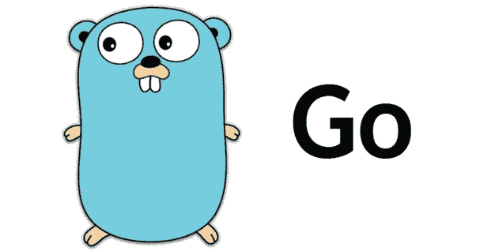
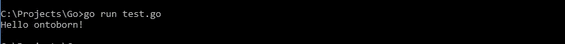
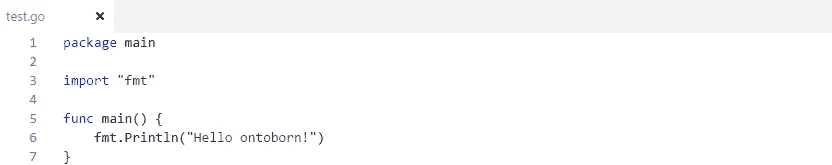
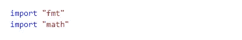
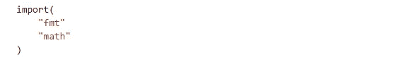
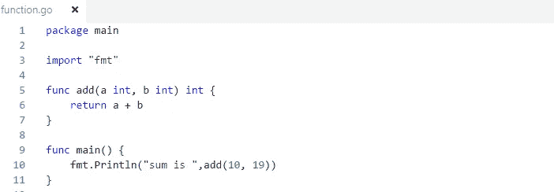
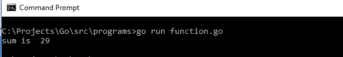

# Golang 基础[初学者]

> 原文：<https://medium.com/hackernoon/basics-of-golang-for-beginners-6bd9b40d79ae>

# Golang 是什么？

Golang 是一种编程语言，最初由 Robert Griesemer、Rob Pike 和 Ken Thompson 于 2007 年在 Google 开发。Go 编程语言是一种静态类型语言，语法类似于 c 语言。它提供垃圾收集、类型安全、动态类型功能以及许多高级内置类型，如可变长度数组和键值映射。它还提供了丰富的标准库。

Go 富于表现力，简洁，干净，高效。它的并发机制使得编写充分利用多核和联网机器的程序变得很容易，而它的新型系统支持灵活和模块化的程序构造。Go 可以快速编译成机器码，同时具有垃圾收集的便利和运行时反射的能力。它是一种快速的静态类型的编译语言，感觉像是一种动态类型的解释语言。

# Go 程序

一个围棋程序可以有 3 行到几百万行，它也应该被写入一个或多个带扩展名的文本文件中。去”；比如 hello.go，你可以用“vi”、“vim”或者其他任何文本编辑器把你的围棋程序写到一个文件里。

设置 Go 环境

环境设置可以分几步完成

**下载**和**安装**最新的 64 位 Go。从转到可安装的归档文件(它也为您设置了大多数环境变量)。

[点击这里下载](https://golang.org/dl/)

# 在 UNIX/Linux/Mac OS X 和 FreeBSD 上安装

将下载的归档文件解压到/usr/local，在/usr/local/go 中创建一个 Go 树。例如:

tar-C/usr/local-xzf go1.4.linux-amd64.tar.gz

将/usr/local/go/bin 添加到 PATH 环境变量中。

Linux export PATH = $ PATH:/usr/local/go/binma export PATH = $ PATH:/usr/local/go/binfreebsexport PATH = $ PATH:/usr/local/go/bin

# 在 Windows 上安装

使用 MSI 文件并按照提示安装 Go 工具。默认情况下，安装程序使用 c:\Go 中的 Go 发行版。安装程序应该在 windows PATH 环境变量中设置 c:\Go\bin 目录。重新启动任何打开的命令提示符，以使更改生效。

**验证安装**

现在运行测试，查看结果:

# Golang 入门

# 包装

每个围棋程序都是由包组成的。

程序开始在主包中运行。

该程序正在使用导入路径为“fmt”的包

这里有一个例子

# 进口

我们可以把进口写成

或者

# 功能

Go 编程语言中函数定义的一般形式如下:

一个函数可以有零个或多个参数。

在下面的例子中，add 接受两个 int 类型的参数。

注意，类型出现在变量名之后的*。*

现在运行这个函数。去看看结果

# 变量

变量定义意味着告诉编译器为变量创建存储的位置和数量。变量定义指定了数据类型，并且… [继续阅读](https://ontoborn.com/blog/golang-hire-developers/)

> [黑客中午](http://bit.ly/Hackernoon)是黑客如何开始他们的下午。我们是 [@AMI](http://bit.ly/atAMIatAMI) 家庭的一员。我们现在[接受投稿](http://bit.ly/hackernoonsubmission)并乐意[讨论广告&赞助](mailto:partners@amipublications.com)机会。
> 
> 如果你喜欢这个故事，我们推荐你阅读我们的[最新科技故事](http://bit.ly/hackernoonlatestt)和[趋势科技故事](https://hackernoon.com/trending)。直到下一次，不要把世界的现实想当然！

