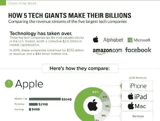
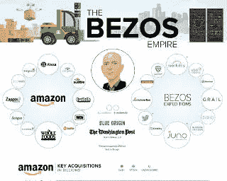

# 交战时代的战斗

> 原文：<https://medium.com/hackernoon/battles-in-the-age-of-engagement-c05d5cad98d5>

**(系列之二—** [**全球科技投资海啸背后**](/@hchawlah/behind-the-global-tech-investing-tsunami-1b8d37c76030) **)**

Battles in The Age of Engagement[By [Krzysztof Kamil](https://pixabay.com/en/male-night-the-darkness-light-2013929/) under [Creative Commons](https://creativecommons.org/publicdomain/zero/1.0/deed.en)]

> 如果事情看起来在控制之中，你只是走得不够快——马里奥·安德烈蒂

想象一下你不得不在脸书、谷歌、亚马逊和微信上下注。你会把钱放在哪里？从表面上看，脸书每月有超过 20 亿用户登录该平台，并投入数十亿小时。谷歌也是如此。这些看起来很诱人。

相比之下，亚马逊的平台上只有大约 3 亿多用户。没什么可写的。然后是苹果。虽然它有着标志性的地位，但这一事实不容否认，它是在史蒂夫·乔布斯钢铁般的目光下诞生的。许多人认为，该实体现在看起来疲惫不堪。

至于微信，虽然它拥有令人印象深刻的 9 亿多用户，但所有用户都局限于中国——对于投资者来说，这是一个不为人知的地理位置，除了环绕它的象征性的长城之外。

至少在理论上，脸书和谷歌应该是你投资的领跑者。为什么不呢？有了这样的规模，几乎每个实体都想接触脸书和谷歌上的观众。为此，他们打广告。两家公司的大部分收入都来自这些广告收入。

但是如果我们换个角度来看呢？

尽管拥有 20 亿用户，脸书的收入却高达 280 亿美元。简单来说，它每个月从每个用户身上只赚 1.6 美元。谷歌也差不多。这是否意味着这些是非常低效的实体？他们做得好的原因仅仅是因为他们能与人交往的规模吗？

然后，有证据清楚地表明，从互联网广告到购买的转化率下降到较低的个位数。除此之外，还有一把即将到来的利剑，叫做广告拦截器。它正在世界许多地方的立法中找到自己的路。那么，脸书和谷歌的商业模式有可能受到威胁吗？

与此相反，亚马逊是为了完成工作而建立的。直截了当地说，它打开了达成交易的大门。它不会像脸书那样让我去搜索别人发布的内容，也不会像谷歌那样把我重定向到其他地方。相反，它鞭策我，直到我买了东西。这是为了融入我的生活。它能做得更好的唯一方法是，亚马逊上的每笔交易都变得更容易、更便宜，直到它变得“不可替代”。

苹果公司也是如此。它建立了一个邪教般的生态系统，将近乎完美的硬件和不那么近乎完美的软件结合在一起。但是在工作中很难模糊两者之间的界限。并最终在消费者和设备之间传递。

五大科技巨头如何赚钱**。单击或点击图表进行查看。来源:【www.visualcapitalist.com**

**那么有没有可能想象一个 [*的未来*](https://hackernoon.com/tagged/future) *我生活在一个亚马逊或者苹果设计的世界里？脸书和谷歌有没有可能是失败者？***

> **科技巨头之间酝酿的战争有能力重塑每一个市场和行业，甚至我们的生活**

**科技巨头之间酝酿的战争有能力重塑每个市场和行业——甚至我们的生活。例如，如果苹果公司在其手机上开启一个微小的支付功能，创建一个虚拟信用卡，它将立即拥有 6 亿用户。这个基数超过了前 10 大信用卡公司几十年来的积累。一瞬间全没了。对零售商和银行家的威胁就在此时此地。但是他们不是唯一的。[技术](https://hackernoon.com/tagged/technology)驱动的创业公司在每个市场的边缘等待着。等待摧毁和创造一个新的范例，一套新的做生意的规则。**

# **重写规则**

**在过去的几年里，科技公司颠覆了公认的智慧，在十大公司中占据了主导地位。**

**在过去的一个世纪里，两个经济概念主导了商业战略的基础，以及公司如何考虑扩大他们的护城河。**

****1。规模经济:**随着经营规模和产量的上升，单位成本下降。因为固定成本分散在更多的产出单位上。这种节约提高了利润。**

****2。范围经济:**简而言之，当企业多元化进入互补的产品范围时，这也给了它成本优势，因为它能够更有效地利用其能力和资产。这些能力包括无形资产，如品牌建设和分销。因此，如果我是一个在肥皂行业实现了规模经济的玩家，我还不如去卖洗发水、牙膏、洗涤剂、剃须系统甚至电池。**

**现代帝国——最大的全球性公司——就是建立在这种智慧之上的。**

**停泊在这两个概念，公司创造了竞争优势，他们认为是无懈可击的护城河。即使在今天，经理们也是基于这些原则做出日常决策的。**

**他们错了。**

**技术消除了这些护城河。**

**消费者互联网业务具有自然的规模经济和范围经济。利用互联网的先天力量实现近乎即时的规模，这是他们 DNA 的一部分。当你把一些火箭燃料(理解为风险资本)注入其中时，它可以让一家企业迅速服务于数百万消费者。捆绑相邻的产品(read: scope)就像用几个像素编程一样简单。风险资本家(VC)寻求产品与市场的契合度。一旦这一点在一小部分用户身上得到证明，人们就认为注入不成比例的资本将会打破市场结构。事实证明这是真的。**

**通过智能手机接触消费者的成本几乎为零。有了网络效应，企业可以把它推到负面地带——消费者邀请他们的同行，平台就自己成长。例证:拥有 35 名员工的 WhatsApp 在短短 4 年内发展到近 6 亿用户。当它被脸书以令人难以置信的 220 亿美元收购时，它的收入约为 1000 万美元。如今，每月有 12 亿人使用它。WhatsApp 单枪匹马摧毁了全球许多电信公司的短信收入，尤其是在印度。**

# **致命的弱点**

***我前面提到的肥皂公司 Proctor Gamble 是一个 800 亿美元的庞然大物。它现在每年向 40 亿人出售 400 亿单位的消费品——这几乎是全球所有成年人的数量。然而，它与他们没有直接关系。***

**你可以把这个镜头应用到几乎所有的传统公司，这些公司对他们认为是战略资产的东西——生产和分销——建立了控制。他们利用自己的议价能力建立庞大的实体品牌和网络。然而，他们很少接触到他们的最终客户。这就是问题所在——去中介化几乎不需要什么，创业公司正在攻击这个弱点。**

**它每天都在发生，发生在每个部门。**

**现有企业无法应对对其“旧世界”商业模式攻击的残酷速度和爆炸性。他们自己的规模和范围有时就像负重，他们无法适应技术润滑的丛林现在要求的速度和敏捷性。**

**这就产生了一个悖论:当公司发展得更快更大时，它们也在死亡。自 2000 年以来，财富 500 强中超过一半的公司已经消失。**

**以沃尔玛和亚马逊之间传说中的[战争为例。尽管沃尔玛拥有巨大的品牌遗产和规模，但它与顾客的关系却很薄弱。忠诚度计划是其维系客户关系的唯一层面。](http://knowledge.wharton.upenn.edu/article/amazon-vs-walmart-one-will-prevail/)**

**另一方面，亚马逊与其客户有着深厚的关系。它确切地知道他们买什么，什么时候买，愿意付多少钱。它创造了过多的服务来吸引用户:Prime、Prime Video、Amazon Dash、Amazon Go、Alexa 等等。所有这些都旨在增加与客户生活的互动深度。**

****

**贝佐斯帝国。单击或点击图表进行查看。来源:www.visualcapitalist.com**

**这种对客户的关注催生了一种“选择性”，远远超出了任何传统企业的想象。亚马逊利用数据将自己融入消费者的生活，并正在重写如何建立一家公司的书。**

**因此，如果你认为沃尔玛正在与亚马逊争夺消费者零售支出的份额，你是对的。但是如果你认为亚马逊的人在和沃尔玛竞争，你就错了*。亚马逊正在为顾客设计一种新的生活方式。***

# **新护城河**

**与消费者的互动正在成为新的护城河。亚马逊不是在玩规模经济和范围经济。它用第三种武器作战，我称之为 ***交战经济*。这些是他们制造出来让我们上瘾的钩子。****

**市场可以看到这一点。尽管沃尔玛的规模大约是亚马逊的 4 倍，而且[一年赚的钱比亚马逊 21 年来赚的钱还多](https://revenuesandprofits.com/amazon-vs-walmart-revenues-profits-1995-2015/)沃尔玛的市值却只有亚马逊的一半。**

**同样，当亚马逊收购全食超市时，这是参与的力量在发挥作用——这赋予了亚马逊独特的能力，可以无缝地将其客户从在线世界“转移”到线下。全食超市的收购不仅仅是一家在线零售商涉足线下。这已经过去了——十多年来，阿里巴巴一直在收购线下零售商，却没有取得什么成果。**

> **控制与消费者的关系比潜在的交易更有价值**

**从敬业度的角度来看，这份工作并不是去线下开店。这项工作是推动顾客访问它。如果他们已经在网上参与，商店就成了力量倍增器。它允许亚马逊在线下和线上世界之间无缝地输送客户。对于消费者来说，线下商店现在是一个连接的、活的、适应的、物理上可接触的点。每位首席执行官都越来越清楚的是:*控制与消费者的关系比潜在的交易更有价值。***

**一些现任者确实意识到了这一点，并正在加紧准备。**

**联合利华斥资 10 亿美元收购了 Dollar Shave Club(一家直接面向消费者、由技术驱动的剃须产品公司)。Dollar Shave Club 了解其客户并有能力吸引他们，这一事实是联合利华能够打入吉列(一家 P&G 公司)享有的高达 70%的市场份额的一个楔子。这迫使吉列公司宣布，它将削减高达 20%的剃须价格，以应对美元剃须俱乐部及其同行。很明显，吉列被包围了。**

# **参与经济内部**

**上周，当我参与全球科技投资海啸后，我深入研究了为什么科技公司的估值与传统公司不同。投资者认为，拥有规模和范围护城河的传统企业总是会受到攻击。但当涉及到科技公司时，他们押注于自己扩大周围护城河的能力。**

**这里有一种新的经济学在起作用。唯一能涉足其中的是嵌入技术的公司。这给了他们每个人一个优势——进入他们选择的任何行业的能力。这就是为什么他们发展得如此之快。但这也意味着他们必须相互激烈竞争。**

**这些公司现在面临的问题不是如何颠覆传统业务，而是如何不被像他们一样灵活的科技公司击败。为了解决这个问题，他们必须回答一个基本问题:我建立的网络上有数百万人。我现在能做些什么来留住他们？**

**这些公司一直生活在恐惧之中，担心自己变得无关紧要。他们互相推挤以吸引用户的注意力。结果不确定。为了理解这一点，花点时间看看这些令人麻木的数字:**

*   **脸书网络拥有 WhatsApp(12 亿用户)、Facebook Messenger(12 亿用户)和 Instagram (7 亿用户)。这还不包括 20 亿脸书直接用户。**
*   **除了 Android 上的 20 亿活跃设备之外，谷歌还有七项服务，月活跃用户超过 10 亿。**
*   **YouTube 每天提供 10 亿小时的视频。**
*   **苹果拥有超过 10 亿台活跃设备。**
*   **微软声称有 12 亿人使用其办公产品*。***

**这些公司吸引消费者的规模令人震惊。普通美国人每天花五个小时在移动设备上。我怀疑，对于中国和印度的消费阶层来说，这个数字甚至更高，因为智能手机是他们与世界的纽带。**

**除了每天都有数十亿人使用它们之外，这些科技公司之间几乎没有什么共同点。人们在其平台上的每次访问、浏览、点击或购买都会留下痕迹。他们的工作是收集这些痕迹，因为其中蕴含着某种价值。我这么说是什么意思？实际上是一些事情。**

**让我们以亚马逊为例，看看它是如何创造参与经济的。**

****1。富足的心态****

**"削减固定成本，使其可变."这是每个会议室的口头禅。**

**传统公司希望通过削减固定成本来降低平均成本，并使其可变，以便能够对需求的变化做出反应。但科技公司并不担心他们创造需求的能力——他们与客户的深厚联系使他们能够扩大和控制需求。**

> **在这个世界上，规模经济和范围经济从属于参与经济**

**相反，他们投资将新服务融入他们的订婚戒指中，以此来绑定他们的客户。对他们来说，固定成本和基础设施是创造可能性的一种方式，也是一条更深、更宽的护城河。因此，你听到的是对基础设施和研发领域惊人投资的报道。**

**在这个世界上，规模经济和范围经济从属于参与经济。**

**亚马逊完全知道如何根据数据激励用户访问附近的 Amazon Go 或 Whole Foods 商店。它可以做出准确的评估和策划需求——这是 Whole Foods 作为一家独立企业永远做不到的。**

****2。我喂平台，然后它吃我****

**他们与消费者的交易不是关于他们卖什么，而是关于他们的习惯能收集到什么样的[数据。消费者认为服务是免费的，但他们是通过自己的行为信息付费的。](http://fieldguide.gizmodo.com/how-to-see-everything-your-browser-knows-about-you-1789550766)**

**科技公司研究行为。这样做了之后，他们试图塑造他们的产品，直到它们像第二层皮肤一样适合消费者。**

**例如，亚马逊 Prime 是一个忠诚度计划，在这里你*支付*来获得*自己*锁定。你为这项服务支付的 499 卢比并没有削弱亚马逊在印度的财务状况，该公司在印度投入了数十亿美元。但是你的大脑会欺骗你去考虑这些钱的“沉没成本”,让你继续从亚马逊购物。**

**很快就形成了一种习惯——你会停止查看 Flipkart，甚至不会比较价格。亚马逊建立了庞大的固定基础设施来服务它的主要客户，反过来，它的主要客户给了它如此多的业务，这使得固定投资变得可行。但是忘了它吧。真正的附带好处是，你会与亚马逊交易如此多的数据，以至于你会发现很难切换。**

**杰夫·贝索斯甚至表示，不加入 Prime 是对消费者“不负责任”的行为。贝佐斯在给股东的一封信中写道:“我们希望 Prime 如此物有所值，不成为会员是不负责任的。”。“Prime 已经成为会员们喜爱的“吃到饱”的物理-数字混合体……很有可能你已经是他们中的一员，但是如果你不是——请负责任——加入 Prime。”**

****3。拥有选择权而非交易权****

**他们不希望你发信息，购买，骑行或搜索。他们希望你用 WhatsApp、亚马逊、优步、谷歌、网飞。**

**亚马逊知道价值不在购买的交易中。它存在于早期进入消费者的购买过程，当他们开始搜索一个产品，正在查找评论并试图做出决定。因此，其平台上的内容和评论越公正、越有用，就会有越多的人在做出决定之前来找它。去年的一份报告称，55%的网购者在亚马逊而不是谷歌上开始他们的产品搜索。**

**因此，亚马逊的定价能力和粘性不仅仅来自于其大量的产品种类，而是来自于它正在迅速成为产品搜索的首选。这是不可避免的，然后它成为购物的地方。这甚至让它在广告业务上占据了优势，因为它可以提供与谷歌和脸书相比的综合购买体验。**

**为了进一步挤压参与价值，该公司正大举投资自有品牌。亚马逊上销售的 90%以上的电池都是自主品牌。这证明，消费者乐于放弃老字号品牌，转而青睐一家他们每天都与之打交道的公司。顺便说一句，被亚马逊自有品牌伤害的品牌是金霸王，讽刺的是归宝洁所有。**

**同样，微信是参与经济的一个进化例子。它拥有近 10 亿中国用户，他们用它做各种事情，从预订课程、出租车到投资共同基金。它为消费者创造了一个虚拟操作系统:他们可以完全在微信上操作自己的生活。**

**这篇摘自彭博文章的节选让你感受到平台和微信生活方式的力量。**

**微信现在有 9.378 亿活跃用户，其中超过三分之一的人每天花在这项服务上的时间超过 4 小时。从这个背景来看，全世界的普通人每天花在脸书、Instagram、Snapchat 和 Twitter 上的时间加起来略多于一个小时。腾讯的服务在中国如此普及，以至于那里的初创公司很难拒绝与该公司结盟或接受该公司的投资。北京咨询公司 Red Pagoda Resources LLC 的创始人兼总裁安迪·莫(Andy Mok)说:“这有点像教父堂·科利昂(Don Corleone)说，‘我会给你一个你无法拒绝的报价。如果你不拿他们的钱，而他们投资于竞争对手，这可能是致命的。"**

# **一把双刃剑**

**酪人类的注意力是一种稀缺资源。随着多种设备和多种模式的消费内容，注意力被分散了。每一种新设备、新技术或新应用都会让注意力之战变得更加激烈。而且很贵。**

**然后还有第二个挑战:使用互联网或智能手机对大脑来说是一种负担。这是因为你使用互联网或智能手机的方式与你消费电视或广播等其他电子媒体的方式明显不同。后者是“向后倾斜”的媒介。他们可以在后台玩。用户可以随时选择使用它。观看或聆听它们不会对你的大脑提出任何要求。**

**与此相反，互联网和智能手机是“向前一步”的媒介。从中消费需要努力。你必须轻敲或滑动手机，它可能会做一些事情。它坚持要你做出回应，这消耗了你的注意力。他们给大脑施加了神经科学家所说的认知负荷。**

**所以，用户生活在他们有选择权的错觉中。但是要做出选择，他们必须通过前倾来消耗能量。只有这样做了，他们才能“向后靠”，让电影或音乐流。**

**但是大脑渴望熟悉和控制；你寻找捷径。**

**这解释了为什么一个人的设备上可能有 50 多个应用程序，平均来说，8-10 个应用程序占了最大的消费。这些不可避免地是那些简单、熟悉并提供奖励的游戏，比如可以得分的游戏或社交媒体，其中每一个分享都可能引起回应，相当于奖励性的多巴胺点击。**

**为了让事情变得简单，人们从他人那里得到应该把注意力引向哪里的暗示。事情就是这样传播开来的。突然之间，《T2》的《权力的游戏》被下载了 10 亿次，或者《T4》的《口袋妖怪 Go》以史无前例的速度达到了 1 亿人。**

**这些对我们注意力的自然限制给科技公司带来了一个生存问题:只有消费者让他们的应用程序在他们的设备上保持活跃，他们的业务才会存在。当用户的注意力转移到其他东西上时，公司就变得无关紧要了。**

**在这种程度上，用户的注意力是他们唯一的竞争优势。这就是为什么网飞必须了解每个用户看什么电影和电视节目，以及他们如何选择。这有助于它创建一个他们觉得最舒服的界面。反过来，它可以设计创造一些东西来降低认知负荷。**

**如果它能成功做到这一点，它将对商业模式产生重大影响。**

**一部典型的电影被设计成留出 40%的预算来吸引观众进入电影院。电影公司最大的风险因素之一是，虽然它可能创造出引人注目的内容，但它可能无法很好地营销这些内容。当它不得不花重金在轰动一时的明星身上以吸引观众时，风险就变得更大了。**

**然而，如果网飞能玩“参与经济”游戏，就能颠覆电影制片厂的业务。这意味着，嵌入到其商业模式中的是以几乎可以忽略不计的成本驱动观众观看电影的潜力。一部电影的成功取决于执行和故事的好坏，而不是演员阵容的表面价值。因此，它可以用独立制作公司一半的风险制作电影和电视剧。**

> **一旦你能支配客户的注意力，你就能支配生意**

**网飞意识到了这一点，并建立了一个预算，成为世界上最大的制作工作室。在所有其他因素保持不变的情况下，网飞创造一部热门电视剧或电影的概率高于世界上任何其他工作室。**

**一旦你能主导客户的注意力，你就能主导业务。它释放了新的雄心——正如你可以在这篇关于网飞的文章中读到的。新的雄心为投资者提供了选择的机会——投资者愿意将网飞的估值定为 700 亿美元，这反过来又进一步刺激了它的雄心。**

**每个科技巨头都有类似的剧本。他们的参与增加了期权性，这增加了投资者愿意支付的钱，这增加了他们创造更多参与和期权性的雄心。**

**这种界限的模糊随处可见。你会发现脸书正在争夺比 YouTube 更多的视频浏览量。然后 Snapchat 作为一个竞争对手出现了，两者都需要小心——它可以通过使视频成为对话的一部分来扰乱视频。Twitter 购买 NFL 转播权——这一切都是为了保持相关性。**

**他们的目的是排挤你注意力的其他聚集者。事实上，他们现在正把这种努力带到另一个层次，并试图看看他们是否能成为你注意力的唯一收集者。这将这些科技公司带入了有趣的新方向。**

# **成为独一无二的战斗**

**目前，你的注意力有两种形式，文本和视频——以及一个带屏幕的设备。**

**但屏幕是一个自限性的命题，争夺屏幕上的每个像素是一场昂贵的战斗。**

**科技公司在问这样一个问题:我能不能以向后倾斜的方式与消费者互动，这样就不会有认知负担，互动也不会那么费力，从而成为一种习惯？**

**他们能退居幕后，变得无所事事，然后简单地完成交易吗？他们能通过预测你的愿望并成为每件事都向你收取少量费用的星期五人来赚钱吗？算法上相当于 PG Wodehouse 小说中的 Jeeves，他可以解决他主人的每一个问题，甚至在他知道他有这些问题之前。**

**这种推动来自广告驱动的公司，如脸书和谷歌。他们面临着一个悖论:为了从你的注意力中赚钱，他们不得不将你的注意力转移到他们正在兜售的广告上。但这是一种效率极低的做生意方式。这迫使他们走一条很细的线——他们必须找到一种方法，从消费者的注意力中获取如此少的价值，以至于他们的中断不会破坏连接。**

**他们通过向你提供广告赚取的数十亿美元正受到威胁，因为消费者非常擅长忽视广告。他们发现“向前倾斜”的注意力是极其昂贵的。处于前倾模式的人想要做他们计划要做的事情，然后离开。广告驱动的模式是不可持续的，尤其是新玩家威胁要创造无广告、智能的信使机器人来完成工作，而不是向你展示广告。**

# **我不需要看设备，它会看着我**

**所以，我们的目的是让科技同时隐形和智能。机器会关注你，准确地解释你需要什么，并使之可用，而不是你关注设备(这在你的认知感官上是“昂贵的”)。**

**这就是为什么人工智能(AI)已经从我们的实验室中卷土重来。**

**但是我怎样才能时刻、完美地为你服务呢？这又增加了一个障碍——了解你的背景，知道你在做出选择之前和之后通常会做什么。这样我就能预料到。目的是让你的人工智能支持的语音和手势激活的助手在你要求之前理解你需要什么。它不应该让你听无止境的选项菜单。(想象一下，向前倾听，然后回忆起你的语音助手正在建议的选项——那将是真正的“向前倾”！)**

**让计算变得环境化，他们挖掘的信息越来越亲密。他们正在超越屏幕、手机、手表，然后是你家里和车里的环境。他们将在你的家中部署设备(查看苹果的 Homecenter 或亚马逊的 Alexa)。**

**他们可以准确地知道你在寻找什么，因为他们现在正在跟踪你的生活，而不是你的眼球。我们周围的设备(在家里、车里或办公室里)会尝试并预测我们的需求。这并不像听起来那么复杂:虽然我们的需求对我们来说是独特的，但我们在很多方面都比我们想象的相似。我们是习惯性的生物，模仿他人的生活。(快速提示:耐克鞋或安德玛 t 恤吸引数百万人的原因。)所以，数据通常可以帮助机器学习算法预测我们想要什么，并推动我们走向合适的产品。**

**他们正无情地占据你的注意力。对他们来说，最甜蜜的时刻是当他们成为你生活中看不见的一部分。**

**这是这些科技巨头正在进行的战斗。能主宰你生活方式的，才是赢家。这将催生数万亿美元的公司。对他们来说没有边界。**

**从十大科技公司的计划中已经可以看出这种想法的轮廓:*他们将制造汽车，驾驶无人机，在商店里销售，帮你导航，送货上门，为你播放音乐，推荐电影，保持健康，检查你的健康。你生活中没有他们不想要的部分。***

**谷歌、特斯拉、苹果和优步都在争相成为汽车公司。脸书、亚马逊、网飞、苹果和 YouTube 都在争相成为你的娱乐目的地。网飞表示，它唯一的竞争对手是 sleep，而不是亚马逊、HBO 或苹果。脸书想拥有自己的新闻，创建一个虚拟现实生态系统，推出一个信使机器人来帮助你与企业互动和在线购物。这样的例子不胜枚举。**

**亚马逊的愿景是最雄心勃勃的:将其语音服务嵌入每一个可能的家庭，从而降低设备、操作系统和应用层的重要性(这并非巧合，因为这些层也是亚马逊最薄弱的层)。**

**拥有你的注意力是圣杯。环境和无形计算是实现这一目标的手段。这就是所有玩家在语音和人工智能上下大赌注的原因(当我写这篇文章时，阿里巴巴宣布了一种新的语音设备)。**

**消费者只想要三样东西——产品、服务和体验。能把这三者结合起来的公司将最终占据主导地位。**

**十有八九，赢家将是一个总数。因为你的家人，你的家务助理，甚至你的狗最终会选择并花费他们的注意力只训练一只。那家公司将管理你的生活，即使你生活在你掌控它的印象中。**

> **— — — — **结束****

# **等等，但是……**

*****1。它会让我们所有人都成为设备迷吗？*****

**我的猜测是，不会。我认为世界正在从移动优先转向人工智能优先。“装置”的概念将会消失。相反，我们将有一个智能的“助手”——无论它是什么形状——它将帮助我们更快地完成工作，而不会干扰我们的注意力。当你错过健身的那一周，你的“助手”储备了健怡可乐而不是普通的那种，不要感到惊讶。**

****2*。数字经济发展的方式有负面影响吗？*****

***有，有。人们开始意识到算法基于我们“喜欢”的东西推送视频、文章、想法和产品的黑暗面。比如恶作剧视频？算法会源源不断地输出。麻烦的是，它无法区分恶作剧视频和仇恨视频。它是为了参与而优化的，而不是为了公平或准确。例如，脸书算法的唯一目的就是让我们逗留并点击广告。***

***此外，通过为我们做出选择，it 正在成为我们如何花费时间和金钱的看门人，甚至是我们选择谁作为我们的影响者。该算法拾取并放大我们的偏见，使用关于我们偏好的数据来创建一个回音室，这只会加深我们的偏见，因为我们最终会看到更多证实这些偏见的事件。我们在社交媒体上看到的极端和异常行为是这种“参与优化”的结果，现在正渗透到现实生活中。美国总统选举以及随后围绕假新闻和社交媒体的喧嚣只是冰山一角。***

*****3。在职人员呢？对他们来说已经是一场输了的比赛了吗？*****

***不一定。我这样说有两个原因。***

***第一，如果一家公司能够提供强大的体验，并展示其存在的强大理由，科技公司将很难取代它。典型的例子是:服装巨头 Zara，它利用速度和商店的新鲜感作为女性沉迷于 Zara 商店“体验”的一个令人信服的理由。尽管科技公司拥有不公平的优势，Zara 仍继续蓬勃发展。***

***因此，要么你是一家强大的特许经营商，开始利用技术与客户沟通，要么你屈服，成为一家供应商，利用这些网络的力量。夹在中间是艰难的。他们需要学会将枪口对准科技公司，通过巧妙利用科技提供的访问权限，将它们商品化。这很难，这将要求他们重新构建自己的业务，像联合利华支付巨额估值收购 Dollar Shave Club 时那样，做出艰难的决定。***

**这场游戏没有失败的第二个原因是，监管机构开始反对科技公司行使限制性权力。**

**每当你在网上留下痕迹，脸书和谷歌就能赚到很少一部分钱。他们通过 4000 多家广告技术公司相互出售你的数据，他们放大了数百万页的广告清单，希望人们会点击。点击率极低，它想出了更聪明的算法来利用你的注意力。**

***随着谷歌和脸书的算法变化，许多公司已经死亡。由于客户只需点击一下鼠标就能做出另一个选择，监管机构迄今为止一直认为这些方法不是限制性行为。但这还没有考虑到带来限制性权力的接合锁定。***

***这一切都在改变，尽管速度缓慢。欧盟监管机构因谷歌滥用竞争法对其罚款 23 亿美元，这是对谷歌的第一次警告。这种反竞争行为将在一个又一个行业上演，其影响将是深远的。在不久的某个时候，政府将不得不提高警惕，保护他们的公民。***

***原载于*[*www.foundingfuel.com*](https://www.foundingfuel.com/article/battles-in-the-age-of-engagement/)*。***

***建议阅读***

** [## 印度的数字经济如何重新找回它的魔力

### 印度可以说是世界上最有前途的互联网市场。它吸引了超过 200 亿美元的全球风险投资…

medium.com](/@hchawlah/how-indias-digital-economy-can-rediscover-its-mojo-9cd120d218a7)  [## 欢迎来到腾讯的 Flipkart，亚马逊的新对手

### “敌人的敌人就是我的朋友”

medium.com](/@hchawlah/welcome-to-tencents-flipkart-amazon-s-new-adversary-afd66e69cdfd)**