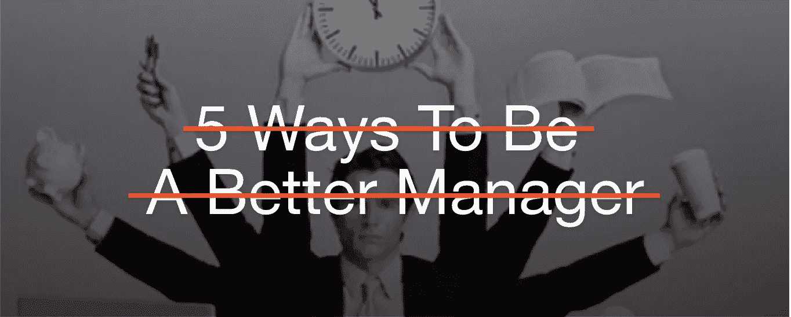

# 忘记“成为更好经理的 5 种方法”…

> 原文：<https://medium.com/hackernoon/be-a-better-manager-112c7397e5e4>

## 这是唯一一个真正重要的。

没关系，我们都这样做…

我们在浪费时间阅读一篇又一篇关于成为更好的经理/领导者/企业家/销售人员/营销人员/开发人员等的文章。

让我们今天结束这一切。

# 😲 😗 💨

## 深呼吸，相信自己。

面对现实吧，你已经知道那 5 件事了。它们和上次一样，但是你就是不能…抗拒…那个…咔嚓…

所以，关键在于:忘掉“成为更好经理的 5 种方法”。事实是，你已经知道至少 20 种方法，此外，知道从来都不是最难的部分。

最难的部分是*在你*已经知道的*上表演*。它是在我们生活的无时间、被动、零收件箱、永远在线、永远忙碌的工作场所中，每天找时间做那五件事。

# 🤔 ☝️

## 真正重要的是什么？做一些事情。

不用担心领导需要重点关注的高层模棱两可的话。专注于做*某事*。

做一件小事并不难。有时候，惯性会接管，这看起来像是一项艰苦的工作，但你可以做艰苦的工作，对吗？

找到一件你今天能做的事情，它会让你的状态提高 1-2%，最多。然后揭开明天的下一件事。

就是这样。仅此而已。没有更多的时间阅读，没有更多的时间分析，只是更多的时间做。然后在今天的基础上复合明天的行为。你专注于做的习惯，让[复合数学让你在年底成为 38 倍](http://jamesclear.com/continuous-improvement)更好的经理/领导/老板等。

# 💪 📈

## 这是你今天要做的事情

把这句话记在脑子里:下次你看到一篇告诉你如何成为更好的领导/经理/老板等的媒体文章时。

1.  停下来。
2.  关闭该选项卡。
3.  问你的团队一个关于你/你的团队如何改进的问题。([以下是其他经理评出的 10 个最佳提问问题](https://www.linkedin.com/pulse/top-10-questions-managers-asking-during-11-meetings-1-mceachran)。)

听他们的，不要听那些随意的博客帖子。你会惊讶于自己是如何神奇地成为一名更好的经理的。

让这成为每天的习惯…很快你就会发现自己在无数方面提高了自己和你的团队。

**完全披露:**我们制作了一个 [slack bot](http://soapboxhq.com/goodtalk) 来帮助你进行这种类型的对话。如果你的谈话陈旧、不一致或者没有条理，你现在应该尝试 [GoodTalk](http://soapboxhq.com/goodtalk) 。

# 🎉 👍

## 你坚持到了最后！

你问过你队里的人吗？他们说了什么？

以下分享以防它帮助下一位读者…

感谢阅读，
布伦南

## **如果你喜欢这篇文章，请给它一个👏去帮助别人找到它！👈**

## 布伦南是加拿大最佳工作场所[肥皂盒](http://soapboxhq.com)的首席执行官兼联合创始人。他们的应用程序[soap box for Enterprise](https://soapboxhq.com/how-it-works/)&[good talk for Managers](https://soapboxhq.com/goodtalk/)，是关于你应该与你的员工进行的对话…但目前没有。

