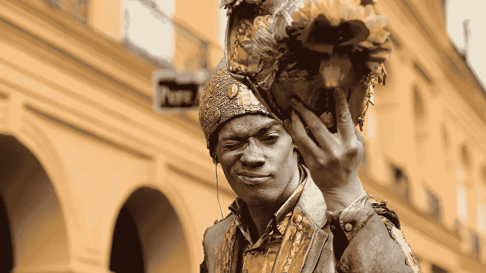

# 小心你的愿望

> 原文：<https://medium.com/hackernoon/be-careful-what-you-wish-for-b2b301878a4b>

人们害怕人工智能:有来自媒体的危言耸听；任何描写人工智能的电影都以灾难告终；埃隆·马斯克一直在鼓吹人工智能的风险。我很想告诉你一切都会好起来的，但是确实有理由担心。

这并不是说机器有一天会醒来，认为没有讨厌的人挡路，它们会更有效率。风险在于我们将无法…