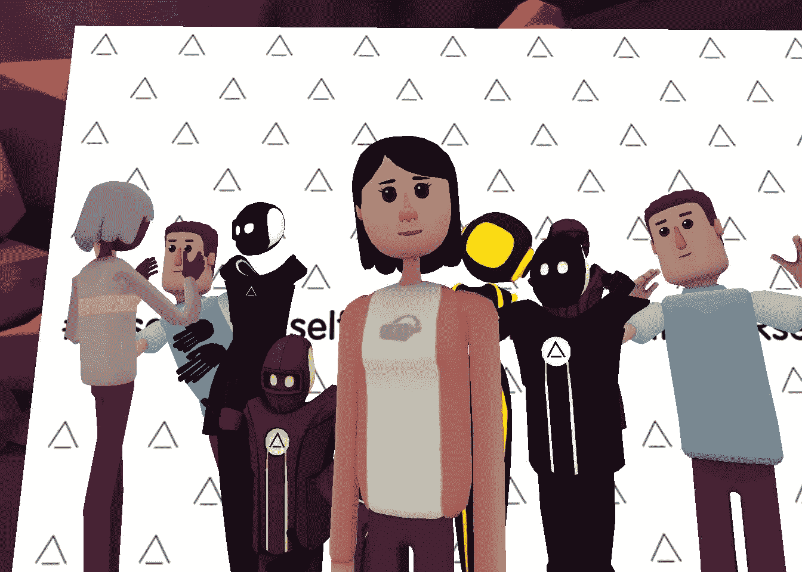
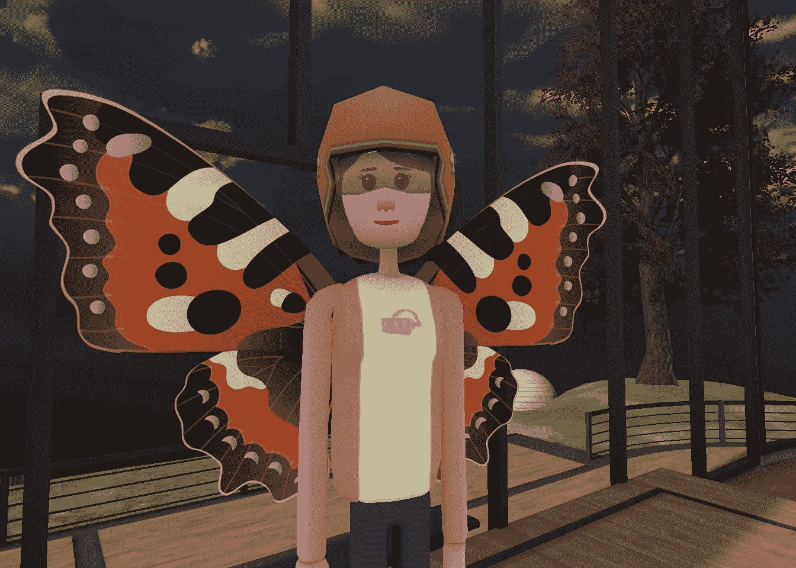
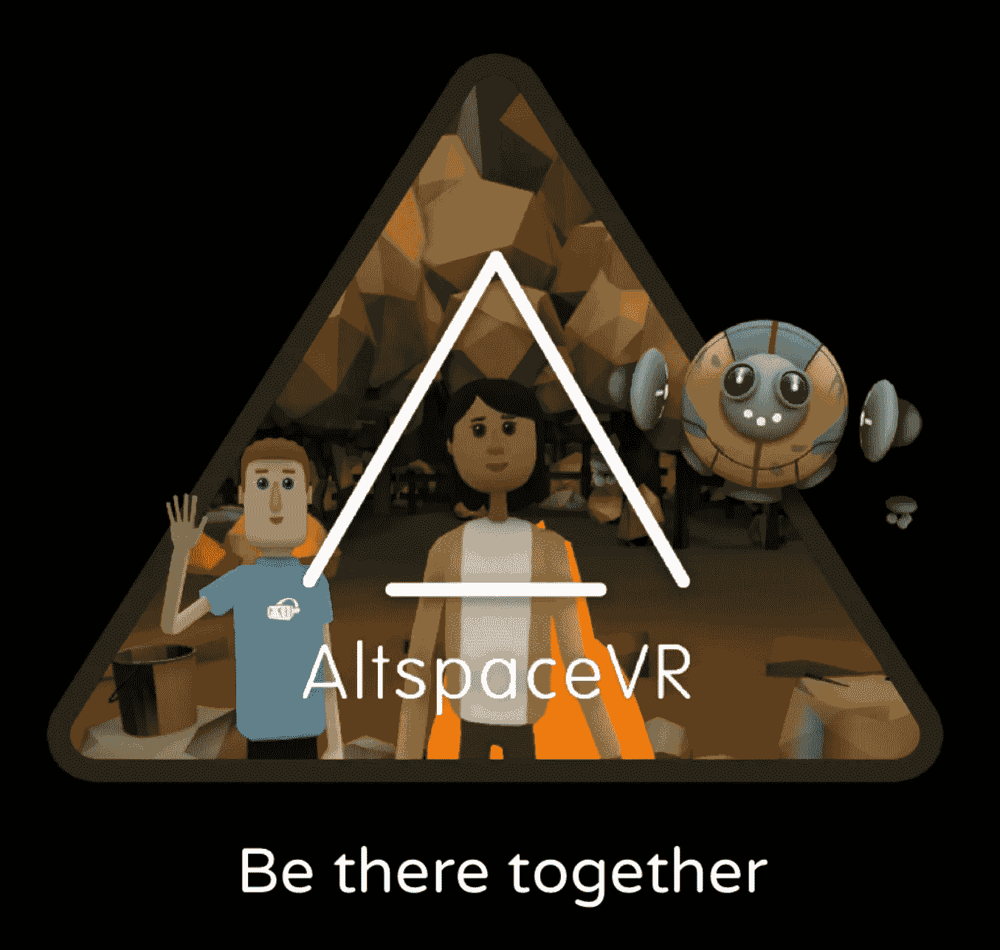

# 永远在一起。再见(带着强烈的头像凝视)AltspaceVR

> 原文：<https://medium.com/hackernoon/be-there-together-forever-goodbye-with-intense-avatar-stare-altspacevr-d57d3b42ac8c>

Selfie at the VRselfie event on occasion of the National Selfie Day

六月，我写了一篇[故事](/hackeriosity/head-set-go-getting-my-feet-wet-diving-head-first-and-doing-a-vr-hackathon-9c99c85a8871)，提到当我沉浸在虚拟现实中时，我遇到了 [AltspaceVR](https://altvr.com/) 。我描述了我参加过的一些活动以及我对这个平台的兴奋程度。上周，该公司宣布将关闭。一个充满活力的市场到此为止。

作为一个用户，我没有看到它的到来。日程上有很多活动，公司似乎总是能提出新的概念。即使在宣布之后，我还是参加了一个装扮活动——嗯，好像我没有报名参加，但开始看到每个人都有奇怪的装扮，并意识到菜单附近有一个新选项，允许我选择新的配饰。这是结果。

“Spread your wings and prepare to fly, for you have become a butterfly“ Mariah Carey

媒体提到的关闭的原因之一是网站的低流量——只有[35000 个月活跃用户](https://www.theverge.com/2017/7/28/16055222/altspacevr-virtual-reality-social-network-shutdown-funding)。但对我来说，魅力的一部分在于成为仍有点模糊的东西的一部分，它正在被改进和完善。事实上，不止一次，当我开始我的会话时，我有机会与公司的化身互动——接待员，我记得他在我进入社交网络的第一步中给了我指导—[来自公司——有时也在篝火上(化身出没的主要地方),团队成员在那里聊天并帮助用户使用一些功能。](https://hackernoon.com/tagged/network)

在社交网络(是的，这是一个关于虚拟现实中的虚拟现实的会议，不能比这更元了)上举行的一次技术虚拟现实中的女性会议中，嘉宾发言人是 Jolanda Tromp——一位自 90 年代以来目睹虚拟现实进步和挫折的行业顾问——我们大约有 7 或 8 个人，这创造了一种在技术会议甚至一些(拥挤的)会议上难以复制的亲密气氛。因为我们只有几个人，我们可以问所有我们想问的问题，然后再问更多的问题。

我不止一次读到 Altspace 如何让人们想起 80 年代和 90 年代，当时电子公告板和 IRC 等社交网络允许真正的社交探索和与陌生人见面，这是 Facebook——在你已知的网络中几乎没有锚——所不能做到的。我完全同意。虽然你可以安排和你认识的人一起进入社交网络，但和完全陌生的人一起玩纸牌游戏或唱歌是一种权力游戏——至少对我来说是这样。

我和我的一个朋友评论的另一点是，我邀请他在晚饭后使用我的耳机尝试虚拟现实社交网络(我知道，这会导致消化不良)，facebook 如何成为一个被动的社交网络——它充满了你认识的人，你在其他场合与他们一起做事情，但你只能与他们有被动的行为——喜欢或标记。AltspaceVR 真的可以让你一起做事情:唱歌、玩耍、画画——这感觉更像是真正的朋友一起做的事情。实际上，“在那里，在一起”是网络的座右铭。

我不喜欢看到这个人离开。在我在 GearVR 上尝试的所有应用程序中，这是促使我更经常戴耳机的一个，目前我没有其他 VR 应用程序能引起同样的热情。

虚拟现实 meetup 中的女性的创造者丽莎在推特上说，他们将继续在“新的虚拟现实家园元宇宙”中生活。我真的希望元宇宙的其他玩家能从开拓性的替代空间的成功和失败中受益，也希望我们——用户——能在[的未来](https://hackernoon.com/tagged/future)中有一个强有力的竞争者。

与此同时，没有什么比亲眼目睹更好的了，你仍然可以做到。你甚至可以参加定于 2017 年 8 月 4 日举行的[欢送会](https://account.altvr.com/events/732036242551603340)。

对于那些将错过它的人，这是开始的屏幕。

