# 成为 22 gifs 的超级用户

> 原文：<https://medium.com/hackernoon/become-a-finder-power-user-in-22-gifs-cdee446844f1>


## 第一部分

> 最初发布在我的[我的网站](http://www.wottpal.com/items/finder-power-user)(用**方式**较小的视频文件)。
> 
> **TL；这仅仅是开始。我准备了一大堆有用的 macOS 玩意儿，近期会发表。[关注我](https://twitter.com/wottpal)保持更新。**

一两周前，我帮一个朋友安装了他的新 Mac 电脑[和一个网络开发环境。在这个乏味的过程中，他注意到我在 macOS 中处理一些简单的日常场景的速度有多快。当然，我想与他分享一切，这很快就变得势不可挡。如果不自己反复使用，你根本不可能一次记住三个以上的快捷键。至少我不能。这就是为什么我决定开始这个小编来收集一些有用的小点点滴滴，与世界分享，也许在下面的评论中可以学到一些新的东西。为了简单起见，我的第一篇文章将只涉及 *Finder* ，它是 macOS 的默认文件管理器。但是还有更多的工作要做，所以如果你认为你可以在更短的时间内完成更多的工作，请在 Twitter 上关注我。⚡️](https://hackernoon.com/tagged/mac)

# 特殊键

在过去的十年里，苹果的键盘布局一直难以置信地不一致，尤其是在一些特殊按键的命名和图标方面。为了澄清事实:

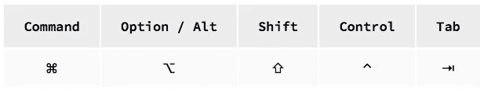

# 1.自动调整列的大小

你有没有在 Finder **⌘+3** 中切换到分栏视图，而你的分栏要么太大，要么太小？有一个简单的修复方法:只需双击右边的分隔线，该列就会将其大小设置为列表中最大的项目。

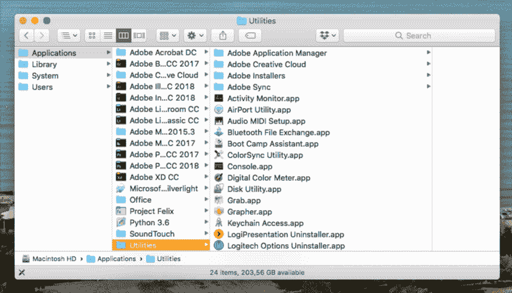

Resize Columns automatically with a double-click.

# 2.全屏快速查看和索引表

在玩 Windows 的时候，我最怀念的一件事就是不用打开文件就能快速浏览它的内容。在我看来，这是 Finders 的核心优势之一。只需按下**空格键**即可调用快速查找当前选中的项目，甚至可以使用**箭头键**进行导航。一个很好的补充是它的免分心全屏模式，只需要你按住 **⌥** 同时按下**空格键**。

在任一模式下，您都可以:

*   按住 **⌥** 暂时放大到 150%左右。
*   点击小网格图标打开一个所谓的*索引表*，在这里你可以一次看到你所有的项目。我经常用这个来快速比较一张图片的两个版本。

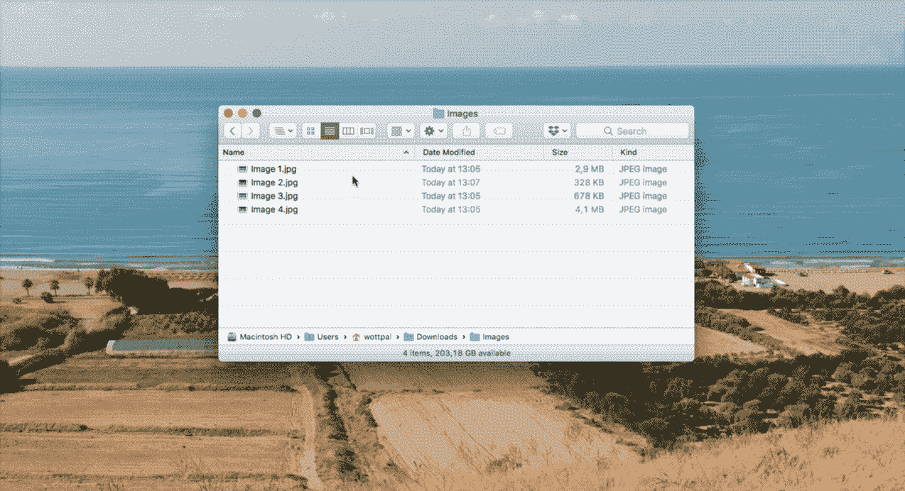

Invoke QuickLook with **Space**, Zoom with **⌥** and show the Image Sheet with the grid-icon.

# 3.快速查看扩展

QuickLook 很好，但是对于一些更高级的文件类型，如 Markdown、WebP、JSON 甚至 CSV，它有一些限制。通过在您的终端中执行以下命令，所有这些都将成为过去。

```
brew cask install qlcolorcode qlstephen qlmarkdown quicklook-json qlprettypatch quicklook-csv betterzipql qlimagesize webpquicklook suspicious-package quicklookase qlvideo
```

更多信息请参见本 [GitHub 页面](https://github.com/sindresorhus/quick-look-plugins)。

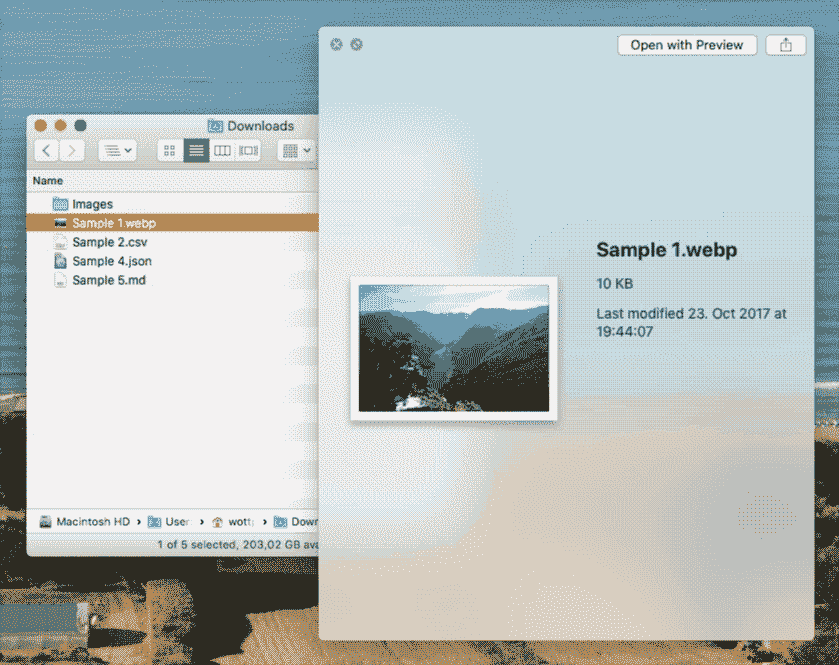

See some of the QuickLook plugins above in action.

# 4.在 Finder 中快速显示 Dock 项目

这是一个短的。你不能在你的 Dock 中的文件夹(很可能是*下载*)的堆栈模式、网格模式或列表模式之间做出选择，或者像我一样不能选择任何一种模式？只需在它们上面放上 **⌘+Click** ，就可以立即在取景器中显示它们。这也适用于应用程序。

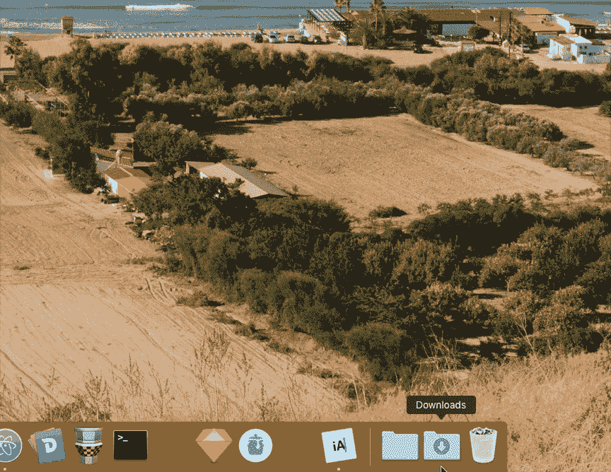

Directly access Dock items in Finder by **⌘+Clicking** them.

# 5.按名称排序时将文件夹放在最上面

从 macOS Sierra 10.12 开始，你可以进入 Finders 设置，在名为**的最后一个标签中勾选最后一个复选框，在按名称**排序时将文件夹放在最上面。简单但节省大量时间，应该默认启用。

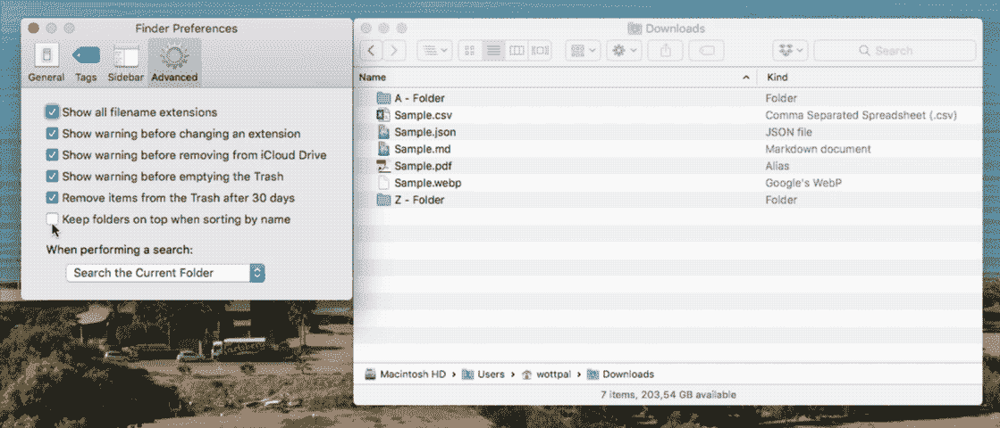

If you do one of the things I’ve mentioned today let it be this. 😀

# 6.转到文件夹

您通过按下 **⌘+⇧+G** (或在菜单栏中手动)调用的这个小文本字段看起来很无聊，但它具有与您的终端相同的 **⇥** 自动完成功能，这很方便。顺便说一下:在 macOS 中，你可以简单地用波浪符号`~`来缩写你的主目录(例如`/Users/wottpal/`)。

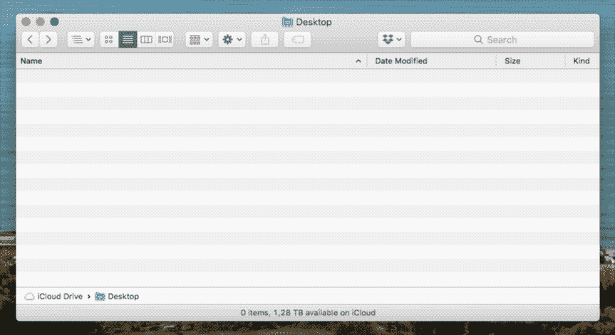

Directly access any location with **⌘+⇧+G**.

# 7.制表符

Finder 在很长一段时间内都有标签，如果你不想让你的桌面被几十个窗口弄得乱七八糟，这很好。但是如果你想有效地和他们一起工作，有一些事情要记住。从 macOS Sierra 开始，你可以在标签中打开文件夹，而不是在你的 Finders 设置中打开新窗口，我强烈推荐。如果你在多个桌面之间扩展你的应用程序，但是只希望 Finder 的一个实例在所有桌面上运行，确保右击 Finders 图标并选中**分配给所有桌面**。Dock 中的每个应用程序都可以做到这一点。

如果您实际上在 Finder 中工作，并且想要在新标签中打开一个目录，有多种方法可以做到这一点:

*   只需在默认的取景器位置打开一个带有 **⌘+T** 的新标签，这个位置也可以在设置中设置。
*   任何文件夹上的 **⌘+Double-click** 或工具条上的 **⌘+Click** 。
*   右击并选择**在新标签页中打开**
*   将文件夹拖到右上角标签栏中的加号图标上。如果你看不到标签栏，用 **⌘+⇧+T** 永久启用它。

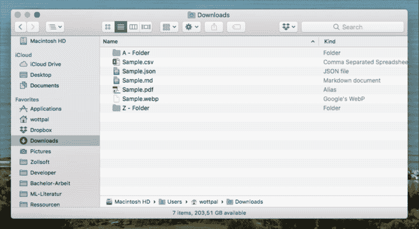

Some different ways to open a folder in a new tab.

其他有用的处理标签页的快捷方式(几乎)与 Safari 相同:用 **⌘+W** 关闭当前标签页。用 **⌃+⇥** 和 **⇧+⌃+⇥** 在它们之间导航。但是我在 Safari 中最喜欢的一个动作**关闭其他标签**不起作用，被映射到**关闭所有标签** : **⌘+⌥+W** 。多么可悲的矛盾。一年前我已经就此事联系过苹果，但他们没有回应。😢

# 8.批量重命名

一个鲜为人知但非常强大的功能是一次重命名一堆文件。虽然重命名单个文件可以简单地通过按回车键 **↩︎** 来启动，但对于多个文件，需要使用右键单击。在这里，你可以找到更详细的指南。

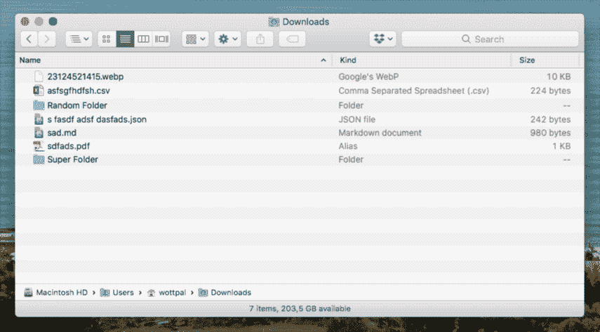

A lot of people don’t know Batch-Rename is directly integrated in macOS.

# 9.获取绝对路径

有时知道文件所在的确切路径会很有用。通过按下 **⌥+⌘+P** 你可以切换 Finders 便捷的路径栏，所有的父目录都像*面包屑*一样列出。你甚至可以通过拖放或 **⌘+Double-click** 来打开一个新标签页。

但是，如果您只想以纯文本形式复制路径，该怎么办呢？只需右击元素并按住 **⌥** 。现在您可以选择**拷贝“…”作为路径名**。就这样。

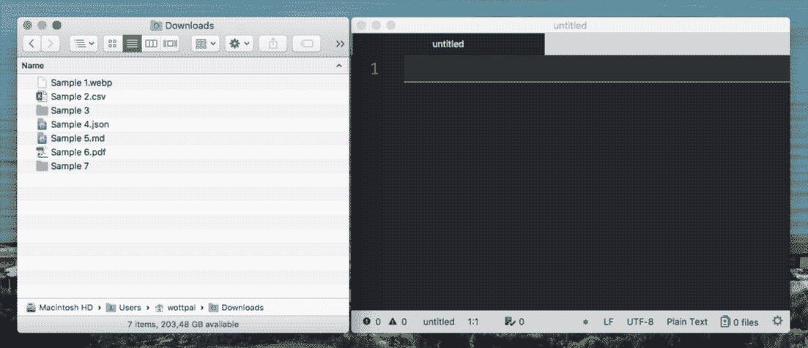

Copy the absolute path of anything with a right click and holding **⌥**.

# 10.用所有选定的文件创建一个新文件夹

这是我最喜欢的省时方法之一:选择一堆你想移到新目录的文件，然后按下 **⌘+⌃+N** 。将为您创建一个新文件夹，其中包含所有文件。

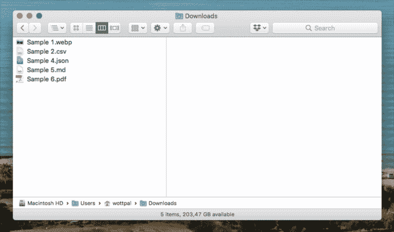

Create a new directory with all selected elements already inside with **⌘+⌃+N**.

# 11.总是用…打开文件

你们可能都知道，如果你想用除默认应用之外的任何其他应用打开一个文件，你可以用右键点击**打开。但是通过按住 **⌥** ，菜单中的该选项变成**总是与**一起打开。**


Always open a file with a selected app by holding ⌥ in the context-menu.

## 暂时就这样了。我已经再一次收集了至少这么多的小费。💌

## 如果你不想错过他们，就跟我来。

*原贴于我的* [*我的网站*](http://www.wottpal.com/items/finder-power-user) *(带小视频文件# perfmatters)。*