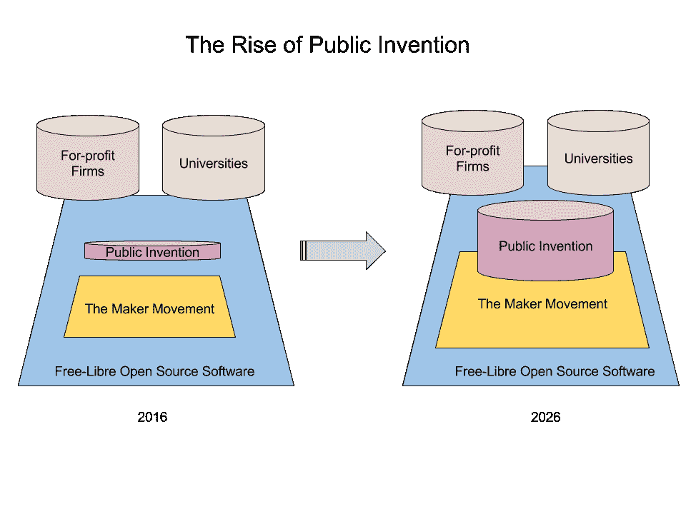

# 成为公共发明家

> 原文：<https://medium.com/hackernoon/become-a-public-inventor-aae282995f27>

发明家是人类进步最引人注目的推动者。今天，发明大多发生在商业公司和大学里。商业公司主要追求利润。大学从发明中寻求金钱和名誉。公司和大学是当今发明领域的两大支柱，它们都试图通过专利和其他知识产权货币化的方式暂时垄断发明。

一直有第三极，我称之为*公共发明*。这项发明主要是为了公众利益，造福全人类而进行的。本杰明·富兰克林、乔纳斯·索尔克、巴克明斯特·富勒和理查德·斯托尔曼是公共发明的典范。他们通过自己创造和免费赠送的东西丰富了世界。这些分别是，而且只是在大纲中:富兰克林炉，脊髓灰质炎疫苗，测地线穹顶和 Emacs。尽管如此，公共发明在历史上并没有与商业公司和高等教育的伟大支柱相匹配。

创客运动的蓬勃发展和自由开源软件(FLOSS)运动的蓬勃发展表明，公共发明的时代正在到来。FLOSS 运动不仅在 GNU-Linux 中结出了果实，在维基百科中也结出了果实，并且在大多数技术专家的意识中深深扎根，以至于无法根除。通过促进共享和开放，创客运动将微控制器、无人机、3D 打印机和虚拟现实等技术的成本迅速降低到业余爱好者的水平，让未来主义者感到震惊，从而实现了硬件的民主化。

创客运动充满了创造力和工匠精神，其中孕育着更有效的公共发明运动。今天，创客运动的很多精力都用在了制造 fannish 玩具和仿真玩具上——这是正确的。但也是时候让制造商变得更加严肃，并根据什么将造福人类，或者换句话说，什么符合公共利益来选择他们的项目。是时候让公共发明成为人类进步的第三极了。

技术不是中性的。所有的专有技术都有好有坏，人类无法预测一项发明最终会走向何方。但是我们有能力运用我们的判断力。我们必须判断脊髓灰质炎疫苗是比原子弹更好的发明，如果不是更聪明的话。所有武器都可以用来毁灭或保护；所有的武器技术最终都会被传播。公共发明家接受困难且容易出错的任务，努力制造帮助人类而不是伤害人类的东西。用巴克明斯特·富勒的话来说，我们必须创造“生活”，而不是“武器”，富勒非常支持这一哲学。

要成为一名公共发明家，在脑海中列出一个你曾经做过的项目清单。也许是你小时候想到的东西。如果你没有什么想法，就拿一个[我的](https://github.com/PubInv/PubInv/tree/master/ideas)。现在根据对全人类的益处写下对这份清单的评价。好处可以是美丽和艺术，或科学和智慧，或效率和财富。不要关心变化无常且难以获得的成功，而要关心进步。问问你自己:

*   哪个项目将为我的同胞提供最大的利益？
*   如果我是最丰富、最自由、最自信的自己，我会从事哪个项目？

当你有了答案，就开始努力吧。我是说现在。当你需要休息时，再来看这篇文章。

因为你的动机是帮助世界，而不是寻求地位或赚钱，你将完全透明地工作，在公众中工作。你可以通过在适当的许可下公开你的想法来分享你的想法。现代技术使得这比以往任何时候都容易。我个人使用 GitHub，但这只是众多方法中的一种。

二十年后，在星际舰队学院建立之前，大学将教授“公共发明 101”。这门课的入门教材还没有写。运气好的话，你和我可以写一行。在写之前，我推荐以下做法:

*   你可能会试图寻求专利，但我建议不要这样做。它们有一种魅力，但是一旦你经历过几次这个过程，你就会意识到获得专利并不是一个真正有意义的成就，除非是作为一种坚持的练习。最终，专利要求保密和不共享，这与公共发明者的目标相违背。它们实际上是昂贵的、麻烦的，最糟糕的是，耗时的。
*   免费分享你所有的硬件和软件设计作为开源。
*   自由地分享你的错误、失败和成功。
*   拥有它。宣称自己是公共发明家。你不必成为一个优秀的人——我们大多数人都不会。没有入学考试，也没有成绩。如果你感觉到了，摇摆吧。
*   求助。其他人想要也应该有机会参与你正在做的事情。就我个人而言，我很乐意亲自帮助你，并且会抽出时间来做这件事。
*   要节俭，但有需要就要钱。我们生活在一个越来越富足的世界，越来越多的人有资金和意愿来帮助你。
*   为每一个微小的胜利奖励自己。你在为全人类的利益而工作，就我们所知，为存在于宇宙中任何地方的所有生命而工作。这不是一件小事。

你应该预料到会遇到困难。我的一位鼓舞人心的教授，本·库伊佩斯，曾经说过“真正聪明的人做的是真正平庸的工作。”这可能是你面临的最大问题--对自己能力的失望。发明，也就是创造真正新的有用的东西，是具有挑战性的。你的幻想可能会破灭。你可能不得不降低自己对自己智力的估计。很刺痛，但这是学习的开始。肯特·贝克曾经告诉我，“困惑是值得珍惜的，因为它先于启蒙。”

另一方面，你可能会成功。完全有可能拯救世界而没有人注意到。历史上很多时候，人们做了很多伟大的工作，但世界还没有准备好接受，只是在发明者不再受益于这种认可时才得到认可。你可能会成功，但感受不到爱。

最后，你可能会被嘲笑。有人会说，“你为什么放弃这么有价值的想法，从而放弃成为亿万富翁的机会？”他们将正确地指出，许多进步是由利润动机驱动的，而不是利他主义。这个声音甚至可能来自你的内心。你必须自己做决定。不要害怕那些说你贪婪的人的反对，也不要害怕那些说你愚蠢的人的反对。世界在变化，我们可以自由地创造新的方式来推动它前进。

> [黑客中午](http://bit.ly/Hackernoon)是黑客如何开始他们的下午。我们是 [@AMI](http://bit.ly/atAMIatAMI) 家庭的一员。我们现在[接受投稿](http://bit.ly/hackernoonsubmission)，并乐意[讨论广告&赞助](mailto:partners@amipublications.com)机会。
> 
> 如果你喜欢这个故事，我们推荐你阅读我们的[最新科技故事](http://bit.ly/hackernoonlatestt)和[趋势科技故事](https://hackernoon.com/trending)。直到下一次，不要把世界的现实想当然！

