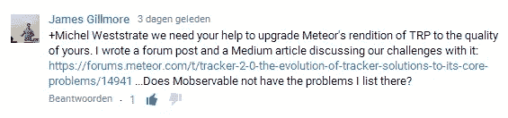
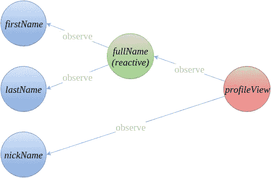
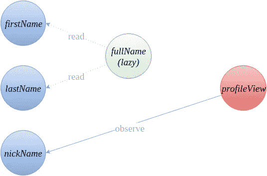
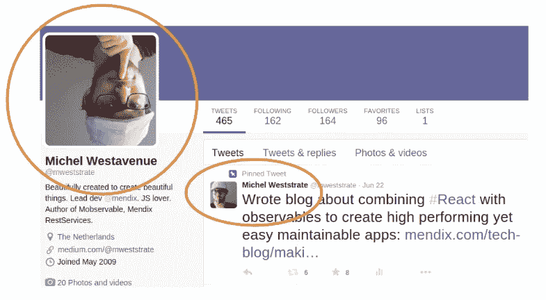
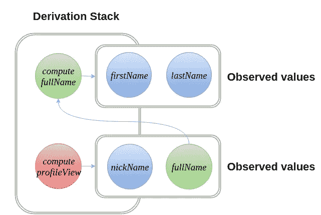
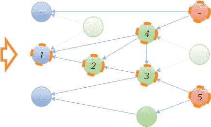

# 变得完全反应式:对 MobX 的深入解释

> 原文：<https://medium.com/hackernoon/becoming-fully-reactive-an-in-depth-explanation-of-mobservable-55995262a254>

由于大众的需求(也为了给我的孙子们一个很酷的故事)，这些是 [MobX](https://hackernoon.com/tagged/mobx) 的内部工作方式。很多人对 MobX 的一致性和速度感到惊讶。不过放心，戏里没有魔法！

首先，让我们定义一下 MobX 的核心概念:

1.  ***可观察状态*** 。任何可以变异并可能作为计算值来源的值都是状态。MobX 可以生成大多数类型的值(原语、数组、类、对象等。)甚至是开箱即用的(潜在的循环)引用。
2.  ***计算出的数值。*** 任何可以用一个纯粹作用于其他可观测值的函数计算出来的值。计算值的范围可以从几个字符串的连接到导出复杂的对象图和可视化。因为计算值本身是可观察的，所以甚至完整用户界面的呈现也可以从可观察状态中导出。计算出的值可能会延迟计算，也可能是对状态变化的反应。
3.  ***反应。*** 一个反应有点类似于一个计算值，但是它并没有产生一个新的值，而是产生了一个副作用。Reactions 连接了反应式和命令式编程，例如打印到控制台、发出网络请求、增量更新 [React](https://hackernoon.com/tagged/react) 组件树以修补 DOM 等。
4.  ***动作。*** 动作是修改状态的主要手段。动作不是对状态变化的反应，而是接受变化的来源，如用户事件或传入的 web 套接字连接，以修改可观察到的状态。

*计算值*和*反应*在这篇博文*的剩余部分都被称为*推导*。到目前为止，这听起来可能有点学术性，所以让我们把它具体化吧！在电子表格中，所有具有值的数据单元格将形成*可观察状态*。公式和图表是可以从数据单元格和其他公式中导出的*计算值*。在屏幕上绘制数据单元格或公式的输出是*反应*。更改数据单元格或公式是一个*动作*。*

无论如何，下面是一个使用 MobX 和 React 的小例子中的所有四个概念:

Listing 1: Observable state, computed values, reactive Reactjs component and some actions

我们可以根据上面的清单画一个依赖树。直观地看，它将如下所示:

Figure 1: Dependency tree of profileView component. FullName is in reactive mode, actively observing firstName and lastName.

该应用的*状态*在*可观察的*属性(蓝色)中被捕获。绿色的*计算值*全名可以通过观察名字和姓氏自动从状态中导出。类似地，profileView 的呈现可以从昵称和全名中导出。profileView 将通过产生一个副作用来对状态变化做出反应:它更新 react 组件树。

当使用 MobX 时，依赖关系树是最小定义的。例如，一旦被呈现的人有了昵称，呈现就不再受全名值输出的影响，也不再受名字或姓氏的影响(见清单 1)。这些值之间的所有观察者关系都可以被清除，MobX 将相应地自动简化依赖关系树:

Figure 2: Dependency tree of the profileView component if the user has a nickname (see listing 1). In contrast to figure 1, fullName is now in lazy mode and does not observe firstName and lastName

MobX 总是试图最小化产生一致状态所需的计算量。在这篇博文的剩余部分，我将描述几个用来实现这个目标的策略。但是在深入研究计算值和反应如何与状态保持同步之前，让我们首先描述一下 MobX 背后的原理:

# 对状态变化做出反应总是比对状态变化采取行动更好。

应用程序为响应状态变化而采取的任何命令性动作通常会创建或更新一些值。换句话说，大多数动作管理一个本地缓存。触发用户界面更新？更新聚合值？通知后端？这些都可以被认为是变相的缓存失效。为了确保这些缓存保持同步，您需要订阅未来的状态更改，以便能够再次触发您的操作。

但是使用订阅(或者光标、镜头、选择器、连接器等)有一个基本问题:随着应用程序的发展，您会在管理这些订阅时出错，或者订阅过多(继续订阅组件中不再使用的值或存储)或者订阅不足(忘记监听更新，导致微妙的过时错误)。

> 换句话说；使用手动订阅时，你的 app 最终会不一致。

Figure 3: Inconsistent Twitter page after updating profile. The pinned tweet is displaying stale values for both the name and the profile picture of the author.

上图是 Twitter 用户界面不一致的一个很好的例子。正如我在 [Reactive2015 talk](https://www.youtube.com/watch?v=FEwLwiizlk0) 中解释的那样，出现这种情况只有两个原因:要么是没有订阅来告诉相关作者的个人资料发生变化时重新呈现推文。或者数据被标准化，一条推文的作者甚至与当前登录用户的个人资料无关，尽管事实上两条数据都试图描述同一个人的相同属性。

像 Flux-style store 订阅这样的粗粒度订阅很容易出现超额订阅。当使用 React 时，您可以通过打印[浪费的渲染](https://facebook.github.io/react/docs/perf.html#perf.printwastedmeasurements)来简单地判断您的组件是否被超额订阅。MobX 将[把这个数字减少到零。这个想法很简单，但是违反直觉:更多的订阅导致更少的重新计算。MobX 为您管理成千上万的观察者。您可以有效地用内存换取 CPU 周期。](https://www.mendix.com/tech-blog/making-react-reactive-pursuit-high-performing-easily-maintainable-react-apps/)

注意，超额认购也以非常微妙的形式存在。如果你订阅被使用的数据，但不是在*所有*条件下，你仍然是超额订阅。例如，如果 profileView 组件订阅了一个有昵称的人的全名，这就是超额订阅(参见清单 1)。所以 MobX 设计背后的一个重要原则是:

> 只有在运行时确定订阅，才能获得最小的、一致的订阅集。

MobX 背后的第二个重要思想是，对于任何比 TodoMVC 更复杂的应用程序，你通常需要一个*数据图*，而不是一个规范化的树，来以一种*心理上可管理的*但又是最佳的方式存储状态。图表支持引用一致性并避免数据重复，因此可以保证导出的值永远不会过时。

# MobX 如何有效地将所有派生保持在一致的状态

解决方案是:不要缓存，而是派生。人们问:“那不是极其昂贵吗？”不会，其实很有效率！原因如上所述:MobX 并不运行所有的推导，而是确保只有参与某些*反应*的*计算值*与可观察状态保持同步。这些衍生被称为*反应*。再次与电子表格进行比较:只有那些当前可见的或由可见公式间接使用的公式，才需要在观察到的数据单元格之一发生变化时重新计算。

## 惰性评估与反应性评估

那么，那些没有被反应直接或间接使用的计算呢？您仍然可以随时检查计算值的值，如 fullName。解决方案很简单:如果一个计算出的值不是反应性的，它将被按需计算(延迟)，就像普通的 getter 函数一样。惰性派生(从不观察任何东西)如果超出范围，可以简单地被垃圾收集。请记住，计算值应该始终是可观察应用程序状态的纯函数。这就是为什么:对于纯函数来说，它们的求值是缓慢的还是急切的并不重要；给定相同的可观察状态，函数的评估总是产生相同的结果。

## 运行计算

MobX 以同样的方式运行反应和计算值。当重新计算被触发时，函数被推送到*派生堆栈*；当前运行的派生的函数堆栈。只要一个计算在运行，每个被访问的可观察对象都会将自己注册为派生堆栈最顶层函数的依赖项。如果需要计算值的值，如果计算值已经处于反应状态，则该值可以简单地是最后已知的值。否则，它将把自己推到派生堆栈上，切换到反应模式并开始计算。

Figure 4: During the execution of the profileView reaction some observable state and some computed values are being observed. Computed values might recompute, this results in the the dependency tree as shown in figure 1.

当一个计算完成时，它将获得一个在执行期间被访问的可观察值的列表。例如，在 profileView 中，这个列表要么只包含昵称属性，要么包含昵称和全名属性。这个列表不同于以前的观察列表。任何移除的项目将不会被观察到(此时计算的值可能会从反应模式返回到惰性模式),而任何添加的可观察项将会被观察到，直到下一次计算。例如，当将来 firstname 的值发生变化时，它知道需要重新计算 fullName。这又会导致重新计算纵断面图。下一段将更详细地解释这个过程。

## 传播状态变化

Figure 5: The effects of changing value ‘1’ on the dependency tree. The dashed border indicates the observers that will be marked as stale. Numbers indicate the order of computation.

导数会自动对状态变化作出反应。所有反应同步发生*，更重要的是*无故障*。当可观察值被修改时，执行以下算法:*

1.  *可观察值发送一个*失效通知*给它的所有观察者，以表明它已经失效。任何受影响的计算值都将递归地将通知传递给它们的观察者。结果，依赖关系树的一部分将被标记为*陈旧*。在图 5 的示例依赖关系树中，当值“1”改变时将变得陈旧的观察器用橙色虚线边框标记。这些都是*可能会受到变化值*影响的推导。*
2.  *在发送了*陈旧通知*并存储了新值之后，将发送一个*就绪通知*。该消息还指示该值是否确实发生了变化。*
3.  *一旦派生收到步骤 1 中收到的每个陈旧通知的就绪通知，它就知道所有观察到的值都是稳定的，并将开始重新计算。对就绪/失效消息的数量进行计数将确保，例如，计算值“4”仅在计算值“3”变得稳定后才会重新评估。*
4.  *如果没有就绪消息表明值被改变，那么派生将简单地告诉它自己的观察者它再次就绪，但是不改变它的值。否则，计算将重新计算，并向自己的观察者发送就绪消息。这导致了如图 5 所示的执行顺序。请注意，例如，如果计算值“4”确实进行了重新计算，但没有产生新值，则最后一个反应(标有'-')将永远不会执行。*

*前面两段总结了如何在运行时跟踪可观察值和派生之间的依赖关系，以及如何通过派生传播变化。在这一点上，你也可能意识到一个*反应*基本上是一个*计算值*，它总是处于*反应*模式。重要的是要认识到，这个算法可以在没有闭包的情况下非常有效地实现，只需要一堆指针数组。此外，MobX 还应用了许多其他优化，这超出了本文的范围。*

## *同步执行*

*人们经常惊讶于 MobX 同步运行所有的东西(像 RxJs，不像 knockout)。这有两大好处:首先，根本不可能观察到陈旧的推导。因此，在更改了影响派生值的值后，可以立即使用派生值。其次，它使堆栈跟踪和调试更容易，因为它避免了无用的堆栈跟踪，这是 Promise / async 库的典型问题。*

*Listing 2: Example transaction. It ensures that nobody is able to observe an intermediate value like “Mich Weststrate”. (See also listing 1)*

*然而，同步执行也引入了对事务的需求。如果连续应用几个突变，最好在应用所有变化后重新评估所有衍生。将一个动作包装在一个*事务*块中可以实现这一点。事务只是推迟所有*就绪通知*，直到事务块完成。请注意，事务仍然同步运行和更新所有内容。*

*这总结了 MobX 最基本的实现细节。我们还没有涵盖所有的内容，但是知道例如您可以合成计算值是有好处的。通过*组合反应式计算*，甚至可以自动将一个数据图表转换为另一个数据图表，并使用最少数量的补丁来保持这种推导是最新的。这使得实现复杂的模式变得容易，比如 map-reduce、使用不可变共享数据的状态跟踪或横向数据加载。但是在下一篇博文中会有更多的介绍。*

# **TL；博士:**

1.  *使用*图*可以最好地表达复杂应用程序的应用程序状态，以实现引用的一致性，并接近问题领域的心智模型。*
2.  *不应该通过使用手动定义的订阅或游标来强制对状态更改进行操作。这将不可避免地导致由于认购不足或超额认购而产生的错误。*
3.  *使用*运行时分析*来确定观察者→可观察关系的*最小可能集合*。这导致了一种计算模型，在该模型中，可以保证运行最小量的推导，而不会观察到过时的值。*
4.  *任何不需要达到活性副作用的导数都可以被完全优化掉。*

*有关 MobX 的更多信息，请查看:*

1.  *我的[在 Reactive2015 上的演讲](https://www.youtube.com/watch?v=FEwLwiizlk0)*
2.  *[官网](http://mweststrate.github.io/mobservable/)或[回购](https://github.com/mweststrate/mobservable)*
3.  *样板项目: [React + Babel](https://github.com/mweststrate/mobservable-react-boilerplate) ， [React + TypeScript](https://github.com/mweststrate/mobservable-react-typescript) ， [TodoMVC](https://github.com/mweststrate/todomvc/tree/master/examples/react-mobservable) 或 [Flux-Challenge](https://github.com/staltz/flux-challenge/blob/master/submissions/mweststrate/index.tsx)*

**编辑 2–3–2016:MobX 在 2.0 版本之前被称为 Mobservable】**

*图片由 [xt0ph3r](https://www.flickr.com/photos/xt0ph3r/3591236086/in/photostream/) 提供*