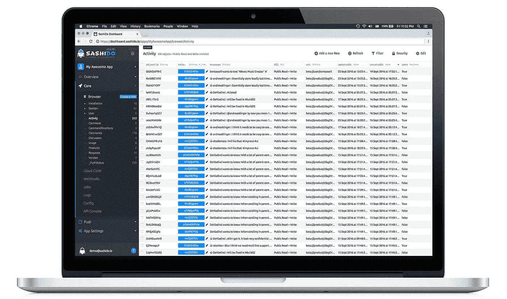

# 成为真正的解析选择

> 原文：<https://medium.com/hackernoon/becoming-the-real-parse-alternative-f2a5474c830f>

**SashiDo - The Real Parse Alternative**

我记得就在昨天:2016 年 1 月，Parse 宣布关闭。我看到了移动开发人员的困惑，他们不得不处理服务器、基础设施、数据库、备份、应用扩展等，所有这些都是他们需要的，但需要大量的时间、精力和知识来实施。

我在想……这些家伙用鼓舞人心的 UX 设计创造出令人惊叹的应用程序，为什么还要麻烦他们解决生产系统的问题呢？解放他们的思想，给他们时间、稳定的平台和工具来释放他们的力量。我的第一家公司 CloudStrap 是一个云托管平台，我和我的团队在云服务和基础设施方面有多年的经验，我们为我们所做的事情而燃烧，所以我们决定:我们必须为他们打造令人难以置信的产品！

这是几个月的艰苦规划，开发，调试，数百个不眠之夜和无数杯咖啡。这很难，但我们希望为客户提供最好的选择，让他们再次获得真正的解析体验。

我们推出已经 3 个月了， [SashiDo](https://www.sashido.io) 已经准备就绪，我们正以越来越大的热情将 [SashiDo](https://www.sashido.io) 打造成为

# **真正的解析替代方案。**

现在，如果您仍然想知道在 Parse 关闭之前迁移到哪里，或者如果您正在寻找一种真正的 Parse 感觉:加入 [SashiDo](https://www.sashido.io) 免费试用！

我们是唯一提供**从 Parse:** [全自动迁移的服务，只需点击几次](https://blog.sashido.io/parse-migration-in-a-click/)。我们还有 [**解析文件迁移工具**](https://blog.sashido.io/do-you-need-a-file-migration-tool/) 所以你的应用不会丢失任何东西。如果您已经从 Parse 托管服务中迁移了您的应用程序:不要担心，SashiDo 工程师很乐意帮助您从任何 Parse 服务器提供商迁移，我们已经积累了很多经验:)

**SashiDo’s Dashboard**

[SashiDo](https://www.sashido.io) 给予 **14 天的免费试用期来测试真正的解析体验:**你会在我们的**改进的闪亮快速解析仪表板**中发现以下特性:

*   **高级云代码**，集成 GitHub。我们为每个应用程序提供一个私有的 GitHub 库:你可以添加合作者、分支、版本控制，只需一个 **git 推送就可以部署你的代码。**你可以阅读我们的“[如何在 SashiDo](https://blog.sashido.io/how-to-set-up-cloud-code-on-sashido/) 上设置云代码”教程。
*   **推送通知:**您可以选择移动平台，受众，发送前预览推送。快速轻松地联系到您的用户！
*   **后台作业:**让您可以选择编写长时间运行的任务，将它们包含在您的云代码中，并设置您希望运行它们的频率。你可以阅读我们的“[SashiDo](https://blog.sashido.io/getting-started-with-background-jobs-on-sashido/)后台工作入门”教程。
*   **电子邮件集成&社交登录:**维护电子邮件、社交验证和登录，不进行任何集成，方式与 Parse 相同。
*   **WebHooks:** 你想用 JavaScript 之外的语言编写代码，并集成云代码不支持的框架和技术？你可以阅读我们的“[如何在 SashiDo](https://blog.sashido.io/how-to-set-up-webhooks-on-sashido/) 上设置 WebHooks”教程。
*   **LiveQueries:** 想让你的应用程序实时运行？我们将它们包含在仪表板中，因此比以往任何时候都更容易！你可以阅读更多关于我们的“ [SashiDo 实时解析服务器实时查询](https://blog.sashido.io/sashido-goes-realtime-with-parse-server-live-queries/)”教程。
*   虚拟主机:我们提供静态网站和动态 ExpressJS 主机。你不再需要在一个提供商上托管你的应用，而在另一个提供商上托管你的网站:一切就绪！

[SashiDo](https://www.sashido.io) 为您的应用提供安全、自动化的扩展。在您的营销活动或媒体报道期间，将始终处理意外流量。

多地区也包括在内:选择哪个对你来说是方便的。

[SashiDo](https://www.sashido.io) 使用[解析开源](https://parseplatform.github.io/)栈，这意味着没有厂商锁定，因为我们希望让你成为一个快乐的客户，而不是人质:)当新版本的[解析服务器](https://github.com/ParsePlatform/parse-server)发布时:我们会测试它是否有错误，如果发现错误，我们会修复它们，当一切运行顺利时，我们会更新你的应用程序，这样你就不用处理这些了:)

我们相信，您不必放弃使用您已经习惯的所有功能的便利。这就是为什么我们不断为我们的客户提供越来越多的工具，让他们可以自由地创建有趣的惊人的应用程序…没有努力！

专注于您的应用，我们很乐意为您完成其余工作，因为这是我们的热情所在！

试试 [SashiDo](https://www.sashido.io/) 分享一下经验吧！

*Marian Ignev(*[*)@ mignev*](https://twitter.com/mignev)*)
萨西多首席执行官*

> [黑客中午](http://bit.ly/Hackernoon)是黑客如何开始他们的下午。我们是这个大家庭的一员。我们现在[正在接受投稿](http://bit.ly/hackernoonsubmission)，并乐意[讨论广告&赞助](mailto:partners@amipublications.com)机会。
> 
> 如果你喜欢这个故事，我们推荐你阅读我们的[最新科技故事](http://bit.ly/hackernoonlatestt)和[趋势科技故事](https://hackernoon.com/trending)。直到下一次，不要把世界的现实想当然！

