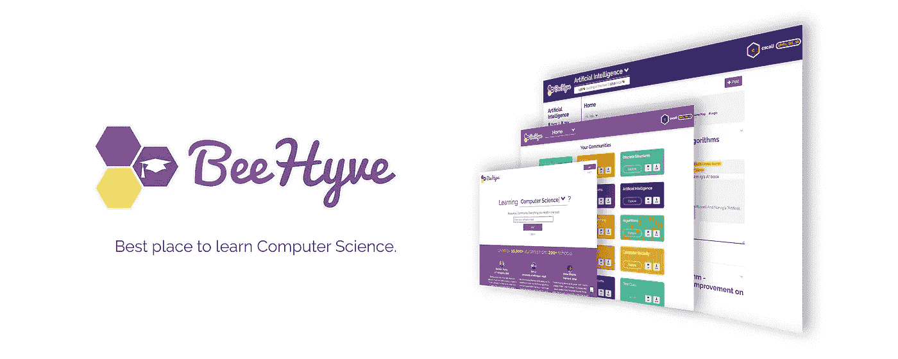
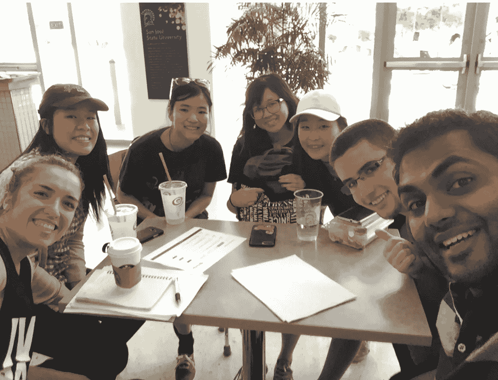
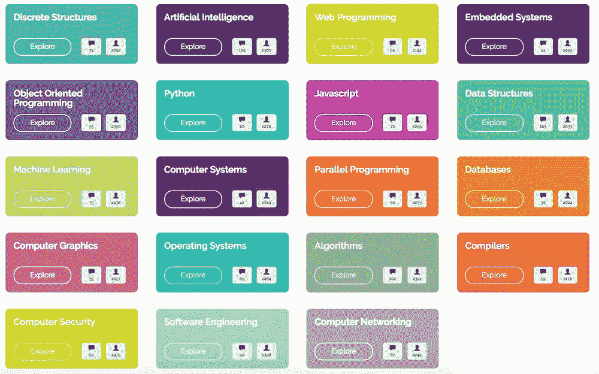
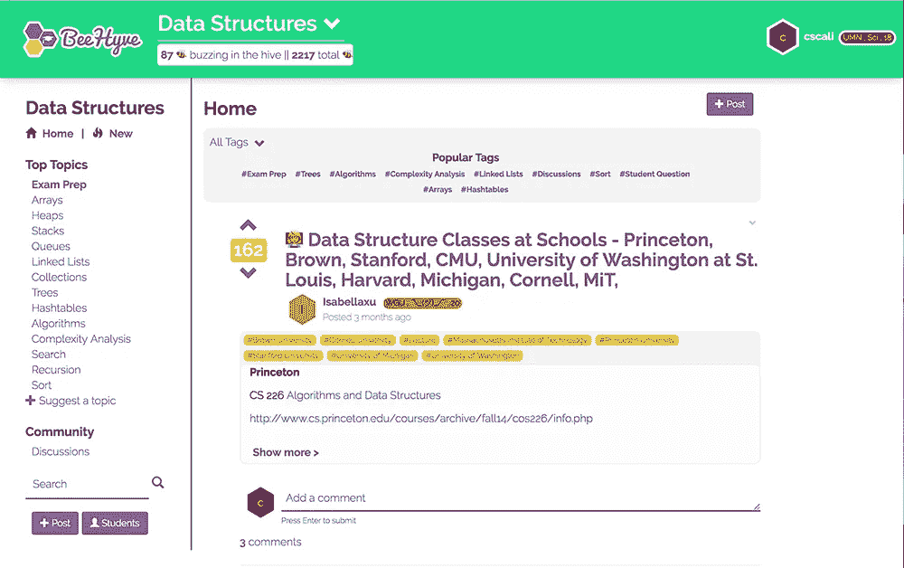
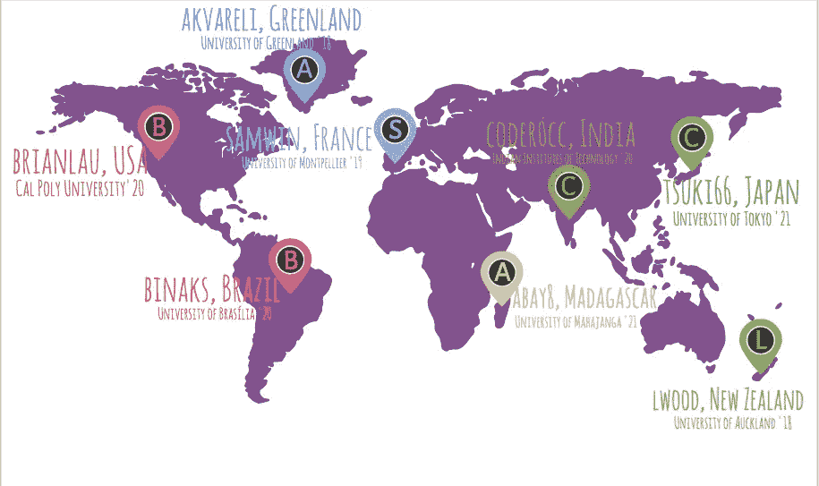

# BeeHyve:学习计算机科学的最佳场所

> 原文：<https://medium.com/hackernoon/beehyve-the-best-place-to-learn-computer-science-e3cd79668882>

在过去的 3 个月里，我们一直在建设[beehive](http://www.beehyve.io)([www . beehive . io](http://www.beehyve.io))——一个吸引世界各地计算机科学学生并为他们提供最佳教育资源的在线社区。

我们很想告诉您我们的旅程，以及我们如何影响了全球数千名学生:)

## **返校:**

对于美国学生来说，现在是返校季节。

2021 班的普通学生出生于 1999 年。大多数学生都不知道什么是拨号上网，更不用说了解一个没有高速互联网的世界。在学生的大部分生活中，他们总是与互联网相连。对于这一代人来说，即使是电子邮件也太过时了。

> **“电子邮件是给老年人的，是为了得到我的亚马逊订单确认”~** 是一名大学生无意中听到的。

然而，当学生们今年秋天去上学时，他们将很大程度上以与生于 20 世纪 40 年代的学生相同的方式学习。学生们会被告知去买一本教科书(大多数人不会)，然后被扔进教室一个小时，去听一个他们以后会遗忘的讲座。尽管[技术](https://hackernoon.com/tagged/technology)开始进入课堂，但基本模型基本上仍未被触及。

A typical college lecture

今天的学生拥有网络的魔力。他们可以在线发现最佳[学习](https://hackernoon.com/tagged/learning)材料(视频、讲座、练习题)，无论来源如何。网络也使得与世界上任何人交往和建立在线社区成为可能，然而学生们被扔进大教室，被告知要以和其他人一样的速度学习。

## 了解学习:

在一年的大部分时间里，我们一直在努力理解人们是如何学习的，尤其是计算机科学学生。我们已经和来自世界各地的 100 多名学生进行了交流。我们学到的最重要的一点是，学生需要两样东西-**社区**和**访问**。

Visiting students and testing concepts at San Jose State University

人们在社区里学习最好——在安全的空间里，他们可以和其他学生交流，一起工作，问问题，建立彼此的理解。我们看到脸书集团、Slack 频道、GroupMe，甚至 SnapChat 都以创造性的方式来建立社区。

学生还需要使用工具来释放他们的全部潜力，并允许他们按照自己的方式学习——视频、讲座、练习题和交互式教程。学生们已经在通过谷歌、StackOverflow、Quora 等在互联网上找到的东西来扩充他们的学习。

## **一个简单的测试:**

在过去的两个月里，我们一直在测试如何建立社区，并为世界各地的学生提供访问机会。

我 *想象一下，如果你能立即与世界各地成千上万和你学同样东西的学生合作。如果你可以很容易地找到学习任何你需要的东西的最佳资源，不管它来自哪里，那会怎么样？如果解释不仅仅是教科书，而是视频呢？互动教程？一个例题？*

*我们认为那会很酷，所以我们决定构建*[*beehy ve*](http://www.beehyve.io)*(*[*www . beehy ve . io*](http://www.beehyve.io)*)。*

BeeHyve 的使命是建立世界上学习计算机科学的最佳场所。我们正在通过建立一个由全球逾 100 万计算机科学学生组成的社区来实现这一目标。在这个社区中，我们提供必要的基础设施来发现学习任何主题的最佳资源。尽管我们才刚刚开始，但我们已经将来自世界各地 200 所不同学校的 1 万多名学生联系在一起。

## **什么是 beehive:**

BeeHyve 是一个由 19 个学习社区组成的集合，专注于世界各地学生参加的通用计算机科学课程。

通过 BeeHyve，学生可以**与其他学生**互动，**分享**最有用的讲座、教程，甚至是任何计算机科学科目的模拟考试，而**通过参与讨论和对最有帮助的资源进行投票来与**合作。

*   BeeHyve 由 **19 个学习社区**组成，涵盖了计算机科学的所有主要主题——从算法到 Web 编程，以及 Javascript 和 Python 等主要语言。

BeeHyve is comprised of 19 communities covering all major topics in Computer Science

*   每个社区都包含高质量的教育资源，这些资源按主题、类型组织，由学习相同材料的学生管理。

*   来自全球 200 多所学校的 1 万多名学生已经在使用 BeeHyve。

Over 10k Students from 200 Schools around the world are using BeeHyve

## 我们要去哪里:

在接下来的几个月里，我们致力于让 BeeHyve 成为学习计算机科学的最佳社区。

我们通过让 BeeHyve 成为每个学生的个人生活来做到这一点，让学生能够通过项目表达自己，并更好地与其他学生互动。我们还推出了更多的学习社区，确保我们涵盖了计算机科学学生学习的科目。

我们知道，我们不会在一夜之间彻底改变教育，但我们希望 BeeHyve 继续对人们的生活产生积极影响。

我们很想听听你的想法！联系我们 [@BeeHyveBuzz](http://www.twitter.com/@beehyvebuzz) 。

我们对接下来会发生什么非常兴奋:)

*~蜜蜂队*

From Left to Right: Justin Mo, Emi Jackson, Varun Bhartia, Vera Kutsenko

在以下网站找到我们:[比希夫](http://www.beehyve.io) | [脸书](https://www.facebook.com/beehyveCS) | [推特](https://twitter.com/BeeHyvebuzz) | [LinkedIn](https://www.linkedin.com/company-beta/18192370/)