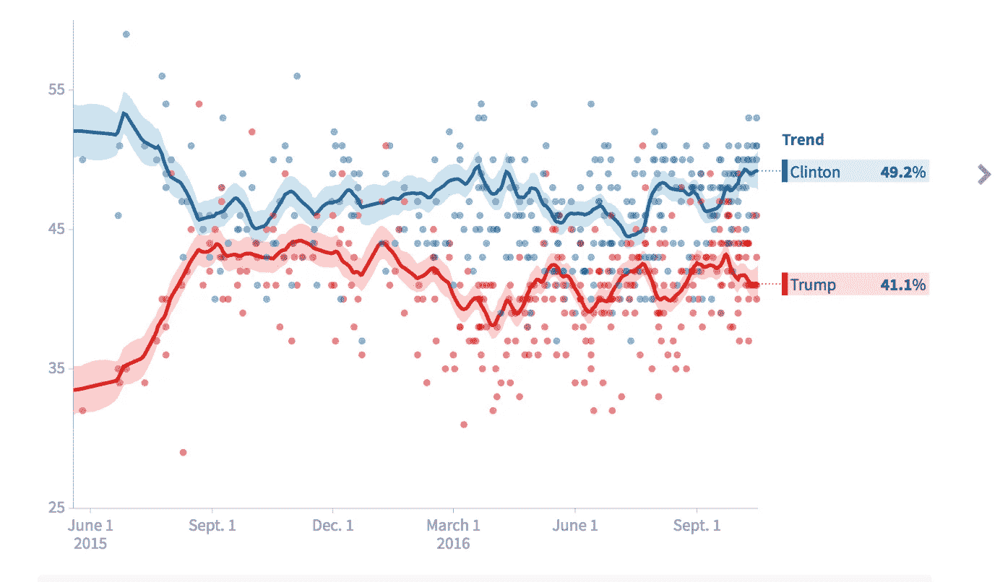
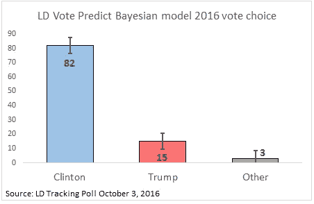
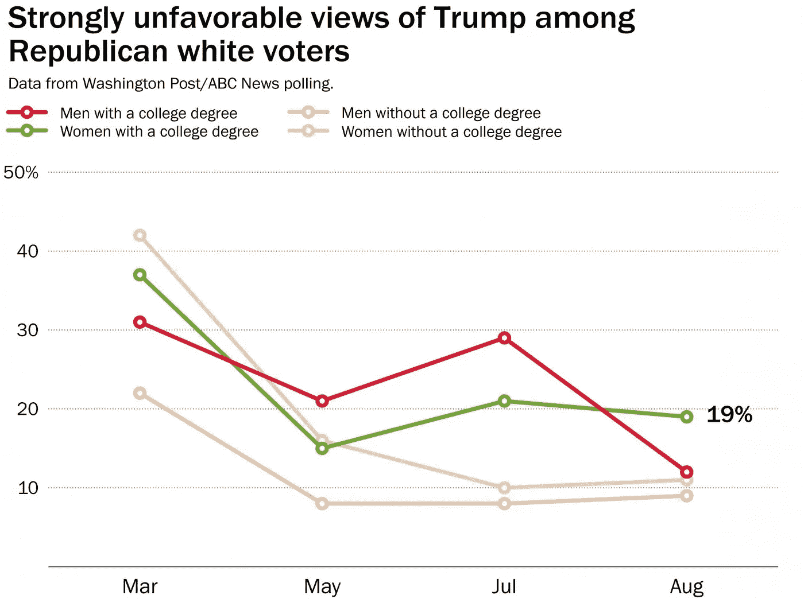

# 上周之前，特朗普已经因为他的反移民政策陷入了巨大的困境。这是比赛的情况。

> 原文：<https://medium.com/hackernoon/before-last-week-trump-was-already-in-a-huge-hole-because-of-his-anti-immigration-policies-939e4f6acdbf>

自去年秋天以来，唐纳德·特朗普(Donald Trump)是现代历史上最不受欢迎的政治家*(或许更重要的是:最高的“非常不受欢迎”评级)*。大多数选民表示，他们永远不会考虑投票给他。

10 月 7 日星期五早上，唐纳德·特朗普在总统竞选中处于绝对劣势，有可能以相当大的优势输掉选举。**他在民调中的劣势是选民拒绝的一系列反移民政策的直接后果，包括他竞选第一天就开始的大规模驱逐计划。不到五分之一的选民支持他的反移民政策[。](http://www.foxnews.com/politics/interactive/2016/08/31/fox-news-poll-aug-31-2016/)**

竞选期间的民调显示，特朗普对移民的攻击和对无证移民合法化的反对带来了巨大的政治成本。[民调追踪显示](http://elections.huffingtonpost.com/pollster/2016-general-election-trump-vs-clinton)特朗普最糟糕的三个政治时刻——直到上周的录像带——是反移民政策与人身攻击交叉的时候:库利艾尔法官(6 月的前两周)、对可汗家族的攻击(大会后)和艾丽西娅·马查多(辩论后)。

[Huffington Post Poll Chart](http://elections.huffingtonpost.com/pollster/2016-general-election-trump-vs-clinton)

**前几天川普的前景有多糟糕？不到两周前,[《纽约时报》](http://www.nytimes.com/2016/10/06/us/politics/donald-trump-campaign.html?rref=collection%2Fbyline%2Falexander-burns&action=click&contentCollection=undefined&region=stream&module=stream_unit&version=latest&contentPlacement=4&pgtype=collection)报道称:“唐纳德·j·特朗普(Donald J. Trump)的支持率在过去 10 天里在摇摆州地图上大幅下降，抹去了他从 9 月份开始的政治复苏，并有可能抵消共和党在国会控制权之战中数周的收益。”今天早上，Marist/NBC News 民意调查显示克林顿在宾夕法尼亚州的四人竞选中大幅上升了 12 个百分点，这对特朗普来说是必须的。**

唐纳德·特朗普(Donald Trump)在总统竞选中已经走上了大幅失利的道路，这在很大程度上是因为他的反移民立场严重冒犯了近三分之二的美国选民。在共和党修正其信息之前，简单地更换信使将确保该党的受欢迎程度只会继续恶化。虽然这些录像带可能暴露了性格问题，但其影响不会持续到特朗普参选之后。然而，移民改革一直是 2016 年辩论的前沿，如果得不到解决，将影响 2018 年和 2020 年的选举。

# **民调显示**

我们研究了特朗普在这次选举中糟糕和荒谬的移民政策的影响，并将这些政策与过去共和党提名人的表现进行了比较。以下是我们了解到的情况:

**1。在拉丁裔选民中，唐纳德·特朗普是历史上最不受欢迎的总统候选人。**

拉丁裔决策模型显示川普只赢得了 15%的拉丁裔选票，几乎是罗姆尼 2012 年 27%选票的一半。与乔治·w·布什总统 2004 年的竞选相比，这是一个天文数字，从布什总统的 44%下降到 12 年的 65%。自 2004 年大选以来，拉美裔选民的比例从占选民总数的 6%增长到了估计占选民总数的 10%，增长了 80%。

[Latino Decisions Model, October 2016](http://www.latinodecisions.com/blog/2016/10/06/ld-vote-predict-2016-latino-voters-poised-to-cast-most-lopsided-presidential-vote-on-record/)

**2。在亚裔选民中，唐纳德·特朗普是历史上最不受欢迎的总统候选人。**

全国亚裔美国人调查公布了一项民意调查，显示克林顿以 70%比 21%领先特朗普。相比之下，1992 年乔治 H.W 布什总统以 55%对 31%击败了比尔·克林顿。亚裔美国人是美国人口增长最快的群体，从 1992 年占选民的 2%增加到 2016 年的近 6%(预计)。

**3。希拉里·克林顿有望获得比奥巴马总统更多的非洲裔美国人的选票。**

无论川普赢得 4%还是 8%的黑人选民，共和党人都希望在 2016 年比 2008 年或 2012 年做得更好，直到这位共和党提名人开始攻击非洲裔美国人社区，[将他们描绘成地狱](http://www.theatlantic.com/business/archive/2016/10/trump-african-american-inner-city/503744/)和[，暗指中央公园五号的罪行](http://www.nydailynews.com/new-york/nyc-crime/donald-trump-central-park-settlement-disgrace-article-1.1838467)，即使他们已经被无罪释放。

**4。年轻和受过大学教育的白人女性选民正在逃离特朗普的反移民运动。**

失去这个可靠的投票集团会让弗吉尼亚和科罗拉多等州更深地陷入蓝色阵营，并把费城郊区变成希拉里的聚集地。北卡罗来纳州、乔治亚州和亚利桑那州是摇摆州，倾向于蓝色。事实证明，不仅白人选民和共和党人压倒性地支持移民改革，特朗普的反移民提议也给他带来了巩固共和党支持的真正问题。

[Washington Post/ABC News Poll, August 2016](https://www.washingtonpost.com/news/the-fix/wp/2016/08/18/if-donald-trump-wants-to-win-in-november-this-is-the-group-he-needs-to-worry-about-the-most/?tid=a_inl)

**无论是迫切需要修复美国支离破碎的移民体系，还是建立一个政治滩头阵地，让共和党人开始扭转潮流，移民改革预计将成为 2017 年 1 月第 115 届国会召开时的焦点。**

# **简而言之:建立在反移民政策基础上的唐纳德·特朗普的竞选早在录像带出现之前就已经走向失败。**

该候选人的反移民政策令许多关键人口群体中的绝大多数人不快。由于移民改革在 2016 年竞选中的突出地位，政党领导人可能被迫采取平权行动通过常识性的移民改革，以抵御巨大的政治挑战。

> [黑客中午](http://bit.ly/Hackernoon)是黑客如何开始他们的下午。我们是阿妹家庭的一员。我们现在[接受投稿](http://bit.ly/hackernoonsubmission)并乐意[讨论广告&赞助](mailto:partners@amipublications.com)的机会。
> 
> 如果你喜欢这个故事，我们推荐你阅读我们的[最新科技故事](http://bit.ly/hackernoonlatestt)和[趋势科技故事](https://hackernoon.com/trending)。直到下一次，不要把世界的现实想当然！

