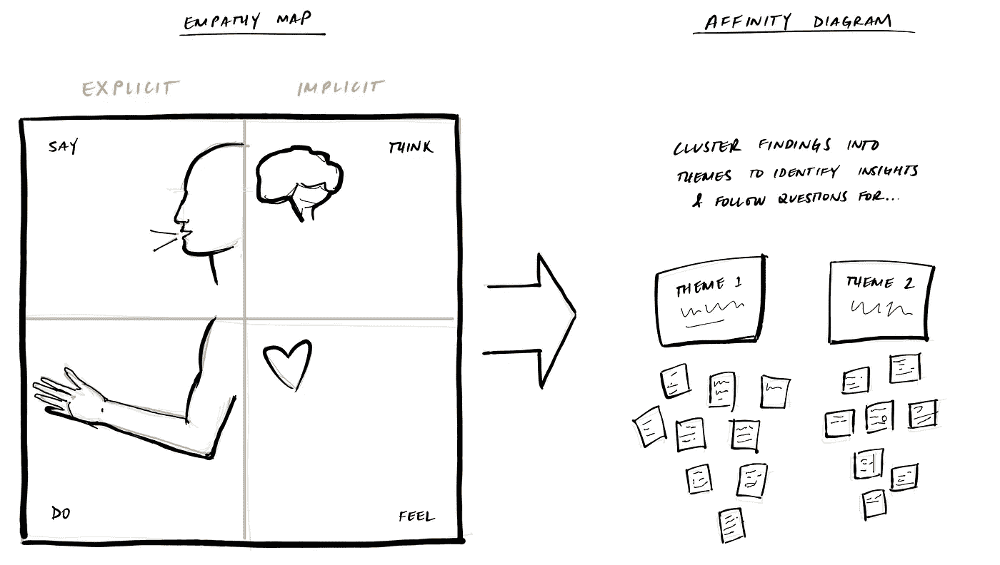

# 面试前，和客户聊聊。

> 原文：<https://medium.com/hackernoon/before-the-interview-talk-to-customers-1812833f16b1>

*搞定产品经理面试的实用方法*

成功的产品领导者是数据驱动和客户支持的——他们是[的建设者和远见者](/briancrofts/the-rise-of-product-leadership-a92e793f605a)。在面试中，你可以通过**先与客户交谈，以一种有意义的方式展示这些能力(这会让你从其他候选人中脱颖而出)。**

以下是你可以在每次面试中“冲洗并重复”的计划:

> 如果你正在为一个消费者应用程序寻找一个项目经理的角色，和 20 个客户谈谈。对于小企业，与 10 人交谈。对于 SaaS 企业，请与 5 联系。

在我分享一些相关的策略之前，让我们来谈谈为什么这是明智的，以及它将如何帮助你走向成功。

*   **产品知识**。比起简单地下载和使用，或者参与演示，你会对产品有更好的了解。
*   **顾客同理心**。你可以培养同理心，更好地理解客户的痛苦——以及产品能否有效解决这种痛苦。
*   **关键见解**。您将看到客户实际上是如何使用产品的——而不是人们说了什么，他们实际上做了什么——即“在野外”发生了什么

通过花时间和真实的客户在一起，你将能够提出更好的有深度的问题来问面试官。实际上，这不像是一次面试，而更像是一次谈话或工作会议，对每个人来说都是一次更好的经历。

**1。寻找客户**

以我的经验来看，几乎不需要什么调查和跑腿工作，就能相对容易地找到并吸引客户

*   **消费者**。询问你的朋友和家人是否使用该产品或服务。还要考虑竞争产品——甚至是类似的产品/服务。你也可以在 Craigslist 上发布广告，寻找愿意分享自己经历的客户。不仅要寻找采访的机会，还要寻找观察的机会。
*   **小型/中型企业**。和消费者类似，中小企业就在我们身边。你可以向朋友和家人寻求帮助，但简单地向小企业主介绍自己更有趣。第一次被介绍时，他们可能很忙，所以如果需要的话，安排一个时间回来(我很少被拒绝)。小企业主对他们的业务有着难以置信的热情，并且喜欢谈论他们的企业。
*   **企业。商家在主页上列出他们的顾客已经变得很普遍了。当然，这样做是为了建立信誉，帮助潜在客户对购买决策更有信心。记下这些名字，在 LinkedIn 上搜索一下——看看你的社交网络中是否有来自这些公司的人，然后请求引荐。**

**2。将你的观察结果&提炼为洞察力**

这是将客户的同理心转化为行动的关键一步。每次与客户接触后，我都会问自己 [**两个问题**](/briancrofts/inspiration-precedes-innovation-21fd5283893a) :什么令人惊讶？我看到了什么痛苦？

**客户移情图**在试图提取有用见解时也非常有用。

走同理心地图(如下)，在适当的地方贴上便签，从每个观察的显性(说，做)开始，然后到隐性(感觉，思考)。“这个人做了什么……”

**…说？**(引号和关键词)

**…做什么？**(动作和行为)

**…感觉？**(用文字/面部表情推断情绪)

**…觉得？**(推断信念，逻辑——如果我这样做，那么...)

Empathy map method learned at Intuit’s Innovation Catalyst program

*   将相关观察和见解分组到突出惊喜或客户难题的部分
*   确定深入探索的见解/设计挑战(这是面试官提问时产生问题的好方法)

**3。面试的最后准备**

现在你已经花时间和客户在一起，并将你的观察和发现综合成见解和主题，你已经为一次精彩的面试做好了准备。

作为发现过程的一部分，你可能会有一些有趣的想法，关于团队应该在哪里投资来改进他们的产品。准备好自信地分享你对产品及其发展方向的见解、想法，甚至是愿景。想一想投资你的一些想法可能会带来什么样的权衡或挑战。准备好问题，作为收集信息/改进想法的一种方式。当然，在捍卫自己观点的同时，也要对新观点持开放态度。

底线？在之前做好产品经理*通过展示你的客户支持和数据驱动的能力(或 PM 工艺)来雇用你——成为一个建设者和梦想家。做他们想雇的产品经理。*