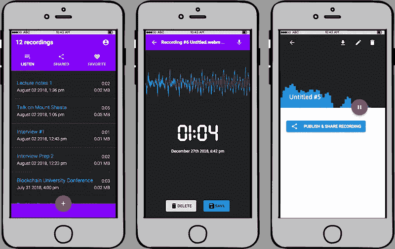
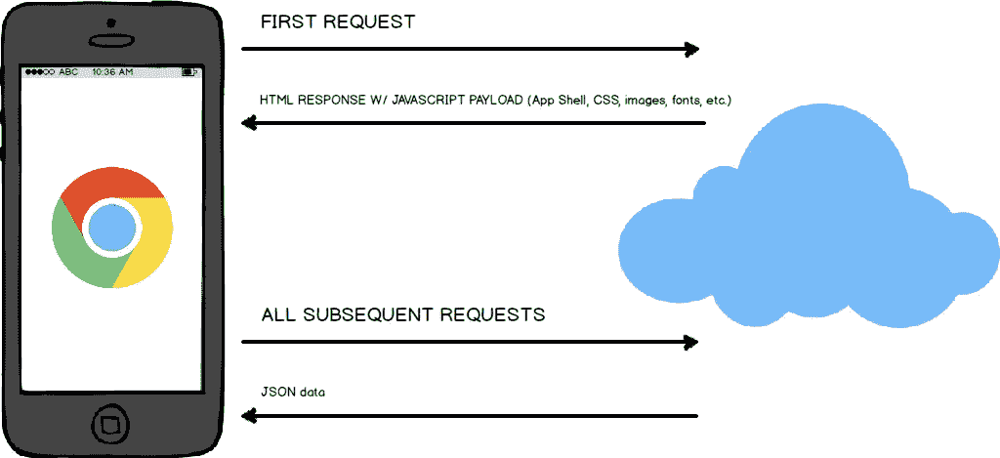
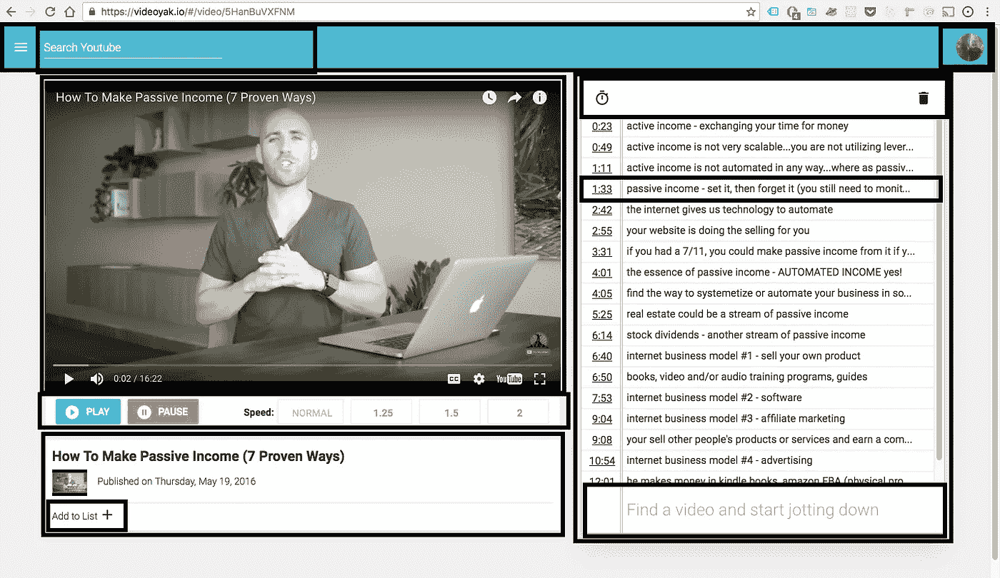
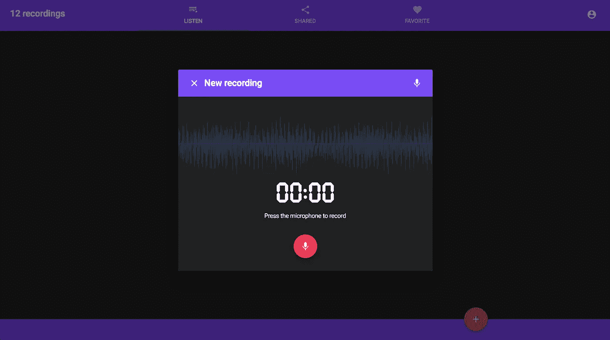
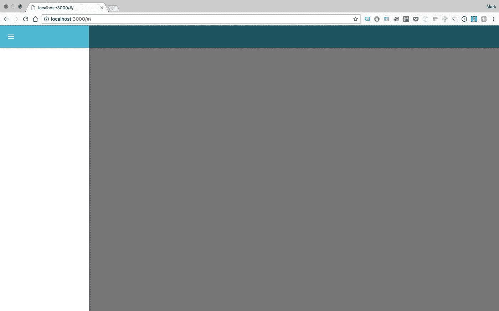

# 在你建造公共水疗中心之前，你需要一个水疗中心

> 原文：<https://medium.com/hackernoon/before-you-build-a-pwa-you-need-a-spa-e22770a0f31c>

你是否希望获得成为 6 位数前端工程师的技能，并掌握非常受欢迎的 React.js 生态系统？

*如果是的话，那就在 ProfessionalReactApp.com***报名参加一个令人兴奋的新培训项目吧！**

**避免错误——比如大量的技术债务——从专业人士那里获得指导，学习如何以正确的方式设计你的应用。最快、最简单、最省事的学习方法是让专家指导您掌握应用程序。**

**

*[professionalreactapp.com](https://professionalreactapp.com)*

# *介绍*

*网络的“应用”正在如火如荼地进行，这将为那些试图为使用各种设备的人提供有价值的数字服务的团队解决许多令人头疼的问题。进步的移动网络应用程序背后有巨大的能量，我认为这显示了网络(地球上最普遍的软件运行时)的巨大前景。*

*但值得注意的是，PWAs 必须满足 3 个主要标准:它们必须*可靠*(也称为离线工作)，它们必须*快速*(通过快速响应用户交互)，它们必须*参与*(它们需要感觉像一个真正的应用)。*

*那么如何让你的 Web App 感觉很快呢？你如何让交互变得流畅、敏捷，让它看起来更像软件而不是网站？*

# *单页应用程序*

*单页应用程序基本上是一个只有*一个* [HTML](https://hackernoon.com/tagged/html) 页面的网站，即使它可能有许多不同的视图。相比之下，常规网站是许多不同 HTML 页面的集合。*

*一个普通的网站感觉不同于一个[水疗中心](https://hackernoon.com/tagged/spa)，因为用户在与网站互动时会一页一页地“跳来跳去”。单击链接并导航后，您会看到一个断断续续的空白页。*

*在温泉中，没有弹簧单高跷。这是因为当用户第一次访问一个 URL 时，应用程序的整个外壳都被下载到浏览器中。然后可以缓存应用程序外壳，以便在进一步请求时不需要重新下载任何资产。类似于第一次从 App Store 下载安装手机应用。*

**

*Single Page Application architecture in a nutshell*

*重申一下，在第一次请求 SPA 时，您“安装”了应用程序。这是应用程序外壳和所有相关资产唯一一次通过管道发送。对服务器或第三方的所有后续请求仅用于设置或检索数据。后续请求不会将数据包装在 HTML 响应中，而是以 JSON 格式的数据进行响应。这让应用程序感觉很快，它消除了普通网站带来的 pogo sticking 效应。*

# *通过在组件中思考和开发来创建您的 SPA*

*我最喜欢的软件开发方法之一是“[用组件](https://facebook.github.io/react/docs/thinking-in-react.html)思考和开发”的概念。我怎么强调这种方法对我的发展有多大帮助都不为过。*

*在这种方法之前，没有一致的方法来模块化 Web 应用程序的各个部分。有各种各样的模式可以使用户界面更加模块化(想想模块模式)。但我们本质上是在单独的“脚本”中组织代码，并根据页面而不是组件来组织前端。这使得可重用性更具挑战性。*

*然后 ES6 出现了，给了我们真正的模块，而使用其他语言的开发人员认为这是理所当然的。现在，您可以使用基本的“导入”和“导出”关键字来导入和导出模块。因此，我们的前端变得更加模块化。*

*最终，我们可以访问像 React 这样强大的库，它为我们提供了封装 UI 部分的标准方法，同时抽象出对 DOM 的访问，开发变得更加容易。*

*组件开发的最大好处之一是**可重用性**，一旦你掌握了它，它将使你的应用程序管理变得更加愉快。*

**

*A SPA developed in components — anything encircled in black is an isolated component*

# *在组件中思考和开发的其他好处*

*这种基于组件的开发方法还有另一个好处。当有意义的时候，你可以打包你的组件并在 NPM 上发布。如果你知道你将与许多其他应用程序共享一个组件，这对生产力来说是一个真正的福音。这也是分享你的工作的好方法，这样其他人可以受益并节省时间(这也是增强你的作品集的好方法)。*

*例如，我正在编写一系列利用用户声音的应用程序(通过仅在 Chrome 和 Firefox 上可用的[媒体流录制 API](https://developer.mozilla.org/en-US/docs/Web/API/MediaStream_Recording_API) )。其中一个主要的 UI 元素是一个组件，它记录用户的声音，同时将其与视觉正弦波同步。这给了用户一个很好的指示，表明正在记录一些东西。*

**

*[React-Mic-Plus](https://react-mic-plus.professionalreactapp.com/sales-page23901658) component used on [voicerecordpro.com](https://voicerecordpro.com)*

*因为我将在其他应用程序中使用这个组件，也因为其他人可能会从中受益，所以我在 NPM 上打包了这个组件。它叫做 [React-Mic](https://www.npmjs.com/package/react-mic) ，你可以使用它并为自己的创作目的设计风格。*

*(如果你想学习如何创建和共享 UI 组件，可以查看我的教程“[在< 100 行代码中用 Material-UI 创建一个 React.js 自动完成搜索弓——第一部分](http://hackingbeauty.com/create-a-reactjs-component-part1/)”。)*

# *如何开始发展你的水疗中心*

*发展专业水疗中心还有其他几个因素。您需要知道如何设计和管理 CSS，如何创建 SPA 的生产版本，如何利用密钥库(如 React、Redux 和 React-Router 4)，如何通过服务工作者缓存使其离线工作，如何利用各种基于浏览器的存储机制、部署等等。*

*现在还没必要担心这些。你所需要的是一个预先配置好的白板和一个知识渊博的向导来正确引导你。*

*如果你愿意使用一个使用令人敬畏的 [Material-UI](http://material-ui.com/) 库的预制组件集合，你甚至不必担心你的 SPA 的初始设计。*

**

*The blank slate for your SPA when you start with [JimJam Boilerplate](http://jimjamboilerplate.com/)*

# *如何开发专业的 React 应用*

*嘿，我是业内的高级前端工程师，我使用 React 为许多成功的初创公司和知名公司开发软件应用程序。*

*UI 工程技能有需求， ***但是你需要有合适的技能*** 。你需要一个合适的基础来建立你成功的代码。*

*这也是为什么我在我的培训项目“ [*专业 React App*](https://professionalreactapp.com/special-offer) ”里教开发者如何开发专业 React App 的原因。这是一个循序渐进的视频课程，向您展示如何使用一个包含您需要的一切的高级基础 UI 样板，为客户、您的雇主或您自己设计和构建一个专业的 React 应用程序。*

*技能越强，选择越多，自由度越大。*

******

> *[黑客中午](http://bit.ly/Hackernoon)是黑客如何开始他们的下午。我们是 [@AMI](http://bit.ly/atAMIatAMI) 家庭的一员。我们现在[接受投稿](http://bit.ly/hackernoonsubmission)，并乐意[讨论广告&赞助](mailto:partners@amipublications.com)机会。*
> 
> *如果你喜欢这个故事，我们推荐你阅读我们的[最新科技故事](http://bit.ly/hackernoonlatestt)和[趋势科技故事](https://hackernoon.com/trending)。直到下一次，不要把世界的现实想当然！*

**