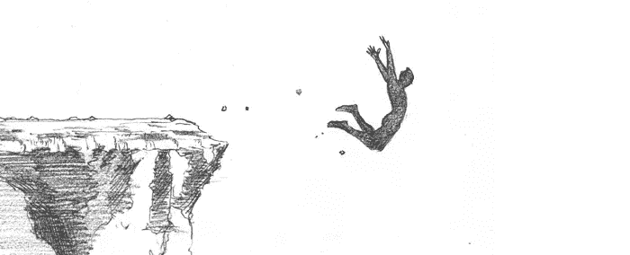
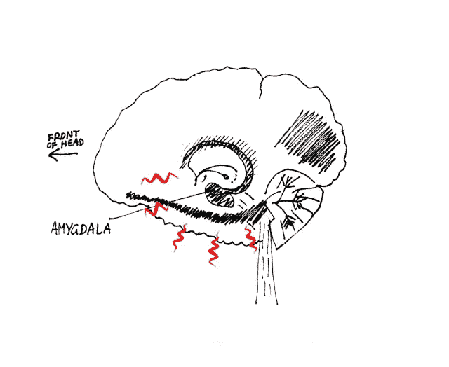
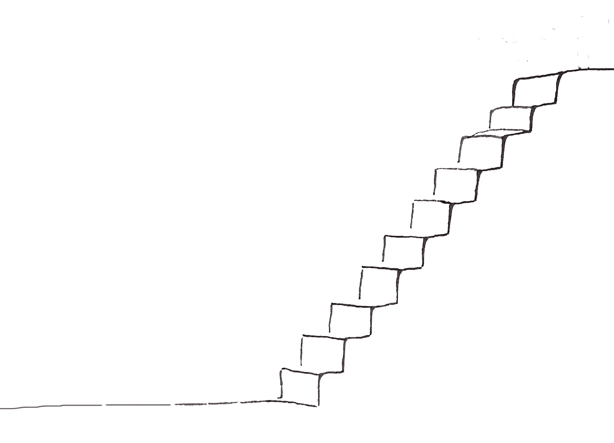

# 在你向你的梦想生活“飞跃”之前…

> 原文：<https://medium.com/hackernoon/before-you-take-a-leap-toward-your-dream-life-839d1c6d529b>

By [Max Miller](http://www.artagem.com/wp-content/uploads/2012/08/max_miller_flying.jpg)

# 暂停一下。

迈出一大步有一种英雄气概和值得注意的地方。超人和非凡的东西。

我们可以以某种方式克服人类局限性的想法，
我们可以采取巨大的信念飞跃，
克服超越人类的巨大挑战，
听起来*英勇，*，
和真正的浪漫。

我们想到:
拿着《信仰的飞跃》、
、【跳崖】、
、【烧船】……
、*一直在想。*

我们想要
做出史诗般的举动，从根本上改变我们的生活和事业，
*就好像我们是超级英雄一样。*

我欣赏你的进取心，但是让我们暂停一下。
我们能够克服自身局限的想法是伟大的…
但是让我们重新考虑一下:
我们是人类，而不是*超人*，
那么为什么我们必须*飞跃*，跳跃*跳跃*，燃烧，
才能从生活中得到我们真正渴望的东西呢？

你看…

**我们人类*容易受惊*。**我们害怕任何不习惯的东西。
每一次我们迈出这样的一大步，
每一次我们做出英勇的举动，
值得媒体报道…

当我们没有计划就辞职的时候，
当我们预算吃紧决定环游世界的时候。
当我们给自己一周的时间来交房租，否则我们就会无家可归……
这会引发我们的*恐惧或逃跑*反应。

杏仁核，
几千年来一直帮助我们生存，
开始发出巨大的尖锐噪音，
每当我们从悬崖边缘跳下，我们的生活。

The Amygdala, in panic mode.

事实是:
当我们‘跳船’或‘跳跃’的时候
我们人类变得恐惧……我们冻结了。
像车灯前的小鹿。我们冻结，我们奔跑，或者我们完全失去它。因为我们不是被设计来进行史诗般的跳跃的。

当我们做出一个大的令人害怕的举动时，
自我破坏，我们潜意识中的限制性信念出现了…
它们让我们错过了跳跃。

在发疯之前，我们的大脑很久以前就决定了我们愿意忍受多大的风险，我们能经历多少恐惧和巨大的变化。

我们的人类机器是为了保护我们的安全而制造的。我们的系统是由我们自己都没有意识到的安全机制构建而成的:
让我们远离任何危险的、史诗般的、突兀的或完全不同的事物。

我不是说我们应该在一个地方辞职，我们不应该追求我们的激情，克服我们最大的恐惧。但是你会把一个婴儿扔进冰冷的水桶里吗？
**号** 那么，你自己为什么一直往那个冰冰冷的桶里跳呢？你知道这没用。

一夜成名的故事，
冠军、英雄、超人和神童，
转瞬之间超越人类
，
是充满希望的人编造的故事..
就像你我一样，
走出好莱坞。

他们的故事是虚构的，不可复制。在好莱坞之外，我们仍然是人类。

我并不是说改变是不可能的。我并不是说我们都应该屈服于平庸，或者屈服于现状。

是的，我们适应力强，而且足智多谋。我们的能力远远超出我们的想象。

但是我们必须知道如何玩，并且有效地侵入我们的人类系统，
如果我们想要以‘史诗般’的方式有效地、成功地玩生命的游戏…

如果我们想成为史诗，我们必须从小处着手。

欺骗我们人类系统的最好方法，
是每天采取小的行动步骤，
慢慢地建立习惯，朝着宏伟的愿景前进，
这样我们就能缩小我们的[生理机能和我们超人的愿景之间的差距。](https://hackernoon.com/tagged/physiology)

日常习惯让人类系统
适应你想象中的宏大比例，
采取勇敢的行动步骤，
而不会触发我们的内部警报系统。

成功不是由一个接一个的大飞跃构成的。无论晴雨，它是由日复一日的一小步一小步的积累而成的。

罗马、谷歌、苹果都不是一天建成的。在谷歌成为谷歌之前，拉里和谢尔盖在一家汽车修理厂工作了七年。

让我们停止美化跳跃的想法，
燃烧船只，跳下悬崖，
让我们开始欣赏缓慢建造的艺术，
一致性的魔力，以及每日小步前进的艺术。

— — — -

想当作家？

开始每天写五分钟，然后十分钟…
然后每天三小时。如果你明天开始写你的第一本书，祝你好运。我祈祷你的自毁精灵不会让你得肺炎或烧掉你的房子。

当你想，我会写一本书，成为一个巨大的，国际知名的自助作家…
**你冻结。**

当你思考的时候，*我今天就写 1 页自助建议。* **你做吧。**

第二天，当你想到:*我今天要写 2 页自助建议。* **你做吧。**

第二天，当你想:今天我会写 3 页自助建议。
**你做吧。**

成功看起来从未如此容易。事实是，在大多数情况下，成功并不光彩。

虽然跳跃听起来很英勇。稳步迈向你的梦想生活听起来是真实的，
可行的，可操作的。

# 如果你喜欢这篇文章，记得把下面的❤分享给你的朋友。

# 如果你想保持联系，在这里订阅我的时事通讯[。](http://www.experimentonpurpose.com/)

> [黑客中午](http://bit.ly/Hackernoon)是黑客如何开始他们的下午。我们是 [@AMI](http://bit.ly/atAMIatAMI) 家庭的一员。我们现在[接受投稿](http://bit.ly/hackernoonsubmission)并乐意[讨论广告&赞助](mailto:partners@amipublications.com)机会。
> 
> 如果你喜欢这个故事，我们推荐你阅读我们的[最新科技故事](http://bit.ly/hackernoonlatestt)和[趋势科技故事](https://hackernoon.com/trending)。直到下一次，不要把世界的现实想当然！

