# 初学者咬:品尝灵丹妙药，一个美丽的，简洁的和富有成效的语言

> 原文：<https://medium.com/hackernoon/beginner-bites-a-taste-of-elixir-a-beautiful-concise-and-productive-language-82e03f69b92e>

你可能最近听说过这种语言。随着一个名为[凤凰](http://phoenixframework.org/)的新框架做出令人兴奋的声明，Elixir 已经获得了公众的关注。

Phoenix 被标榜为一个“高效、可靠和快速”的 web 框架，并且是用 Elixir 构建的。在对 Phoenix 过于兴奋之前，我想深入研究一下仙丹，看看这种神秘的语言能提供什么。

重要的事情先来。这些公司已经使用了灵丹妙药:

*   WhatsApp
*   不调和
*   拼趣
*   暴动小游戏
*   杂草地图

这引起了我的兴趣！


What will I do with such a beautiful language

今天，我想通过一个小小的黑客问题向你展示 Elixir 带来的一些乐趣。

我们将涵盖，基本功能，迭代集合，获取用户输入，管道，模式匹配和警卫。

在我们开始解决这个问题之前，让我们先安装 Elixir 并创建一个项目！

## 入门指南

Elixir 有很好的关于起床和跑步的说明[这里](https://elixir-lang.org/install.html)！

通过在终端或命令提示符下键入`elixir -v`,检查您是否正确安装了 elixir:

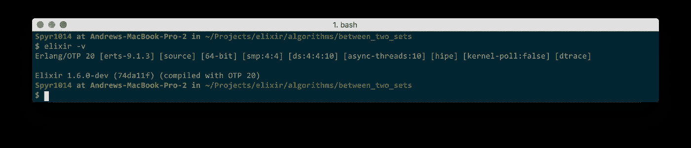

长生不老药配有极好的工具。

*   混合:仙丹的构建工具。它设置你的项目，获取依赖项并测试你的代码。太牛逼了。
*   IEx:一个动态测试代码的交互式 repl。我总是用它打字。在你的终端/命令提示符下用`iex`打开它，但是我们稍后会讲到。
*   ExUnit:一个简单但强大的测试框架。在这篇文章中，我们不会涉及太多。

让我们开始编码这个问题吧！

如果你正在寻找一个 IDE 来编写你的灵丹妙药，我强烈推荐安装了 [*vscode-elixir 插件*](https://marketplace.visualstudio.com/items?itemName=mjmcloug.vscode-elixir) *的*[*vs code*](https://code.visualstudio.com/)*。它是轻量级的，反应灵敏的，并且有语法高亮和自动完成等优点。提示:* ***视图- >集成终端*** *将打开一个终端，您可以在其中使用 Iex。*

## 开始一个项目

导航到您想要放置项目的目录(这是这个代码问题的解决方案)。一旦你在终端中导航到这个文件夹，用命令`mix new hackerrank_sol`创建一个新项目。当然，你可以随意称呼这个项目。

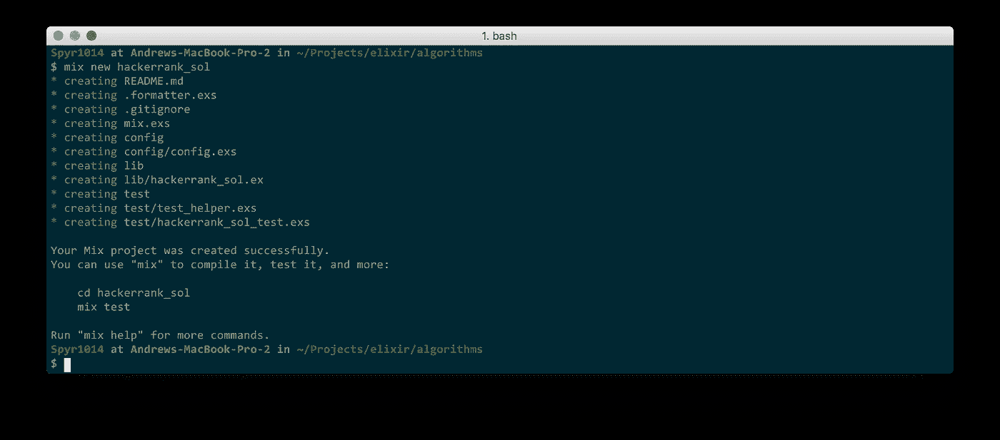

这将创建一个包含您的 Elixir 项目的新文件夹。让我们在我们最喜欢的代码编辑器中打开这个文件夹。我们的代码将存在于以下文件中:`lib/hackerrank_sol.ex`。通过运行`mix test`检查一切正常。

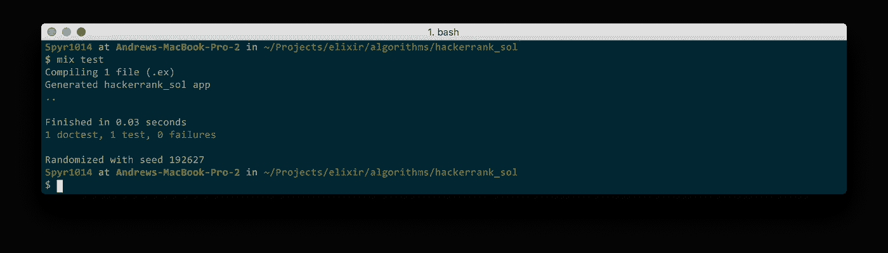

## 我们来编码吧！

您的`lib/hackerrank_sol.ex`文件中已经有一些代码:

我们将保留它，并开始在一个名为`Solution`的新模块中对其进行编码(一个文件中可以有多个模块)。

这个问题需要我们获得用户输入。特别是一串数字。让我们打开终端中的 Iex，看看我们需要什么。

在你的终端中输入`iex`，你将会受到友好的 REPL 的欢迎。经常使用`h()`查找关于函数的信息，因为文档很棒。

因为我们想从用户那里获得 IO，所以我们将查看 IO 模块。此处模块列表:[https://hexdocs.pm/elixir/Kernel.html](https://hexdocs.pm/elixir/Kernel.html)

在`iex`中，我们可以看到 IO 输出了什么，也可以像这样请求帮助:

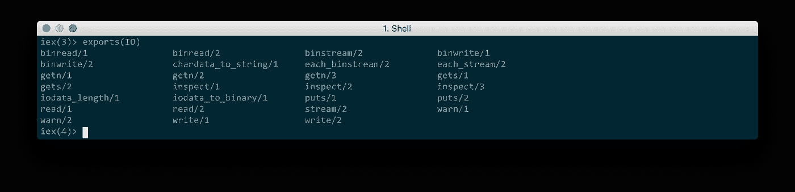

Here I’m using `exports` to find out what IO exports

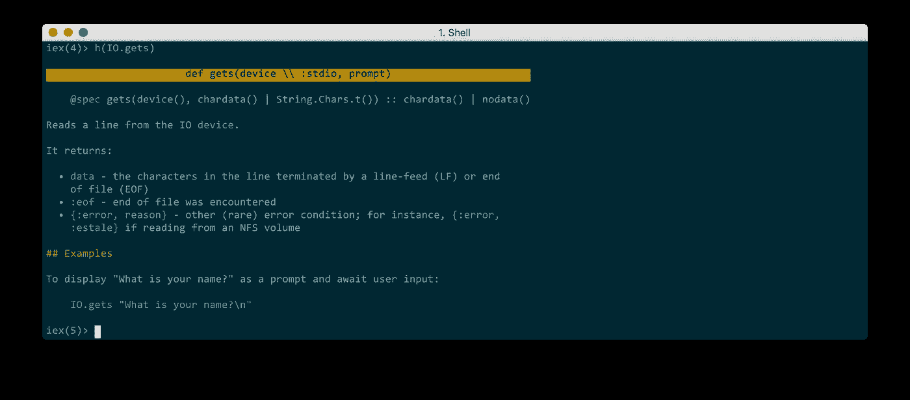

Now I’m using `h(IO.gets)` to ask Elixir what the function gets does.

神圣的 moly，**我们得到一个例子**和其他好的信息！关于名字`IO.gets/2`的一个快速注释。`/2`仅仅意味着函数接受两个参数。类似地，`/1`表示一个参数，而`/0`表示零个参数。这个函数的名字叫做 **arity** 。(现在你又有了一个很棒的派对事实)

让我们在`iex`中使用这个函数，尝试一下它返回的内容。

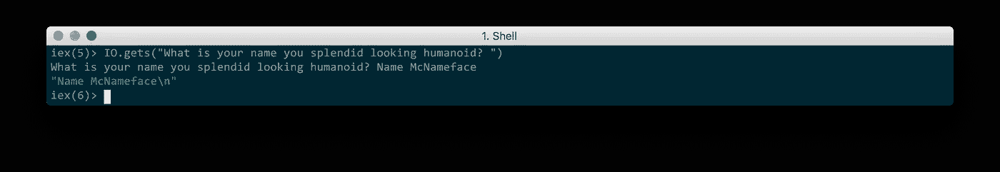

好吧！我们现在真的应该试着解决这个问题！

> 注意:您可以使用`IO.puts/1`打印到控制台

# 两组之间

这个问题可以概括为:

*   给我们一条长度为两个数组的线， **a** 和 **b.**
*   我们给了一个数组**一个**。这是一个整数列表。
*   我们得到一个数组 **b** 。它也是一个整数列表。

一个元素 **x** 被称为在 **a** 和 **b** 之间，如果:

*   数组 **a** 中的所有元素都是 **x** 的因子。
*   **x** 是 **b** 中所有元素的因子。

然后我们想知道, **x** 有多少个不同的值。

[查看 hackerrank 给出的具体示例，以明确需要什么](https://www.hackerrank.com/challenges/between-two-sets/problem)。

让我们把这个问题分成三块:

*   获取和处理输入。
*   确保 **x** 是 **b.** 中所有元素的因子
*   确保数组 **a** 中的所有元素都是 **x** 的因子。

## 获取和处理输入

这真的是干净的仙丹。我们有从标准输入中获取一行输入的`IO.gets/1`。在这个问题中，我们将得到 3 行输入，每一行都是一个整数列表。让我们创建一个通用的`getLine/0`函数，它从 stdin 获取一行数据并返回一个数字列表。

这里有一个简单的实现，应该很容易理解。随意使用 **iex** 来浏览这些行，看看每一行在做什么。

如果您想测试这个功能，在您的终端中使用这个命令启动 iex:`iex -S mix`。这个命令允许您在 iex 中访问您的 mix 项目。如果你修改了代码，你也可以使用`recompile()`来重新编译你的工作，这样你就可以使用最新的代码。

为了在`iex`中测试这个函数，我们键入`Solution.getLine()`。

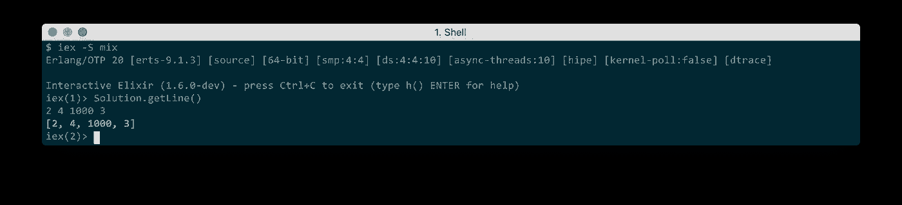

在使这段代码更加地道之前，我们先来看看 elixir 提供的一些很棒的东西。我们在函数上面有这个`@doc`标签。这被称为模块属性，它告诉 Elixir 您已经向`getLine/0`函数提供了文档。键入`h(Solution.getLine/0)`并观察您自己的文档显示的所有荣耀！(注意文档支持降价！)

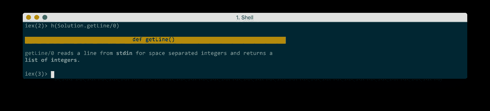

This is beautiful professional documentation.

我们现在不会详细讨论这个问题，但是您也可以在您的文档中编写可执行的文档测试。大多数时候，当你在文档中看到例子时，它们是可执行的，以确保它们是有效的。这允许单元测试和集成测试的分离。

让我们快速浏览一下看起来很时髦的一行:

```
converted_to_int = Enum.map(split_line, fn el -> String.to_integer(el) end)
```

我们映射一个字符串列表，并将每个元素转换成一个整数。发生了以下情况:

`["1", "10", "3"] -- *Enum.map* --> [1, 10, 3]`

每个元素都作为`el`传递给匿名函数，然后匿名函数将字符串转换成整数。

函数的最后一行被隐式返回。我发现这实际上鼓励了干净的编码，因为很难写出奇怪的嵌套条件，它们会奇怪地返回。

让我们来清理一下，这样每个人都会对使用另一个令人敬畏的仙丹操作员印象深刻…

*我们将相信每个字符串都是有效的整数(但在现实世界中不应该这样)。*

## 管道操作员

我们的职能中出现了一种模式。每一行都将上面函数的输出作为第一个参数。Elixir 为我们提供了这个很酷的操作符:`|>`,它将输出从左向右传输。

Check out the code without all the intermediate variables!

注意，我们删除了每个函数的第一个参数，因为它是由管道操作符处理的。

输入完毕！现在让我们着手确保 **x** 是 **b** 中所有元素的一个因子。

## 确保 **x** 是 **b** 中所有元素的因子。

我就直入主题了。我们需要找出列表 **b** 中元素的最大公约数。那么如果 **x** 除以最小公约数，它满足条件:它是 **b** 所有元素的因子。

有没有瞬间尖叫*欧几里德的算法*？稍后快速搜索**寻找最大公约数**你会发现这个数学公式。

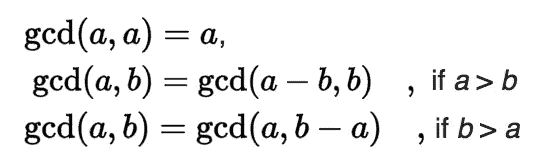

Straight from [wikipedia](https://en.wikipedia.org/wiki/Greatest_common_divisor#Using_Euclid.27s_algorithm)

您还记得编码该算法的一种强制性方式(来自 python 的标准库):

```
def gcd(a, b):
    """Calculate the Greatest Common Divisor of a and b.
    Unless b==0, the result will have the same sign as b (so that      
    when b is divided by it, the result comes out positive).
    """
    while b:
        a, b = b, a%b
    return a
```

我们将做得更好，用 Elixir 编写我们自己的代码，它使用数学定义，提供很好的错误消息，并且仍然很快。

## 防护和模式匹配

Elixir 支持模式匹配以及检查函数输入的条件。下面是一个简单的模式匹配示例:

我们在这里说的是，如果参数是`0`，我们想要运行函数的顶层版本。如果参数不是`0`，我们将在一个字符串中返回它。

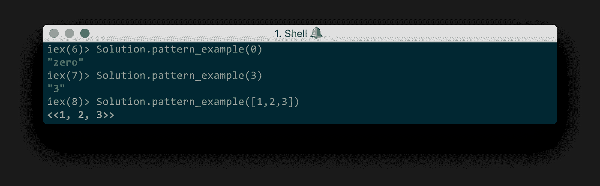

Wait!!! We don’t want that third behaviour!

这是可行的，但不幸的是参数`x`可以是任何东西！幸运的是，我们有 [**守卫**](https://hexdocs.pm/elixir/master/guards.html) ，允许我们给参数添加约束。

我们可以通过添加`is_integer`守卫来改进这个模式匹配示例，如下所示:

看看当我们试图传递无效的东西时会发生什么:

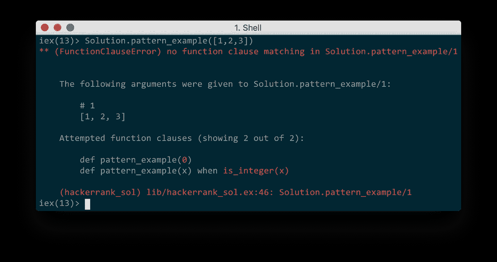

Taking our new guard for a test run.

我们得到了一个非常有用的信息，它特别指出了我们的论点失败的地方。我们可以看到一个`[1,2,3]`的列表没能成为`0`。它也不是整数。

我们现在已经有足够的东西来编写我们的`gcd`函数了。

守卫比代码多！(*嘶，仙丹中有一种方法可以创造你自己的组合守卫，但那不在今天的讨论范围之内*)

这也遵循了最大公约数的数学定义！当然有一种更快的方法来使用余数，我把它作为练习留给你们。([解](https://gist.github.com/SpyR1014/dbd333de6f7dc9fb07bf4f9f8b6556f0))

我们需要找到一个列表的最大公约数。为了找到一系列数字的 gcd，我们只需要根据当前的最大公约数减少这些数字，我们用每个元素更新这个最大公约数。我就用图吧！

我们从这个列表开始:`[8, 4, 16, 2]`

然后我们在前两个数字上使用`gcd`:

```
Reducing    --   List left to reduce
------------------------------------
gcd(8, 4)   --   [16, 2]
= 4         --   [16, 2]
gcd(4, 16)  --   [2]
= 4         --   [2]
gcd(4, 2)   --   []
= 2
```

有一个功能可以做到这一点，叫做`Enum.reduce/2`。这个列表缩减函数也可以称为`gcd`，因为它在计算最大公约数。

## 计算最低公倍数

现在我们有了一个`gcd`函数，最小公倍数就简单多了。事实上是下面的公式:

> lcm( *a* ，*b*)=*a*×*b*/gcd(*a*， *b* )

该死，这是一个伟大的公式。我们可以很容易地编写代码，包括演示的减少。

## 大结局

既然我们有了获取输入的方法、找到最大公约数的方法和找到最小公倍数的方法，我们几乎就有了找到解决方案的方法。

我们要用有史以来最无聊的方法找到解决方案。我们将从最小公倍数到最大公约数“循环”每个整数，检查该数字是否满足问题的两个条件。然后我们将计算满足测试的结果 **x** 值。

在我们将要编写的函数中，我们将接受最大值(**或 list** **b** 的 gcd)。我们还将接受最低值(**或列表 a 的 LCM**)。

我们首先检查列表 **b** 中的 **gcd** 值是否大于列表 **a** 中的 **lcm** 值(否则保护失败，我们返回 0)。

`lowest..highest`是一个范围。医生说。

> ”定义一个范围”

`1..3`基本上就是我们上面使用的`[1,2,3]`。该代码基本上创建了一个介于最小和最大值之间的所有可能的 **x** 值的范围，然后根据这两个条件进行过滤。第一个过滤器检查 **x** 是列表 **a** 的 lcm 的倍数。第二个过滤器检查 **x** 是列表 **b** 的 gcf 的一个因子。然后我们统计结果:)

现在，我们可以将各个部分放在一起以获得输入，并计算结果:

This puts it all together to solve the hackerrank problem! :)

恭喜你读到这里！希望我已经向你展示了长生不老药是一种乐趣。模式匹配和保护的概念允许你对你的函数所采用的内容实施更好的前提条件。

模式匹配比这里所展示的要深入得多，它确实有助于编写可读、可爱的代码。[黑客排名代码的完整解决方案在此](https://gist.github.com/SpyR1014/d35dce82460d468055d28be00261c08b)。

我还没有介绍这种语言的测试有多棒，或者 Elixir 1.6 附带了一个代码格式化程序。我甚至没有提到尾部递归或角色模型，也没有提到用这种语言进行并发编程是多么容易。

我希望你喜欢这个旋风式的旅行，如果你使用了仙丹或者对这个帖子感兴趣，请留下你的评论！我也喜欢掌声，如果你喜欢这篇文章，我会非常感激。