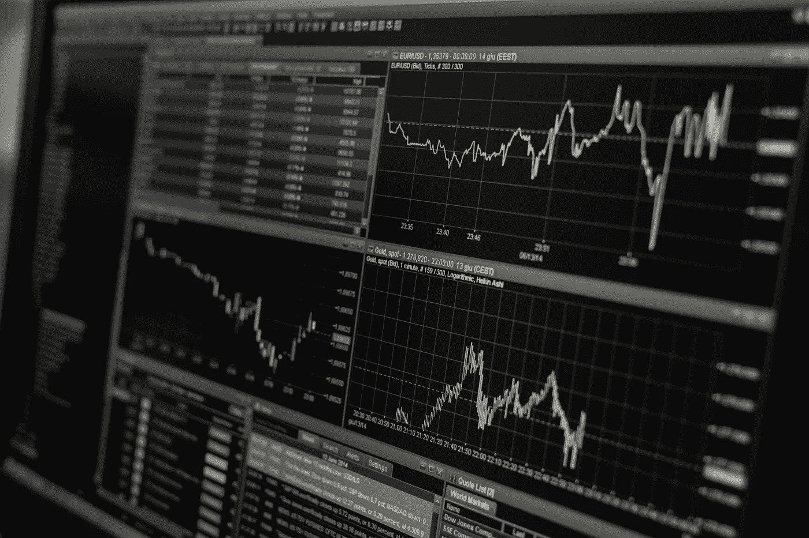

# 加密货币交易入门指南(如何盈利)

> 原文：<https://medium.com/hackernoon/beginners-guide-to-cryptocurrency-trading-how-to-make-profit-fcaf68f63b44>

一些加密货币交易者可能会忘记交易平台上存在的“陷阱”。为了帮助新手避免这种情况，并开始从交易中赚第一笔钱，在这篇短文中，我列出了最重要的提示。

1.理论。在你第一次在交易平台上交易之前，我强烈建议你了解一些基本知识。了解或询问烛台图表(也称为日本烛台图表)，订单簿，传播和深度图表。您还必须了解不同的订单类型。我将在下一篇文章中讨论它。

2.加密货币平台费用。不同的交易平台收费不同。使用其中一些你将支付每笔交易的百分比，使用另一个你将支付收入和结果(支出)交易。在开始使用它之前理解平台规则。

3.技术分析。记住，技术分析是基于过去的信息。甚至不要试图预测未来的加密货币价格，没有人知道它。

4.仲裁。一些交易者可能认为从两个平台的价格差异中获利非常容易。是的，这是可能的，但是不要忘记隐藏的危险。主要问题是，在操作过程中，汇率会发生显著变化。如果你在两个平台上都有法定货币和加密货币，你就可以降低风险。很少有其他问题，如你感兴趣的价格的可用数量少，订单执行延迟，交易费用。

5.分销。为了减少可能的风险，最好将你的钱分散到不同的加密货币中。例如，在你的钱包里，你可以有 40%的比特币，25%的以太坊，20%的比特币现金，15%的莱特币。永远不要卖掉你在这次发行中的所有部分。

6.常识。在加密货币交易平台上玩游戏要最大限度地注意和小心。记住，你刚刚开始你的交易方式！

7.追踪。如果你想成功，跟踪最新的加密货币新闻，排名和关键指标。每天。它会帮助你做出正确的决定。我个人用的是 LiveMarketCap.com 的 T1。与 CoinMarketCap 不同，在那里你会发现一个基于可靠来源的新闻聚合器(CoinTelegraph，CoinDesk，…)。还有一些有趣的指标，如通货膨胀图和 CMGR(复合月增长率)。我将在下一篇文章中尝试介绍主要指标。

这可能是开始前最重要的提示。**不要用你输不起的钱交易！**真的。新手准备做一件愚蠢的事情，就像投资全部积蓄一样。最愚蠢的是把家人和朋友的钱拿去投资比特币、莱特币、ripple 等。所以，请永远考虑这样的选择，如果你不知道你在做什么，你可能会失去一切。

仅此而已。投资愉快！

> 感谢阅读！如果你喜欢，请鼓掌支持👏👏👏还有分享帖子。欢迎在下面留下你的评论💭。

> ***丹波多兰*** *是区块链* ***开发商*******投资方*** *。**
> 
> **他是***的 CEO。它提供所有活跃加密货币的实时排名，包括最新的加密货币新闻、市场价格、图表和分析。***
> 
> ***有反馈吗？关注 LiveMarketCap 上的* [*推特*](https://twitter.com/livemarketcap) *！👋***