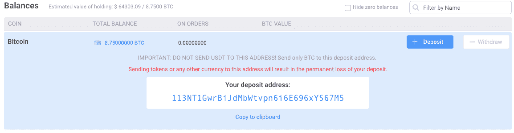
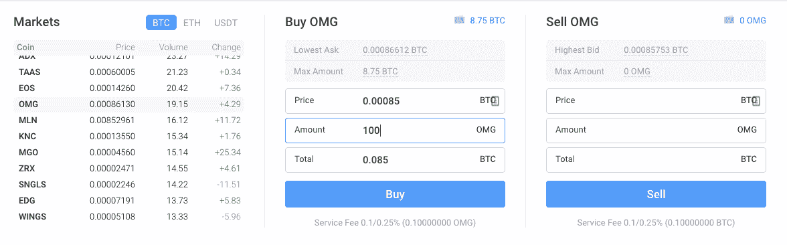

# 比特币、Altcoin、ICOs 投资入门指南

> 原文：<https://medium.com/hackernoon/beginners-guide-to-investing-in-bitcoin-altcoin-and-ico-b0f2906a9fc1>

*免责声明:本文无意作为投资建议。加密货币有风险。不要投资超过你能承受的损失。在进行任何投资之前，一定要寻求专业建议。*

**如果你是加密货币领域的新手，请提供一些关于比特币和区块链的背景知识:**

1.  [比特币](https://hackernoon.com/tagged/bitcoin)和[区块链](https://hackernoon.com/tagged/blockchain)协议基础:
    [http://www . Michael Nielsen . org/ddi/how-the-bit coin-protocol-actually-works/](http://www.michaelnielsen.org/ddi/how-the-bitcoin-protocol-actually-works/)
2.  [https://www.youtube.com/watch?v=o3im-TsfQ9I](https://www.youtube.com/watch?v=o3im-TsfQ9I)【简单视频讲解】
3.  加密货币图表和市值[检查历史价格和每日交易量]

[https://coinmarketcap.com/](https://coinmarketcap.com/)

iOS 应用:[https://itunes.apple.com/us/app/coincap/id1074052280?mt=8](https://itunes.apple.com/us/app/coincap/id1074052280?mt=8)

安卓应用[https://play.google.com/store/apps/details?id = io . coin cap . coin cap&HL = en](https://play.google.com/store/apps/details?id=io.coinCap.coinCap&hl=en)

## 交换

交易所是您可以买卖加密货币以换取法定货币(如印度卢比/美元/CNY)的地方。

对于印度居民:

*   [https://www.zebpay.com/](https://www.zebpay.com/)
*   【https://www.unocoin.com/】
*   [https://koinex.in/](https://koinex.in/)(解说视频:[https://koinex.in/how_it_works](https://koinex.in/how_it_works))

对外交流

*   https://www.cex.io 他们的利率通常较高，收取 3.5%的存款费+你还要向银行支付 3.5%的货币兑换费。
*   [https://www.poloniex.com](https://www.poloniex.com)
*   https://www.coinbase.com

## 投资另类硬币[除比特币之外的任何货币]时要寻找的指标

1.  理想情况下，你应该投资总市值超过 1 亿美元的硬币。
2.  检查硬币的每日交易量(24 小时内交易的硬币价值)，理想情况下应超过 100 万美元，因为低交易量的硬币表明其他买家/卖家缺乏兴趣。
3.  去 http://www.reddit.com 搜索硬币行情系统，看看人们对硬币的看法。
4.  阅读有关组织谁开始了硬币，看看他们是否可以信任。
5.  不要被那些认为未来几个月硬币价格将上涨 X 倍的人所左右。不要被任何人的承诺所迷惑。
6.  永远记住，没有人能保证你的投资有固定的回报。

## 购买替代币的步骤:

1.  从上面提到的任何一个交易所购买比特币或 ETH。
2.  在 https://www.poloniex.com[或 https://www.binance.com](https://www.poloniex.com)[报名](https://www.binance.com)
3.  转到网站的存款页面，记下“地址”

1.  然后在你持有比特币/以太币的交易所进入取款选项，将它转移到从 Liqui.io 或币安复制的“地址”。
2.  然后转到“外汇”标签，选择你想购买的货币对。

1.  输入您想要购买的价格，并选择您想要购买的硬币数量，相应的价格将以总 BTC 显示给您，然后单击购买。
2.  如果你决定在晚些时候出售代币，你可以提出一个出售订单，拿回你的 BTC。

## 如何投资 ICO

*首次发行硬币(* ***ICO*** *)是一种通过使用加密货币进行众筹的不受监管且有争议的方式，加密货币可以成为创业公司的资金来源。在一个****ICO****中，将新发行的加密货币的一定比例出售给投资者，以换取法定货币或比特币等其他加密货币。
查看*[*https://token data . io*](https://tokendata.io)*了解通过 ico 募集资金的机构过往表现。*

1.  投资 ico 是件棘手的事情，你必须对团队、他们参与的项目以及支持它的人进行深入研究。
2.  您可以在以下网站中找到有关即将推出的 ico 的信息

*   [https://www.icoalert.com](https://www.icoalert.com)
*   [http://www.icohunt.co](http://www.icohunt.co)
*   [http://www.tokendata.io](http://www.tokendata.io) 【您可以查看过去 ico 的统计数据及其性能。
*   【https://icostats.com 号

## 投资 ICO 的步骤

1.  从交易所将您的以太网或比特币转移到钱包:
2.  这样做的原因是，当你使用一个集中的服务，如比特币基地/Unocoin/Poloniex 这样的公司，你不拥有你的比特币或以太网地址的私钥。ico 通常的工作方式是，你向他们发送以太网或比特币，智能合约会立即将令牌发送回你的地址。但由于你在 Zebpay 或 Liqui 或比特币基地账户中没有私钥，如果你从你的交易所账户向 ICO 地址发送以太或比特币，你只会丰富交易所，而不是获得你想要的令牌。
3.  如果你使用的是 ICOs 中普遍接受的以太，你可以使用像[我的以太钱包](https://myetherwallet.com/)这样的网站在那里创建一个新的以太坊密钥，并将你在比特币基地的以太转移到那个钱包。另一个选择是[平价](https://parity.io/)，它使你能够在一个准确的时间投资一个 ICO——如果你认为 ICO 会在几秒钟内售罄，你可能会想使用这个功能。一旦你将你的硬币转移到一个用户控制的钱包，你将拥有一个以太或比特币地址，其私钥由你控制——这意味着你也可以在那里接收令牌。
4.  代币销售将张贴一个地址，在特定的时间窗口内收集金钱。非常小心，你要寄送硬币的地址实际上是代币销售的地址。试图让人们将以太和比特币转移到别处的骗局比比皆是。事实上，昨天，在 ICO 期间，Coindash.io 的网站遭到了黑客攻击，这些骗子似乎仅仅通过将网站上的地址改为他们自己的地址，就偷走了价值 790 万美元的乙醚。
5.  您将获得基于您贡献的代币。
6.  收到代币后，你可以将其转移到 Liqui.io 或币安或 EtherDelta.io 出售这些代币，如果你愿意，并获得 BTC/ETH 作为回报。

**关注博客(订阅他们的时事通讯)。**

*   [https://www.coindesk.com/](https://www.coindesk.com/)
*   [https://cointelegraph.com/](https://cointelegraph.com/)
*   [https://bitcoinmagazine.com/](https://bitcoinmagazine.com/)

**比特币影响者的 Twitter 名单**

*   https://twitter.com/kaleazy/lists/bitcoin-influencers

**Reddit 线程订阅**。

*   [https://www.reddit.com/r/ethtrader/](https://www.reddit.com/r/ethtrader/)
*   [https://www.reddit.com/r/ico/](https://www.reddit.com/r/ico/)
*   [https://www.reddit.com/r/Bitcoin/](https://www.reddit.com/r/Bitcoin/)
*   [https://www.reddit.com/r/CryptoCurrency/](https://www.reddit.com/r/CryptoCurrency/)

几乎所有顶级币都有自己的 Reddit 线程，搜一下就知道了。

**后续媒体出版物:**

*   http://tokeneconomy.co/【订阅他们的时事通讯】
*   [https://medium.com/jenkins-crypto-ideas](https://medium.com/jenkins-crypto-ideas)

使用谷歌搜索更多关于硬币的信息。去 https://www.bitcointalk.org 或 Reddit，看看人们对那枚硬币的评论。

## 我们长期持有的硬币:[做你自己的研究]

BTC:比特币

**ETH** :以太[https://ethereum.org](https://ethereum.org)【我一直在以太坊上亲自开发 dApps】

**尼奥**:前安托什[https://neo.org/](https://neo.org/)

**https://status.im/**SNT:状态令牌

**短期:**
你要持续监控(你可以从你现在的交易所转移你的 ETH 或者 BTC 之后，从 Liqui.io 或者 Binance.com 或者 Poloniex.com 购买)

**LTC** :莱特币

https://stratisplatform.com/斯特拉斯

**IOTA**:[https://iota.org/](https://iota.org/):

并继续检查[http://www.icohunt.co](http://www.icohunt.co)新的 ICO 相关新闻和信息

在推特上关注我们:[https://twitter.com/icohuntdotco](https://twitter.com/icohuntdotco)
在推特上关注我@[https://twitter.com/haliminfinity](https://twitter.com/haliminfinity)