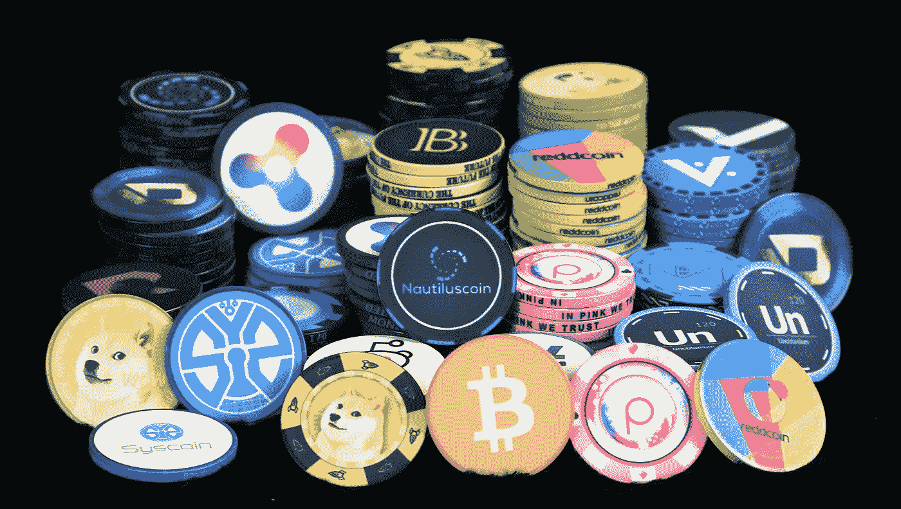

# 投资加密货币的完全初学者指南

> 原文：<https://medium.com/hackernoon/beginners-guide-to-investing-in-cryptocurrency-5ec5139c609b>

## **如何开始投资** **加密货币的分步指南。**

Image Courtesy of [CardChat](https://www.cardschat.com/news/wpn-poker-sites-will-accept-60-cryptocurrencies-as-funding-method-51777)

## 在你开始准备购买加密软件之前，你应该做一些研究。

*如果你在寻找更多关于购买硬币/如何安全储存和(或)交易的实际过程的分步指南，请跳到第 6 步。*

我已经帮助很多人开始投资加密货币，这意味着我在一天的任何时候都会收到很多关于如何做这个或那个的问题——为了保持理智，我创建了这个指南供人们参考。

## ***1。接受你一无所知的事实。***

你需要接受你什么都不知道的事实，不要带着对市场行为的先入为主的想法进入这个市场。

*基本上，*不要带着 here 进入这个市场——比如你的朋友说，到 2018 年 5 月，ETH 将达到 10 万美元。

如果你有炒股的背景，我不会和你谈——把你对技术和基本面分析的理解带到 *Blocktrain* (版权待定)。

也就是说，确保以开放的心态去做，仅仅因为你的策略在外汇交易中 93.27896%的时候有效，并不意味着它在这里也会有效。

**奖励回合:**一个不“持有”加密货币，一个“持有”

当我第一次进入加密世界时，Reddit 是我最好的朋友。

查看[r/Cryptocurrency](https://www.reddit.com/r/CryptoCurrency/)&[r/block chain](https://www.reddit.com/r/BlockChain/)让你快速上手。

*以下是十大市值硬币的子分类*

[/r/比特币](https://www.reddit.com/r/Bitcoin)[/r/以太坊](https://www.reddit.com/r/Ethereum)[/r/涟漪](https://www.reddit.com/r/Ripple)[/r/比特币现金](https://www.reddit.com/r/BitcoinCash)

[/r/litecon](https://www.reddit.com/r/Litecoin)[/r/dash pay](https://www.reddit.com/r/Dashpay)[/r/NEM](https://www.reddit.com/r/NEM)[/r/NEO](https://www.reddit.com/r/NEO)[/r/IOTA](https://www.reddit.com/r/IOTA)

[/r/Monero](https://www.reddit.com/r/Monero)

*旁注:我想借此机会赞扬一下比特币，这些家伙已经存在很久了。我仍然是这个社区的学徒，人们在这些社区中创造的资源和信息(完全免费)令人惊叹。*

## **3。对市场如何变动有一个基本的了解，即瑞士联邦理工学院/BTC 大学/长期资本公司&替代货币如何相互影响**

有很多硬币。以太坊、比特币和莱特币是市值最高的硬币，它们已经存在了相当长的一段时间——它们通常是初学者投资的第一批硬币之一。

*旁注:不管你投资什么，你也应该买一些 BTC，因为很多硬币不是和美元* ( *甚至是瑞士法郎)配对的，你需要有 BTC 才能买到它们。*

尽管它最近的极端波动性(在撰写本文时:BTC 昨晚打破了它的历史新高$ *8，000 美元*，并且似乎有望在挤兑结束前触及 10，000 美元)，BTC 和其他前 2 名是将你的钱长期储存在加密货币中的最佳地点。

当你看到价格大幅波动%时，不要惊慌，只需买蘸酱，HODL**。**

**比特币，以及另外两个加密 bae，ETH 和 LTC，是在 crypto 中储存你的钱的最稳定的地方。把这些当做你的安全投资。**

**就我个人而言，我把我的大部分财产(大约 60%)分成这三种硬币。我用剩下的 40%投资市值较小但回报潜力较高的硬币。**

**长期资本非常稳定，如果你想买入，等待它盘整和下跌(它最近处于漂亮的牛市，**永远不要在上升趋势中买入。你可能会赶上顶端**。**

**一旦你阅读了区块链、ETH、BTC 和 LTC，步入坏的一面，进入 altcoin 世界。**

**替代硬币被称为“狗屎硬币”，几乎是任何不在十大市值硬币之列的硬币，尽管一些纯粹主义者会认为替代硬币都不是 BTC 硬币。**

**替代硬币可能是令人兴奋的，因为这些硬币的回报潜力可能比它们在顶级市值名单中的高价表亲大得多。**

**需要考虑的一件事是，替代硬币随着 BTC 的价格波动，所以如果有一天你的替代硬币投资组合下跌了可笑的%。**

**当 BTC 处于上升趋势时，人们把钱从备用硬币转移到 BTC，试图抓住这一波行情。**

****这是购买山寨币的最佳时机。****

**这是我两天内第二次在 Quora 上引用沃伦巴菲特的话，但现在是这样的，“当街上有血的时候就买”。**

**当你在 Twitter 上搜索#altcoin，每个人都在为他们损失了多少钱而哭泣，这意味着是时候以巨大的折扣投资你最喜欢的硬币了。**

## *****4。对你想投资的每一枚硬币背后的团队，以及他们正在实现的概念，做极端尽职调查。*****

**这个*应该*不用说，不要投资一些你不知道公司做什么的东西。shitcoins 和有潜力成为前 10 名的小市值硬币的区别在于他们的团队和他们的愿景。**

## *****5。选择你想投资的硬币，在投资前观察它们的图表几个月。*****

**如果你不想的话，你可以不听这个。**

**完全透明:**

**我没有。**

****我在看图表之前投入第一枚硬币的损失如此巨大，以至于我几乎停止了交易/投资。****

**我看到一枚硬币在升值，一个朋友几个月前就告诉我了，而我却什么也没做。**

***看到它增长了 100 倍，“来不及了”，我想。***

***然后我看着它又增加了 100 倍。***

**“好吧，去他妈的我”，我惊叫道。**

**然后我看到它又开始增加，我跳到了大约 400 倍，我的朋友最初告诉我离开 FOMO。**

***然后，我看着它掉了 100 倍。***

***又一个 100x。***

**我眼睁睁地看着自己辛辛苦苦挣来的钱，那些我认为投资是明智之举的钱，在几分钟内失去了大部分价值。**

****长话短说****

**研究图表。不是因为你要变成斐波那契本人，成为一个钱币密语者，而是因为你要开始理解钱币经历的真正波动，并对其价格范围有一个大致的概念。**

**观察图表，找出你认为的好的进场点，在这个价格下限价单，然后离开。(找到好的切入点比我在这里说的要困难得多，我建议找一个导师，或者在 Udemy 上看看技术分析课程)。**

****继续教育:**如果你想能够读懂图表并在图表上做出自己的决定，从一些基础的 TA 开始。了解[烛台模式](http://stockcharts.com/school/doku.php?id=chart_school%3Achart_analysis%3Acandlesticks_and_traditional_chart_analysis&st=candlesticks)、[图表模式](http://stockcharts.com/school/doku.php?id=chart_school%3Achart_analysis%3Achart_patterns&st=chart+patterns)、[支撑&阻力](http://stockcharts.com/school/doku.php?id=chart_school%3Achart_analysis%3Asupport_and_resistance&st=support+and+resistance)、[所有股票图表上的指标](http://stockcharts.com/school/doku.php?id=chart_school%3Atechnical_indicators)。宇宙交易**的家伙教会了我几乎所有关于技术分析的知识，所以，如果这些指标让你困惑，找个时间停下来听听他们的争论，问个问题。****

****我个人最喜欢的覆盖图/指示器:****

****[MACD](http://stockcharts.com/school/doku.php?id=chart_school%3Atechnical_indicators%3Amoving_average_convergence_divergence_macd)****

****[相对强度指数](http://stockcharts.com/school/doku.php?id=chart_school%3Atechnical_indicators%3Arelative_strength_index_rsi)****

****[随机 RSI](http://stockcharts.com/school/doku.php?id=chart_school%3Atechnical_indicators%3Astochrsi)****

****[布林线。](http://stockcharts.com/school/doku.php?id=chart_school%3Atechnical_indicators%3Abollinger_bands)****

****一旦你对基础知识有了扎实的了解:深入研究[斐波那契回撤](http://stockcharts.com/school/doku.php?id=chart_school%3Achart_analysis%3Afibonacci_retracemen&st=fibonnaci+retracement) & [艾略特波浪理论。这些是我个人最喜欢的，我非常喜欢。](http://stockcharts.com/school/doku.php?id=chart_school%3Amarket_analysis%3Aintroduction_to_elliott_wave_theory&st=elliot+wave)****

## *******6。购买你的第一枚硬币*******

1.  ****在[比特币基地](http://coinbase.com)上设立账户****
2.  ****设置离线钱包****
3.  ****出埃及记/杰克斯/格林地址****
4.  ****验证您的账户后，在[比特币基地](http://www.coinbase.com/)购买您的第一枚硬币。****
5.  ****如果您打算长期持有，请将您的硬币转入您的钱包。****
6.  ****如果你想交易，把你的硬币转移到交易所。****
7.  ****以下是一些流行的交流方式:****

****[币安](https://www.binance.com/?ref=12570216)****

****[北海巨妖](http://kraken.com/)****

****[Bitfinex](http://bitfinex.com/)****

****[GDAX](http://gdax.com/) (比特币基地所有)****

****祝你好运，当你遭受损失时不要失去信心。每个人都会承受损失，大多数人直到获得一些战斗伤疤才学会如何明智地交易/投资。****

****— — —****

# ****想了解更多吗？****

## ****如果你喜欢这篇文章，请随意查看我最近的一些作品。****

**** [## 密码货币的新版本？从这里开始

### 密码货币、比特币和区块链崩溃课程

medium.com](/swlh/new-to-cryptocurrency-start-here-44cc5a6d6626)  [## 了解密码货币市场周期以获得更好的投资

### 当比特币创出新高时，为什么以太币、Litecoin 和其他替代币会下跌，以及如何利用这一点

medium.com](/swlh/understanding-cryptocurrency-market-cycles-for-better-investments-c6cc4bc80099)  [## 论密码货币的未来

### 对密码市场崛起原因的鸟瞰

medium.com](/swlh/on-the-future-of-cryptocurrency-e8ff9e171be9)  [## 关于 Facebooks 密码货币你需要知道的一切(天秤座项目)

### 我阅读了天秤座项目白皮书，所以你不必阅读。

medium.com](/swlh/facebook-crypto-d13449171a9f)****