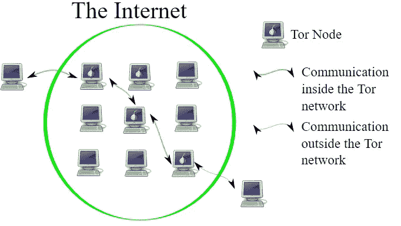

# Ubuntu 上的 Tor 初学者指南

> 原文：<https://medium.com/hackernoon/beginners-guide-to-tor-on-ubuntu-33f81194698>


Tor 是一个能让你在网上隐藏身份的软件。这是一个开放的网络，有助于抵御流量分析，并授予您高度的隐私。

> Tor 通过将你的通信在一个由世界各地的志愿者运行的分布式中继网络中来回传递来保护你(被称为洋葱路由):它防止有人监视你的互联网连接来了解你访问了什么网站，它还防止你访问的网站了解你的物理位置。

## 等等，我听说过洋葱，但是这个洋葱路由是什么？



在洋葱路由中，要发送的数据封装在加密层中，就像洋葱的层一样。然后，产生的加密数据通过一系列称为洋葱路由器的网络节点传输，每个节点都“剥离”(或解密)一层加密，揭示数据的下一个目的地。解密最后一层后，数据到达目的地。发送者保持匿名，因为每个中介只知道紧接的前一个和后一个节点的位置。

# 如何在 Ubuntu 上安装 Tor

按照以下步骤在 [Ubuntu](https://hackernoon.com/tagged/ubuntu) 上安装 Tor:

## 1.添加源条目

先搞清楚你用的是哪个版本的 Ubuntu。然后从下面的列表中选择该版本，并使用您使用的编辑器或简单地通过 cat 命令将这些行添加到文件 **/etc/apt/sources.list** 中。

```
$ sudo cat >> /etc/apt/sources.list
```

*   如果你用的是 Ubuntu 14.xx

```
*deb http://deb.torproject.org/torproject.org trusty main
deb-src http://deb.torproject.org/torproject.org trusty main*
```

*   如果你用的是 Ubuntu 15.xx

```
*deb http://deb.torproject.org/torproject.org wily main
deb-src http://deb.torproject.org/torproject.org wily main*
```

*   如果你用的是 Ubuntu 16.xx

```
*deb http://deb.torproject.org/torproject.org xenial main
deb-src http://deb.torproject.org/torproject.org xenial main*
```

## 2.添加 GPG 键

通过在终端中运行以下命令，添加用于对包进行签名的 gpg 密钥:

```
$ sudo gpg — keyserver keys.gnupg.net — recv 886DDD89
$ sudo gpg — export A3C4F0F979CAA22CDBA8F512EE8CBC9E886DDD89 | sudo apt-key add -
```

## 3.安装 Tor

现在运行以下命令来安装 Tor。

```
$ sudo apt-get update
$ sudo apt-get install tor deb.torproject.org-keyring
```

# 使用 Tor

## 1.配置 Tor

> 如果您从源代码编译 Tor，tor 将 torrc 文件放在/usr/local/etc/tor/torrc 中，如果您安装了预构建的软件包，则放在/etc/tor/torrc 或/etc/torrc 中。

Tor 自带控制口，可以用来，duh，控制 tor。为了使用控制端口与 tor 通信，强烈建议您设置一种身份验证方法，以防止其他任何人访问它。推荐的方法是使用密码。如果您选择使用密码进行身份验证，请首先运行此命令以获取一个哈希密码，该密码将在下一步的配置文件中使用:

```
$ tor --hash-password "passwordhere"
*16:AC5FB526B90B4ED06027C6C4343EF87075B63B9A25822EE198622EE4D6*
```

打开 torrc 文件*(如果你遵循了上面的安装过程，那么你的 torrc 文件很可能会位于****/etc/tor/torrc****)*并取消注释这些行:
1 .控制端口
2。CookieAuthentication **或**HashedControlPassword
*(如果您选择取消对 HashedControlPassword 的注释，请复制您在上一步中获得的散列密码并粘贴到那里)*
这些行如下所示:

```
*# This provides a port for our script to talk with. If you set this then be*
*# sure to also set either CookieAuthentication *or* HashedControlPassword!*
*#*
*# You could also use ControlSocket instead of ControlPort, which provides a*
*# file based socket. You don't need to have authentication if you use*
*# ControlSocket. For this example however we'll use a port.*

**ControlPort 9051 *# <--- uncomment this ControlPort line***

*# Setting this will make Tor write an authentication cookie. Anything with*
*# permission to read this file can connect to Tor. If you're going to run*
*# your script with the same user or permission group as Tor then this is the*
*# easiest method of authentication to use.*

**CookieAuthentication 1 *#either uncomment this or below password line***

*# Alternatively we can authenticate with a password. To set a password first*
*# get its hash...*
*#*
*# % tor --hash-password "my_password"*
*# 16:E600ADC1B52C80BB6022A0E999A7734571A451EB6AE50FED489B72E3DF*
*#*
*# ... and use that for the HashedControlPassword in your torrc.*

**HashedControlPassword 16:E600ADC1B52C80BB6022A0E999A7734571A451EB6AE50FED489B72E3DF**
```

> Cookie 认证仅仅意味着您的凭证是 Tor 的数据目录中的文件内容。

现在使用以下命令重新启动 Tor:

```
$ sudo /etc/init.d/tor restart
```

## 2.如何通过 Tor 控制端口进行认证

如果您想要通过 Tor 进行身份验证，以便与 Tor 控制端口进行通信(例如，启动新会话)，您可以这样做:(如果您选择了 cookie 身份验证，您可以只使用身份验证，不需要任何密码)

```
$ echo -e 'AUTHENTICATE "passwordhere"\r\nsignal NEWNYM\r\nQUIT' | nc 127.0.0.1 9051
```

默认情况下，Tor 在端口 9050 上打开一个 SOCKS 代理。要直接使用 SOCKS，可以将应用程序直接指向 Tor(本地主机端口 9050)。对于不使用代理的应用程序，您可以使用 [torsocks](https://gitweb.torproject.org/torsocks.git/) 。

## 3.如何安装 torsocks

要安装 torsocks，您可以直接运行以下命令:

```
$ sudo apt-get install torsocks
```

**或者，**直接从源代码安装(这样可以获得最新版本和最新补丁):

```
$ git clone https://git.torproject.org/torsocks.git
$ cd torsocks
$ ./autogen.sh
$ ./configure
$ make
$ sudo make install
```

现在让我们使用托索克斯！首先，让我们获取公共 ip 地址。

```
$ curl 'https://api.ipify.org'
*75.119.16.140*
```

它说 75.119.16.140 是我的公共 ip，现在在 curl 命令前使用 torsocks:

```
$ **torsocks** curl 'https://api.ipify.org'
*31.45.26.14*
```

如您所见，我们现在有了一个不同的 ip 地址，用于浏览互联网。

## 4.给控制发信号以创建新的电路(或路径)

你可以告诉 Tor 控制启动一个新的 Tor 电路。这里需要注意的一点是，新的电路不一定意味着新的 IP 地址。为此，我们使用上面已经介绍过的命令:

```
$ echo -e 'AUTHENTICATE "passwordhere"\r\nsignal NEWNYM\r\nQUIT' | nc 127.0.0.1 9051
```

**或者**，如果你想使用远程登录:

```
$ telnet localhost 9051
*Trying 127.0.0.1...
Connected to localhost.*
*Escape character is '^]'.*
AUTHENTICATE "my_password"
*250 OK*
SIGNAL NEWNYM
*250 OK*
QUIT
*250 closing connection
Connection closed by foreign host.*
```

## **5。为 Tor 使用 Python 控制器库**

Stem 是官方支持的 Python 控制器库。你可以在这里找到关于如何安装 Stem 的所有内容和一些好的教程。

这篇文章仅用于教育目的。

[](http://bit.ly/HackernoonFB)[](https://goo.gl/k7XYbx)[](https://goo.gl/4ofytp)

> [黑客中午](http://bit.ly/Hackernoon)是黑客如何开始他们的下午。我们是 [@AMI](http://bit.ly/atAMIatAMI) 家庭的一员。我们现在[接受投稿](http://bit.ly/hackernoonsubmission)，并乐意[讨论广告&赞助](mailto:partners@amipublications.com)机会。
> 
> 如果你喜欢这个故事，我们推荐你阅读我们的[最新科技故事](http://bit.ly/hackernoonlatestt)和[趋势科技故事](https://hackernoon.com/trending)。直到下一次，不要把世界的现实想当然！

[](https://goo.gl/Ahtev1)