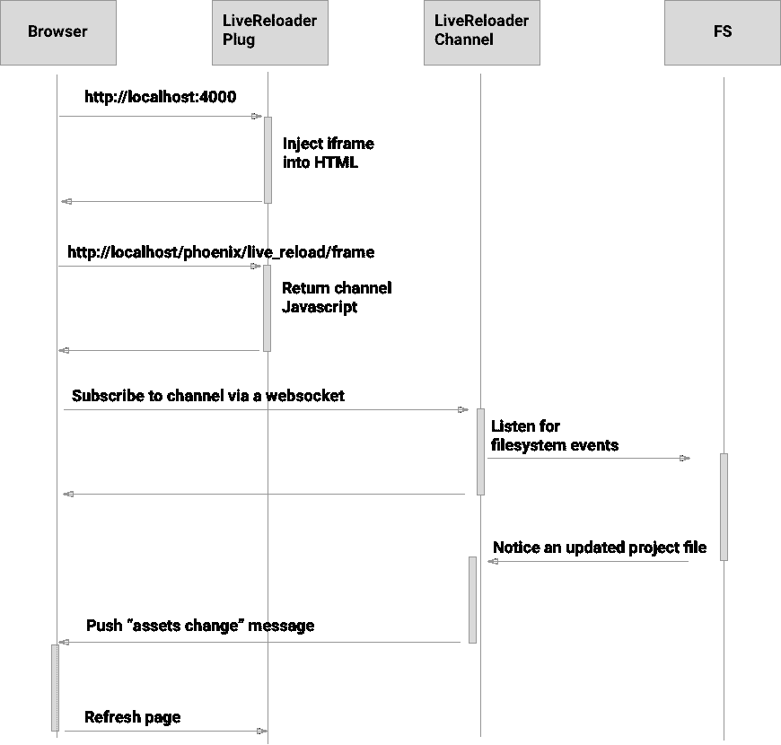

# 凤凰城魅力的背后

> 原文：<https://medium.com/hackernoon/behind-the-magic-of-phoenix-livereload-aa007995aa0f>

当您在代码编辑器中更新文件时，Phoenix 的实时重新加载功能会立即刷新您的浏览器。这种体验非常简单，Phoenix 代码也非常轻量级。

让我们一起穿越 LiveReload 的优雅魔力。



# **如何将所需代码注入 HTML？**

当您运行`mix phoenix.new`来生成 Phoenix 应用程序时，您将在`web/endpoint.ex:`中看到以下内容

```
if code_reloading? do
  socket "/phoenix/live_reload/socket", Phoenix.LiveReloader.Socket
  plug Phoenix.LiveReloader
  ...
end
```

`Phoenix.LiveReloader`负责注入触发实时重载所需的 HTML 位。这是一个模块插件:它通过实现`call/2`来转换连接。

`Phoenix.LiveReloader`实际上声明了两个`call/2`函数:

1.  **有一个通用的函数定义(** [**来源**](https://github.com/phoenixframework/phoenix_live_reload/blob/master/lib/phoenix_live_reload/live_reloader.ex) **):**

```
def call(conn, _) do
```

这将在 HTML 中注入一个 iframe 来加载“/phoenix/live_reload_iframe”。

**2。另一个** `**call/2**` **函数定义根据请求路径通过模式匹配加载 iframe 内容(** [**源**](https://github.com/phoenixframework/phoenix_live_reload/blob/master/lib/phoenix_live_reload/live_reloader.ex#L63) **):**

```
def call(%Plug.Conn{path_info: ["phoenix", "live_reload", "frame"]} = conn , _) do
```

这将返回注入客户端 Javascript 以连接到`Phoenix.LiveReloader.Socket`的 HTML。

# 如何观察对文件的更改？

Erlang 包用于监听文件的变化。当 iframe 中的 javascript 加入通道时，`LiveReloader`开始订阅文件系统变更( [source](https://github.com/phoenixframework/phoenix_live_reload/blob/master/lib/phoenix_live_reload/channel.ex#L12) )。

# 观察哪些文件？

默认情况下，您的静态资产(javascript、css 等)以及 web 视图和模板。

> 有没有部署凤凰 app？试试 Scout，这是我帮助开发的一个新的 Elixir 应用程序监控解决方案。 [**报名免费**](https://scoutapp.com/info/pricing) 。

# LiveReload 如何监听变化？

调用`:fs.subscribe/0`后，通道进程通过定义`handle_info/` ( [源](https://github.com/phoenixframework/phoenix_live_reload/blob/master/lib/phoenix_live_reload/channel.ex#L17))监听`fs`消息事件:

```
def handle_info({_pid, {:fs, :file_event}, {path, _event}}, socket) do
```

这将接收文件系统上的所有文件事件。因为我们只关心一个子集，`matches_any_pattern?/2`检查文件是否在我们的 Phoenix 应用程序中。

然后，我们通过信道发送消息通知这一变化:

```
push socket, "assets_change", %{asset_type: asset_type}
```

# Javascript 代码如何刷新页面？

JS 监听`assets_change`事件，并以两种方式之一更新窗口:

1.  当一个 css 文件改变时，不需要完全重新加载。相反，在加载更新样式表的页面中插入一个新的 link 元素。
2.  当任何其他类型的文件发生更改时，将触发全窗口重新加载。

# 摘要

LiveReload 在你的应用中编织了一条有趣的路径:插入一个插件将内容注入 HTML，呈现一个 iframe，将 Javascript 插入 iframe 并订阅一个通道，监听文件系统事件，通过通道发送相关事件的消息，最后，重新加载你的浏览器窗口。

[在 GitHub](https://github.com/phoenixframework/phoenix_live_reload) 上查看源码。

[](http://bit.ly/HackernoonFB)[](https://goo.gl/k7XYbx)[](https://goo.gl/4ofytp)

> [黑客中午](http://bit.ly/Hackernoon)是黑客如何开始他们的下午。我们是阿妹家庭的一员。我们现在[接受投稿](http://bit.ly/hackernoonsubmission)并乐意[讨论广告&赞助](mailto:partners@amipublications.com)机会。
> 
> 如果你喜欢这个故事，我们推荐你阅读我们的[最新科技故事](http://bit.ly/hackernoonlatestt)和[趋势科技故事](https://hackernoon.com/trending)。直到下一次，不要把世界的现实想当然！

