# React 会议的幕后

> 原文：<https://medium.com/hackernoon/behind-the-scenes-of-react-conferences-dd23e44fa1f1>

## 2017 年 7 次 React 大会报告

2017 年，当我用 React 参加世界各地的会议时，我与发言者、与会者和组织者进行了互动！下面是我想分享的。

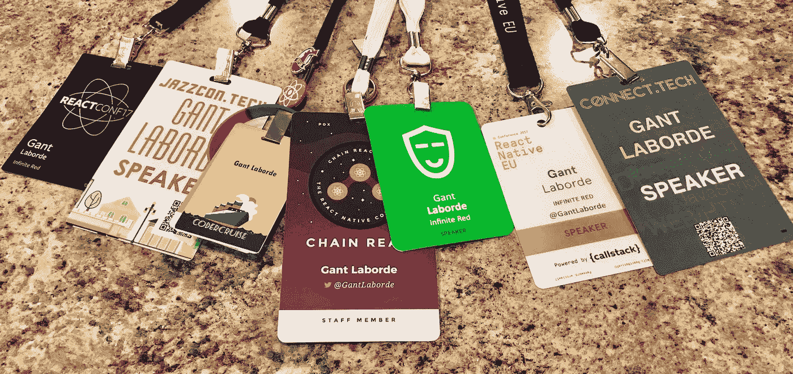

2017 年有太多的*会议，我没能全部参加。我知道我当然想！虽然我尽可能多地参加了，但他们中的大多数人都有一些特定的反应。按时间顺序，我们来一游吧！*

*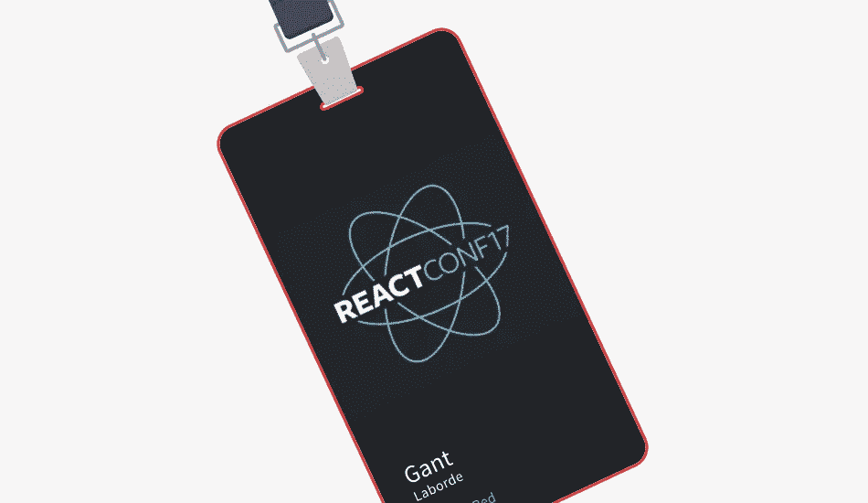*

# *反应会议 17*

*【T13 月 13 日-14 日加州圣克拉拉
人数: ~350 人 **曲目:**单曲 **工作坊:**否
**我的角色:**出席者
[http://conf.reactjs.org/](http://conf.reactjs.org/)*

***大的那个！脸书每年都会举办一次令人瞩目的会议，与会者都是你经常在网上看到的人，但一旦你参加了会议，你就会见到[汤姆·奥奇诺](https://medium.com/u/b103e28db223?source=post_page-----dd23e44fa1f1--------------------------------)、[布兰特·瓦特恩](https://medium.com/u/d5a707474bd2?source=post_page-----dd23e44fa1f1--------------------------------)和[塔尔·科尔](https://medium.com/u/83a4f96844d0?source=post_page-----dd23e44fa1f1--------------------------------)。你甚至可以在詹妮弗·范这样的明星爆红之前见到他们！***

*这里讨论的技术在质量和外观上都是一流的。尽管每个人都挤得水泄不通，但景色还是很美。*

*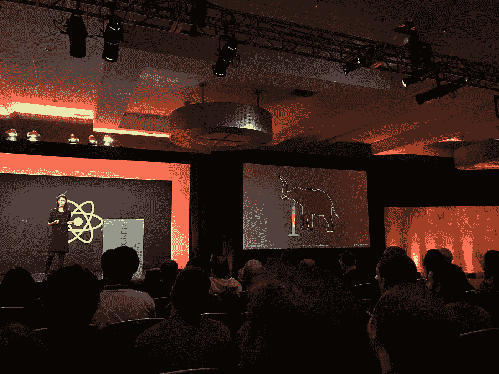*

*门票很难买到，但如果有一个 React 会议需要参加**以获取信息**，那就是它了。脸书在活动中非常照顾每个人。*

*如果你是一个专业的 React 开发者，你想申请参加这个会议。如果不能，那你就想看直播。*

*我有这次会议的详细报道——所以如果你打算参加的话，请把这些博客文章添加到你的阅读清单上。*

## *总结:*

*很棒的信息，很好的照顾。
**Con:** 空间和门票有限
**TL:DR；**如果你是专业的 react 开发者，就去看看直播吧。*

*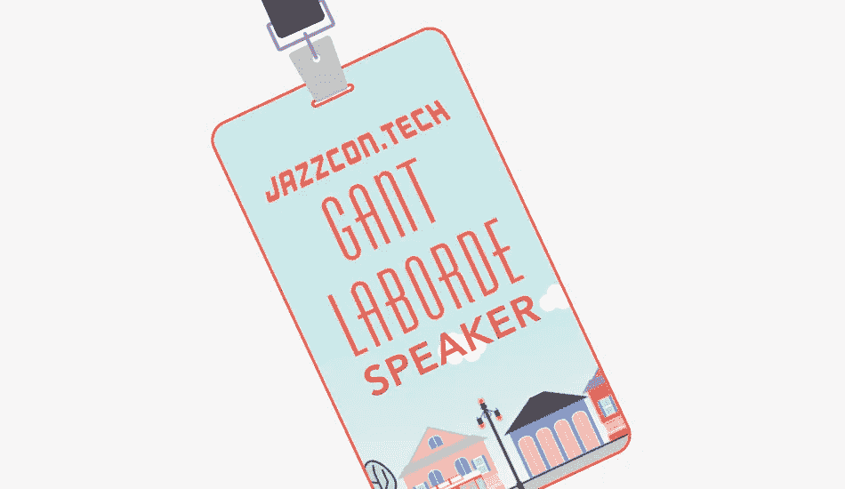*

# *爵士乐。技术*

***3 月 26 日–28 日在洛杉矶新奥尔良
规模:** ~400 人 **曲目:** 5 **工作坊:**是
**我的角色:**演讲人
[http://jazzcon.tech/](http://jazzcon.tech/)*

*仿佛你需要另一个理由来参观新奥尔良。Tech 很神奇。作为 JazzConf 的第一年，我不确定会发生什么，但是举办这个活动的人都是专业人士。他们知道会议，他们知道新奥尔良。*

*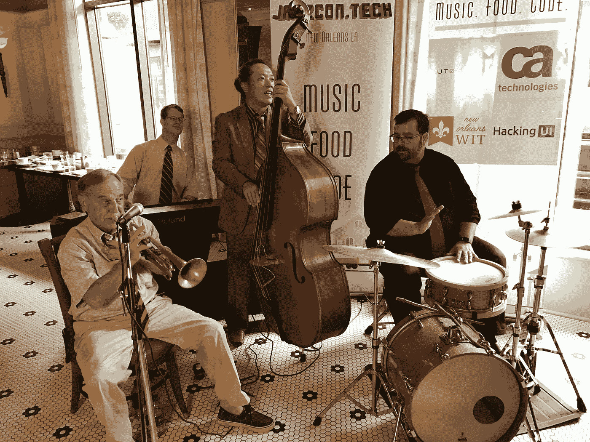*

*格式完全是 Web/JavaScript。有一个特定的反应轨迹，但当我比较演讲时，我发现自己被吸引去超越我的标准要求。有大量的曲目可供选择，您可以通过步入领域并忽略技术的操作部分来完善您的 JavaScript 掌握。*

*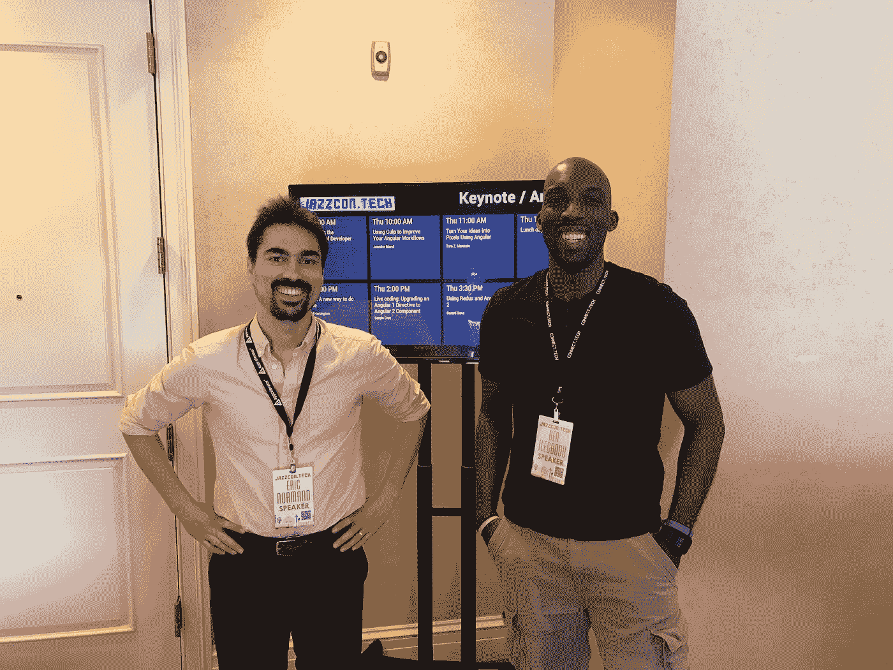*

*来自世界各地的著名演讲者将出席并发言，但最棒的是整个活动具有独特的新奥尔良风格。*

*工作人员平易近人，电源板充足，食物和烈酒都是一流的。*

*一些会议在信息交流方面非常出色，但在网络方面却表现平平。因为，让我们面对现实吧，作为一个书呆子，社交对我们来说比其他人要难一点。但不是在这里。有机地扩展我的社交网络很容易，而且我花时间和许多演讲者在一起，这一年剩下的时间里我会继续和他们交流。*

## ***作为演讲者***

*我受到了非常好的待遇。如果我有任何问题或顾虑，我可以很容易地找到协调员普拉蒂克和文森特。我从未感到有压力、紧张或担心。他们宠坏了我。对我其他的演讲来说，这是多么高的标准啊。*

*[2018 年日期已经公布。](http://jazzcon.tech/)*

*一定要把这个加到你的清单上。你可以一个人预定行程，和 100 个新朋友一起离开。*

## *总结:*

***赞成:**伟大的城市和专业地详细的会议
**反对:**大多数会谈没有记录
**演讲人:**极其优厚的待遇，适用于这个 CFP！ **TL:DR；**悠闲且经营良好的发布会；非常适合探索技术，也非常适合网络。*

*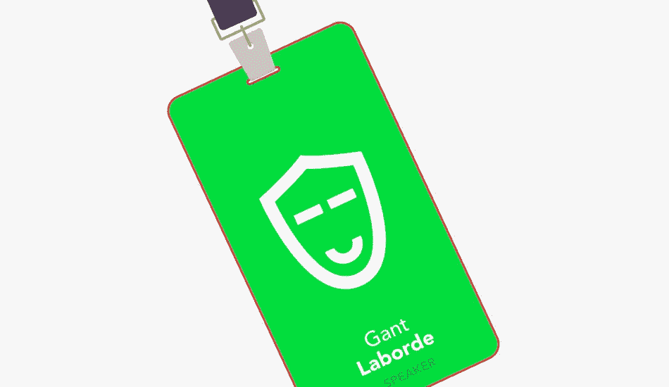*

# *反应阿姆斯特丹*

***4 月 20-21 日荷兰阿姆斯特丹
规模:** ~1.2k 人 **曲目:** 2 **工作坊:**是
**我的角色:**演讲人
[https://react.amsterdam/](https://react.amsterdam/)*

*“在你生命中的某个时刻，你必须去阿姆斯特丹看看。”无数兄弟会成员和电影《欧洲之旅》都是这么告诉我的。老实说，我并没有期望太多，但我发现，这是我的第二个家。*

*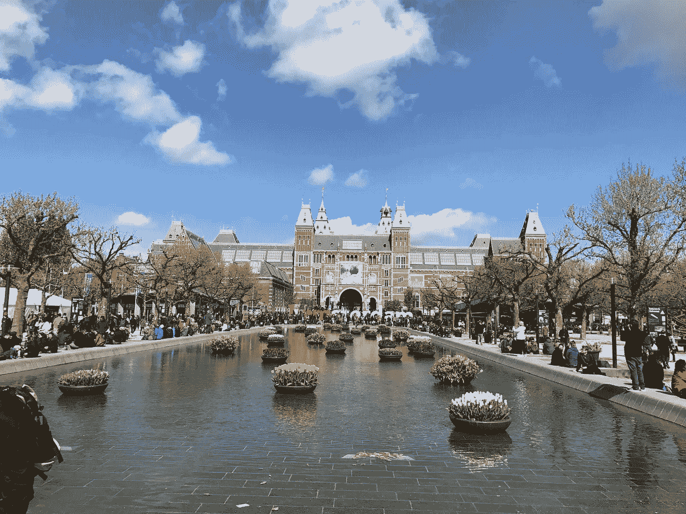*

*Rijksmuseum Amsterdam*

*多么美丽、友好、热情的城市。我去那里希望把它加入到我在欧洲看过的地方的名单中，然后我离开了它…踢着，尖叫着要永远留下来。它现在是我在欧洲最喜欢的地方；每个人都骑自行车，每个人都互相尊重，头号罪行是逃税。这是创意者的天堂，会议是皇冠上的宝石。*

*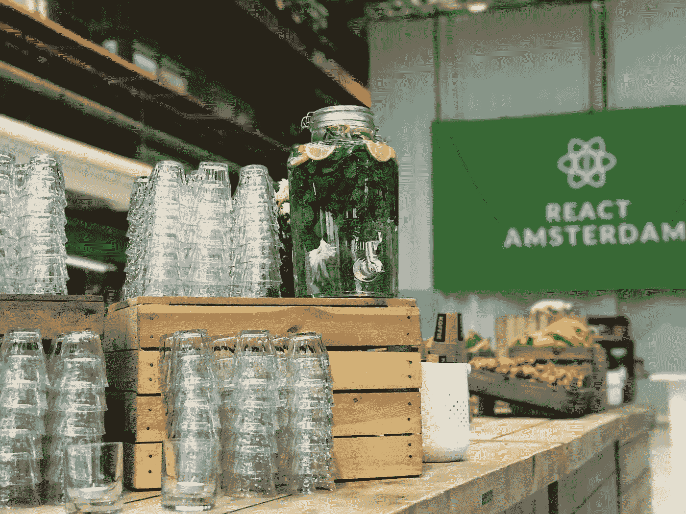*

*对于一个 1200 人的会议，你可能会想到一些后勤方面的问题:人的空间、所有人的食物、能见度和进入速度，但一切都很优雅。他们甚至有专门的咖啡摊，人们会为你在咖啡泡沫上做出美丽的图案。正是对细节的关注让这个活动吸引了如此多的人！*

*唯一的问题是，wifi 似乎在一天的中途就停止了，考虑到这些数字，这是可以理解的。我强烈建议你在旅行时做好“离线准备”,这样对我来说就不会太难了。*

*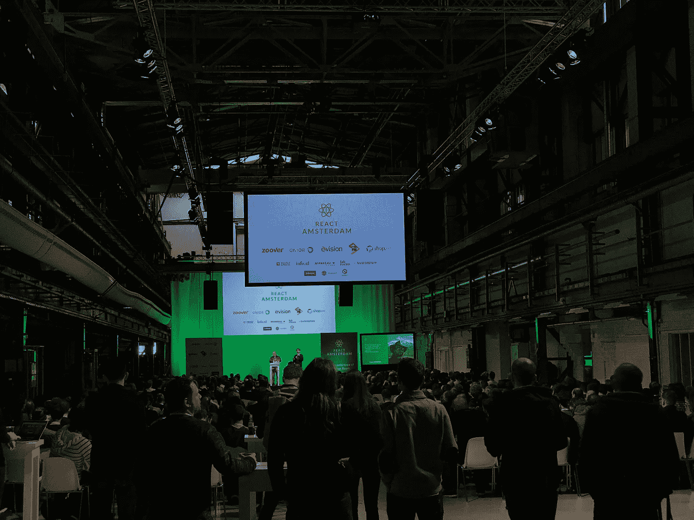*

*两条轨道是一个很好的接触。这让人们有能力与可能没有时间或能力去参加专门针对本地人的会议的本地人进行实验。*

## ***作为演讲者***

*我能够在会议之前接入并测试所有的东西，所以我可以确信事情会正确运行。我要注意的一点是，我看不到计时指示器，所以因为我开始得早，所以结束得也早，因为在舞台上动态地改变我的演示持续时间是我尚未掌握的技能。结局好就一切都好，演讲也非常成功。*

*这个我也补充一下。没有官方的会后派对，但当你遇到一群来自世界各地的演讲者，而你在阿姆斯特丹这样的城市，你会有自己的派对。正是在这里，我与肯·惠勒、T2、桑科特、T4、托米斯拉夫和其他人度过了许多美好的时光。我至今仍保持联系的人。*

## *总结:*

***Pro:**Amsterdam+tech = = = amazing
**Con:**这么多人，这么活跃的活动，可能很难互动或争夺关注。请务必给外置电池充电。
**演讲者:**一切都清晰而简洁！我不能要求更多。 **TL:DR；**本次会议气氛紧张，意义重大。如果可以的话，你应该去看看，并准备好在这个史诗般的地方获得大量的信息。*

*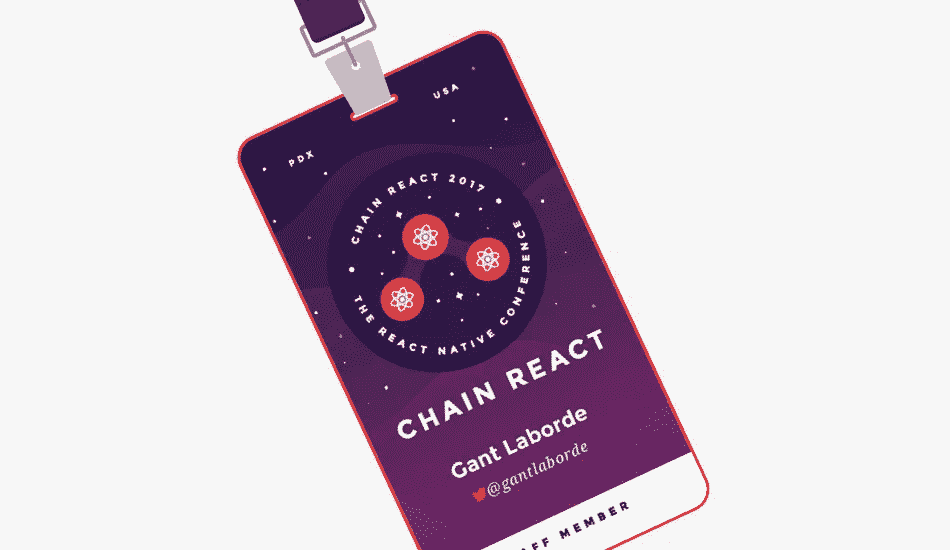*

# *连锁反应会议*

***7 月 10 日-11 日俄勒冈州波特兰
规模:** ~500 人 **曲目:**单曲 **工作坊:**不在 2017 年
**我的角色:**司仪
[https://infinite.red/ChainReactConf](https://infinite.red/ChainReactConf)*

*波特兰！美国的高科技中心，非常适合举办第一届 React Native 会议。在许多方面，React Native 会议比大多数其他会议更关注 React，因为它更关注核心内部，而不是平台。*

*现在，当然，这个会议在我的❤️有一个特殊的位置，因为它是由无限红色举办的，我是司仪！*

*由于我一直在后台，并不是会议的实际参与者，我只能说，帮助举办会议的所有努力和乐趣！但是，已经有相当多的[博客帖子](/@andreneves/chain-react-conf-2017-an-in-depth-recap-of-the-first-react-native-conference-1f047d13f3d7)称赞这一经历。*

*在计划这次会议时，我们有五个重要目标:*

***首先是**，专注于提供最热情友好的环境，强调行为规范，让人们玩得开心。*

***第二个**，汇集该领域的专家，介绍新兴概念，并为所有人提供直接接触演讲者的机会。*

*第三个，一个展示波特兰的理想地点，有一个美丽的场地。*

*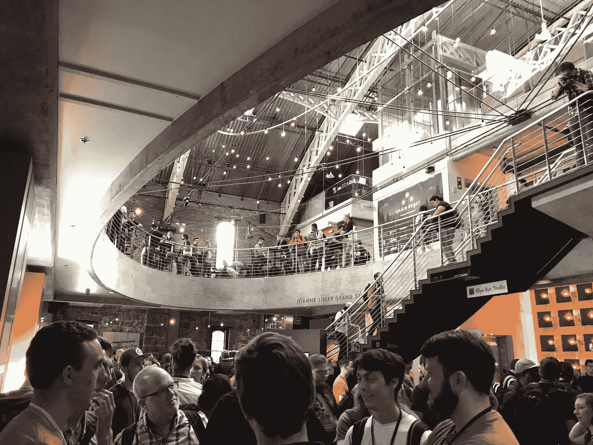*

*Nailed it*

***第四**，以合理的票价提供最优质的服务。*

***第五届**，为大家打造一次难忘的体验；让这件事年复一年成为每个人日程表上的一件大事。*

*在今年剩下的时间里，在我参加的其他会议上看到 Chain React 的衬衫和笔记本电脑上的贴纸真是太棒了。*

## *作为一个演讲者*

*我是计划的一部分。我知道我们必须非常小心我们的演讲者，因为没有他们，就没有会议。此外，作为一个连续参加会议的人，我们尽一切努力让每个人都感到受欢迎，同时强调他们的波特兰之旅！*

*这是一个令人惊叹的场地。多酷的建筑啊，有一个很酷的休息区，可以准备发言。查看这条展示布伦特·瓦特恩在[的演讲中幕后的冷静的推文。](https://medium.com/u/d5a707474bd2?source=post_page-----dd23e44fa1f1--------------------------------)*

## *总结:*

***Pro:** 以友好有趣的方式直接展示 React(特别是 React Native)的强大功能。
**弊:**涵盖所有平台，可以说是相当的话题过山车。我喜欢的东西，但不是每个人都喜欢。
**音箱:**音箱 wifi，休息室，晚餐，作品！ **TL:DR；是的，如果你考虑在网络之外的任何地方使用 React，你应该去 Chain React。这包括 Windows，Xbox，Linux，iOS，Android，AppleTV 等。***

*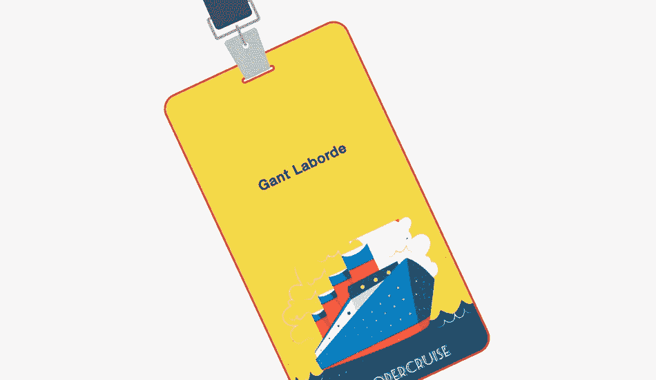*

# *编码器巡航*

***7 月 16 日–23 日在国际水域
规模:** ~100 人 **曲目:** 2 **工作坊:**否
**我的角色:**演讲人
[https://www.codercruise.com/](https://www.codercruise.com/)*

*在所有美丽的风景中，这是唯一能给你带来+美丽水景的游船。*

*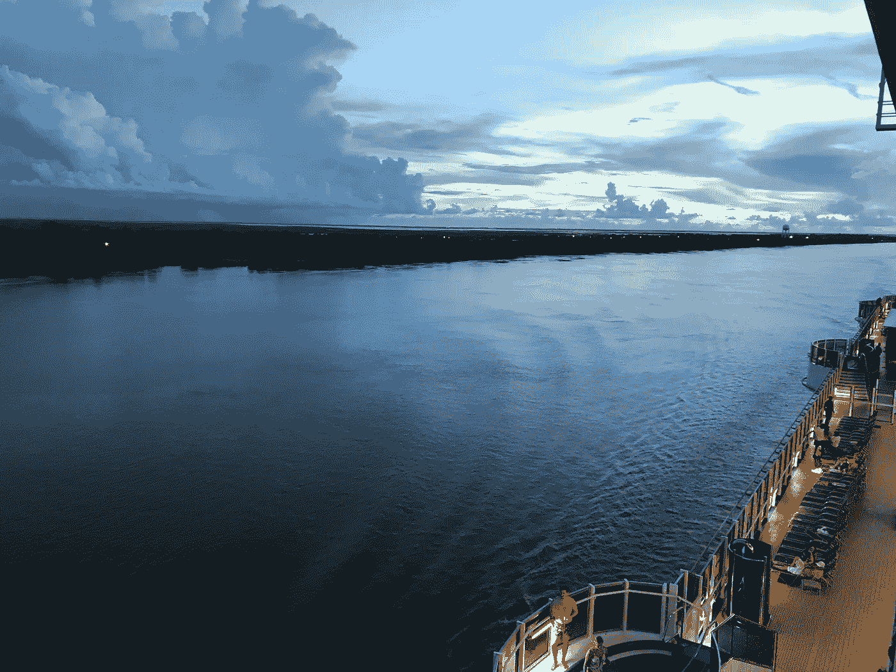*

*你当然不能抱怨派对、娱乐、食物或饮料…那是游轮的工作！在那艘嘉年华梦幻船上的每一秒都是如此美妙。*

*CoderCruise 是一个多语言会议；任何编程语言都欢迎。现在你可能会认为这太不集中，但实际上，这是我最喜欢的方面之一。我希望每年至少参加一次多语言会议。概念太开放了！*

*你学习的不是在你所在的技术领域处理问题的方式，而是一般技术领域的问题和解决方案。没有 React 的严格限制，您可以很好地了解 React 做得好的地方，以及人们需要不同解决方案的地方。他们没有推动 React 竞争对手，而是发现了更深层次的需求！*

*我带着许多新的想法离开了这次会议，让图书馆成为各种语言的解决方案。*

*对一些人来说，在船上编码听起来很傻，而对另一些人来说，这听起来很神奇。老实说，两者都有一点构成了它的魅力。*

*有趣的是，船上的会议室是最无聊、最单调、最愚蠢的地方。帮助协调会议的 EliW 竭尽全力使船的内部成为高质量的会议材料。反对他的是嘉年华的工作人员。*

*这让我想起当你在节食时，一个同事不停地给每个人买油炸圈饼来诱惑你。*

> *“哦，对不起，我不知道在这些房间里有一个会议，我只是带着这些免费的饮料票和舞蹈演员走过…你不会想…加入我们吧？”—嘉年华摄制组(会谈期间)*

*除了分心，我们真的玩得很开心。所有被选中的演讲者都很棒，会议也很精彩。*

*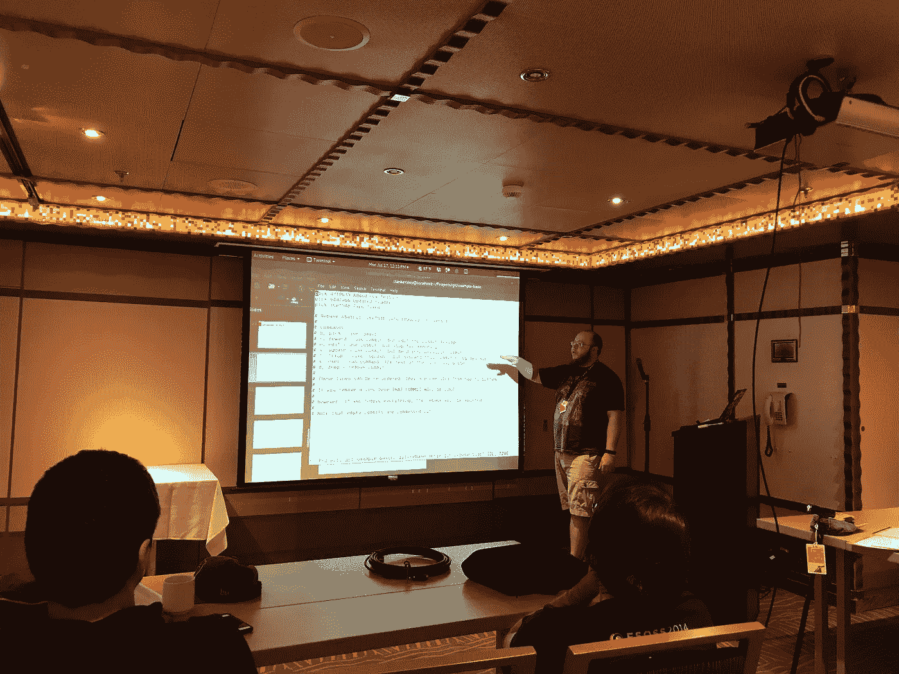*

*我想强调的另一个方面使这次会议与众不同。因为这是一次航行，所以这是我见过的对孩子最友好的会议。几乎总是，参加一个会议意味着你将远离你所爱的人。人们带着他们的家人，甚至还有鼓励人们*开始*编码的会议。*

*我*有*看到这一点。像《我的世界》这样简单的东西，整个房间都在为他们特别的“代码小时”会议而编码。CoderCruise 为你提供了充分的机会，让你以一种有趣的方式脱离关系，真正思考重要的事情。*

## *作为一个演讲者*

*有趣的是，每个人都受到了很好的对待，演讲者和与会者之间几乎没有什么区别。甚至晚餐座位也是混杂的。前一秒钟你还在和一个被派去参加会议并享受其中的员工交谈，下一秒钟你就在和微软的高层管理人员交谈。我喜欢它。*

*当然，为这次航行做好 100%的离线准备。即使拥有现代技术的所有奇迹，你也别无选择，只能断开连接。*

## *总结:*

***Pro:** 一切都很美好——这是一艘游轮
**Con:** 船是一个邪恶的妖妇(但我们选择了会议)
**Speaker:** 待遇非常好，但每个人都是如此！ **TL:DR；**多语言会议太棒了(做一个！)，还有什么比在游轮上拥有它们更好的呢？带上家人；这是一场不会把你带走，却能激励你所爱的人的大会。*

*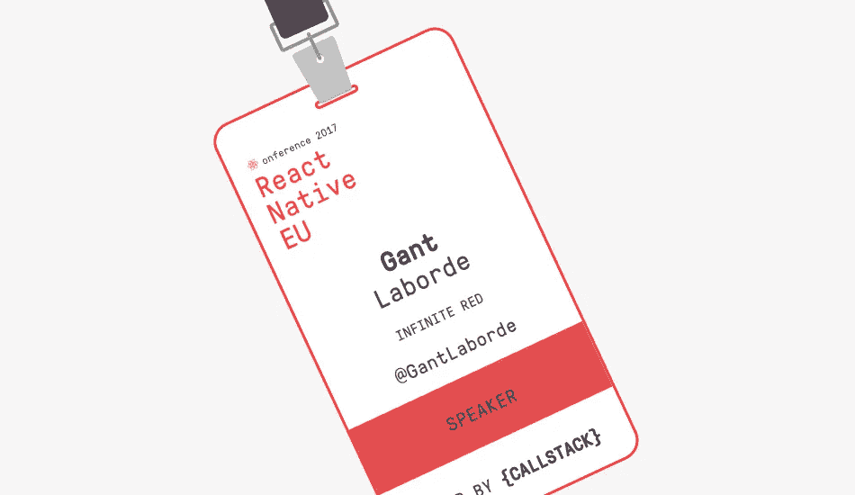*

# *反应本地欧盟*

***9 月 6 日至 7 日在波兰弗罗茨瓦夫
规模:** ~400 人 **曲目:**单曲 **工作坊:**是
**我的角色:**演讲人
[https://react-native.eu/](https://react-native.eu/)*

*迈克·格拉博斯基是 React 原住民社区的核心人物，当他宣布他将举办 React 原住民大会时，我就知道这会给人留下深刻印象。无数知名的演讲者出席了这次会议。信息和场地都是一流的！*

*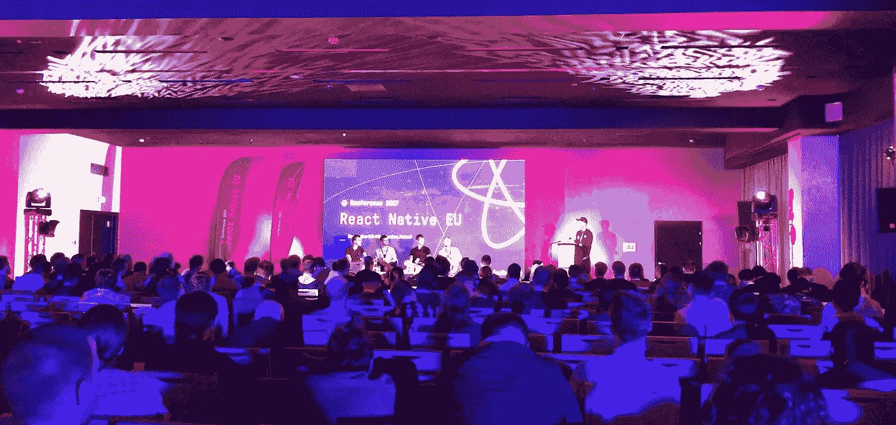*

*我赢得了欧盟所有人的极大尊重，他们不得不经常飞往美国。那次飞行可不是开玩笑的。不过，这是非常值得的！ [CallStack](https://callstack.com/) 不惜重金打造这一盛事。*

*每一次谈话都令人印象深刻，令人愉快。从 [Vladimir Novick](https://medium.com/u/546ece1e9a84?source=post_page-----dd23e44fa1f1--------------------------------) 的蓝牙设备，一直到与 React 库绑定的本机代码。有如此多的信息，社交和食物，以至于会议甚至有一个房间可以坐下来放松，同时可以在电视上观看会谈！*

*虽然我从来没想过要去波兰弗罗茨瓦夫，但它充满了文化和令人惊叹的地方，就像 afterparty 的那个地方。*

*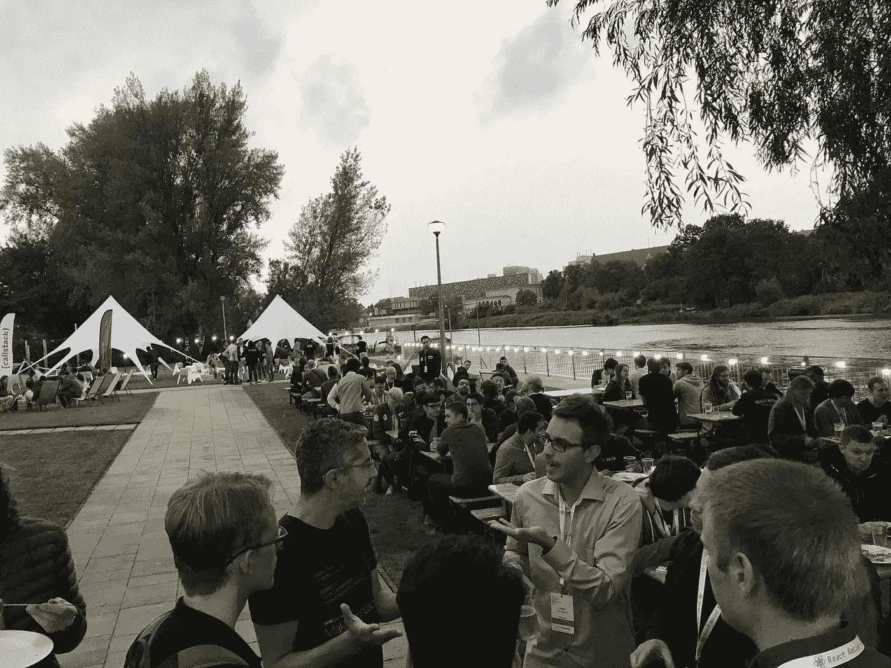*

*值得注意的是，赞助商的位置非常酷！休息区的大部分设备都装饰有赞助商标志。多么酷的主意！*

## *作为一个演讲者*

*演讲者受到了很好的待遇。我们甚至有了自己的房间，但我们太专注于会议，很少使用它。作为一名演讲者，最大的好处可能是在会议之后。在 CallStack 办公室有一个专门邀请演讲者的聚会，在那里我们可以和每个人一起玩桌上足球和吃披萨来庆祝。与每个人分享活动的成功非常有趣。*

## *总结:*

***Pro:** 专家在友好热情的环境中交谈
**Con:** 航班；早点飞过去就是了！
**扬声器:**顶级扬声器待遇！ **TL:DR；如果你在欧盟，这是一个很棒的会议。如果你不是，它仍然是值得的，尤其是如果你正在考虑反应本土❤️***

*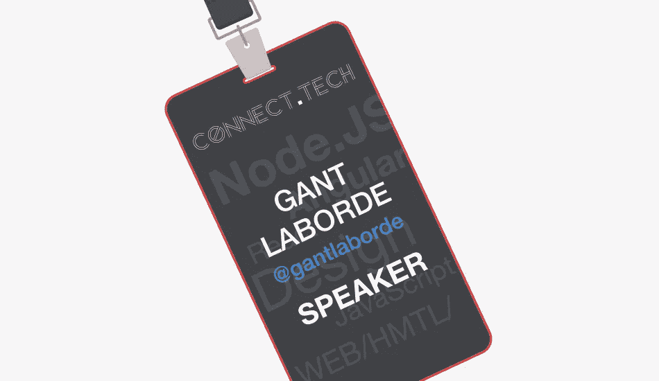*

# *连接。技术*

***9 月 20-22 日佐治亚州亚特兰大
规模:** ~1k 人 **曲目:** 11 **工作坊:**是
**我的角色:**演讲人
[http://connect.tech/](http://connect.tech/)*

*ConnectTech 是另一个大型会议，它有大量的曲目，有两个官方反应室，但这个概念出现在其他几个曲目中，如“高级 JS”和“通用移动”。主题演讲以开发者为中心，非常有价值。在这次盛大的会议上，每个人都有自己想要的东西。*

*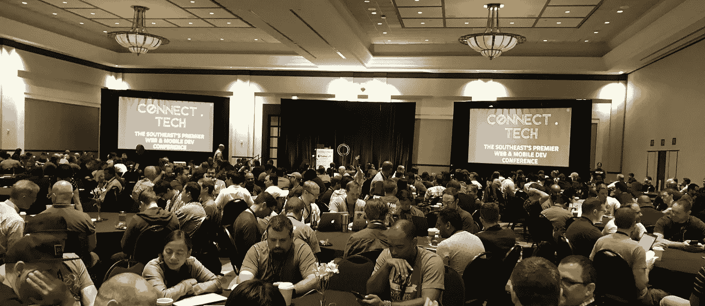*

*每当我看到一个大型会议时，我会对两件事感到奇怪；质量下降是怎么回事，给自己找个舒服的空间有多难？我不能一个人担心这些事情，所以让我来回答你。*

1.  ***质量这么大的群体:**质量一点都没下降。它实际上上涨了。更多的人意味着更多的选择。食物、谈话和会谈都因一些友好的竞争而有所改善。这样一个大型会议的另一个好处是有更多的赞助商！这意味着更多有趣的赠品、赠品和令人兴奋的能量。ConnectTech 的人是处理大型团队的专家。所有的轨道都清楚地标明前面有电视。*
2.  *个人空间:它必须被碾碎，对吗？不……他们租了大量的空间。你可以在每个房间里找到一个舒适的地方。从一个会场走到另一个会场，你会经过很多空桌子，让那些需要脱离会议并完成工作的人可以使用。就连主厅也配置了大圆桌，有利于会谈时吃饭或编码。*

**

*well done*

## *作为一个演讲者*

*拥有 70 多位演讲者，您的周围都是学科大师。有什么更好的地方来包围自己？我立刻结交了许多新朋友。我真正喜欢的一件事是有很多机会与每个人互动！*

*第二天，我发现自己坐在一张由史诗般的演讲者组成的桌子旁，讨论着各种各样的荒谬和好奇。这是你能想到的最酷的聚会团体。*

*会议确保每个人都有所收获。最后一天，他们分发了价值数千美元的奖品(其中一个奖品是一台全新的 MacBook ),然后带大家去市中心社交。在整个会议上，我看到了很多笑脸。*

## *总结:*

***优点:**适合每个层次的每个人的东西
**缺点:**那个没有电源板的房间(我知道我说到这里了)
**演讲者:**年度最佳演讲者待遇🌟 **TL:DR；**亚特兰大擅长举办大型、成功且令人印象深刻的会议。这是托管 ConnectTech 的理想场所，这就是所有这些。*

# *结束语:*

## *赃物*

*会议赠品总是很有趣；我个人很喜欢！一定要抓住它，因为你的团队中有很多人会很乐意从你手中接过它。看着公司经历时尚潮流也很有趣。*

## *但是 2017 年还没结束甘特！！！*

*对，但我不干了！在接下来的几个月里，它将成为假日季节，除了所有的家庭活动，我将参加无限红色全队静修(称为 All-treat)，与朋友们在树林中露营，并飞往哈利波特世界！你要记得为自己旅行！*

*我已经开始为 2018 年排队了！看到[GantLaborde.com](http://gantlaborde.com/)的阵容发展。*

# *🎉关于作者*

*在 Twitter 上用 [@GantLaborde](http://twitter.com/GantLaborde) 查看技术推文和双关语，或者在 [Medium](/@gantlaborde/) 和 [GitHub](https://github.com/gantman) 上关注他。你可以在 http://GantLaborde.com/电视台看到他接下来的演讲*

*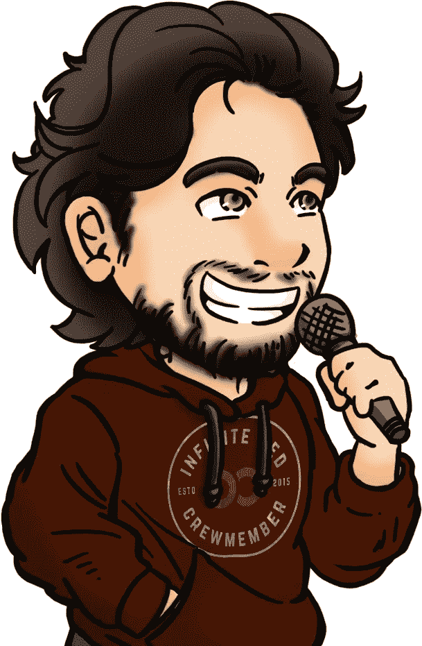*

*[Gant Laborde](https://medium.com/u/6ca0fe37eac1?source=post_page-----dd23e44fa1f1--------------------------------)*