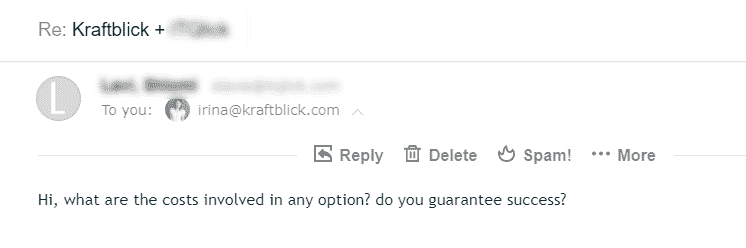
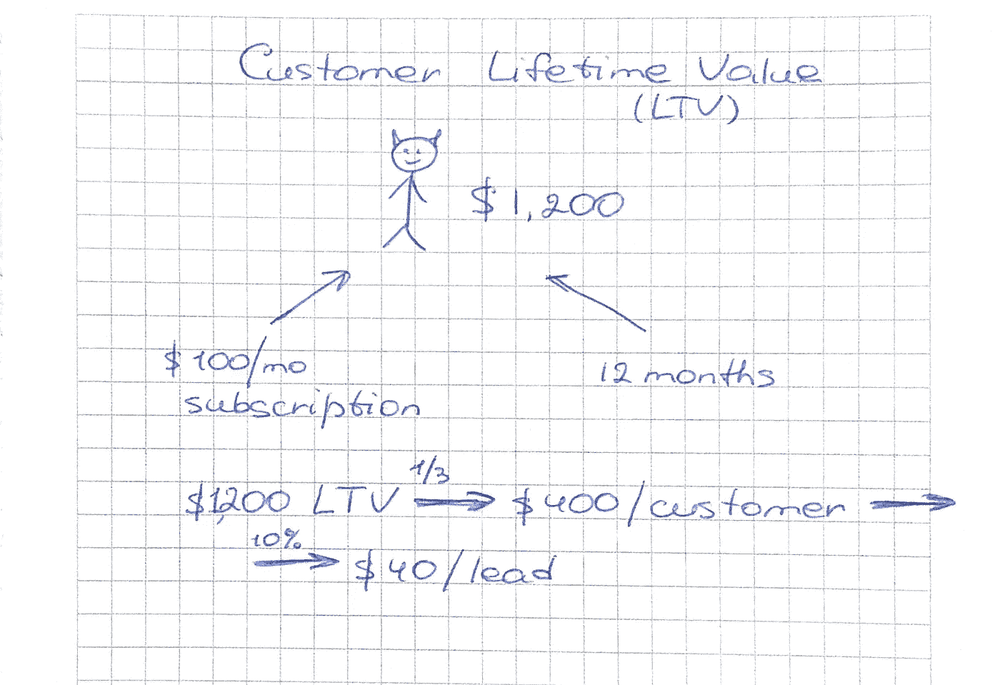
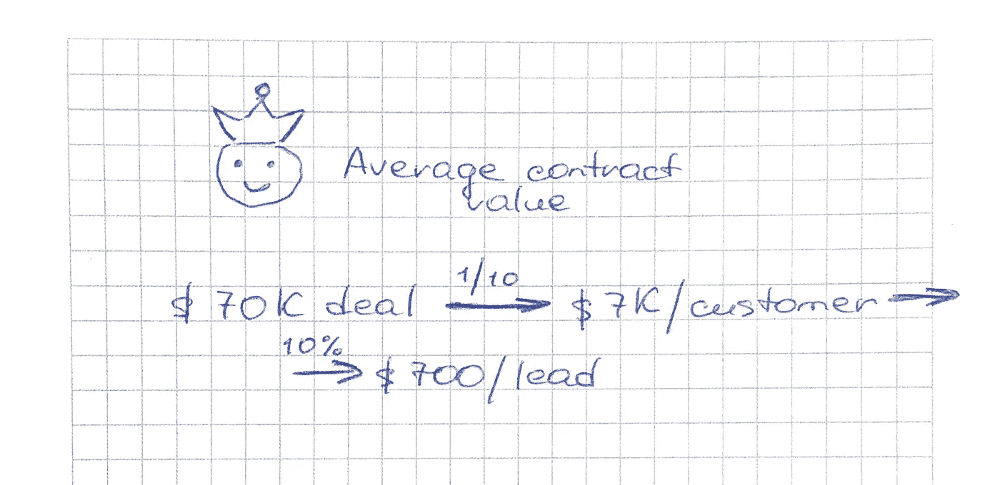
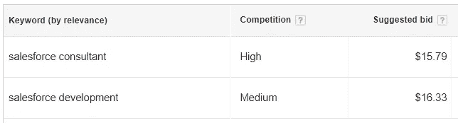
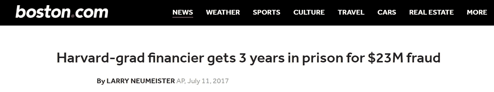

# 软件营销的幕后:担保、数学和受过教育的猜测

> 原文：<https://medium.com/hackernoon/behind-the-scenes-of-software-marketing-guarantees-math-and-educated-guess-e3f0f882df0d>

最近，我们的 Kraftblick 团队收到了一封来自首席执行官的电子邮件，询问“*我们如何在“推广部分”帮助他们。*

当我建议安排一次会谈时，他拒绝了，并直接走向了定价和保证的终点线。

担保？真的吗？在两封 30 字的邮件之后？

这让我百思不得其解。

**为什么有人会像在美元树购物一样选择营销伙伴？**

营销是公司成长的基石。毕竟，你委派并忘记的不是数据输入。

不过，这不是常识。你可能知道营销总监和企业主对获得销售线索的成本有不切实际的期望。

我们主要与软件公司合作。几乎所有的软件领域都竞争激烈。因此，销售线索的成本可能从几十美元到几百美元不等。

背后除了数学什么都没有。

# 只有当你关心铅成本时，才继续阅读

(否则，跳过我无聊的计算)

对 SaaS 来说，**这一切都关乎客户的终身价值**。如果一个产品像创始人说的那样好，他们至少会有一年的付费客户。

比方说，每月的平均订阅费是 100 美元。那么，每个客户的收入将是 1200 美元/年。

如果你准备[投资潜在客户收入的⅓](https://kraftblick.com/blog/saas-marketing-plan/#step5) 来获得一个新客户(本例中为 400 美元)，那么**10%的行业平均[试用客户转换率](https://www.groovehq.com/blog/saas-conversion-survey-results)所产生的每条线索**40 美元将是你能够承受的成本。

My drawings of LTV

对于定制软件开发，**平均合同价值为王**。一些公司正忙于制作 WordPress 1000 美元的小补丁，而其他开发公司则完成了 7 万美元的交易。

销售线索成本计算的逻辑与 SaaS 相同。这里唯一的区别是，在定制软件开发中，高价值的合同是有代价的。

凭借公司签署 7 万美元合同的能力，一个价值 7 万美元的客户，或他带来的收入的 1/10，是有利可图的。如果你能转化十分之一的销售线索，那么每条线索 700 美元是一个合理的价格。

My drawings of average contract value

> 然而，数学并不总是人们期望的基础。

一些首席执行官和创始人的根本问题是:

1.  他们希望吸引更多的企业客户
2.  他们认为四五位数的营销投资太高了，因为这个数字看起来很高。

期望和能力之间的不匹配可能是一个公司没有为企业客户做好准备的信号。

即使他们获得了企业领先优势，也很有可能无法完成。

因为他们不懂得“先给后得”的原则(这在金融领域也适用！)，他们不会在预售阶段投入大量的精力。企业领导会离开并把他们的企业合同给其他人。

我知道这很可悲。但这是真的。

现在该讲个小故事了。

# 没有人愿意生活在现实中

一次，一家 Salesforce 咨询公司找到我，他们想从英国获得更多客户。

这种资格的专家非常吃香，他们的时薪高得惊人。英国提供 Salesforce 服务的机构之间的竞争也是如此。

Salesforce competition in the UK

尽管如此，该公司的营销预算少得离谱，既与竞争率也与潜在利润不相关。

**我的假设是他们被免费而来的推荐(** [**口碑客户**](https://kraftblick.com/blog/word_of_mouth_in_saas/) **)宠坏了。他们对投资于通常免费获得的东西感到难过，尽管推荐很难扩大规模。**

我们唯一能做的就是阻止公司花费营销费用。如果没有任何好处，为什么要浪费钱呢？

我见过一堆赤手空拳与竞争对手血战的公司。最终，他们放弃了说[说出任何在线营销渠道]已死的说法。

# 我能保证成功吗？

这是这位首席执行官问的第二个问题。

我的答案很简单，

> 我很想保证成功，但我做不到。

除非他或她是一个骗子，一个初学者或要求业务份额(你可能会否认)，否则没有营销人员能做到这一点。此外，对于一些利基市场和流量渠道，每次获取成本(CPA)模型确实有效，但这种情况很少。

想象一下，在申请大学之前，一个高中毕业生问一个院长，

你能保证从你的大学毕业后我的生活会成功吗？

大学学位是人生成功的有力预示。但是高等教育并没有默认它。

我在这里的主要观点是，营销成功是许多游戏玩家的结果。我们可以对其中一些产生影响(战略、战术、[流程](https://kraftblick.com/blog/this-is-how-we-create-content-in-kraftblick/))，而其他的则由客户控制(产品/服务的质量、定价模式、目标受众等)。)或外力(需求、竞争、季节性等。).

我们努力提供帮助。在大多数情况下，我们能做的最好的事情就是历史数据和有根据的猜测。推广软件产品和服务的经验是我们的后盾。

在某种程度上，我们决定不与拒绝安排谈话的潜在客户合作。这被证明是一个地狱的策略！我认为克拉夫特布利克不会让他们失望。

您的软件公司需要更多线索吗？

我们是来帮忙的。在 irina@kraftblick.com 给我写封短信