# 做一个好的开源公民

> 原文：<https://medium.com/hackernoon/being-a-good-open-source-citizen-9060d0ab9732>

## A.k .开源贡献中的一个不成文的交流规则

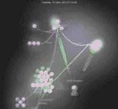

Cake project Gource contribution visualization

所以这篇文章是我对贡献和维护开源项目的高度主观的个人观点，可能有与我不同的观点。这个主题有很多东西，所以我可能会错过一些东西，不管怎样，我希望听到你的反馈！

这篇文章将是“平台”不可知的，我相信我的大部分想法将适用于任何 OSS 项目，但对于披露，我主要活跃在。NET 开源社区，我的经验主要来自那里。我有时会有一种感觉。NET 社区在开源方面还不太成熟，有一些老的成功项目，但有时也有一些老问题。也就是说，我觉得在过去的几年里，情况真的发生了变化，我觉得……有一个光明的未来。旧的污名主要存在于那些在平台的“黑暗”时期离开平台的人身上——就我所见，许多社区分享了我们的祝福和诅咒。

我将从贡献开始，谈论贡献者的角色和维护者的角色。虽然很多事情有明显的交集，但两者都适用。

# 贡献的

所以维护开源很可能影响了我对什么是好的贡献者工作流的看法，因为这是我希望人们如何行动的方式，我自己也试图以此为生。

## 首先发布

甚至在写第一行代码之前，提出一个问题，让维护者接受你的建议。这有几个原因，人们可能已经在处理这个问题，这个问题可能不是一个问题或设计问题，但主要是让社区知道你在处理一些事情，它会“分配”给你，你可以尽早获得实施细节的反馈。所有这些都是为了减少重做工作或者你的贡献被拒绝的机会。首先提出问题也是剔除不活跃或放弃的项目的好方法，如果他们不愿意回答你的问题，他们很可能不会审核你的拉动请求。

## 投稿指南

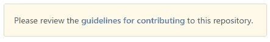

存储库根目录中的 CONTRIBUTION.md 文件是维护人员陈述如何贡献的准则的约定，陈述了期望和要求的内容。如果 CONTRIBUTION.md 存在，那么 GitHub 会在创建拉式请求时显示“请检查”通知，但是基本上已经太晚了，你可能已经“违反”了，希望只能回去重做。这主要归结为重视你和维护者的时间，如果你的拉请求没有准备好，不要浪费任何人的时间。如果它还没有准备好，但你出于某种原因需要提交它，说明它正在进行中，有时这完全是正确的做法，特别是对于更大更复杂的拉式请求，你可能需要反馈，需要在持续集成下进行测试等等。如果一个存储库还没有 CONTRIBUTION.md 文件，那么我建议你先添加一个关于它的问题，弄清楚维护者对贡献者有什么期望，在这个问题上，也许贡献指南可以成为你的第一个贡献。

## 许可证

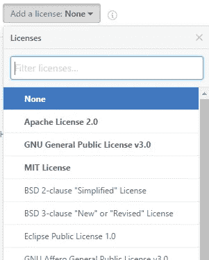

许可证和法律的东西可能不是人们想到的第一件事，但请确保代码是你提交的，你有权重新分配代码的版权，如果代码是在雇主那里使用或开发的，请确保获得对它进行贡献的许可。甚至像堆栈溢出这样的地方的代码也可能有不兼容的许可证。即使代码处于非常宽松的许可之下，也请注明原始作者——如果没有别的作为感谢！

考虑许可证的惯例是有一个名为 LICENSE 的文本文件，或者也可以是一个名为 LICENSE.md 的降价文件。如果存储库没有许可证文件，我的建议还是提出一个问题，并可能让这成为您的第一个拉请求。

## 焦点

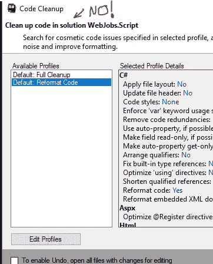

拉请求应该是有重点的，只触及与你的变化有关的东西，并遵循现有的编码风格。编码风格的变化，如果完成后，应在一个单独的拉请求买断。归根结底，您制造的噪音越少，就越容易审查和接受拉取请求。尤其是在你的第一个拉取请求中，如果你的投资不是太大的话，这是很好的，所以如果你的提议被推后或者被维护者忽略，声望会很低。
走极端，如果你的意图只是添加一个属性，不要重新格式化文件中的所有代码，这是一个保证得到推回的方法。

## 技巧

为了不发疯，在开始之前执行测试并确保它们通过，然后在发送拉请求之前确保它们通过并且您提供了新特性的覆盖范围。即使维护人员不要求将您的工作保持在一个特性分支中，也可以更容易地将您的拉请求与您的拉请求所针对的上游分支保持同步。GitHub 现在还允许你让维护者推送对特性分支的更改，我鼓励你这么做，这让维护者如果需要的话可以在合并之前做一些调整，而不会丢失任何属性，这对于打开了受保护分支的库尤其重要，强制拉请求与上游分支保持一致。

## 耐心

开源项目的主要部分是在志愿者的基础上完成的，利用他们的业余时间，这些时间与成家、度假、爱好等事情相冲突。因此，不要对付费商业软件抱有同样的期望，即使你经常可以获得优秀和快速的支持，也不要想当然地认为这是 SLA。

# 维持

我几乎可以把我学到的通过贡献来维持生活的对立面写在这里，尤其是贡献的社会方面。但我也很幸运地维持着那些定期获得捐款的项目。从贡献中有一些明显的重复，但这里是我对成为一个好的维护者的看法:

## Readme.md

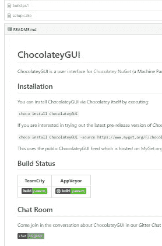

你需要一个！不要指望别人得到你得到的，不要指望别人看到你项目的光彩，你需要告诉他们！这里的惯例是在您的存储库的根目录下有一个 README.md markdown 文件，它将自动显示为您的存储库的“登录页”。
说明项目的目的，如何开始，任何依赖关系等等。这是你推销这个项目的机会。

## 投稿指南

你是一片雪花，或者至少有一点点机会，人们仅仅通过看你的回购协议不会得到你想要的贡献、代码和测试。因此，在你的根项目中有一个 CONTRIBUTING.md，简单地向贡献者传达如何协作，使他们有可能获得并遵从你的期望。

## 贡献者行为准则

因为常识并不常见…认真地说，我们如何沟通和待人接物对于多样性和让每个人都感到受欢迎是至关重要的。我强烈地感觉到这一点，你不必自己发明任何东西 [Contributor Covenant](http://contributor-covenant.org/) 是一个被许多人采用的极好的倡议，它有作为 [Markdown](http://contributor-covenant.org/version/1/4/code_of_conduct.md) 、 [HTML](http://contributor-covenant.org/version/1/4/) 和 [text](http://contributor-covenant.org/version/1/4/code_of_conduct.txt) 的版本，他们也有[本地化的](http://contributor-covenant.org/i18n/)版本。最常用的惯例是将 CODE_OF_CONDUCT.md 文件放在存储库的根目录下。许多人还在他们的自述文件和投稿文件中链接到它。

## 发布和提取请求模板

GitHub 提供了一种很好的方式，通过发布和拉取请求模板来传达您希望如何提出您的发布和拉取请求。

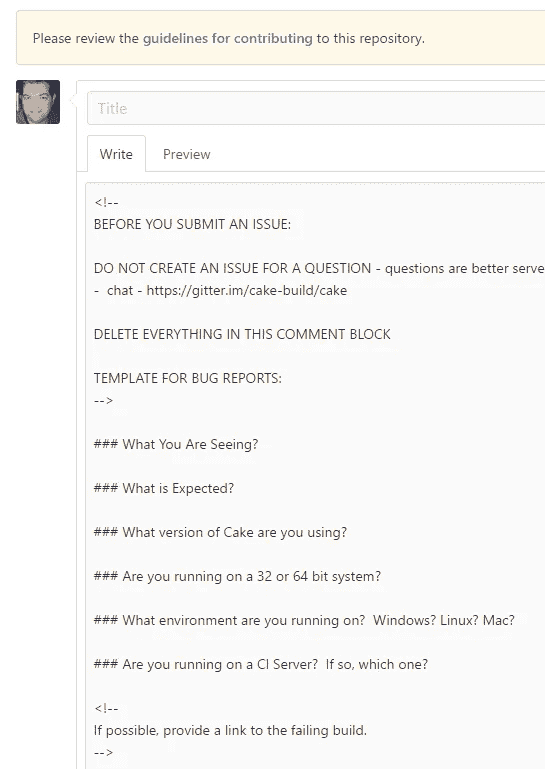

基本上，它要么是一个 ISSUE_TEMPLATE.md 文件，要么是 PULL_REQUEST_TEMPLATE.md 文件，放在存储库根目录或。根目录下的 github 文件夹。
然后，这些模板将被预先填入发布/拉取请求的注释框中。

这让你可以问你 90%的时候都会问的问题，问的问题很快就会过时。公平地说，即使这些问题对你来说是显而易见的，但对这个项目的新手来说可能根本不是。

在某些情况下，常见的问题甚至可能导致问题没有被提出——我经常发现，一个好的公式化问题往往会导致答案。

## 连续累计

成为一名开源构建系统的维护者——这的确是我非常想做的事情。软件是复杂的，尤其是如果你的目标是多个平台，自动化是唯一可行的选择，可以让你安心，回归保持在最低限度。

对于 Cake 项目，人们可能会认为我们已经完成了在 11 个不同的系统和各种版本的 Windows、Linux 和 MacOS 上进行的每一个提交

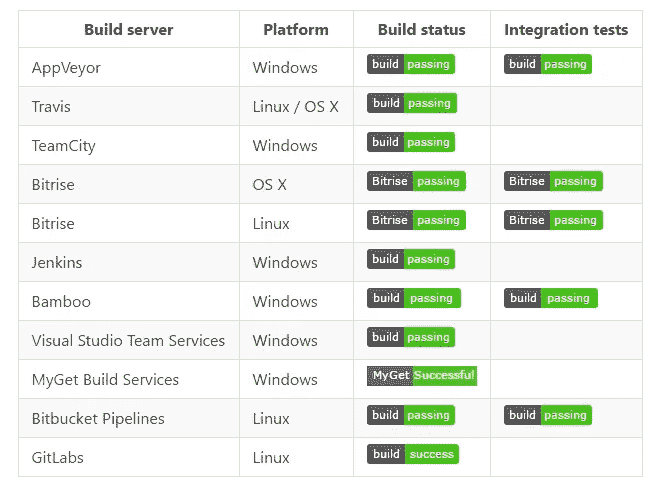

…但它实际上救了我们好几次，例如，我们有特定版本的 Linux 内核在 GitLabs 上造成问题，我们有单元测试在某些系统上运行中断，因为某些日志输出被视为服务消息，我们有单元测试失败，因为测试运行人员将智能绑定到特定的构建服务器。一些问题是由以下事实引起的:一些构建服务器是无状态的，而一些保持状态，一些具有混合方法，其中它们具有用于依赖项的目标缓存。

许多构建服务也支持持续构建 pull 请求，在 GitHub 上这被称为状态检查，

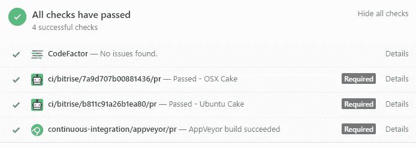

状态检查是自动检查“拉”请求是否准备好接受检查的好方法，这样可以节省时间并更快地向发布者提供反馈。这也让你不需要唠叨，这是更难与机器人争论:)GitHub 有一个相当简单的状态检查 API，所以这是一个完美的机会，让你去做所有的开发和实现自定义检查。有了 Cake，我们不仅有确保代码构建和测试通过的检查，我们还有针对代码风格和代码复杂性的测试。所有这些都有助于保持代码的良好状态，在少数回归中给予信心，并加速 PR 审查过程。
GitHub

## 保持东西整洁

有些事情真的让我很恼火…例如，完成一个项目，它看起来像这样

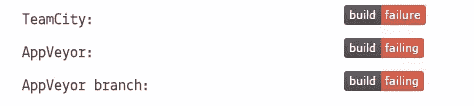

对我来说，默认分支的构建和没有失败的测试是一件好事。即使你是维护者，也要在特性分支或分叉中工作。在自述文件中简要记录您的构建过程(即使只是 build.sh/ps1 ),或者从自述文件中链接到该过程，最好准备好一个构建脚本，该脚本最好处理所有依赖关系，这样就只需要克隆和构建就可以开始了。
作为贡献者，分叉、开始编码、无法构建或测试失败，并意识到这不是回归，而是测试在项目中失败，这是非常令人沮丧的。
也要尽可能地在存储库中保持隔离，如果不能，请明确地通知/记录，尽可能地保持单元测试的自包含性——试着在内存中工作，而不是在磁盘上处理文件。曾经有一个项目在用户的 home 和 temp 文件夹中创建了数千个文件和文件夹——让它保持原样吧——我不喜欢这样。
如果您应该有构建脚本，请确保在另一台计算机上测试它们，如果您从普通操作系统安装开始并记录启动和运行所需的 Debian/Chocolatey/msi 软件包，那么 path 中的内容可能不在另一台 gold star 计算机上。

## 受保护的分支

GitHub 提供了一个很好的方法来执行您的流程，CI 和状态检查已经通过，拉请求已经由其他人而不是发行人审查，拉请求没有落后于目标分支等等。

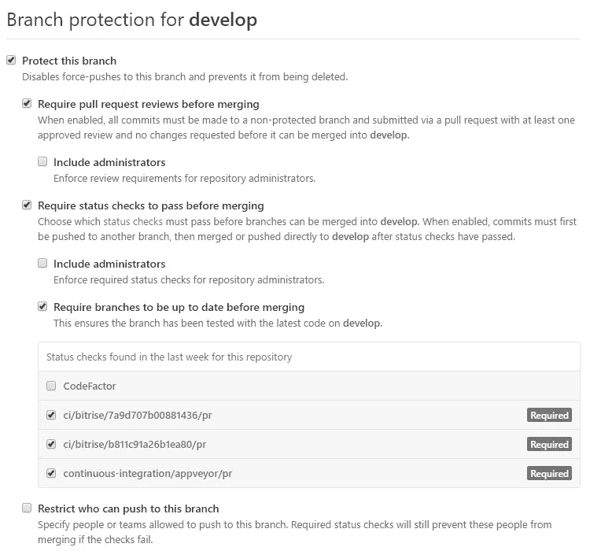

你可以在回购->设置->分支->编辑下找到这些设置

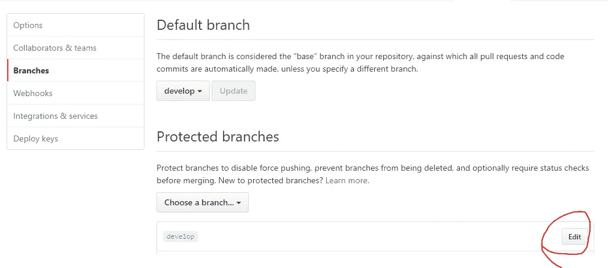

## 承诺

如果你能很快承认问题和公关，这很好，但不要承诺任何太具体的你不能保持，因为承诺会变成期望。我这么说是什么意思？最初，当一个问题被提出时，人们通常不期望它在 24 小时内得到解决，但是如果你对这样的问题进行评论:

> 今晚我会调查这件事。

然后人们期望你这样做，但是如果你不能 100%确定你“今晚”有专门的时间，生活就很容易阻碍你，导致你因为没有达到“最后期限”而感到压力，发行人也会失望，这是基于你对*的期望。如果你故意含糊一点:*

> *我会尽快调查此事，然后把我的调查结果反馈给这个问题。*

*然后，如果你真的在“今晚”寻找并解决了这个问题，你可能会承诺不足，交付过多，而且偶然的机会，发行人心里有一个更确定的日期或有问题，然后他们可以回复反馈或作出决定，即采取变通办法。*

*一般来说，尽量避免设置确定的日期，例如，对于发布，最好将其与需要满足的条件联系起来，即里程碑中的所有问题都必须关闭。*

## *组建一支队伍*

*如果你很幸运有一个项目获得了一些关注，那么我能给你的最好的建议就是留意加入维护者行列的潜在客户。通常，它可以是一个真正积极的贡献者，做着扎实的工作，或者只是一个你认识和信任的人。很难控制你的创作，但是对项目的寿命和坦率地说你的理智的好处是巨大的。迟早你会有你需要拒绝的拉式请求，问题或生活中的麻烦制造者总的来说只是扔给你一个曲线球——在这些情况下，有人私下交换想法是一种解脱，或者当你不能时，可以继续融合和回答。*

# *结论*

*这一切基本上都归结为沟通，很难！和你从未谋面的人一起做提高了标准。但是关键的一点是——要文明礼貌，尽可能多地自动化流程，一般来说，流程永远不会结束——总有迭代、重构和持续改进流程的空间。*

******

> *[黑客中午](http://bit.ly/Hackernoon)是黑客如何开始他们的下午。我们是 [@AMI](http://bit.ly/atAMIatAMI) 家庭的一员。我们现在[接受投稿](http://bit.ly/hackernoonsubmission)并乐意[讨论广告&赞助](mailto:partners@amipublications.com)机会。*
> 
> *如果你喜欢这个故事，我们推荐你阅读我们的[最新科技故事](http://bit.ly/hackernoonlatestt)和[趋势科技故事](https://hackernoon.com/trending)。直到下一次，不要把世界的现实想当然！*

**